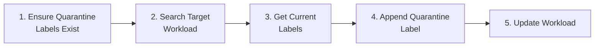
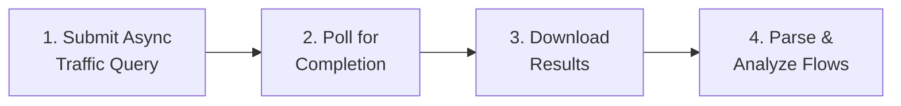

# Illumio PCE Ops — API Cookbook & SIEM/SOAR Integration Guide

> **[English](API_Cookbook.md)** | **[繁體中文](API_Cookbook_zh.md)**

This guide provides scenario-based API tutorials specifically designed for **SIEM/SOAR engineers** writing Actions, Playbooks, or automation scripts. Each scenario lists the exact API calls, parameters, and Python code snippets needed.

All examples use the `ApiClient` class from this project's `src/api_client.py`.

---

## Quick Setup

```python
from src.config import ConfigManager
from src.api_client import ApiClient

cm = ConfigManager()        # Loads config.json
api = ApiClient(cm)          # Initializes with PCE credentials
```

> **Prerequisites**: Configure `config.json` with valid `api.url`, `api.org_id`, `api.key`, and `api.secret`. The API user needs the appropriate role (see each scenario below).

---

## Scenario 1: Health Check — Verify PCE Connectivity

**Use Case**: Heartbeat check in a monitoring playbook.  
**Required Role**: Any (read_only or above)

### API Call

| Step | Method | Endpoint | Response |
|:---|:---|:---|:---|
| 1 | GET | `/api/v2/health` | `200 OK` = healthy |

### Python Code

```python
status, message = api.check_health()
if status == 200:
    print("PCE is healthy")
else:
    print(f"PCE health check failed: {status} - {message}")
```

---

## Scenario 2: Workload Quarantine (Isolation)

**Use Case**: Incident response — isolate a compromised host by tagging it with a Quarantine label.  
**Required Role**: `owner` or `admin`

### Workflow



### Step-by-Step API Calls

| Step | Method | Endpoint | Purpose |
|:---|:---|:---|:---|
| 1a | GET | `/orgs/{org_id}/labels?key=Quarantine` | Check if Quarantine labels exist |
| 1b | POST | `/orgs/{org_id}/labels` | Create missing label (`{"key":"Quarantine","value":"Severe"}`) |
| 2 | GET | `/orgs/{org_id}/workloads?hostname=<target>` | Find the target workload |
| 3 | GET | `/api/v2{workload_href}` | Get workload's current labels |
| 4-5 | PUT | `/api/v2{workload_href}` | Update labels = existing + quarantine label |

### Complete Python Code

```python
from src.config import ConfigManager
from src.api_client import ApiClient

cm = ConfigManager()
api = ApiClient(cm)

# --- Step 1: Ensure Quarantine labels exist ---
label_hrefs = api.check_and_create_quarantine_labels()
# Returns: {"Mild": "/orgs/1/labels/XX", "Moderate": "/orgs/1/labels/YY", "Severe": "/orgs/1/labels/ZZ"}
print(f"Quarantine label hrefs: {label_hrefs}")

# --- Step 2: Search for the target workload ---
results = api.search_workloads({"hostname": "infected-server-01"})
if not results:
    print("Workload not found!")
    exit(1)

target = results[0]
workload_href = target["href"]
print(f"Found workload: {target.get('name')} ({workload_href})")

# --- Step 3: Get current labels ---
workload = api.get_workload(workload_href)
current_labels = [{"href": lbl["href"]} for lbl in workload.get("labels", [])]
print(f"Current labels: {current_labels}")

# --- Step 4: Append the Quarantine label ---
quarantine_level = "Severe"  # Choose: "Mild", "Moderate", or "Severe"
quarantine_href = label_hrefs[quarantine_level]
current_labels.append({"href": quarantine_href})

# --- Step 5: Update the workload ---
success = api.update_workload_labels(workload_href, current_labels)
if success:
    print(f"✅ Workload quarantined at level: {quarantine_level}")
else:
    print("❌ Failed to apply quarantine label")
```

> **SOAR Playbook Tip**: The above code can be wrapped as a single Action. Input parameters: `hostname` (string), `quarantine_level` (enum: Mild/Moderate/Severe).

---

## Scenario 3: Traffic Flow Analysis

**Use Case**: Query blocked or anomalous traffic in the last N minutes for investigation.  
**Required Role**: `read_only` or above

### Workflow



### API Calls

| Step | Method | Endpoint | Purpose |
|:---|:---|:---|:---|
| 1 | POST | `/orgs/{org_id}/traffic_flows/async_queries` | Submit query |
| 2 | GET | `/orgs/{org_id}/traffic_flows/async_queries/{uuid}` | Poll status |
| 3 | GET | `.../async_queries/{uuid}/download` | Download results (gzip) |

### Request Body (Step 1)

```json
{
    "start_date": "2026-03-03T00:00:00Z",
    "end_date": "2026-03-03T23:59:59Z",
    "policy_decisions": ["blocked", "potentially_blocked"],
    "max_results": 200000,
    "query_name": "SOAR_Investigation",
    "sources": {"include": [], "exclude": []},
    "destinations": {"include": [], "exclude": []},
    "services": {"include": [], "exclude": []}
}
```

### Python Code

```python
from src.config import ConfigManager
from src.api_client import ApiClient
from src.analyzer import Analyzer
from src.reporter import Reporter

cm = ConfigManager()
api = ApiClient(cm)

# Option A: Low-level streaming (memory efficient)
for flow in api.execute_traffic_query_stream(
    "2026-03-03T00:00:00Z",
    "2026-03-03T23:59:59Z",
    ["blocked", "potentially_blocked"]
):
    src_ip = flow.get("src", {}).get("ip", "N/A")
    dst_ip = flow.get("dst", {}).get("ip", "N/A")
    port = flow.get("service", {}).get("port", "N/A")
    decision = flow.get("policy_decision", "N/A")
    print(f"{src_ip} -> {dst_ip}:{port} [{decision}]")

# Option B: High-level query with sorting (via Analyzer)
rep = Reporter(cm)
ana = Analyzer(cm, api, rep)
results = ana.query_flows({
    "start_time": "2026-03-03T00:00:00Z",
    "end_time": "2026-03-03T23:59:59Z",
    "policy_decisions": ["blocked"],
    "sort_by": "bandwidth",       # "bandwidth", "volume", or "connections"
    "search": "10.0.1.50"         # Optional text filter
})

for r in results[:10]:
    print(f"{r['source']['name']} -> {r['destination']['name']} "
          f"| {r['formatted_bandwidth']} | {r['policy_decision']}")
```

### Key Response Fields

| Field | Type | Description |
|:---|:---|:---|
| `src.ip` | string | Source IP address |
| `src.workload.name` | string | Source workload name (if managed) |
| `src.workload.labels` | array | Source workload labels (`[{key, value, href}]`) |
| `dst.ip` | string | Destination IP address |
| `dst.workload.name` | string | Destination workload name |
| `service.port` | int | Destination port |
| `service.proto` | int | IP protocol (6=TCP, 17=UDP, 1=ICMP) |
| `num_connections` | int | Connection count |
| `policy_decision` | string | `"allowed"`, `"blocked"`, `"potentially_blocked"` |
| `timestamp_range.first_detected` | string | First seen timestamp |
| `timestamp_range.last_detected` | string | Last seen timestamp |

---

## Scenario 4: Security Event Monitoring

**Use Case**: Retrieve recent security events for a SIEM dashboard.  
**Required Role**: `read_only` or above

### API Call

| Step | Method | Endpoint | Purpose |
|:---|:---|:---|:---|
| 1 | GET | `/orgs/{org_id}/events?timestamp[gte]=<ISO_TIME>&max_results=1000` | Fetch events |

### Python Code

```python
from datetime import datetime, timezone, timedelta
from src.config import ConfigManager
from src.api_client import ApiClient

cm = ConfigManager()
api = ApiClient(cm)

# Query events from the last 30 minutes
since = (datetime.now(timezone.utc) - timedelta(minutes=30)).strftime('%Y-%m-%dT%H:%M:%SZ')
events = api.fetch_events(since, max_results=500)

for evt in events:
    print(f"[{evt.get('timestamp')}] {evt.get('event_type')} - "
          f"Severity: {evt.get('severity')} - "
          f"Host: {evt.get('created_by', {}).get('agent', {}).get('hostname', 'System')}")
```

### Common Event Types

| Event Type | Category | Description |
|:---|:---|:---|
| `agent.tampering` | Agent Health | VEN tampering detected |
| `system_task.agent_offline_check` | Agent Health | Agent went offline |
| `system_task.agent_missed_heartbeats_check` | Agent Health | Agent missed heartbeats |
| `user.sign_in` | Authentication | User sign in (success or failure) |
| `request.authentication_failed` | Authentication | API key authentication failure |
| `rule_set.create` / `rule_set.update` | Policy | Ruleset created or modified |
| `sec_rule.create` / `sec_rule.delete` | Policy | Security rule created or deleted |
| `sec_policy.create` | Policy | Policy provisioned |
| `workload.create` / `workload.delete` | Workload | Workload paired or unpaired |

---

## Scenario 5: Workload Search & Inventory

**Use Case**: Search for workloads by hostname, IP, or labels.  
**Required Role**: `read_only` or above

### API Call

| Step | Method | Endpoint | Purpose |
|:---|:---|:---|:---|
| 1 | GET | `/orgs/{org_id}/workloads?<params>` | Search workloads |

### Python Code

```python
from src.config import ConfigManager
from src.api_client import ApiClient

cm = ConfigManager()
api = ApiClient(cm)

# Search by hostname (partial match)
results = api.search_workloads({"hostname": "web-server"})

# Search by IP address
results = api.search_workloads({"ip_address": "10.0.1.50"})

for wl in results:
    labels = ", ".join([f"{l['key']}={l['value']}" for l in wl.get("labels", [])])
    managed = "Managed" if wl.get("agent", {}).get("config", {}).get("mode") else "Unmanaged"
    print(f"{wl.get('name', 'N/A')} | {wl.get('hostname', 'N/A')} | {managed} | Labels: [{labels}]")
```

---

## Scenario 6: Label Management

**Use Case**: List or create labels for policy automation.  
**Required Role**: `admin` or above (for create)

### Python Code

```python
from src.config import ConfigManager
from src.api_client import ApiClient

cm = ConfigManager()
api = ApiClient(cm)

# List all labels of type "env"
env_labels = api.get_labels("env")
for lbl in env_labels:
    print(f"{lbl['key']}={lbl['value']}  (href: {lbl['href']})")

# Create a new label
new_label = api.create_label("env", "Staging")
if new_label:
    print(f"Created label: {new_label['href']}")
```

---

## SIEM/SOAR Quick Reference Table

| Operation | API Endpoint | HTTP | Request Body | Expected Response |
|:---|:---|:---|:---|:---|
| Health Check | `/api/v2/health` | GET | — | `200` |
| Fetch Events | `/orgs/{id}/events?timestamp[gte]=...` | GET | — | `200` + JSON array |
| Submit Traffic Query | `/orgs/{id}/traffic_flows/async_queries` | POST | See Scenario 3 | `201`/`202` + `{href}` |
| Poll Query Status | `/orgs/{id}/traffic_flows/async_queries/{uuid}` | GET | — | `200` + `{status}` |
| Download Query Results | `.../async_queries/{uuid}/download` | GET | — | `200` + gzip data |
| List Labels | `/orgs/{id}/labels?key=<key>` | GET | — | `200` + JSON array |
| Create Label | `/orgs/{id}/labels` | POST | `{key, value}` | `201` + `{href}` |
| Search Workloads | `/orgs/{id}/workloads?hostname=...` | GET | — | `200` + JSON array |
| Get Workload | `/api/v2{workload_href}` | GET | — | `200` + workload JSON |
| Update Workload Labels | `/api/v2{workload_href}` | PUT | `{labels: [{href}]}` | `204` |

> **Base URL Pattern**: `https://<pce_host>:<port>/api/v2/orgs/<org_id>/...`  
> **Auth**: HTTP Basic with API Key as username and Secret as password.
