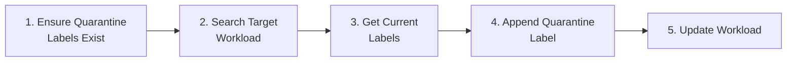
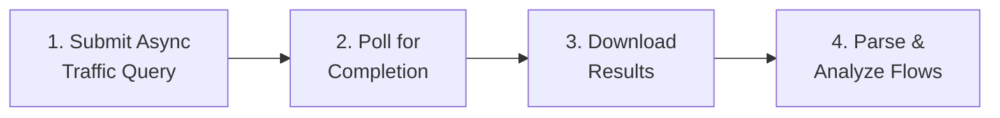
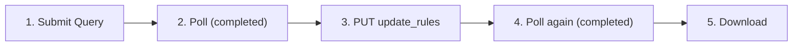
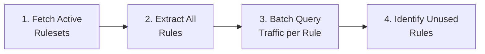
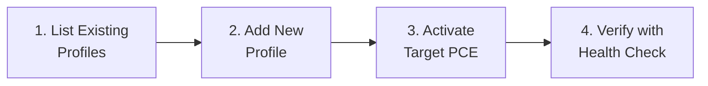

# Illumio PCE Ops — API Cookbook & SIEM/SOAR Integration Guide


> **[English](API_Cookbook.md)** | **[繁體中文](API_Cookbook_zh.md)**

This guide provides scenario-based API tutorials specifically designed for **SIEM/SOAR engineers** writing Actions, Playbooks, or automation scripts. Each scenario lists the exact API calls, parameters, and Python code snippets needed.

All examples use the `ApiClient` class from this project's `src/api_client.py`.

---

## Quick Setup

```python
from src.config import ConfigManager
from src.api_client import ApiClient

cm = ConfigManager()        # Loads config.json
api = ApiClient(cm)          # Initializes with PCE credentials
```

> **Prerequisites**: Configure `config.json` with valid `api.url`, `api.org_id`, `api.key`, and `api.secret`. The API user needs the appropriate role (see each scenario below).

---

## Scenario 1: Health Check — Verify PCE Connectivity

**Use Case**: Heartbeat check in a monitoring playbook.
**Required Role**: Any (read_only or above)

### API Call

| Step | Method | Endpoint | Response |
|:---|:---|:---|:---|
| 1 | GET | `/api/v2/health` | `200 OK` = healthy |

### Python Code

```python
status, message = api.check_health()
if status == 200:
    print("PCE is healthy")
else:
    print(f"PCE health check failed: {status} - {message}")
```

---

## Scenario 2: Workload Quarantine (Isolation)

**Use Case**: Incident response — isolate a compromised host by tagging it with a Quarantine label.
**Required Role**: `owner` or `admin`

### Workflow



### Step-by-Step API Calls

| Step | Method | Endpoint | Purpose |
|:---|:---|:---|:---|
| 1a | GET | `/orgs/{org_id}/labels?key=Quarantine` | Check if Quarantine labels exist |
| 1b | POST | `/orgs/{org_id}/labels` | Create missing label (`{"key":"Quarantine","value":"Severe"}`) |
| 2 | GET | `/orgs/{org_id}/workloads?hostname=<target>` | Find the target workload |
| 3 | GET | `/api/v2{workload_href}` | Get workload's current labels |
| 4-5 | PUT | `/api/v2{workload_href}` | Update labels = existing + quarantine label |

### Complete Python Code

```python
from src.config import ConfigManager
from src.api_client import ApiClient

cm = ConfigManager()
api = ApiClient(cm)

# --- Step 1: Ensure Quarantine labels exist ---
label_hrefs = api.check_and_create_quarantine_labels()
# Returns: {"Mild": "/orgs/1/labels/XX", "Moderate": "/orgs/1/labels/YY", "Severe": "/orgs/1/labels/ZZ"}
print(f"Quarantine label hrefs: {label_hrefs}")

# --- Step 2: Search for the target workload ---
results = api.search_workloads({"hostname": "infected-server-01"})
if not results:
    print("Workload not found!")
    exit(1)

target = results[0]
workload_href = target["href"]
print(f"Found workload: {target.get('name')} ({workload_href})")

# --- Step 3: Get current labels ---
workload = api.get_workload(workload_href)
current_labels = [{"href": lbl["href"]} for lbl in workload.get("labels", [])]
print(f"Current labels: {current_labels}")

# --- Step 4: Append the Quarantine label ---
quarantine_level = "Severe"  # Choose: "Mild", "Moderate", or "Severe"
quarantine_href = label_hrefs[quarantine_level]
current_labels.append({"href": quarantine_href})

# --- Step 5: Update the workload ---
success = api.update_workload_labels(workload_href, current_labels)
if success:
    print(f"Workload quarantined at level: {quarantine_level}")
else:
    print("Failed to apply quarantine label")
```

> **SOAR Playbook Tip**: The above code can be wrapped as a single Action. Input parameters: `hostname` (string), `quarantine_level` (enum: Mild/Moderate/Severe).

---

## Scenario 3: Traffic Flow Analysis

**Use Case**: Query blocked or anomalous traffic in the last N minutes for investigation.
**Required Role**: `read_only` or above

> **Important — Illumio Core 25.2 Change**: Synchronous traffic queries are deprecated. This tool uses exclusively **async queries** (`async_queries`) with support for up to **200,000 results** per query. All traffic analysis — including streaming downloads — goes through the async workflow below.

### Workflow

**Standard (Reported view):** 3 steps



**With Draft Policy Analysis:** 4 steps — insert `update_rules` before download to unlock hidden fields (`draft_policy_decision`, `rules`, `enforcement_boundaries`, `override_deny_rules`).



### API Calls

| Step | Method | Endpoint | Purpose |
|:---|:---|:---|:---|
| 1 | POST | `/orgs/{org_id}/traffic_flows/async_queries` | Submit query |
| 2 | GET | `/orgs/{org_id}/traffic_flows/async_queries/{uuid}` | Poll status |
| 3 *(optional)* | PUT | `.../async_queries/{uuid}/update_rules` | Trigger draft policy computation |
| 4 *(optional)* | GET | `/orgs/{org_id}/traffic_flows/async_queries/{uuid}` | Re-poll after update_rules |
| 5 | GET | `.../async_queries/{uuid}/download` | Download results (JSON array) |

> **update_rules notes**: Request body is empty (`{}`). Returns `202 Accepted`. PCE status stays `"completed"` during computation — wait ~10 s before re-polling. This tool passes `compute_draft=True` to `execute_traffic_query_stream()` to trigger this automatically.

### Request Body (Step 1)

```json
{
    "start_date": "2026-03-03T00:00:00Z",
    "end_date": "2026-03-03T23:59:59Z",
    "policy_decisions": ["blocked", "potentially_blocked"],
    "max_results": 200000,
    "query_name": "SOAR_Investigation",
    "sources": {"include": [], "exclude": []},
    "destinations": {"include": [], "exclude": []},
    "services": {"include": [], "exclude": []}
}
```

### Python Code

```python
from src.config import ConfigManager
from src.api_client import ApiClient
from src.analyzer import Analyzer
from src.reporter import Reporter

cm = ConfigManager()
api = ApiClient(cm)

# Option A: Low-level streaming (memory efficient)
for flow in api.execute_traffic_query_stream(
    "2026-03-03T00:00:00Z",
    "2026-03-03T23:59:59Z",
    ["blocked", "potentially_blocked"]
):
    src_ip = flow.get("src", {}).get("ip", "N/A")
    dst_ip = flow.get("dst", {}).get("ip", "N/A")
    port = flow.get("service", {}).get("port", "N/A")
    decision = flow.get("policy_decision", "N/A")
    print(f"{src_ip} -> {dst_ip}:{port} [{decision}]")

# Option B: High-level query with sorting (via Analyzer)
rep = Reporter(cm)
ana = Analyzer(cm, api, rep)
results = ana.query_flows({
    "start_time": "2026-03-03T00:00:00Z",
    "end_time": "2026-03-03T23:59:59Z",
    "policy_decisions": ["blocked"],
    "sort_by": "bandwidth",       # "bandwidth", "volume", or "connections"
    "search": "10.0.1.50"         # Optional text filter
})

for r in results[:10]:
    print(f"{r['source']['name']} -> {r['destination']['name']} "
          f"| {r['formatted_bandwidth']} | {r['policy_decision']}")
```

### Advanced Filtering (Post-Download)

Traffic flows are downloaded in bulk from the PCE, then filtered client-side using `ApiClient.check_flow_match()`. This provides richer filtering than the PCE API itself supports.

| Filter Key | Type | Description |
|:---|:---|:---|
| `src_labels` | list of `"key:value"` | Match by source label |
| `dst_labels` | list of `"key:value"` | Match by destination label |
| `any_label` | `"key:value"` | OR logic — match if **either** source or destination has the label |
| `src_ip` / `dst_ip` | string (IP or CIDR) | Match by source/destination IP |
| `any_ip` | string (IP or CIDR) | OR logic — match if either side matches the IP |
| `port` / `proto` | int | Service port and IP protocol filter |
| `ex_src_labels` / `ex_dst_labels` | list of `"key:value"` | **Exclude** flows matching these labels |
| `ex_src_ip` / `ex_dst_ip` | string (IP or CIDR) | **Exclude** flows from/to these IPs |
| `ex_any_label` / `ex_any_ip` | string | **Exclude** if either side matches |
| `ex_port` | int | Exclude flows on this port |

> **Filter Direction**: When using `filter_direction: "src_or_dst"`, label and IP filters use OR logic (match if either source or destination satisfies the condition). The default is `"src_and_dst"` (both sides must match their respective filters).

### Flow Record — Complete Field Reference

#### Policy & Decision Fields

| Field | Required | Description |
|:---|:---|:---|
| `policy_decision` | Yes | Reported policy result based on **active** rules. Values: `allowed` / `potentially_blocked` / `blocked` / `unknown` |
| `boundary_decision` | No | Reported boundary result. Values: `blocked` / `blocked_by_override_deny` / `blocked_non_illumio_rule` |
| `draft_policy_decision` | No ⚠️ | **Requires `update_rules`**. Draft policy diagnosis combining action + reason (see table below) |
| `rules` | No ⚠️ | **Requires `update_rules`**. HREFs of draft allow rules matching this flow |
| `enforcement_boundaries` | No ⚠️ | **Requires `update_rules`**. HREFs of draft enforcement boundaries blocking this flow |
| `override_deny_rules` | No ⚠️ | **Requires `update_rules`**. HREFs of draft override deny rules blocking this flow |

**`draft_policy_decision` value reference** (action + reason formula):

| Value | Meaning |
|:---|:---|
| `allowed` | Draft rules allow the flow |
| `allowed_across_boundary` | Flow hits a deny boundary but an explicit allow rule overrides it (exception) |
| `blocked_by_boundary` | Draft enforcement boundary will block this flow |
| `blocked_by_override_deny` | Highest-priority override deny rule will block — no allow rule can override |
| `blocked_no_rule` | Blocked by default-deny because no matching allow rule exists |
| `potentially_blocked` | Same as blocked reason but destination host is in Visibility Only mode |
| `potentially_blocked_by_boundary` | Boundary block, but destination host is in Visibility Only mode |
| `potentially_blocked_by_override_deny` | Override deny block, but destination host is in Visibility Only mode |
| `potentially_blocked_no_rule` | No allow rule, but destination host is in Visibility Only mode |

**`boundary_decision` value reference** (reported view only):

| Value | Meaning |
|:---|:---|
| `blocked` | Blocked by an enforcement boundary or deny rule |
| `blocked_by_override_deny` | Blocked by an override deny rule (highest priority) |
| `blocked_non_illumio_rule` | Blocked by a native host firewall rule (e.g. iptables, GPO) — not an Illumio rule |

#### Connection Fields

| Field | Required | Description |
|:---|:---|:---|
| `num_connections` | Yes | Number of times this aggregated flow was seen |
| `flow_direction` | Yes | VEN capture perspective: `inbound` (destination VEN) / `outbound` (source VEN) |
| `timestamp_range.first_detected` | Yes | First seen (ISO 8601 UTC) |
| `timestamp_range.last_detected` | Yes | Last seen (ISO 8601 UTC) |
| `state` | No | Connection state: `A` (Active) / `C` (Closed) / `T` (Timed out) / `S` (Snapshot) / `N` (New/SYN) |
| `transmission` | No | `broadcast` / `multicast` / `unicast` |

#### Service Object (`service`)

> Process and user belong to the VEN-side host: **destination** for `inbound`, **source** for `outbound`.

| Field | Required | Description |
|:---|:---|:---|
| `service.port` | Yes | Destination port |
| `service.proto` | Yes | IANA protocol number (6=TCP, 17=UDP, 1=ICMP) |
| `service.process_name` | No | Application process name (e.g. `sshd`, `nginx`) |
| `service.windows_service_name` | No | Windows service name |
| `service.user_name` | No | OS account running the process |

#### Source / Destination Objects (`src`, `dst`)

| Field | Description |
|:---|:---|
| `src.ip` / `dst.ip` | IPv4 or IPv6 address |
| `src.workload.href` | Workload unique URI |
| `src.workload.hostname` / `name` | Hostname and friendly name |
| `src.workload.enforcement_mode` | `idle` / `visibility_only` / `selective` / `full` |
| `src.workload.managed` | `true` if VEN is installed |
| `src.workload.labels` | Array of `{href, key, value}` label objects |
| `src.ip_lists` | IP Lists this address falls into |
| `src.fqdn_name` | Resolved FQDN (if DNS data available) |
| `src.virtual_server` / `virtual_service` | Kubernetes / load balancer virtual service |
| `src.cloud_resource` | Cloud-native resource (e.g. AWS RDS) |

#### Bandwidth & Network Fields

| Field | Description |
|:---|:---|
| `dst_bi` | Destination bytes in (= source bytes out) |
| `dst_bo` | Destination bytes out (= source bytes in) |
| `icmp_type` / `icmp_code` | ICMP type and code (proto=1 only) |
| `network` | PCE network object (`name`, `href`) |
| `client_type` | Agent type reporting this flow: `server` / `endpoint` / `flowlink` / `scanner` |

---

## Scenario 4: Security Event Monitoring

**Use Case**: Retrieve recent security events for a SIEM dashboard.
**Required Role**: `read_only` or above

### API Call

| Step | Method | Endpoint | Purpose |
|:---|:---|:---|:---|
| 1 | GET | `/orgs/{org_id}/events?timestamp[gte]=<ISO_TIME>&max_results=1000` | Fetch events |

### Python Code

```python
from datetime import datetime, timezone, timedelta
from src.config import ConfigManager
from src.api_client import ApiClient

cm = ConfigManager()
api = ApiClient(cm)

# Query events from the last 30 minutes
since = (datetime.now(timezone.utc) - timedelta(minutes=30)).strftime('%Y-%m-%dT%H:%M:%SZ')
events = api.fetch_events(since, max_results=500)

for evt in events:
    print(f"[{evt.get('timestamp')}] {evt.get('event_type')} - "
          f"Severity: {evt.get('severity')} - "
          f"Host: {evt.get('created_by', {}).get('agent', {}).get('hostname', 'System')}")
```

### Common Event Types

| Event Type | Category | Description |
|:---|:---|:---|
| `agent.tampering` | Agent Health | VEN tampering detected |
| `system_task.agent_offline_check` | Agent Health | Agent went offline |
| `system_task.agent_missed_heartbeats_check` | Agent Health | Agent missed heartbeats |
| `user.sign_in` | Authentication | User sign in (success or failure) |
| `request.authentication_failed` | Authentication | API key authentication failure |
| `rule_set.create` / `rule_set.update` | Policy | Ruleset created or modified |
| `sec_rule.create` / `sec_rule.delete` | Policy | Security rule created or deleted |
| `sec_policy.create` | Policy | Policy provisioned |
| `workload.create` / `workload.delete` | Workload | Workload paired or unpaired |

---

## Scenario 5: Workload Search & Inventory

**Use Case**: Search for workloads by hostname, IP, or labels.
**Required Role**: `read_only` or above

### API Call

| Step | Method | Endpoint | Purpose |
|:---|:---|:---|:---|
| 1 | GET | `/orgs/{org_id}/workloads?<params>` | Search workloads |

### Python Code

```python
from src.config import ConfigManager
from src.api_client import ApiClient

cm = ConfigManager()
api = ApiClient(cm)

# Search by hostname (partial match)
results = api.search_workloads({"hostname": "web-server"})

# Search by IP address
results = api.search_workloads({"ip_address": "10.0.1.50"})

for wl in results:
    labels = ", ".join([f"{l['key']}={l['value']}" for l in wl.get("labels", [])])
    managed = "Managed" if wl.get("agent", {}).get("config", {}).get("mode") else "Unmanaged"
    print(f"{wl.get('name', 'N/A')} | {wl.get('hostname', 'N/A')} | {managed} | Labels: [{labels}]")
```

---

## Scenario 6: Label Management

**Use Case**: List or create labels for policy automation.
**Required Role**: `admin` or above (for create)

### Python Code

```python
from src.config import ConfigManager
from src.api_client import ApiClient

cm = ConfigManager()
api = ApiClient(cm)

# List all labels of type "env"
env_labels = api.get_labels("env")
for lbl in env_labels:
    print(f"{lbl['key']}={lbl['value']}  (href: {lbl['href']})")

# Create a new label
new_label = api.create_label("env", "Staging")
if new_label:
    print(f"Created label: {new_label['href']}")
```

---

---

## Scenario 7: Internal Tool API (Auth & Security)

**Use Case**: Automating against the Illumio PCE Ops tool itself (e.g., bulk updating rules, triggering reports via script).
**Required**: Valid tool credentials (default: `illumio`/`illumio`).

### Workflow

1. **Login**: POST to `/api/login` to receive a session cookie.
2. **Authenticated Requests**: Include the session cookie in subsequent calls.

### Python Code

```python
import requests

BASE_URL = "http://127.0.0.1:5001"
session = requests.Session()

# 1. Login
login_payload = {"username": "illumio", "password": "illumio"}
res = session.post(f"{BASE_URL}/api/login", json=login_payload)

if res.json().get("ok"):
    print("Login successful")

    # 2. Example: Trigger a Traffic Report
    report_res = session.post(f"{BASE_URL}/api/reports/generate", json={
        "type": "traffic",
        "days": 7
    })
    print(f"Report triggered: {report_res.json()}")
else:
    print("Login failed")
```

---

## Scenario 8: Policy Usage Analysis

**Use Case**: Identify unused or underused security rules by querying per-rule traffic hit counts. Helps with policy hygiene, compliance audits, and rule lifecycle management.
**Required Role**: `read_only` or above (PCE API); tool login required for GUI endpoint.

### Workflow



### How It Works

The policy usage analysis uses a three-phase concurrent approach:

1. **Phase 1 (Submit)**: For each rule, build a targeted async traffic query based on the rule's consumers, providers, ingress services, and parent ruleset scope. Submit all queries in parallel.
2. **Phase 2 (Poll)**: Poll all pending async jobs concurrently until every job completes or fails.
3. **Phase 3 (Download)**: Download results in parallel and count matching flows per rule.

Rules with zero matching flows in the analysis window are flagged as "unused".

### PCE API Calls

| Step | Method | Endpoint | Purpose |
|:---|:---|:---|:---|
| 1 | GET | `/orgs/{org_id}/sec_policy/active/rule_sets?max_results=10000` | Fetch all active (provisioned) rulesets |
| 2 | POST | `/orgs/{org_id}/traffic_flows/async_queries` | Submit per-rule traffic query (one per rule) |
| 3 | GET | `/orgs/{org_id}/traffic_flows/async_queries/{uuid}` | Poll query status |
| 4 | GET | `.../async_queries/{uuid}/download` | Download query results |

### Python Code (Direct API)

```python
from src.config import ConfigManager
from src.api_client import ApiClient

cm = ConfigManager()
api = ApiClient(cm)

# Step 1: Fetch all active rulesets with their rules
rulesets = api.get_active_rulesets()
print(f"Found {len(rulesets)} active rulesets")

# Step 2: Flatten all rules from all rulesets
all_rules = []
for rs in rulesets:
    for rule in rs.get("rules", []):
        rule["_ruleset_name"] = rs.get("name", "Unknown")
        rule["_ruleset_scopes"] = rs.get("scopes", [])
        all_rules.append(rule)

print(f"Total rules to analyze: {len(all_rules)}")

# Step 3: Batch query traffic counts (parallel, up to 10 concurrent)
hit_hrefs, hit_counts = api.batch_get_rule_traffic_counts(
    rules=all_rules,
    start_date="2026-03-01T00:00:00Z",
    end_date="2026-04-01T00:00:00Z",
    max_concurrent=10,
    on_progress=lambda msg: print(f"  {msg}")
)

# Step 4: Report results
used_count = len(hit_hrefs)
unused_count = len(all_rules) - used_count
print(f"\nResults: {used_count} rules with traffic, {unused_count} rules unused")

for rule in all_rules:
    href = rule.get("href", "")
    count = hit_counts.get(href, 0)
    status = "HIT" if href in hit_hrefs else "UNUSED"
    print(f"  [{status}] {rule['_ruleset_name']} / "
          f"{rule.get('description', 'No description')} — {count} flows")
```

### Python Code (GUI Endpoint)

```python
import requests

BASE_URL = "http://127.0.0.1:5001"
session = requests.Session()
session.post(f"{BASE_URL}/api/login", json={"username": "illumio", "password": "illumio"})

# Generate policy usage report (defaults to last 30 days)
res = session.post(f"{BASE_URL}/api/policy_usage_report/generate", json={
    "start_date": "2026-03-01T00:00:00Z",
    "end_date": "2026-04-01T00:00:00Z"
})

data = res.json()
if data.get("ok"):
    print(f"Report files: {data['files']}")
    print(f"Total rules analyzed: {data['record_count']}")
    for kpi in data.get("kpis", []):
        print(f"  {kpi}")
else:
    print(f"Error: {data.get('error')}")
```

> **Performance Note**: `batch_get_rule_traffic_counts()` uses `ThreadPoolExecutor` with configurable concurrency (`max_concurrent`, default 10). For environments with 500+ rules, consider increasing to 15-20 if the PCE can handle the load. The overall timeout is 5 minutes.

---

## Scenario 9: Multi-PCE Profile Management

**Use Case**: Manage connections to multiple PCE instances (e.g., Production, Staging, DR) from a single Illumio Ops deployment. Switch the active PCE without editing `config.json` manually.
**Required**: Tool login (GUI endpoint).

### Workflow



### GUI API Endpoints

| Action | Method | Endpoint | Request Body |
|:---|:---|:---|:---|
| List profiles | GET | `/api/pce-profiles` | — |
| Add profile | POST | `/api/pce-profiles` | `{"action":"add", "name":"...", "url":"...", ...}` |
| Update profile | POST | `/api/pce-profiles` | `{"action":"update", "id":123, "name":"...", ...}` |
| Activate profile | POST | `/api/pce-profiles` | `{"action":"activate", "id":123}` |
| Delete profile | POST | `/api/pce-profiles` | `{"action":"delete", "id":123}` |

### curl Examples

```bash
BASE="http://127.0.0.1:5001"
COOKIE=$(curl -s -c - "$BASE/api/login" \
  -H "Content-Type: application/json" \
  -d '{"username":"illumio","password":"illumio"}' | grep session | awk '{print $NF}')

# List all PCE profiles
curl -s -b "session=$COOKIE" "$BASE/api/pce-profiles" | python -m json.tool

# Add a new PCE profile
curl -s -b "session=$COOKIE" "$BASE/api/pce-profiles" \
  -H "Content-Type: application/json" \
  -d '{
    "action": "add",
    "name": "Production PCE",
    "url": "https://pce-prod.example.com:8443",
    "org_id": "1",
    "key": "api_key_here",
    "secret": "api_secret_here",
    "verify_ssl": true
  }'

# Activate a profile (switch active PCE)
curl -s -b "session=$COOKIE" "$BASE/api/pce-profiles" \
  -H "Content-Type: application/json" \
  -d '{"action": "activate", "id": 1700000000}'

# Delete a profile
curl -s -b "session=$COOKIE" "$BASE/api/pce-profiles" \
  -H "Content-Type: application/json" \
  -d '{"action": "delete", "id": 1700000000}'
```

### Python Code

```python
import requests

BASE_URL = "http://127.0.0.1:5001"
session = requests.Session()
session.post(f"{BASE_URL}/api/login", json={"username": "illumio", "password": "illumio"})

# List current profiles
res = session.get(f"{BASE_URL}/api/pce-profiles")
profiles = res.json()
print(f"Active PCE ID: {profiles['active_pce_id']}")
for p in profiles["profiles"]:
    marker = " [ACTIVE]" if p.get("id") == profiles["active_pce_id"] else ""
    print(f"  {p['id']}: {p['name']} — {p['url']}{marker}")

# Add a new profile
new_profile = session.post(f"{BASE_URL}/api/pce-profiles", json={
    "action": "add",
    "name": "DR Site PCE",
    "url": "https://pce-dr.example.com:8443",
    "org_id": "1",
    "key": "api_12345",
    "secret": "secret_67890",
    "verify_ssl": True
})
profile_data = new_profile.json()
print(f"Added profile: {profile_data['profile']['id']}")

# Activate the new profile
session.post(f"{BASE_URL}/api/pce-profiles", json={
    "action": "activate",
    "id": profile_data["profile"]["id"]
})
print("Switched active PCE to DR site")
```

> **Note**: Activating a profile updates `config.json` with the selected profile's API credentials. All subsequent API calls (health check, events, traffic queries) will target the newly activated PCE. Existing daemon loops will pick up the change on the next iteration.

---

## SIEM/SOAR Quick Reference Table

### PCE API Endpoints (Direct)

| Operation | API Endpoint | HTTP | Request Body | Expected Response |
|:---|:---|:---|:---|:---|
| Health Check | `/api/v2/health` | GET | — | `200` |
| Fetch Events | `/orgs/{id}/events?timestamp[gte]=...` | GET | — | `200` + JSON array |
| Submit Traffic Query | `/orgs/{id}/traffic_flows/async_queries` | POST | See Scenario 3 | `201`/`202` + `{href}` |
| Poll Query Status | `/orgs/{id}/traffic_flows/async_queries/{uuid}` | GET | — | `200` + `{status}` |
| Download Query Results | `.../async_queries/{uuid}/download` | GET | — | `200` + gzip data |
| List Labels | `/orgs/{id}/labels?key=<key>` | GET | — | `200` + JSON array |
| Create Label | `/orgs/{id}/labels` | POST | `{key, value}` | `201` + `{href}` |
| Search Workloads | `/orgs/{id}/workloads?hostname=...` | GET | — | `200` + JSON array |
| Get Workload | `/api/v2{workload_href}` | GET | — | `200` + workload JSON |
| Update Workload Labels | `/api/v2{workload_href}` | PUT | `{labels: [{href}]}` | `204` |
| List Active Rulesets | `/orgs/{id}/sec_policy/active/rule_sets?max_results=10000` | GET | — | `200` + JSON array |

### Tool GUI API Endpoints (Session Auth)

| Operation | API Endpoint | HTTP | Request Body | Expected Response |
|:---|:---|:---|:---|:---|
| Login | `/api/login` | POST | `{username, password}` | `{ok: true}` + session cookie |
| PCE Profiles — List | `/api/pce-profiles` | GET | — | `{profiles: [...], active_pce_id}` |
| PCE Profiles — Action | `/api/pce-profiles` | POST | `{action: "add"\|"update"\|"activate"\|"delete", ...}` | `{ok: true}` |
| Policy Usage Report | `/api/policy_usage_report/generate` | POST | `{start_date?, end_date?}` | `{ok, files, record_count, kpis}` |
| Bulk Quarantine | `/api/quarantine/bulk_apply` | POST | `{hrefs: [...], level: "Severe"}` | `{ok, success, failed}` |
| Trigger Report Schedule | `/api/report-schedules/<id>/run` | POST | — | `{ok, message}` |
| Schedule History | `/api/report-schedules/<id>/history` | GET | — | `{ok, history: [...]}` |
| Browse PCE Rulesets | `/api/rule_scheduler/rulesets` | GET | `?q=<search>&page=1&size=50` | `{items, total, page, size}` |
| Rule Schedules — List | `/api/rule_scheduler/schedules` | GET | — | JSON array of schedules |
| Rule Schedules — Create | `/api/rule_scheduler/schedules` | POST | `{href, ...}` | `{ok: true}` |

> **Base URL Pattern (PCE Direct)**: `https://<pce_host>:<port>/api/v2/orgs/<org_id>/...`
> **Auth (PCE Direct)**: HTTP Basic with API Key as username and Secret as password.
> **Auth (Tool GUI)**: Session cookie obtained from `/api/login`.
---

## Updated Traffic Filter Reference

The current `Analyzer.query_flows()` and `ApiClient.build_traffic_query_spec()` path separates filters into three execution classes:

- `native_filters`: pushed into the PCE async Explorer query
- `fallback_filters`: evaluated client-side after flow download
- `report_only_filters`: used only for sorting, search, pagination, or draft comparison

### Native filters

These reduce the server-side result set and are also the only filters accepted by raw Explorer CSV export.

| Filter Key | Type | Example | Notes |
|:---|:---|:---|:---|
| `src_label`, `dst_label` | `key:value` string | `role:web` | Resolved to label href |
| `src_labels`, `dst_labels` | list of `key:value` | `["env:prod", "app:web"]` | Multiple values on the same side |
| `src_label_group`, `dst_label_group` | name or href | `Critical Apps` | Resolved to label group href |
| `src_label_groups`, `dst_label_groups` | list of names or hrefs | `["Critical Apps", "PCI Apps"]` | Multiple group filters |
| `src_ip_in`, `src_ip`, `dst_ip_in`, `dst_ip` | IP, workload href, or IP list name/href | `10.0.0.5`, `corp-net` | Supports IP literal or resolved actor |
| `ex_src_label`, `ex_dst_label` | `key:value` string | `env:dev` | Exclude by label |
| `ex_src_labels`, `ex_dst_labels` | list of `key:value` | `["role:test"]` | Exclude multiple labels |
| `ex_src_label_group`, `ex_dst_label_group` | name or href | `Legacy Apps` | Exclude by label group |
| `ex_src_label_groups`, `ex_dst_label_groups` | list of names or hrefs | `["Legacy Apps"]` | Exclude multiple label groups |
| `ex_src_ip`, `ex_dst_ip` | IP, workload href, or IP list name/href | `10.20.0.0/16` | Exclude actor/IP |
| `port`, `proto` | int or string | `443`, `6` | Single service port/protocol |
| `port_range`, `ex_port_range` | range string or tuple | `"8080-8090/6"` | One range expression |
| `port_ranges`, `ex_port_ranges` | list of range strings or tuples | `["1000-2000/6"]` | Multiple range expressions |
| `ex_port` | int or string | `22` | Exclude a port |
| `process_name`, `windows_service_name` | string | `nginx`, `WinRM` | Service-side process/service filters |
| `ex_process_name`, `ex_windows_service_name` | string | `sshd` | Exclude service-side process/service |
| `query_operator` | `and` or `or` | `or` | Maps to `sources_destinations_query_op` |
| `exclude_workloads_from_ip_list_query` | bool | `true` | Passed through to async payload |
| `src_ams`, `dst_ams` | bool | `true` | Adds `actors:"ams"` to include side |
| `ex_src_ams`, `ex_dst_ams` | bool | `true` | Adds `actors:"ams"` to exclude side |
| `transmission_excludes`, `ex_transmission` | string or list | `["broadcast", "multicast"]` | Filters by `unicast`/`broadcast`/`multicast` |
| `src_include_groups`, `dst_include_groups` | list of actor groups | `[["role:web", "env:prod"], ["ams"]]` | Outer list is OR, inner list is AND |

### Fallback filters

These are intentionally kept client-side because they express either-side semantics that do not map cleanly to Explorer payloads.

| Filter Key | Type | Example | Notes |
|:---|:---|:---|:---|
| `any_label` | `key:value` string | `app:web` | Match if source or destination has the label |
| `any_ip` | IP/CIDR/string | `10.0.0.5` | Match if source or destination matches |
| `ex_any_label` | `key:value` string | `env:dev` | Exclude if either side matches |
| `ex_any_ip` | IP/CIDR/string | `172.16.0.0/16` | Exclude if either side matches |

### Report-only filters

These do not alter the PCE query body.

| Filter Key | Type | Example | Notes |
|:---|:---|:---|:---|
| `search` | string | `db01` | Text match across names, IPs, ports, process, and user |
| `sort_by` | string | `bandwidth` | `bandwidth`, `volume`, or `connections` |
| `draft_policy_decision` | string | `blocked_no_rule` | Requires `compute_draft=True` query path |
| `page`, `page_size`, `limit`, `offset` | int | `100` | UI/report pagination only |

### Example: mixed native and fallback filters

```python
results = ana.query_flows({
    "start_time": "2026-04-01T00:00:00Z",
    "end_time": "2026-04-01T23:59:59Z",
    "policy_decisions": ["blocked", "potentially_blocked"],
    "src_label_group": "Critical Apps",
    "dst_ip_in": "corp-net",
    "src_ams": True,
    "transmission_excludes": ["broadcast", "multicast"],
    "port_range": "8000-8100/6",
    "any_label": "env:prod",
    "search": "nginx",
    "sort_by": "bandwidth",
})
```

In that example:

- `src_label_group`, `dst_ip_in`, `src_ams`, `transmission_excludes`, and `port_range` are native
- `any_label` is fallback
- `search` and `sort_by` are report-only

### Raw Explorer CSV export constraint

`ApiClient.export_traffic_query_csv()` accepts only filters that resolve fully as `native_filters`. If a filter remains in `fallback_filters` or `report_only_filters`, the raw CSV export will reject the request instead of silently changing query semantics.
