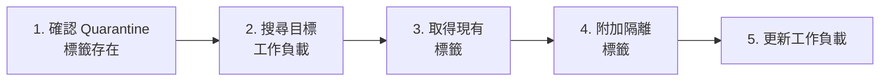
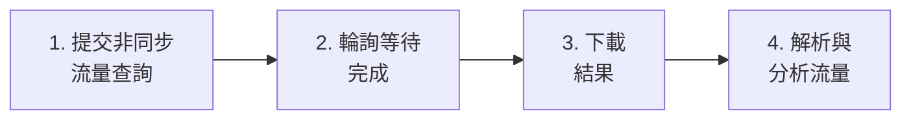

# Illumio PCE Ops — API 教學與 SIEM/SOAR 整合指南

> **[English](API_Cookbook.md)** | **[繁體中文](API_Cookbook_zh.md)**

本指南專為 **SIEM/SOAR 工程師** 設計，用於撰寫 Action、Playbook 或自動化腳本時參考。每個場景列出精確的 API 呼叫、參數和可直接複製的 Python 程式碼片段。

所有範例使用本專案 `src/api_client.py` 中的 `ApiClient` 類別。

---

## 快速設定

```python
from src.config import ConfigManager
from src.api_client import ApiClient

cm = ConfigManager()        # 載入 config.json
api = ApiClient(cm)          # 使用 PCE 憑證初始化
```

> **前置條件**：在 `config.json` 中設定有效的 `api.url`、`api.org_id`、`api.key` 和 `api.secret`。API 使用者需要適當的角色權限（見各場景說明）。

---

## 場景一：健康檢查 — 驗證 PCE 連線

**使用場景**：監控 Playbook 中的心跳檢測。  
**所需角色**：任意（`read_only` 以上）

### API 呼叫

| 步驟 | 方法 | 端點 | 回應 |
|:---|:---|:---|:---|
| 1 | GET | `/api/v2/health` | `200 OK` = 健康 |

### Python 程式碼

```python
status, message = api.check_health()
if status == 200:
    print("PCE 連線正常")
else:
    print(f"PCE 健康檢查失敗: {status} - {message}")
```

---

## 場景二：工作負載隔離（Quarantine）

**使用場景**：事件回應 — 透過標記 Quarantine 標籤來隔離遭入侵的主機。  
**所需角色**：`owner` 或 `admin`

### 操作流程



### 分步 API 呼叫

| 步驟 | 方法 | 端點 | 用途 |
|:---|:---|:---|:---|
| 1a | GET | `/orgs/{org_id}/labels?key=Quarantine` | 檢查 Quarantine 標籤是否存在 |
| 1b | POST | `/orgs/{org_id}/labels` | 建立缺失的標籤 (`{"key":"Quarantine","value":"Severe"}`) |
| 2 | GET | `/orgs/{org_id}/workloads?hostname=<目標>` | 尋找目標工作負載 |
| 3 | GET | `/api/v2{workload_href}` | 取得工作負載的現有標籤 |
| 4-5 | PUT | `/api/v2{workload_href}` | 更新標籤 = 現有標籤 + 隔離標籤 |

### 完整 Python 程式碼

```python
from src.config import ConfigManager
from src.api_client import ApiClient

cm = ConfigManager()
api = ApiClient(cm)

# --- 步驟 1：確認 Quarantine 標籤存在 ---
label_hrefs = api.check_and_create_quarantine_labels()
# 回傳: {"Mild": "/orgs/1/labels/XX", "Moderate": "/orgs/1/labels/YY", "Severe": "/orgs/1/labels/ZZ"}
print(f"Quarantine 標籤 href: {label_hrefs}")

# --- 步驟 2：搜尋目標工作負載 ---
results = api.search_workloads({"hostname": "infected-server-01"})
if not results:
    print("找不到工作負載！")
    exit(1)

target = results[0]
workload_href = target["href"]
print(f"找到工作負載: {target.get('name')} ({workload_href})")

# --- 步驟 3：取得現有標籤 ---
workload = api.get_workload(workload_href)
current_labels = [{"href": lbl["href"]} for lbl in workload.get("labels", [])]
print(f"現有標籤: {current_labels}")

# --- 步驟 4：附加 Quarantine 標籤 ---
quarantine_level = "Severe"  # 選擇: "Mild"（輕微）、"Moderate"（中度）、"Severe"（嚴重）
quarantine_href = label_hrefs[quarantine_level]
current_labels.append({"href": quarantine_href})

# --- 步驟 5：更新工作負載 ---
success = api.update_workload_labels(workload_href, current_labels)
if success:
    print(f"✅ 工作負載已隔離，等級: {quarantine_level}")
else:
    print("❌ 套用隔離標籤失敗")
```

> **SOAR Playbook 提示**：以上程式碼可包裝為單一 Action。輸入參數：`hostname`（字串）、`quarantine_level`（列舉：Mild/Moderate/Severe）。

---

## 場景三：流量分析查詢

**使用場景**：查詢過去 N 分鐘內被阻擋或異常的流量以進行調查。  
**所需角色**：`read_only` 以上

### 操作流程



### API 呼叫

| 步驟 | 方法 | 端點 | 用途 |
|:---|:---|:---|:---|
| 1 | POST | `/orgs/{org_id}/traffic_flows/async_queries` | 提交查詢 |
| 2 | GET | `/orgs/{org_id}/traffic_flows/async_queries/{uuid}` | 輪詢狀態 |
| 3 | GET | `.../async_queries/{uuid}/download` | 下載結果（gzip） |

### 請求主體（步驟 1）

```json
{
    "start_date": "2026-03-03T00:00:00Z",
    "end_date": "2026-03-03T23:59:59Z",
    "policy_decisions": ["blocked", "potentially_blocked"],
    "max_results": 200000,
    "query_name": "SOAR_Investigation",
    "sources": {"include": [], "exclude": []},
    "destinations": {"include": [], "exclude": []},
    "services": {"include": [], "exclude": []}
}
```

### Python 程式碼

```python
from src.config import ConfigManager
from src.api_client import ApiClient
from src.analyzer import Analyzer
from src.reporter import Reporter

cm = ConfigManager()
api = ApiClient(cm)

# 方式 A：低階串流（記憶體效率最佳）
for flow in api.execute_traffic_query_stream(
    "2026-03-03T00:00:00Z",
    "2026-03-03T23:59:59Z",
    ["blocked", "potentially_blocked"]
):
    src_ip = flow.get("src", {}).get("ip", "N/A")
    dst_ip = flow.get("dst", {}).get("ip", "N/A")
    port = flow.get("service", {}).get("port", "N/A")
    decision = flow.get("policy_decision", "N/A")
    print(f"{src_ip} -> {dst_ip}:{port} [{decision}]")

# 方式 B：高階查詢含排序（透過 Analyzer）
rep = Reporter(cm)
ana = Analyzer(cm, api, rep)
results = ana.query_flows({
    "start_time": "2026-03-03T00:00:00Z",
    "end_time": "2026-03-03T23:59:59Z",
    "policy_decisions": ["blocked"],
    "sort_by": "bandwidth",       # "bandwidth"、"volume" 或 "connections"
    "search": "10.0.1.50"         # 選用文字篩選
})

for r in results[:10]:
    print(f"{r['source']['name']} -> {r['destination']['name']} "
          f"| {r['formatted_bandwidth']} | {r['policy_decision']}")
```

### 關鍵回應欄位

| 欄位 | 類型 | 說明 |
|:---|:---|:---|
| `src.ip` | string | 來源 IP 位址 |
| `src.workload.name` | string | 來源工作負載名稱（若為受管） |
| `src.workload.labels` | array | 來源工作負載標籤 (`[{key, value, href}]`) |
| `dst.ip` | string | 目的 IP 位址 |
| `dst.workload.name` | string | 目的工作負載名稱 |
| `service.port` | int | 目的端口 |
| `service.proto` | int | IP 協定（6=TCP, 17=UDP, 1=ICMP） |
| `num_connections` | int | 連線次數 |
| `policy_decision` | string | `"allowed"`、`"blocked"`、`"potentially_blocked"` |
| `timestamp_range.first_detected` | string | 首次偵測時間戳 |
| `timestamp_range.last_detected` | string | 最後偵測時間戳 |

---

## 場景四：安全事件監控

**使用場景**：為 SIEM 儀表板擷取近期安全事件。  
**所需角色**：`read_only` 以上

### API 呼叫

| 步驟 | 方法 | 端點 | 用途 |
|:---|:---|:---|:---|
| 1 | GET | `/orgs/{org_id}/events?timestamp[gte]=<ISO_TIME>&max_results=1000` | 擷取事件 |

### Python 程式碼

```python
from datetime import datetime, timezone, timedelta
from src.config import ConfigManager
from src.api_client import ApiClient

cm = ConfigManager()
api = ApiClient(cm)

# 查詢過去 30 分鐘的事件
since = (datetime.now(timezone.utc) - timedelta(minutes=30)).strftime('%Y-%m-%dT%H:%M:%SZ')
events = api.fetch_events(since, max_results=500)

for evt in events:
    print(f"[{evt.get('timestamp')}] {evt.get('event_type')} - "
          f"嚴重等級: {evt.get('severity')} - "
          f"主機: {evt.get('created_by', {}).get('agent', {}).get('hostname', 'System')}")
```

### 常用事件類型

| 事件類型 | 分類 | 說明 |
|:---|:---|:---|
| `agent.tampering` | Agent 健康 | 偵測到 VEN 竄改 |
| `system_task.agent_offline_check` | Agent 健康 | Agent 離線 |
| `system_task.agent_missed_heartbeats_check` | Agent 健康 | Agent 心跳遺失 |
| `user.sign_in` | 認證 | 使用者登入 (包含失敗) |
| `request.authentication_failed` | 認證 | API Key 認證失敗 |
| `rule_set.create` / `rule_set.update` | 政策 | Ruleset 建立或修改 |
| `sec_rule.create` / `sec_rule.delete` | 政策 | 安全規則建立或刪除 |
| `sec_policy.create` | 政策 | 政策已佈建 |
| `workload.create` / `workload.delete` | 工作負載 | 工作負載配對或解除配對 |

---

## 場景五：工作負載搜尋與盤點

**使用場景**：依主機名稱、IP 或標籤搜尋工作負載。  
**所需角色**：`read_only` 以上

### API 呼叫

| 步驟 | 方法 | 端點 | 用途 |
|:---|:---|:---|:---|
| 1 | GET | `/orgs/{org_id}/workloads?<params>` | 搜尋工作負載 |

### Python 程式碼

```python
from src.config import ConfigManager
from src.api_client import ApiClient

cm = ConfigManager()
api = ApiClient(cm)

# 依主機名搜尋（支援部分匹配）
results = api.search_workloads({"hostname": "web-server"})

# 依 IP 位址搜尋
results = api.search_workloads({"ip_address": "10.0.1.50"})

for wl in results:
    labels = ", ".join([f"{l['key']}={l['value']}" for l in wl.get("labels", [])])
    managed = "受管" if wl.get("agent", {}).get("config", {}).get("mode") else "未受管"
    print(f"{wl.get('name', 'N/A')} | {wl.get('hostname', 'N/A')} | {managed} | 標籤: [{labels}]")
```

---

## 場景六：標籤管理

**使用場景**：列出或建立標籤以進行政策自動化。  
**所需角色**：`admin` 以上（建立操作）

### Python 程式碼

```python
from src.config import ConfigManager
from src.api_client import ApiClient

cm = ConfigManager()
api = ApiClient(cm)

# 列出所有 "env" 類型的標籤
env_labels = api.get_labels("env")
for lbl in env_labels:
    print(f"{lbl['key']}={lbl['value']}  (href: {lbl['href']})")

# 建立新標籤
new_label = api.create_label("env", "Staging")
if new_label:
    print(f"已建立標籤: {new_label['href']}")
```

---

## SIEM/SOAR 快速查閱表

| 操作 | API 端點 | HTTP | 請求主體 | 預期回應 |
|:---|:---|:---|:---|:---|
| 健康檢查 | `/api/v2/health` | GET | — | `200` |
| 擷取事件 | `/orgs/{id}/events?timestamp[gte]=...` | GET | — | `200` + JSON 陣列 |
| 提交流量查詢 | `/orgs/{id}/traffic_flows/async_queries` | POST | 見場景三 | `201`/`202` + `{href}` |
| 輪詢查詢狀態 | `/orgs/{id}/traffic_flows/async_queries/{uuid}` | GET | — | `200` + `{status}` |
| 下載查詢結果 | `.../async_queries/{uuid}/download` | GET | — | `200` + gzip 資料 |
| 列出標籤 | `/orgs/{id}/labels?key=<key>` | GET | — | `200` + JSON 陣列 |
| 建立標籤 | `/orgs/{id}/labels` | POST | `{key, value}` | `201` + `{href}` |
| 搜尋工作負載 | `/orgs/{id}/workloads?hostname=...` | GET | — | `200` + JSON 陣列 |
| 取得工作負載 | `/api/v2{workload_href}` | GET | — | `200` + workload JSON |
| 更新工作負載標籤 | `/api/v2{workload_href}` | PUT | `{labels: [{href}]}` | `204` |

> **Base URL 格式**：`https://<pce_host>:<port>/api/v2/orgs/<org_id>/...`  
> **認證**：HTTP Basic，API Key 作為使用者名稱，Secret 作為密碼。
