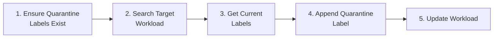
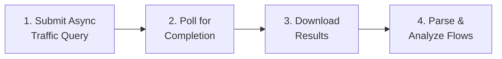
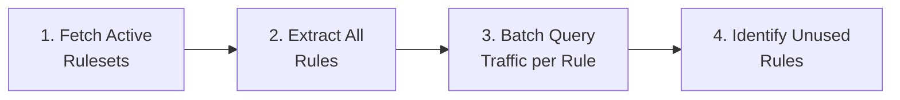
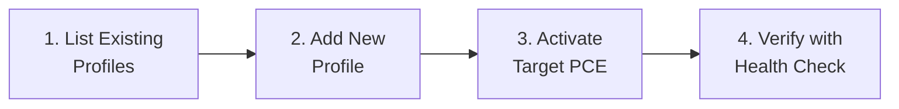

# PCE REST API 手冊

<!-- BEGIN:doc-map -->
| Document | EN | 中文 |
|---|---|---|
| README | [README.md](../README.md) | [README_zh.md](../README_zh.md) |
| User Manual | [User_Manual.md](./User_Manual.md) | [User_Manual_zh.md](./User_Manual_zh.md) |
| Architecture | [Architecture.md](./Architecture.md) | [Architecture_zh.md](./Architecture_zh.md) |
| Security Rules | [Security_Rules_Reference.md](./Security_Rules_Reference.md) | [Security_Rules_Reference_zh.md](./Security_Rules_Reference_zh.md) |
<!-- END:doc-map -->

> **[English](API_Cookbook.md)** | **[繁體中文](API_Cookbook_zh.md)**

本指南提供以情境為基礎的 API 教學，專為撰寫 Action、Playbook 或自動化腳本的 **SIEM/SOAR 工程師**設計。每個情境列出所需的確切 API 呼叫、參數及 Python 程式碼片段。

所有範例均使用本專案 `src/api_client.py` 中的 `ApiClient` 類別。

---

## §1 認證

Illumio PCE REST API 使用 HTTP Basic 認證，搭配 **API key + secret** 對。與 session 憑證不同，API key 除非明確刪除，否則不會過期，使其成為自動化腳本的首選機制。

**產生憑證：** 在 PCE Web 主控台中，導覽至 My Profile → API Keys。系統回傳：
- `auth_username` —— API key ID，格式如 `api_xxxxxxxx`
- `secret` —— 一次性可見的 secret 值

**HTTP 標頭格式：** 串接 `api_key:secret`，對結果進行 Base64 編碼，並以 `Authorization: Basic <b64>` 標頭傳遞。`illumio_ops` 在 `_build_auth_header()` 中建立此標頭：

```python
# src/api_client.py — _build_auth_header()
credentials = f"{self.api_cfg['key']}:{self.api_cfg['secret']}"
encoded = base64.b64encode(credentials.encode('utf-8')).decode('ascii')
return f"Basic {encoded}"
```

`illumio_ops` 從 `config/config.json` 讀取 `api.key` 和 `api.secret`。標頭在初始化時附加至共享的 `requests.Session`，使後續所有呼叫自動繼承。

**各方法所需標頭：**

| HTTP 方法 | 必要標頭 |
|-------------|----------------|
| GET | `Accept: application/json`（建議） |
| PUT / POST | `Content-Type: application/json` |
| 非同步請求 | `Prefer: respond-async`（見 §3） |

PCE 嚴格要求符合 RFC 7230 §3.2 的**不區分大小寫的標頭名稱匹配**。所有回應均包含 `X-Request-Id` 標頭，可用於向 Illumio Support 排除故障。

---

## §2 分頁

預設情況下，同步 `GET` 集合 endpoint 最多回傳 **500 個物件**。兩種機制控制分頁：

**`max_results` 查詢參數：** 傳遞 `?max_results=N` 以調整每次請求的上限（部分 endpoint 允許最多 10,000，例如 Events API）。若要以低成本探查總計數，請求 `?max_results=1` 並讀取 `X-Total-Count` 回應標頭。

**處理大型集合：** 當 `X-Total-Count` 超過 endpoint 的上限時，PCE 不使用 `Link` 標頭進行逐頁遍歷。相反，使用**非同步批次集合**模式（§3）：注入 `Prefer: respond-async`，PCE 將以批次作業的方式離線收集所有匹配記錄，回傳單一可下載的結果檔案。

`illumio_ops` 對 ruleset 擷取（`/sec_policy/active/rule_sets`）使用 `max_results=10000`，對事件擷取使用 `max_results=5000`。對於流量記錄，由於 200,000 筆結果的上限，始終使用非同步路徑。

---

## §3 非同步作業模式

長時間執行或大型集合請求使用 PCE 非同步作業模式。完整生命週期為：

**1. 提交** —— 以 `Prefer: respond-async` POST 查詢。PCE 回應 `202 Accepted`，並在 `Location` 標頭中包含作業 HREF（例如 `/orgs/1/traffic_flows/async_queries/<uuid>`）。

**2. 輪詢** —— 重複 GET 作業 HREF，直到 `status` 為 `"completed"` 或 `"failed"`。遵守任何 `Retry-After` 標頭。`src/api/async_jobs.py` 中的 `_wait_for_async_query()` 方法實作輪詢迴圈：

```python
# src/api/async_jobs.py — _wait_for_async_query() (condensed)
for poll_num in range(max_polls):         # polls every 2 s, default 60 polls (120 s)
    time.sleep(2)
    poll_status, poll_body = c._request(poll_url, timeout=15)
    poll_result = orjson.loads(poll_body)
    state = poll_result.get("status")
    if state == "completed":
        break
    if state == "failed":
        return poll_result
```

**3. 擷取** —— GET `<job_href>/download` 以串流方式取得 gzip 壓縮的 JSONL 結果檔案。`iter_async_query_results()` 即時解壓縮並逐一 yield 流量字典以節省記憶體。

**Draft policy 擴充：** 在 `completed` 後，`illumio_ops` 選擇性地 PUT `<job_href>/update_rules`（body `{}`），然後重新輪詢直至 `rules` 狀態也達到 `"completed"`。這解鎖下載中的 `draft_policy_decision`、`rules`、`enforcement_boundaries` 及 `override_deny_rules` 欄位。

---

## §4 illumio_ops 使用的常用 Endpoint

| Endpoint | 方法 | `illumio_ops` 實作 | 用途 |
|----------|--------|------------------------------|---------|
| `/api/v2/health` | GET | `ApiClient.check_health()` | PCE 連線心跳 |
| `/orgs/{id}/events` | GET | `ApiClient.fetch_events()` | 安全事件（SIEM 攝取） |
| `/orgs/{id}/labels` | GET | `LabelResolver.get_labels()` | Label 維度查詢 |
| `/orgs/{id}/workloads` | GET | `ApiClient.search_workloads()` | Workload 清單 / 搜尋 |
| `/orgs/{id}/sec_policy/active/rule_sets` | GET | `ApiClient.get_active_rulesets()` | 活躍 ruleset 擷取 |
| `/orgs/{id}/traffic_flows/async_queries` | POST | `AsyncJobManager.submit_async_query()` | 提交流量查詢 |
| `/orgs/{id}/traffic_flows/async_queries/{uuid}` | GET | `AsyncJobManager._wait_for_async_query()` | 輪詢作業狀態 |
| `/orgs/{id}/traffic_flows/async_queries/{uuid}/download` | GET | `AsyncJobManager.iter_async_query_results()` | 串流結果 |
| `/orgs/{id}/traffic_flows/async_queries/{uuid}/update_rules` | PUT | `AsyncJobManager._wait_for_async_query()` | 啟用 draft policy 欄位 |

---

## §5 錯誤處理與重試策略

`illumio_ops` 在共享的 `requests.Session` 上掛載 `urllib3.Retry` adapter：

```python
retry = Retry(
    total=MAX_RETRIES,            # 3 attempts
    backoff_factor=1.0,
    status_forcelist=[429, 502, 503, 504],
    allowed_methods=frozenset(["GET", "POST", "PUT", "DELETE", "HEAD"]),
    respect_retry_after_header=True,
    raise_on_status=False,
)
```

HTTP 429（速率限制）及 5xx 暫時性錯誤會以指數退避自動重試。`EventFetchError` 針對不可重試的失敗觸發，由呼叫者捕獲，記錄狀態碼並回傳空清單以保持 daemon 迴圈繼續執行。

---

## §6 速率限制

PCE 實施 API 速率配額（大多數部署中預設 500 requests/min）。`illumio_ops` 在 `src/pce_cache/rate_limiter.py` 中提供令牌桶速率限制器。呼叫者在每次呼叫前傳遞 `rate_limit=True` 給 `_request()` 以取得令牌：

```python
# src/api_client.py — _request() with rate_limit=True
if not get_rate_limiter(rate_per_minute=rpm).acquire(timeout=30.0):
    raise APIError("Global rate limiter timeout — PCE 500/min budget exhausted")
```

`rate_limit_per_minute` 值從 `config_models.pce_cache.rate_limit_per_minute` 讀取，預設為 400（為並行 PCE Web 主控台流量保留餘裕）。

> **參考資料：** Illumio REST API Guide 25.4（`REST_APIs_25_4.pdf`）。

---

## Quick Setup

```python
from src.config import ConfigManager
from src.api_client import ApiClient

cm = ConfigManager()        # Loads config.json
api = ApiClient(cm)          # Initializes with PCE credentials
```

> **前置條件**：在 `config.json` 中設定有效的 `api.url`、`api.org_id`、`api.key` 及 `api.secret`。API 使用者需要適當的角色（詳見以下各情境）。

---

## Scenario 1: Health Check — Verify PCE Connectivity

**使用案例**：監控 Playbook 中的心跳檢查。
**所需角色**：任何角色（read_only 或以上）

### API Call

| 步驟 | 方法 | Endpoint | 回應 |
|:---|:---|:---|:---|
| 1 | GET | `/api/v2/health` | `200 OK` = 健康 |

### Python Code

```python
status, message = api.check_health()
if status == 200:
    print("PCE is healthy")
else:
    print(f"PCE health check failed: {status} - {message}")
```

---

## Scenario 2: Workload Quarantine (Isolation)

**使用案例**：事件回應 —— 透過標記隔離 label 隔離受損主機。
**所需角色**：`owner` 或 `admin`

### Workflow



### Step-by-Step API Calls

| 步驟 | 方法 | Endpoint | 用途 |
|:---|:---|:---|:---|
| 1a | GET | `/orgs/{org_id}/labels?key=Quarantine` | 檢查隔離 label 是否存在 |
| 1b | POST | `/orgs/{org_id}/labels` | 建立缺少的 label（`{"key":"Quarantine","value":"Severe"}`） |
| 2 | GET | `/orgs/{org_id}/workloads?hostname=<target>` | 尋找目標 workload |
| 3 | GET | `/api/v2{workload_href}` | 取得 workload 當前的 label |
| 4-5 | PUT | `/api/v2{workload_href}` | 更新 label = 現有 + 隔離 label |

### Complete Python Code

```python
from src.config import ConfigManager
from src.api_client import ApiClient

cm = ConfigManager()
api = ApiClient(cm)

# --- Step 1: Ensure Quarantine labels exist ---
label_hrefs = api.check_and_create_quarantine_labels()
# Returns: {"Mild": "/orgs/1/labels/XX", "Moderate": "/orgs/1/labels/YY", "Severe": "/orgs/1/labels/ZZ"}
print(f"Quarantine label hrefs: {label_hrefs}")

# --- Step 2: Search for the target workload ---
results = api.search_workloads({"hostname": "infected-server-01"})
if not results:
    print("Workload not found!")
    exit(1)

target = results[0]
workload_href = target["href"]
print(f"Found workload: {target.get('name')} ({workload_href})")

# --- Step 3: Get current labels ---
workload = api.get_workload(workload_href)
current_labels = [{"href": lbl["href"]} for lbl in workload.get("labels", [])]
print(f"Current labels: {current_labels}")

# --- Step 4: Append the Quarantine label ---
quarantine_level = "Severe"  # Choose: "Mild", "Moderate", or "Severe"
quarantine_href = label_hrefs[quarantine_level]
current_labels.append({"href": quarantine_href})

# --- Step 5: Update the workload ---
success = api.update_workload_labels(workload_href, current_labels)
if success:
    print(f"Workload quarantined at level: {quarantine_level}")
else:
    print("Failed to apply quarantine label")
```

> **SOAR Playbook 提示**：上述程式碼可包裝為單一 Action。輸入參數：`hostname`（字串）、`quarantine_level`（列舉：Mild/Moderate/Severe）。

---

## Scenario 3: Traffic Flow Analysis

**使用案例**：查詢過去 N 分鐘內被封鎖或異常的流量以進行調查。
**所需角色**：`read_only` 或以上

> **重要 —— Illumio Core 25.2 變更**：同步流量查詢已棄用。本工具專門使用**非同步查詢**（`async_queries`），每次查詢支援最多 **200,000 筆結果**。所有流量分析 —— 包括串流下載 —— 均透過以下非同步工作流程進行。

### Workflow

**標準（Reported 視圖）：** 3 步驟



**含 Draft Policy 分析：** 4 步驟 —— 在下載前插入 `update_rules` 以解鎖隱藏欄位（`draft_policy_decision`、`rules`、`enforcement_boundaries`、`override_deny_rules`）。


### API Calls

| 步驟 | 方法 | Endpoint | 用途 |
|:---|:---|:---|:---|
| 1 | POST | `/orgs/{org_id}/traffic_flows/async_queries` | 提交查詢 |
| 2 | GET | `/orgs/{org_id}/traffic_flows/async_queries/{uuid}` | 輪詢狀態 |
| 3 *（選用）* | PUT | `.../async_queries/{uuid}/update_rules` | 觸發 draft policy 計算 |
| 4 *（選用）* | GET | `/orgs/{org_id}/traffic_flows/async_queries/{uuid}` | update_rules 後重新輪詢 |
| 5 | GET | `.../async_queries/{uuid}/download` | 下載結果（JSON 陣列） |

> **update_rules 注意事項**：Request body 為空（`{}`）。回傳 `202 Accepted`。PCE 狀態在計算期間保持 `"completed"` —— 重新輪詢前等待約 10 秒。本工具向 `execute_traffic_query_stream()` 傳遞 `compute_draft=True` 以自動觸發。

### Request Body (Step 1)

```json
{
    "start_date": "2026-03-03T00:00:00Z",
    "end_date": "2026-03-03T23:59:59Z",
    "policy_decisions": ["blocked", "potentially_blocked"],
    "max_results": 200000,
    "query_name": "SOAR_Investigation",
    "sources": {"include": [], "exclude": []},
    "destinations": {"include": [], "exclude": []},
    "services": {"include": [], "exclude": []}
}
```

### Python Code

```python
from src.config import ConfigManager
from src.api_client import ApiClient
from src.analyzer import Analyzer
from src.reporter import Reporter

cm = ConfigManager()
api = ApiClient(cm)

# Option A: Low-level streaming (memory efficient)
for flow in api.execute_traffic_query_stream(
    "2026-03-03T00:00:00Z",
    "2026-03-03T23:59:59Z",
    ["blocked", "potentially_blocked"]
):
    src_ip = flow.get("src", {}).get("ip", "N/A")
    dst_ip = flow.get("dst", {}).get("ip", "N/A")
    port = flow.get("service", {}).get("port", "N/A")
    decision = flow.get("policy_decision", "N/A")
    print(f"{src_ip} -> {dst_ip}:{port} [{decision}]")

# Option B: High-level query with sorting (via Analyzer)
rep = Reporter(cm)
ana = Analyzer(cm, api, rep)
results = ana.query_flows({
    "start_time": "2026-03-03T00:00:00Z",
    "end_time": "2026-03-03T23:59:59Z",
    "policy_decisions": ["blocked"],
    "sort_by": "bandwidth",       # "bandwidth", "volume", or "connections"
    "search": "10.0.1.50"         # Optional text filter
})

for r in results[:10]:
    print(f"{r['source']['name']} -> {r['destination']['name']} "
          f"| {r['formatted_bandwidth']} | {r['policy_decision']}")
```

### Advanced Filtering (Post-Download)

流量記錄從 PCE 批次下載後，使用 `ApiClient.check_flow_match()` 在客戶端進行篩選。這提供比 PCE API 本身支援更豐富的篩選功能。

| 篩選鍵 | 類型 | 說明 |
|:---|:---|:---|
| `src_labels` | `"key:value"` 清單 | 依來源 label 匹配 |
| `dst_labels` | `"key:value"` 清單 | 依目的地 label 匹配 |
| `any_label` | `"key:value"` | OR 邏輯 —— 若**來源或目的地**具有該 label 則匹配 |
| `src_ip` / `dst_ip` | 字串（IP 或 CIDR） | 依來源/目的地 IP 匹配 |
| `any_ip` | 字串（IP 或 CIDR） | OR 邏輯 —— 若任一端匹配 IP 則符合 |
| `port` / `proto` | int | 服務 port 和 IP 協定篩選 |
| `ex_src_labels` / `ex_dst_labels` | `"key:value"` 清單 | **排除**匹配這些 label 的流量 |
| `ex_src_ip` / `ex_dst_ip` | 字串（IP 或 CIDR） | **排除**來自/前往這些 IP 的流量 |
| `ex_any_label` / `ex_any_ip` | 字串 | 若任一端匹配則**排除** |
| `ex_port` | int | 排除此 port 上的流量 |

> **篩選方向**：使用 `filter_direction: "src_or_dst"` 時，label 和 IP 篩選使用 OR 邏輯（若來源或目的地滿足條件則匹配）。預設為 `"src_and_dst"`（兩端必須各自匹配其篩選器）。

### Flow Record — Complete Field Reference

#### Policy & Decision Fields

| 欄位 | 必要 | 說明 |
|:---|:---|:---|
| `policy_decision` | 是 | 基於**活躍**規則的回報 policy 結果。值：`allowed` / `potentially_blocked` / `blocked` / `unknown` |
| `boundary_decision` | 否 | 回報的 boundary 結果。值：`blocked` / `blocked_by_override_deny` / `blocked_non_illumio_rule` |
| `draft_policy_decision` | 否 ⚠️ | **需要 `update_rules`**。Draft policy 診斷，結合 action + reason（見下表） |
| `rules` | 否 ⚠️ | **需要 `update_rules`**。匹配此流量的 draft allow 規則 HREF |
| `enforcement_boundaries` | 否 ⚠️ | **需要 `update_rules`**。封鎖此流量的 draft enforcement boundary HREF |
| `override_deny_rules` | 否 ⚠️ | **需要 `update_rules`**。封鎖此流量的 draft override deny 規則 HREF |

**`draft_policy_decision` 值參考**（action + reason 公式）：

| 值 | 含義 |
|:---|:---|
| `allowed` | Draft 規則允許此流量 |
| `allowed_across_boundary` | 流量命中 deny boundary，但明確的 allow 規則覆蓋（例外） |
| `blocked_by_boundary` | Draft enforcement boundary 將封鎖此流量 |
| `blocked_by_override_deny` | 最高優先級的 override deny 規則將封鎖 —— 任何 allow 規則均無法覆蓋 |
| `blocked_no_rule` | 因沒有匹配的 allow 規則而被 default-deny 封鎖 |
| `potentially_blocked` | 與 blocked 原因相同，但目的地主機處於 Visibility Only 模式 |
| `potentially_blocked_by_boundary` | Boundary 封鎖，但目的地主機處於 Visibility Only 模式 |
| `potentially_blocked_by_override_deny` | Override deny 封鎖，但目的地主機處於 Visibility Only 模式 |
| `potentially_blocked_no_rule` | 無 allow 規則，但目的地主機處於 Visibility Only 模式 |

**`boundary_decision` 值參考**（僅限 reported 視圖）：

| 值 | 含義 |
|:---|:---|
| `blocked` | 被 enforcement boundary 或 deny 規則封鎖 |
| `blocked_by_override_deny` | 被 override deny 規則封鎖（最高優先級） |
| `blocked_non_illumio_rule` | 被原生主機防火牆規則封鎖（例如 iptables、GPO）—— 非 Illumio 規則 |

#### Connection Fields

| 欄位 | 必要 | 說明 |
|:---|:---|:---|
| `num_connections` | 是 | 此聚合流量被看到的次數 |
| `flow_direction` | 是 | VEN 捕獲視角：`inbound`（目的地 VEN）/ `outbound`（來源 VEN） |
| `timestamp_range.first_detected` | 是 | 首次看到（ISO 8601 UTC） |
| `timestamp_range.last_detected` | 是 | 最後看到（ISO 8601 UTC） |
| `state` | 否 | 連線狀態：`A`（Active）/ `C`（Closed）/ `T`（Timed out）/ `S`（Snapshot）/ `N`（New/SYN） |
| `transmission` | 否 | `broadcast` / `multicast` / `unicast` |

#### Service Object (`service`)

> 行程和使用者屬於 VEN 端主機：`inbound` 的**目的地**，`outbound` 的**來源**。

| 欄位 | 必要 | 說明 |
|:---|:---|:---|
| `service.port` | 是 | 目的地 port |
| `service.proto` | 是 | IANA 協定編號（6=TCP、17=UDP、1=ICMP） |
| `service.process_name` | 否 | 應用程式行程名稱（例如 `sshd`、`nginx`） |
| `service.windows_service_name` | 否 | Windows 服務名稱 |
| `service.user_name` | 否 | 執行行程的 OS 帳戶 |

#### Source / Destination Objects (`src`, `dst`)

| 欄位 | 說明 |
|:---|:---|
| `src.ip` / `dst.ip` | IPv4 或 IPv6 位址 |
| `src.workload.href` | Workload 唯一 URI |
| `src.workload.hostname` / `name` | 主機名稱和友好名稱 |
| `src.workload.enforcement_mode` | `idle` / `visibility_only` / `selective` / `full` |
| `src.workload.managed` | 若 VEN 已安裝則為 `true` |
| `src.workload.labels` | `{href, key, value}` label 物件陣列 |
| `src.ip_lists` | 此位址所屬的 IP List |
| `src.fqdn_name` | 解析的 FQDN（若 DNS 資料可用） |
| `src.virtual_server` / `virtual_service` | Kubernetes / 負載均衡器虛擬服務 |
| `src.cloud_resource` | 雲端原生資源（例如 AWS RDS） |

#### Bandwidth & Network Fields

| 欄位 | 說明 |
|:---|:---|
| `dst_bi` | 目的地接收位元組（= 來源送出位元組） |
| `dst_bo` | 目的地送出位元組（= 來源接收位元組） |
| `icmp_type` / `icmp_code` | ICMP 類型和代碼（僅 proto=1） |
| `network` | PCE 網路物件（`name`、`href`） |
| `client_type` | 回報此流量的代理類型：`server` / `endpoint` / `flowlink` / `scanner` |

---

## Scenario 4: Security Event Monitoring

**使用案例**：擷取 SIEM 儀表板的最近安全事件。
**所需角色**：`read_only` 或以上

### API Call

| 步驟 | 方法 | Endpoint | 用途 |
|:---|:---|:---|:---|
| 1 | GET | `/orgs/{org_id}/events?timestamp[gte]=<ISO_TIME>&max_results=1000` | 擷取事件 |

### Python Code

```python
from datetime import datetime, timezone, timedelta
from src.config import ConfigManager
from src.api_client import ApiClient

cm = ConfigManager()
api = ApiClient(cm)

# Query events from the last 30 minutes
since = (datetime.now(timezone.utc) - timedelta(minutes=30)).strftime('%Y-%m-%dT%H:%M:%SZ')
events = api.fetch_events(since, max_results=500)

for evt in events:
    print(f"[{evt.get('timestamp')}] {evt.get('event_type')} - "
          f"Severity: {evt.get('severity')} - "
          f"Host: {evt.get('created_by', {}).get('agent', {}).get('hostname', 'System')}")
```

### Common Event Types

| 事件類型 | 類別 | 說明 |
|:---|:---|:---|
| `agent.tampering` | Agent 健康 | 偵測到 VEN 篡改 |
| `system_task.agent_offline_check` | Agent 健康 | Agent 離線 |
| `system_task.agent_missed_heartbeats_check` | Agent 健康 | Agent 錯過心跳 |
| `user.sign_in` | 認證 | 使用者登入（成功或失敗） |
| `request.authentication_failed` | 認證 | API key 認證失敗 |
| `rule_set.create` / `rule_set.update` | Policy | Ruleset 建立或修改 |
| `sec_rule.create` / `sec_rule.delete` | Policy | 安全規則建立或刪除 |
| `sec_policy.create` | Policy | Policy 已佈建 |
| `workload.create` / `workload.delete` | Workload | Workload 配對或取消配對 |

---

## Scenario 5: Workload Search & Inventory

**使用案例**：依主機名稱、IP 或 label 搜尋 workload。
**所需角色**：`read_only` 或以上

### API Call

| 步驟 | 方法 | Endpoint | 用途 |
|:---|:---|:---|:---|
| 1 | GET | `/orgs/{org_id}/workloads?<params>` | 搜尋 workload |

### Python Code

```python
from src.config import ConfigManager
from src.api_client import ApiClient

cm = ConfigManager()
api = ApiClient(cm)

# Search by hostname (partial match)
results = api.search_workloads({"hostname": "web-server"})

# Search by IP address
results = api.search_workloads({"ip_address": "10.0.1.50"})

for wl in results:
    labels = ", ".join([f"{l['key']}={l['value']}" for l in wl.get("labels", [])])
    managed = "Managed" if wl.get("agent", {}).get("config", {}).get("mode") else "Unmanaged"
    print(f"{wl.get('name', 'N/A')} | {wl.get('hostname', 'N/A')} | {managed} | Labels: [{labels}]")
```

---

## Scenario 6: Label Management

**使用案例**：列出或建立 label 以進行 policy 自動化。
**所需角色**：`admin` 或以上（用於建立）

### Python Code

```python
from src.config import ConfigManager
from src.api_client import ApiClient

cm = ConfigManager()
api = ApiClient(cm)

# List all labels of type "env"
env_labels = api.get_labels("env")
for lbl in env_labels:
    print(f"{lbl['key']}={lbl['value']}  (href: {lbl['href']})")

# Create a new label
new_label = api.create_label("env", "Staging")
if new_label:
    print(f"Created label: {new_label['href']}")
```

---

---

## Scenario 7: Internal Tool API (Auth & Security)

**使用案例**：對 Illumio PCE Ops 工具本身進行自動化（例如，批次更新規則、透過腳本觸發報表）。
**必要條件**：有效的工具憑證（預設：使用者名稱 `illumio` / 密碼 `illumio` —— 首次登入時請變更）。

### Workflow

1. **登入**：POST 至 `/api/login` 以取得 session cookie。
2. **已認證請求**：在後續呼叫中包含 session cookie。

### Python Code

```python
import requests

BASE_URL = "http://127.0.0.1:5001"
session = requests.Session()

# 1. Login (default: illumio / illumio)
login_payload = {"username": "illumio", "password": "<your_password>"}
res = session.post(f"{BASE_URL}/api/login", json=login_payload)

if res.json().get("ok"):
    print("Login successful")

    # 2. Example: Trigger a Traffic Report
    report_res = session.post(f"{BASE_URL}/api/reports/generate", json={
        "type": "traffic",
        "days": 7
    })
    print(f"Report triggered: {report_res.json()}")
else:
    print("Login failed")
```

---

## Scenario 8: Policy Usage Analysis

**使用案例**：透過查詢每規則流量命中計數，識別未使用或使用率低的安全規則。有助於 policy 清理、合規性稽核及規則生命週期管理。
**所需角色**：`read_only` 或以上（PCE API）；GUI endpoint 需要工具登入。

### Workflow



### How It Works

Policy usage 分析使用三階段並行方式：

1. **Phase 1（提交）**：對每條規則，根據規則的 consumer、provider、ingress service 及父 ruleset 範圍，建構目標化的非同步流量查詢。並行提交所有查詢。
2. **Phase 2（輪詢）**：並行輪詢所有待處理的非同步作業，直到每個作業完成或失敗。
3. **Phase 3（下載）**：並行下載結果，並計算每條規則的匹配流量數。

在分析窗口內，零匹配流量的規則被標記為「未使用」。

### PCE API Calls

| 步驟 | 方法 | Endpoint | 用途 |
|:---|:---|:---|:---|
| 1 | GET | `/orgs/{org_id}/sec_policy/active/rule_sets?max_results=10000` | 擷取所有活躍（已佈建）ruleset |
| 2 | POST | `/orgs/{org_id}/traffic_flows/async_queries` | 提交每規則流量查詢（每條規則一個） |
| 3 | GET | `/orgs/{org_id}/traffic_flows/async_queries/{uuid}` | 輪詢查詢狀態 |
| 4 | GET | `.../async_queries/{uuid}/download` | 下載查詢結果 |

### Python Code (Direct API)

```python
from src.config import ConfigManager
from src.api_client import ApiClient

cm = ConfigManager()
api = ApiClient(cm)

# Step 1: Fetch all active rulesets with their rules
rulesets = api.get_active_rulesets()
print(f"Found {len(rulesets)} active rulesets")

# Step 2: Flatten all rules from all rulesets
all_rules = []
for rs in rulesets:
    for rule in rs.get("rules", []):
        rule["_ruleset_name"] = rs.get("name", "Unknown")
        rule["_ruleset_scopes"] = rs.get("scopes", [])
        all_rules.append(rule)

print(f"Total rules to analyze: {len(all_rules)}")

# Step 3: Batch query traffic counts (parallel, up to 10 concurrent)
hit_hrefs, hit_counts = api.batch_get_rule_traffic_counts(
    rules=all_rules,
    start_date="2026-03-01T00:00:00Z",
    end_date="2026-04-01T00:00:00Z",
    max_concurrent=10,
    on_progress=lambda msg: print(f"  {msg}")
)

# Step 4: Report results
used_count = len(hit_hrefs)
unused_count = len(all_rules) - used_count
print(f"\nResults: {used_count} rules with traffic, {unused_count} rules unused")

for rule in all_rules:
    href = rule.get("href", "")
    count = hit_counts.get(href, 0)
    status = "HIT" if href in hit_hrefs else "UNUSED"
    print(f"  [{status}] {rule['_ruleset_name']} / "
          f"{rule.get('description', 'No description')} — {count} flows")
```

### Python Code (GUI Endpoint)

```python
import requests

BASE_URL = "http://127.0.0.1:5001"
session = requests.Session()
session.post(f"{BASE_URL}/api/login", json={"username": "illumio", "password": "<your_password>"})

# Generate policy usage report (defaults to last 30 days)
res = session.post(f"{BASE_URL}/api/policy_usage_report/generate", json={
    "start_date": "2026-03-01T00:00:00Z",
    "end_date": "2026-04-01T00:00:00Z"
})

data = res.json()
if data.get("ok"):
    print(f"Report files: {data['files']}")
    print(f"Total rules analyzed: {data['record_count']}")
    for kpi in data.get("kpis", []):
        print(f"  {kpi}")
else:
    print(f"Error: {data.get('error')}")
```

> **效能注意事項**：`batch_get_rule_traffic_counts()` 使用 `ThreadPoolExecutor`，並行度可設定（`max_concurrent`，預設 10）。對於具有 500+ 條規則的環境，若 PCE 可承受負載，可考慮增加至 15-20。整體逾時為 5 分鐘。

---

## Scenario 9: Multi-PCE Profile Management

**使用案例**：從單一 Illumio Ops 部署管理多個 PCE 實例（例如 Production、Staging、DR）的連線。無需手動編輯 `config.json` 即可切換活躍 PCE。
**必要條件**：工具登入（GUI endpoint）。

### Workflow



### GUI API Endpoints

| 操作 | 方法 | Endpoint | Request Body |
|:---|:---|:---|:---|
| 列出 profile | GET | `/api/pce-profiles` | — |
| 新增 profile | POST | `/api/pce-profiles` | `{"action":"add", "name":"...", "url":"...", ...}` |
| 更新 profile | POST | `/api/pce-profiles` | `{"action":"update", "id":123, "name":"...", ...}` |
| 啟用 profile | POST | `/api/pce-profiles` | `{"action":"activate", "id":123}` |
| 刪除 profile | POST | `/api/pce-profiles` | `{"action":"delete", "id":123}` |

### curl Examples

```bash
BASE="http://127.0.0.1:5001"
COOKIE=$(curl -s -c - "$BASE/api/login" \
  -H "Content-Type: application/json" \
  -d '{"username":"illumio","password":"<your_password>"}' | grep session | awk '{print $NF}')

# List all PCE profiles
curl -s -b "session=$COOKIE" "$BASE/api/pce-profiles" | python -m json.tool

# Add a new PCE profile
curl -s -b "session=$COOKIE" "$BASE/api/pce-profiles" \
  -H "Content-Type: application/json" \
  -d '{
    "action": "add",
    "name": "Production PCE",
    "url": "https://pce-prod.example.com:8443",
    "org_id": "1",
    "key": "api_key_here",
    "secret": "api_secret_here",
    "verify_ssl": true
  }'

# Activate a profile (switch active PCE)
curl -s -b "session=$COOKIE" "$BASE/api/pce-profiles" \
  -H "Content-Type: application/json" \
  -d '{"action": "activate", "id": 1700000000}'

# Delete a profile
curl -s -b "session=$COOKIE" "$BASE/api/pce-profiles" \
  -H "Content-Type: application/json" \
  -d '{"action": "delete", "id": 1700000000}'
```

### Python Code

```python
import requests

BASE_URL = "http://127.0.0.1:5001"
session = requests.Session()
session.post(f"{BASE_URL}/api/login", json={"username": "illumio", "password": "<your_password>"})

# List current profiles
res = session.get(f"{BASE_URL}/api/pce-profiles")
profiles = res.json()
print(f"Active PCE ID: {profiles['active_pce_id']}")
for p in profiles["profiles"]:
    marker = " [ACTIVE]" if p.get("id") == profiles["active_pce_id"] else ""
    print(f"  {p['id']}: {p['name']} — {p['url']}{marker}")

# Add a new profile
new_profile = session.post(f"{BASE_URL}/api/pce-profiles", json={
    "action": "add",
    "name": "DR Site PCE",
    "url": "https://pce-dr.example.com:8443",
    "org_id": "1",
    "key": "api_12345",
    "secret": "secret_67890",
    "verify_ssl": True
})
profile_data = new_profile.json()
print(f"Added profile: {profile_data['profile']['id']}")

# Activate the new profile
session.post(f"{BASE_URL}/api/pce-profiles", json={
    "action": "activate",
    "id": profile_data["profile"]["id"]
})
print("Switched active PCE to DR site")
```

> **注意**：啟用 profile 會以所選 profile 的 API 憑證更新 `config.json`。後續所有 API 呼叫（健康檢查、事件、流量查詢）都將以新啟用的 PCE 為目標。現有的 daemon 迴圈將在下一次迭代時接收變更。

---

## SIEM/SOAR Quick Reference Table

### PCE API Endpoints (Direct)

| 操作 | API Endpoint | HTTP | Request Body | 預期回應 |
|:---|:---|:---|:---|:---|
| Health Check | `/api/v2/health` | GET | — | `200` |
| Fetch Events | `/orgs/{id}/events?timestamp[gte]=...` | GET | — | `200` + JSON 陣列 |
| Submit Traffic Query | `/orgs/{id}/traffic_flows/async_queries` | POST | 見 Scenario 3 | `201`/`202` + `{href}` |
| Poll Query Status | `/orgs/{id}/traffic_flows/async_queries/{uuid}` | GET | — | `200` + `{status}` |
| Download Query Results | `.../async_queries/{uuid}/download` | GET | — | `200` + gzip 資料 |
| List Labels | `/orgs/{id}/labels?key=<key>` | GET | — | `200` + JSON 陣列 |
| Create Label | `/orgs/{id}/labels` | POST | `{key, value}` | `201` + `{href}` |
| Search Workloads | `/orgs/{id}/workloads?hostname=...` | GET | — | `200` + JSON 陣列 |
| Get Workload | `/api/v2{workload_href}` | GET | — | `200` + workload JSON |
| Update Workload Labels | `/api/v2{workload_href}` | PUT | `{labels: [{href}]}` | `204` |
| List Active Rulesets | `/orgs/{id}/sec_policy/active/rule_sets?max_results=10000` | GET | — | `200` + JSON 陣列 |

### Tool GUI API Endpoints (Session Auth)

| 操作 | API Endpoint | HTTP | Request Body | 預期回應 |
|:---|:---|:---|:---|:---|
| Login | `/api/login` | POST | `{username, password}` | `{ok: true}` + session cookie |
| PCE Profiles — List | `/api/pce-profiles` | GET | — | `{profiles: [...], active_pce_id}` |
| PCE Profiles — Action | `/api/pce-profiles` | POST | `{action: "add"\|"update"\|"activate"\|"delete", ...}` | `{ok: true}` |
| Policy Usage Report | `/api/policy_usage_report/generate` | POST | `{start_date?, end_date?}` | `{ok, files, record_count, kpis}` |
| Bulk Quarantine | `/api/quarantine/bulk_apply` | POST | `{hrefs: [...], level: "Severe"}` | `{ok, success, failed}` |
| Trigger Report Schedule | `/api/report-schedules/<id>/run` | POST | — | `{ok, message}` |
| Schedule History | `/api/report-schedules/<id>/history` | GET | — | `{ok, history: [...]}` |
| Browse PCE Rulesets | `/api/rule_scheduler/rulesets` | GET | `?q=<search>&page=1&size=50` | `{items, total, page, size}` |
| Rule Schedules — List | `/api/rule_scheduler/schedules` | GET | — | 排程 JSON 陣列 |
| Rule Schedules — Create | `/api/rule_scheduler/schedules` | POST | `{href, ...}` | `{ok: true}` |

> **Base URL 模式（PCE 直連）**：`https://<pce_host>:<port>/api/v2/orgs/<org_id>/...`
> **認證（PCE 直連）**：HTTP Basic，API Key 為使用者名稱，Secret 為密碼。
> **認證（工具 GUI）**：從 `/api/login` 取得的 session cookie。
---

## Updated Traffic Filter Reference

當前的 `Analyzer.query_flows()` 和 `ApiClient.build_traffic_query_spec()` 路徑將篩選器分為三個執行類別：

- `native_filters`：推送至 PCE 非同步 Explorer 查詢
- `fallback_filters`：流量下載後在客戶端評估
- `report_only_filters`：僅用於排序、搜尋、分頁或 draft 比較

### Native filters

這些篩選器縮小伺服器端結果集，也是原始 Explorer CSV 匯出唯一接受的篩選器。

| 篩選鍵 | 類型 | 範例 | 備注 |
|:---|:---|:---|:---|
| `src_label`, `dst_label` | `key:value` 字串 | `role:web` | 解析至 label href |
| `src_labels`, `dst_labels` | `key:value` 清單 | `["env:prod", "app:web"]` | 同一端的多個值 |
| `src_label_group`, `dst_label_group` | 名稱或 href | `Critical Apps` | 解析至 label group href |
| `src_label_groups`, `dst_label_groups` | 名稱或 href 清單 | `["Critical Apps", "PCI Apps"]` | 多個 group 篩選器 |
| `src_ip_in`, `src_ip`, `dst_ip_in`, `dst_ip` | IP、workload href 或 IP list 名稱/href | `10.0.0.5`、`corp-net` | 支援 IP 字面值或已解析的 actor |
| `ex_src_label`, `ex_dst_label` | `key:value` 字串 | `env:dev` | 依 label 排除 |
| `ex_src_labels`, `ex_dst_labels` | `key:value` 清單 | `["role:test"]` | 排除多個 label |
| `ex_src_label_group`, `ex_dst_label_group` | 名稱或 href | `Legacy Apps` | 依 label group 排除 |
| `ex_src_label_groups`, `ex_dst_label_groups` | 名稱或 href 清單 | `["Legacy Apps"]` | 排除多個 label group |
| `ex_src_ip`, `ex_dst_ip` | IP、workload href 或 IP list 名稱/href | `10.20.0.0/16` | 排除 actor/IP |
| `port`, `proto` | int 或字串 | `443`、`6` | 單一服務 port/協定 |
| `port_range`, `ex_port_range` | 範圍字串或元組 | `"8080-8090/6"` | 一個範圍運算式 |
| `port_ranges`, `ex_port_ranges` | 範圍字串或元組清單 | `["1000-2000/6"]` | 多個範圍運算式 |
| `ex_port` | int 或字串 | `22` | 排除某個 port |
| `process_name`, `windows_service_name` | 字串 | `nginx`、`WinRM` | 服務端行程/服務篩選器 |
| `ex_process_name`, `ex_windows_service_name` | 字串 | `sshd` | 排除服務端行程/服務 |
| `query_operator` | `and` 或 `or` | `or` | 對應至 `sources_destinations_query_op` |
| `exclude_workloads_from_ip_list_query` | bool | `true` | 直接傳遞至非同步 payload |
| `src_ams`, `dst_ams` | bool | `true` | 在包含端新增 `actors:"ams"` |
| `ex_src_ams`, `ex_dst_ams` | bool | `true` | 在排除端新增 `actors:"ams"` |
| `transmission_excludes`, `ex_transmission` | 字串或清單 | `["broadcast", "multicast"]` | 依 `unicast`/`broadcast`/`multicast` 篩選 |
| `src_include_groups`, `dst_include_groups` | actor group 清單 | `[["role:web", "env:prod"], ["ams"]]` | 外層清單為 OR，內層清單為 AND |

### Fallback filters

這些篩選器刻意保留在客戶端，因為它們表達了無法完整對應至 Explorer payload 的任一端語意。

| 篩選鍵 | 類型 | 範例 | 備注 |
|:---|:---|:---|:---|
| `any_label` | `key:value` 字串 | `app:web` | 若來源或目的地具有該 label 則匹配 |
| `any_ip` | IP/CIDR/字串 | `10.0.0.5` | 若來源或目的地匹配則符合 |
| `ex_any_label` | `key:value` 字串 | `env:dev` | 若任一端匹配則排除 |
| `ex_any_ip` | IP/CIDR/字串 | `172.16.0.0/16` | 若任一端匹配則排除 |

### Report-only filters

這些篩選器不更改 PCE 查詢 body。

| 篩選鍵 | 類型 | 範例 | 備注 |
|:---|:---|:---|:---|
| `search` | 字串 | `db01` | 跨名稱、IP、port、行程及使用者的文字匹配 |
| `sort_by` | 字串 | `bandwidth` | `bandwidth`、`volume` 或 `connections` |
| `draft_policy_decision` | 字串 | `blocked_no_rule` | 需要 `compute_draft=True` 查詢路徑 |
| `page`, `page_size`, `limit`, `offset` | int | `100` | 僅限 UI/報表分頁 |

### Example: mixed native and fallback filters

```python
results = ana.query_flows({
    "start_time": "2026-04-01T00:00:00Z",
    "end_time": "2026-04-01T23:59:59Z",
    "policy_decisions": ["blocked", "potentially_blocked"],
    "src_label_group": "Critical Apps",
    "dst_ip_in": "corp-net",
    "src_ams": True,
    "transmission_excludes": ["broadcast", "multicast"],
    "port_range": "8000-8100/6",
    "any_label": "env:prod",
    "search": "nginx",
    "sort_by": "bandwidth",
})
```

在此範例中：

- `src_label_group`、`dst_ip_in`、`src_ams`、`transmission_excludes` 及 `port_range` 為 native
- `any_label` 為 fallback
- `search` 及 `sort_by` 為 report-only

### Raw Explorer CSV export constraint

`ApiClient.export_traffic_query_csv()` 僅接受能完整解析為 `native_filters` 的篩選器。若篩選器保留在 `fallback_filters` 或 `report_only_filters` 中，原始 CSV 匯出將拒絕請求，而非靜默地改變查詢語意。

## 延伸閱讀

- [Architecture](./Architecture.md) — 系統架構與模組深入剖析
- [User Manual](./User_Manual.md) — CLI / GUI / Daemon / 報表 / SIEM 操作視角
- [README](../README.md) — 專案入口與快速開始
