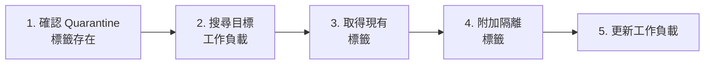
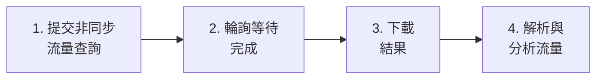
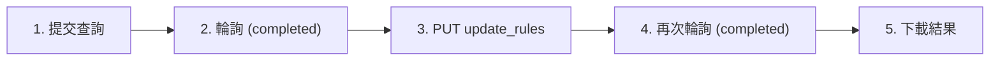
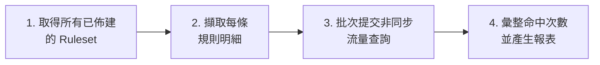
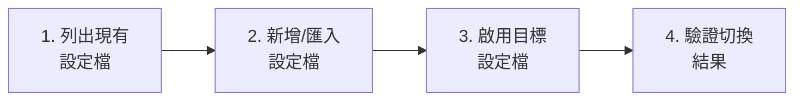

# Illumio PCE Ops — API 教學與 SIEM/SOAR 整合指南


> **[English](API_Cookbook.md)** | **[繁體中文](API_Cookbook_zh.md)**

本指南專為 **SIEM/SOAR 工程師** 設計，用於撰寫 Action、Playbook 或自動化腳本時參考。每個場景列出精確的 API 呼叫、參數和可直接複製的 Python 程式碼片段。

所有範例使用本專案 `src/api_client.py` 中的 `ApiClient` 類別。

---

## 快速設定

```python
from src.config import ConfigManager
from src.api_client import ApiClient

cm = ConfigManager()        # 載入 config.json
api = ApiClient(cm)          # 使用 PCE 憑證初始化
```

> **前置條件**：在 `config.json` 中設定有效的 `api.url`、`api.org_id`、`api.key` 和 `api.secret`。API 使用者需要適當的角色權限（見各場景說明）。

---

## 場景一：健康檢查 — 驗證 PCE 連線

**使用場景**：監控 Playbook 中的心跳檢測。
**所需角色**：任意（`read_only` 以上）

### API 呼叫

| 步驟 | 方法 | 端點 | 回應 |
|:---|:---|:---|:---|
| 1 | GET | `/api/v2/health` | `200 OK` = 健康 |

### Python 程式碼

```python
status, message = api.check_health()
if status == 200:
    print("PCE 連線正常")
else:
    print(f"PCE 健康檢查失敗: {status} - {message}")
```

---

## 場景二：工作負載隔離（Quarantine）

**使用場景**：事件回應 — 透過標記 Quarantine 標籤來隔離遭入侵的主機。
**所需角色**：`owner` 或 `admin`

### 操作流程



### 分步 API 呼叫

| 步驟 | 方法 | 端點 | 用途 |
|:---|:---|:---|:---|
| 1a | GET | `/orgs/{org_id}/labels?key=Quarantine` | 檢查 Quarantine 標籤是否存在 |
| 1b | POST | `/orgs/{org_id}/labels` | 建立缺失的標籤 (`{"key":"Quarantine","value":"Severe"}`) |
| 2 | GET | `/orgs/{org_id}/workloads?hostname=<目標>` | 尋找目標工作負載 |
| 3 | GET | `/api/v2{workload_href}` | 取得工作負載的現有標籤 |
| 4-5 | PUT | `/api/v2{workload_href}` | 更新標籤 = 現有標籤 + 隔離標籤 |

### 完整 Python 程式碼

```python
from src.config import ConfigManager
from src.api_client import ApiClient

cm = ConfigManager()
api = ApiClient(cm)

# --- 步驟 1：確認 Quarantine 標籤存在 ---
label_hrefs = api.check_and_create_quarantine_labels()
# 回傳: {"Mild": "/orgs/1/labels/XX", "Moderate": "/orgs/1/labels/YY", "Severe": "/orgs/1/labels/ZZ"}
print(f"Quarantine 標籤 href: {label_hrefs}")

# --- 步驟 2：搜尋目標工作負載 ---
results = api.search_workloads({"hostname": "infected-server-01"})
if not results:
    print("找不到工作負載！")
    exit(1)

target = results[0]
workload_href = target["href"]
print(f"找到工作負載: {target.get('name')} ({workload_href})")

# --- 步驟 3：取得現有標籤 ---
workload = api.get_workload(workload_href)
current_labels = [{"href": lbl["href"]} for lbl in workload.get("labels", [])]
print(f"現有標籤: {current_labels}")

# --- 步驟 4：附加 Quarantine 標籤 ---
quarantine_level = "Severe"  # 選擇: "Mild"（輕微）、"Moderate"（中度）、"Severe"（嚴重）
quarantine_href = label_hrefs[quarantine_level]
current_labels.append({"href": quarantine_href})

# --- 步驟 5：更新工作負載 ---
success = api.update_workload_labels(workload_href, current_labels)
if success:
    print(f"✅ 工作負載已隔離，等級: {quarantine_level}")
else:
    print("❌ 套用隔離標籤失敗")
```

> **SOAR Playbook 提示**：以上程式碼可包裝為單一 Action。輸入參數：`hostname`（字串）、`quarantine_level`（列舉：Mild/Moderate/Severe）。

---

## 場景三：流量分析查詢

**使用場景**：查詢過去 N 分鐘內被阻擋或異常的流量以進行調查。
**所需角色**：`read_only` 以上

> **重要變更（Illumio Core 25.2）**：同步流量查詢端點已棄用。本工具專用非同步查詢 (`async_queries`)，單次查詢最多支援 **200,000** 筆結果。所有範例均使用非同步 API。

### 操作流程

**標準（Reported 檢視）：** 3 步驟



**含草稿政策分析：** 4 步驟 — 在下載前呼叫 `update_rules`，解鎖隱藏欄位（`draft_policy_decision`、`rules`、`enforcement_boundaries`、`override_deny_rules`）。



### API 呼叫

| 步驟 | 方法 | 端點 | 用途 |
|:---|:---|:---|:---|
| 1 | POST | `/orgs/{org_id}/traffic_flows/async_queries` | 提交查詢 |
| 2 | GET | `/orgs/{org_id}/traffic_flows/async_queries/{uuid}` | 輪詢狀態 |
| 3 *(選用)* | PUT | `.../async_queries/{uuid}/update_rules` | 觸發草稿政策運算 |
| 4 *(選用)* | GET | `/orgs/{org_id}/traffic_flows/async_queries/{uuid}` | update_rules 後再次輪詢 |
| 5 | GET | `.../async_queries/{uuid}/download` | 下載結果（JSON 陣列） |

> **update_rules 注意事項**：Request body 留空（`{}`），回傳 `202 Accepted`。PCE 狀態在運算期間維持 `"completed"` 不變，建議等待約 10 秒後再輪詢。本工具透過 `execute_traffic_query_stream(compute_draft=True)` 自動觸發此流程。

### 請求主體（步驟 1）

```json
{
    "start_date": "2026-03-03T00:00:00Z",
    "end_date": "2026-03-03T23:59:59Z",
    "policy_decisions": ["blocked", "potentially_blocked"],
    "max_results": 200000,
    "query_name": "SOAR_Investigation",
    "sources": {"include": [], "exclude": []},
    "destinations": {"include": [], "exclude": []},
    "services": {"include": [], "exclude": []}
}
```

### 進階篩選選項

除了基本的 `sources`/`destinations` include/exclude 外，本工具的高階查詢支援以下額外篩選參數：

| 篩選參數 | 類型 | 說明 |
|:---|:---|:---|
| `ex_src_labels` | array | 排除來源標籤（格式：`["env:Production"]`） |
| `ex_dst_labels` | array | 排除目的標籤（格式：`["app:Database"]`） |
| `ex_src_ip` | string | 排除來源 IP 位址（支援 CIDR，例如 `"10.0.0.0/8"`） |
| `ex_dst_ip` | string | 排除目的 IP 位址 |
| `ex_port` | int | 排除特定目的端口 |
| `any_label` | string | 來源或目的任一方符合即可（OR 邏輯） |
| `any_ip` | string | 來源或目的 IP 任一方符合即可（OR 邏輯） |

> **OR 邏輯篩選**：使用 `any_label` 或 `any_ip` 時，只要來源或目的其中一方匹配即視為符合條件，適用於不確定流量方向的場景。

### Python 程式碼

```python
from src.config import ConfigManager
from src.api_client import ApiClient
from src.analyzer import Analyzer
from src.reporter import Reporter

cm = ConfigManager()
api = ApiClient(cm)

# 方式 A：低階串流（記憶體效率最佳）
for flow in api.execute_traffic_query_stream(
    "2026-03-03T00:00:00Z",
    "2026-03-03T23:59:59Z",
    ["blocked", "potentially_blocked"]
):
    src_ip = flow.get("src", {}).get("ip", "N/A")
    dst_ip = flow.get("dst", {}).get("ip", "N/A")
    port = flow.get("service", {}).get("port", "N/A")
    decision = flow.get("policy_decision", "N/A")
    print(f"{src_ip} -> {dst_ip}:{port} [{decision}]")

# 方式 B：高階查詢含排序（透過 Analyzer）
rep = Reporter(cm)
ana = Analyzer(cm, api, rep)
results = ana.query_flows({
    "start_time": "2026-03-03T00:00:00Z",
    "end_time": "2026-03-03T23:59:59Z",
    "policy_decisions": ["blocked"],
    "sort_by": "bandwidth",       # "bandwidth"、"volume" 或 "connections"
    "search": "10.0.1.50"         # 選用文字篩選
})

for r in results[:10]:
    print(f"{r['source']['name']} -> {r['destination']['name']} "
          f"| {r['formatted_bandwidth']} | {r['policy_decision']}")

# 方式 C：使用排除篩選（過濾掉不需要的流量）
results = ana.query_flows({
    "start_time": "2026-03-03T00:00:00Z",
    "end_time": "2026-03-03T23:59:59Z",
    "policy_decisions": ["allowed", "blocked", "potentially_blocked"],
    "ex_src_labels": ["env:Development"],   # 排除開發環境來源
    "ex_dst_ip": "10.255.0.0/16",           # 排除管理網段目的
})
```

### 流量紀錄（Flow Record）完整欄位說明

#### 策略決策欄位

| 欄位 | 必填 | 說明 |
|:---|:---|:---|
| `policy_decision` | 是 | 基於**已生效**規則的 Reported 處置結果。值：`allowed` / `potentially_blocked` / `blocked` / `unknown` |
| `boundary_decision` | 否 | Reported 邊界決策。值：`blocked` / `blocked_by_override_deny` / `blocked_non_illumio_rule` |
| `draft_policy_decision` | 否 ⚠️ | **需呼叫 `update_rules`**。草稿政策診斷，結合動作與原因（見下表） |
| `rules` | 否 ⚠️ | **需呼叫 `update_rules`**。草稿白名單規則 HREFs |
| `enforcement_boundaries` | 否 ⚠️ | **需呼叫 `update_rules`**。草稿強制邊界 HREFs |
| `override_deny_rules` | 否 ⚠️ | **需呼叫 `update_rules`**。草稿覆寫拒絕規則 HREFs |

**`draft_policy_decision` 值對照表**（動作 + 原因公式）：

| 值 | 含義 |
|:---|:---|
| `allowed` | 草稿白名單將允許此流量 |
| `allowed_across_boundary` | 跨越邊界允許：流量命中黑名單，但白名單例外規則將其放行 |
| `blocked_by_boundary` | 草稿強制邊界（Enforcement Boundary）將封鎖此流量 |
| `blocked_by_override_deny` | 最高優先級覆寫拒絕規則將封鎖，無法被任何白名單覆蓋 |
| `blocked_no_rule` | 無匹配白名單，觸發預設拒絕（Default Deny）封鎖 |
| `potentially_blocked` | 同上述封鎖原因，但目的端主機處於 Visibility Only 模式 |
| `potentially_blocked_by_boundary` | 強制邊界封鎖，但目的端主機處於 Visibility Only 模式 |
| `potentially_blocked_by_override_deny` | 覆寫拒絕封鎖，但目的端主機處於 Visibility Only 模式 |
| `potentially_blocked_no_rule` | 無白名單，但目的端主機處於 Visibility Only 模式 |

**`boundary_decision` 值對照表**（Reported 視圖）：

| 值 | 含義 |
|:---|:---|
| `blocked` | 被強制邊界或拒絕規則封鎖 |
| `blocked_by_override_deny` | 被覆寫拒絕規則封鎖（最高優先級） |
| `blocked_non_illumio_rule` | 被本機原生防火牆規則封鎖（如 iptables、GPO），非 Illumio 規則 |

#### 連線基礎欄位

| 欄位 | 必填 | 說明 |
|:---|:---|:---|
| `num_connections` | 是 | 此聚合流量的連線次數 |
| `flow_direction` | 是 | VEN 擷取視角：`inbound`（目的端 VEN）/ `outbound`（來源端 VEN） |
| `timestamp_range.first_detected` | 是 | 首次偵測時間（ISO 8601 UTC） |
| `timestamp_range.last_detected` | 是 | 最後偵測時間（ISO 8601 UTC） |
| `state` | 否 | 連線狀態：`A`（活躍）/ `C`（已關閉）/ `T`（逾時）/ `S`（快照）/ `N`（新建/SYN） |
| `transmission` | 否 | `broadcast`（廣播）/ `multicast`（多播）/ `unicast`（單播） |

#### 服務物件（`service`）

> Process 與 User 屬於 VEN 所在端主機：`inbound` 時屬目的端；`outbound` 時屬來源端。

| 欄位 | 必填 | 說明 |
|:---|:---|:---|
| `service.port` | 是 | 目的通訊埠 |
| `service.proto` | 是 | IANA 協定代碼（6=TCP, 17=UDP, 1=ICMP） |
| `service.process_name` | 否 | 應用程式程序名稱（如 `sshd`、`nginx`） |
| `service.windows_service_name` | 否 | Windows 服務名稱 |
| `service.user_name` | 否 | 執行程序的 OS 帳號 |

#### 來源／目的端物件（`src`、`dst`）

| 欄位 | 說明 |
|:---|:---|
| `src.ip` / `dst.ip` | IPv4 或 IPv6 位址 |
| `src.workload.href` | Workload 唯一識別 URI |
| `src.workload.hostname` / `name` | 主機名稱與友善名稱 |
| `src.workload.enforcement_mode` | `idle` / `visibility_only` / `selective` / `full` |
| `src.workload.managed` | 是否安裝 VEN（`true`/`false`） |
| `src.workload.labels` | 標籤陣列 `[{href, key, value}]` |
| `src.ip_lists` | 此 IP 命中的 IP List 清單 |
| `src.fqdn_name` | DNS 解析的 FQDN（若有 DNS 資料） |
| `src.virtual_server` / `virtual_service` | Kubernetes / 負載平衡虛擬服務物件 |
| `src.cloud_resource` | 雲端原生資源（如 AWS RDS） |

#### 頻寬與網路欄位

| 欄位 | 說明 |
|:---|:---|
| `dst_bi` | 目的端接收位元組數（= 來源端送出量） |
| `dst_bo` | 目的端送出位元組數（= 來源端接收量） |
| `icmp_type` / `icmp_code` | ICMP 類型與代碼（proto=1 時才存在） |
| `network` | 觀測此流量的 PCE 網路物件（`name`、`href`） |
| `client_type` | 回報此流量的代理類型：`server` / `endpoint` / `flowlink` / `scanner` |

---

## 場景四：安全事件監控

**使用場景**：為 SIEM 儀表板擷取近期安全事件。
**所需角色**：`read_only` 以上

### API 呼叫

| 步驟 | 方法 | 端點 | 用途 |
|:---|:---|:---|:---|
| 1 | GET | `/orgs/{org_id}/events?timestamp[gte]=<ISO_TIME>&max_results=1000` | 擷取事件 |

### Python 程式碼

```python
from datetime import datetime, timezone, timedelta
from src.config import ConfigManager
from src.api_client import ApiClient

cm = ConfigManager()
api = ApiClient(cm)

# 查詢過去 30 分鐘的事件
since = (datetime.now(timezone.utc) - timedelta(minutes=30)).strftime('%Y-%m-%dT%H:%M:%SZ')
events = api.fetch_events(since, max_results=500)

for evt in events:
    print(f"[{evt.get('timestamp')}] {evt.get('event_type')} - "
          f"嚴重等級: {evt.get('severity')} - "
          f"主機: {evt.get('created_by', {}).get('agent', {}).get('hostname', 'System')}")
```

### 常用事件類型

| 事件類型 | 分類 | 說明 |
|:---|:---|:---|
| `agent.tampering` | Agent 健康 | 偵測到 VEN 竄改 |
| `system_task.agent_offline_check` | Agent 健康 | Agent 離線 |
| `system_task.agent_missed_heartbeats_check` | Agent 健康 | Agent 心跳遺失 |
| `user.sign_in` | 認證 | 使用者登入 (包含失敗) |
| `request.authentication_failed` | 認證 | API Key 認證失敗 |
| `rule_set.create` / `rule_set.update` | 政策 | Ruleset 建立或修改 |
| `sec_rule.create` / `sec_rule.delete` | 政策 | 安全規則建立或刪除 |
| `sec_policy.create` | 政策 | 政策已佈建 |
| `workload.create` / `workload.delete` | 工作負載 | 工作負載配對或解除配對 |

---

## 場景五：工作負載搜尋與盤點

**使用場景**：依主機名稱、IP 或標籤搜尋工作負載。
**所需角色**：`read_only` 以上

### API 呼叫

| 步驟 | 方法 | 端點 | 用途 |
|:---|:---|:---|:---|
| 1 | GET | `/orgs/{org_id}/workloads?<params>` | 搜尋工作負載 |

### Python 程式碼

```python
from src.config import ConfigManager
from src.api_client import ApiClient

cm = ConfigManager()
api = ApiClient(cm)

# 依主機名搜尋（支援部分匹配）
results = api.search_workloads({"hostname": "web-server"})

# 依 IP 位址搜尋
results = api.search_workloads({"ip_address": "10.0.1.50"})

for wl in results:
    labels = ", ".join([f"{l['key']}={l['value']}" for l in wl.get("labels", [])])
    managed = "受管" if wl.get("agent", {}).get("config", {}).get("mode") else "未受管"
    print(f"{wl.get('name', 'N/A')} | {wl.get('hostname', 'N/A')} | {managed} | 標籤: [{labels}]")
```

---

## 場景六：標籤管理

**使用場景**：列出或建立標籤以進行政策自動化。
**所需角色**：`admin` 以上（建立操作）

### Python 程式碼

```python
from src.config import ConfigManager
from src.api_client import ApiClient

cm = ConfigManager()
api = ApiClient(cm)

# 列出所有 "env" 類型的標籤
env_labels = api.get_labels("env")
for lbl in env_labels:
    print(f"{lbl['key']}={lbl['value']}  (href: {lbl['href']})")

# 建立新標籤
new_label = api.create_label("env", "Staging")
if new_label:
    print(f"已建立標籤: {new_label['href']}")
```

---

---

## 場景七：工具內部 API (認證與安全性)

**使用場景**：對 Illumio PCE Ops 工具本身進行自動化操作（例如：透過腳本批次更新規則、觸發報表）。
**需求**：有效的工具登入憑證（預設：`illumio`/`illumio`）。

### 操作流程

1. **登入**：POST 至 `/api/login` 以取得 Session Cookie。
2. **認證請求**：在後續呼叫中帶上該 Session Cookie。

### Python 程式碼

```python
import requests

BASE_URL = "http://127.0.0.1:5001"
session = requests.Session()

# 1. 登入
login_payload = {"username": "illumio", "password": "illumio"}
res = session.post(f"{BASE_URL}/api/login", json=login_payload)

if res.json().get("ok"):
    print("登入成功")

    # 2. 範例：觸發產生流量報表
    report_res = session.post(f"{BASE_URL}/api/reports/generate", json={
        "type": "traffic",
        "days": 7
    })
    print(f"指令已送出: {report_res.json()}")
else:
    print("登入失敗")
```

---

## 場景八：政策使用率分析

**使用場景**：分析每條安全規則的實際流量命中數，找出未使用或低使用率的規則以進行政策最佳化。
**所需角色**：`read_only` 以上（PCE API）；工具內部 API 需登入認證。

### 操作流程



### API 呼叫（PCE 直接呼叫）

| 步驟 | 方法 | 端點 | 用途 |
|:---|:---|:---|:---|
| 1 | GET | `/orgs/{org_id}/sec_policy/active/rule_sets?max_results=10000` | 取得所有已佈建的 Ruleset |
| 2 | — | （從步驟 1 回應中解析 `rules` 陣列） | 擷取每條規則的 scope、port、proto |
| 3 | POST | `/orgs/{org_id}/traffic_flows/async_queries` | 為每條規則提交對應的流量查詢 |
| 4 | GET | `.../async_queries/{uuid}/download` | 下載查詢結果並計算命中數 |

### Python 程式碼（使用 ApiClient）

```python
from src.config import ConfigManager
from src.api_client import ApiClient

cm = ConfigManager()
api = ApiClient(cm)

# --- 步驟 1：取得所有已佈建的 Ruleset ---
rulesets = api.get_active_rulesets()
print(f"共有 {len(rulesets)} 個已佈建的 Ruleset")

# --- 步驟 2：展開所有規則 ---
all_rules = []
for rs in rulesets:
    for rule in rs.get("rules", []):
        rule["_ruleset_name"] = rs.get("name", "Unknown")
        all_rules.append(rule)
print(f"共有 {len(all_rules)} 條規則")

# --- 步驟 3-4：批次查詢流量命中數（三階段並行處理） ---
hit_hrefs, hit_counts = api.batch_get_rule_traffic_counts(
    rules=all_rules,
    start_date="2026-03-01T00:00:00Z",
    end_date="2026-04-01T00:00:00Z",
    max_concurrent=10,
    on_progress=lambda msg: print(f"  {msg}")
)

# --- 結果彙整 ---
unused_rules = [r for r in all_rules if r.get("href") not in hit_hrefs]
print(f"\n命中規則數: {len(hit_hrefs)} / {len(all_rules)}")
print(f"未使用規則數: {len(unused_rules)}")

for rule in unused_rules[:10]:
    print(f"  - [{rule['_ruleset_name']}] {rule.get('href')}")
```

### 透過工具內部 API 觸發報表

```python
import requests

BASE_URL = "http://127.0.0.1:5001"
session = requests.Session()
session.post(f"{BASE_URL}/api/login", json={"username": "illumio", "password": "illumio"})

# 觸發政策使用率報表產生
res = session.post(f"{BASE_URL}/api/policy_usage_report/generate", json={
    "lookback_days": 30
})
print(res.json())
# 回傳: {"ok": true, "message": "Report generation started", ...}
```

> **效能提示**：`batch_get_rule_traffic_counts()` 使用三階段並行處理（提交 → 輪詢 → 下載），預設 10 個並行執行緒，可透過 `max_concurrent` 參數調整。大型環境（>500 條規則）建議設為 5 以避免 PCE 過載。

---

## 場景九：多 PCE 設定檔管理

**使用場景**：在多個 PCE 環境（如開發、測試、正式）之間切換，無需手動修改 `config.json`。
**需求**：工具內部 API 需登入認證。

### 操作流程



### API 端點

| 操作 | 方法 | 端點 | 請求主體 |
|:---|:---|:---|:---|
| 列出所有設定檔 | GET | `/api/pce-profiles` | — |
| 新增設定檔 | POST | `/api/pce-profiles` | `{"action": "add", "profile": {...}}` |
| 啟用設定檔 | POST | `/api/pce-profiles` | `{"action": "activate", "name": "<名稱>"}` |
| 刪除設定檔 | POST | `/api/pce-profiles` | `{"action": "delete", "name": "<名稱>"}` |

### Python 程式碼

```python
import requests

BASE_URL = "http://127.0.0.1:5001"
session = requests.Session()
session.post(f"{BASE_URL}/api/login", json={"username": "illumio", "password": "illumio"})

# --- 列出所有設定檔 ---
res = session.get(f"{BASE_URL}/api/pce-profiles")
profiles = res.json()
print(f"設定檔數量: {len(profiles.get('profiles', []))}")
print(f"目前啟用: {profiles.get('active')}")

# --- 新增設定檔 ---
res = session.post(f"{BASE_URL}/api/pce-profiles", json={
    "action": "add",
    "profile": {
        "name": "Production-PCE",
        "url": "https://pce-prod.example.com:8443",
        "org_id": "1",
        "key": "api_key_here",
        "secret": "api_secret_here",
        "verify_ssl": True
    }
})
print(f"新增結果: {res.json()}")

# --- 啟用設定檔 ---
res = session.post(f"{BASE_URL}/api/pce-profiles", json={
    "action": "activate",
    "name": "Production-PCE"
})
print(f"啟用結果: {res.json()}")

# --- 刪除設定檔 ---
res = session.post(f"{BASE_URL}/api/pce-profiles", json={
    "action": "delete",
    "name": "Old-Dev-PCE"
})
print(f"刪除結果: {res.json()}")
```

> **SOAR 整合提示**：可將 PCE 設定檔切換包裝為 Playbook 的前置步驟，根據事件來源自動選擇對應的 PCE 環境進行回應操作。

---

## SIEM/SOAR 快速查閱表

### PCE 直接 API（需 HTTP Basic 認證）

| 操作 | API 端點 | HTTP | 請求主體 | 預期回應 |
|:---|:---|:---|:---|:---|
| 健康檢查 | `/api/v2/health` | GET | — | `200` |
| 擷取事件 | `/orgs/{id}/events?timestamp[gte]=...` | GET | — | `200` + JSON 陣列 |
| 提交流量查詢 | `/orgs/{id}/traffic_flows/async_queries` | POST | 見場景三 | `201`/`202` + `{href}` |
| 輪詢查詢狀態 | `/orgs/{id}/traffic_flows/async_queries/{uuid}` | GET | — | `200` + `{status}` |
| 下載查詢結果 | `.../async_queries/{uuid}/download` | GET | — | `200` + gzip 資料 |
| 列出標籤 | `/orgs/{id}/labels?key=<key>` | GET | — | `200` + JSON 陣列 |
| 建立標籤 | `/orgs/{id}/labels` | POST | `{key, value}` | `201` + `{href}` |
| 搜尋工作負載 | `/orgs/{id}/workloads?hostname=...` | GET | — | `200` + JSON 陣列 |
| 取得工作負載 | `/api/v2{workload_href}` | GET | — | `200` + workload JSON |
| 更新工作負載標籤 | `/api/v2{workload_href}` | PUT | `{labels: [{href}]}` | `204` |
| 取得已佈建 Ruleset | `/orgs/{id}/sec_policy/active/rule_sets` | GET | — | `200` + JSON 陣列 |

> **Base URL 格式**：`https://<pce_host>:<port>/api/v2/orgs/<org_id>/...`
> **認證**：HTTP Basic，API Key 作為使用者名稱，Secret 作為密碼。

### 工具內部 API（需 Session 認證，見場景七）

| 操作 | API 端點 | HTTP | 請求主體 | 預期回應 |
|:---|:---|:---|:---|:---|
| 登入 | `/api/login` | POST | `{username, password}` | `200` + `{ok}` |
| 列出 PCE 設定檔 | `/api/pce-profiles` | GET | — | `200` + `{profiles, active}` |
| 管理 PCE 設定檔 | `/api/pce-profiles` | POST | `{action, ...}` | `200` + `{ok}` |
| 產生政策使用率報表 | `/api/policy_usage_report/generate` | POST | `{lookback_days}` | `200` + `{ok}` |
| 批次套用隔離 | `/api/quarantine/bulk_apply` | POST | `{workloads, level}` | `200` + `{ok, results}` |
| 手動觸發排程報表 | `/api/report-schedules/<id>/run` | POST | — | `200` + `{ok}` |
| 查詢排程執行歷史 | `/api/report-schedules/<id>/history` | GET | — | `200` + `{history}` |
| 列出 Ruleset（排程器） | `/api/rule_scheduler/rulesets` | GET | — | `200` + `{items}` |
| 列出排程規則 | `/api/rule_scheduler/schedules` | GET | — | `200` + `{items}` |
| 新增排程規則 | `/api/rule_scheduler/schedules` | POST | `{ruleset_href, ...}` | `200` + `{ok, id}` |
---

## 更新版 Traffic Filter 參數說明

目前 `Analyzer.query_flows()` 與 `ApiClient.build_traffic_query_spec()` 會把查詢條件分成三類：

- `native_filters`：直接下推到 PCE async Explorer query
- `fallback_filters`：流量下載後在 client 端做補過濾
- `report_only_filters`：只影響搜尋、排序、分頁或 draft 比對

### Native filters

這些條件會直接縮小 PCE 端結果集，也是 raw Explorer CSV export 唯一接受的 filter 類型。

| 參數 | 型別 | 範例 | 說明 |
|:---|:---|:---|:---|
| `src_label`, `dst_label` | `key:value` 字串 | `role:web` | 解析成 label href 後下推 |
| `src_labels`, `dst_labels` | `key:value` 陣列 | `["env:prod", "app:web"]` | 同側多個 label |
| `src_label_group`, `dst_label_group` | 名稱或 href | `Critical Apps` | 解析成 label group href |
| `src_label_groups`, `dst_label_groups` | 名稱或 href 陣列 | `["Critical Apps", "PCI Apps"]` | 多個 label group |
| `src_ip_in`, `src_ip`, `dst_ip_in`, `dst_ip` | IP、workload href、IP list 名稱/href | `10.0.0.5`, `corp-net` | 支援 literal IP 或 resolver actor |
| `ex_src_label`, `ex_dst_label` | `key:value` 字串 | `env:dev` | 排除 label |
| `ex_src_labels`, `ex_dst_labels` | `key:value` 陣列 | `["role:test"]` | 排除多個 label |
| `ex_src_label_group`, `ex_dst_label_group` | 名稱或 href | `Legacy Apps` | 排除 label group |
| `ex_src_label_groups`, `ex_dst_label_groups` | 名稱或 href 陣列 | `["Legacy Apps"]` | 排除多個 label group |
| `ex_src_ip`, `ex_dst_ip` | IP、workload href、IP list 名稱/href | `10.20.0.0/16` | 排除 actor/IP |
| `port`, `proto` | int 或字串 | `443`, `6` | 單一 service port/protocol |
| `port_range`, `ex_port_range` | range 字串或 tuple | `"8080-8090/6"` | 單一 port range |
| `port_ranges`, `ex_port_ranges` | range 陣列 | `["1000-2000/6"]` | 多個 port range |
| `ex_port` | int 或字串 | `22` | 排除 port |
| `process_name`, `windows_service_name` | 字串 | `nginx`, `WinRM` | service 側 process / service filter |
| `ex_process_name`, `ex_windows_service_name` | 字串 | `sshd` | 排除 service 側 process / service |
| `query_operator` | `and` 或 `or` | `or` | 對應 `sources_destinations_query_op` |
| `exclude_workloads_from_ip_list_query` | bool | `true` | 原樣帶入 async payload |
| `src_ams`, `dst_ams` | bool | `true` | 在 include 側加入 `actors:"ams"` |
| `ex_src_ams`, `ex_dst_ams` | bool | `true` | 在 exclude 側加入 `actors:"ams"` |
| `transmission_excludes`, `ex_transmission` | 字串或陣列 | `["broadcast", "multicast"]` | 支援 `unicast` / `broadcast` / `multicast` |
| `src_include_groups`, `dst_include_groups` | actor group 陣列 | `[["role:web", "env:prod"], ["ams"]]` | 外層 OR，內層 AND |

### Fallback filters

這些條件保留在 client-side，因為它們是 `source or destination` 的 either-side 語意，不適合直接映射成單一 Explorer payload。

| 參數 | 型別 | 範例 | 說明 |
|:---|:---|:---|:---|
| `any_label` | `key:value` 字串 | `app:web` | 來源或目的任一側有 label 即命中 |
| `any_ip` | IP/CIDR/字串 | `10.0.0.5` | 任一側 IP 命中即可 |
| `ex_any_label` | `key:value` 字串 | `env:dev` | 任一側命中即排除 |
| `ex_any_ip` | IP/CIDR/字串 | `172.16.0.0/16` | 任一側命中即排除 |

### Report-only filters

這些條件不會影響 PCE query body。

| 參數 | 型別 | 範例 | 說明 |
|:---|:---|:---|:---|
| `search` | 字串 | `db01` | 對名稱、IP、port、process、user 做文字比對 |
| `sort_by` | 字串 | `bandwidth` | `bandwidth`、`volume`、`connections` |
| `draft_policy_decision` | 字串 | `blocked_no_rule` | 需要 `compute_draft=True` 路徑 |
| `page`, `page_size`, `limit`, `offset` | int | `100` | UI / 報表分頁用途 |

### 混合使用範例

```python
results = ana.query_flows({
    "start_time": "2026-04-01T00:00:00Z",
    "end_time": "2026-04-01T23:59:59Z",
    "policy_decisions": ["blocked", "potentially_blocked"],
    "src_label_group": "Critical Apps",
    "dst_ip_in": "corp-net",
    "src_ams": True,
    "transmission_excludes": ["broadcast", "multicast"],
    "port_range": "8000-8100/6",
    "any_label": "env:prod",
    "search": "nginx",
    "sort_by": "bandwidth",
})
```

上面這個例子中：

- `src_label_group`、`dst_ip_in`、`src_ams`、`transmission_excludes`、`port_range` 會 native 下推
- `any_label` 會走 fallback
- `search` 與 `sort_by` 屬於 report-only

### Raw Explorer CSV export 限制

`ApiClient.export_traffic_query_csv()` 只接受能完整解析成 `native_filters` 的條件。如果某個 filter 最後仍留在 `fallback_filters` 或 `report_only_filters`，raw CSV export 會直接拒絕，而不是悄悄改變查詢語意。
