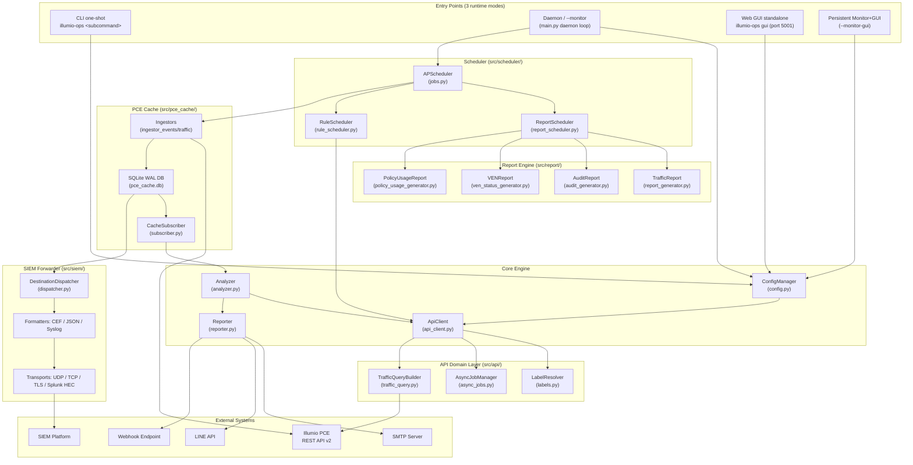
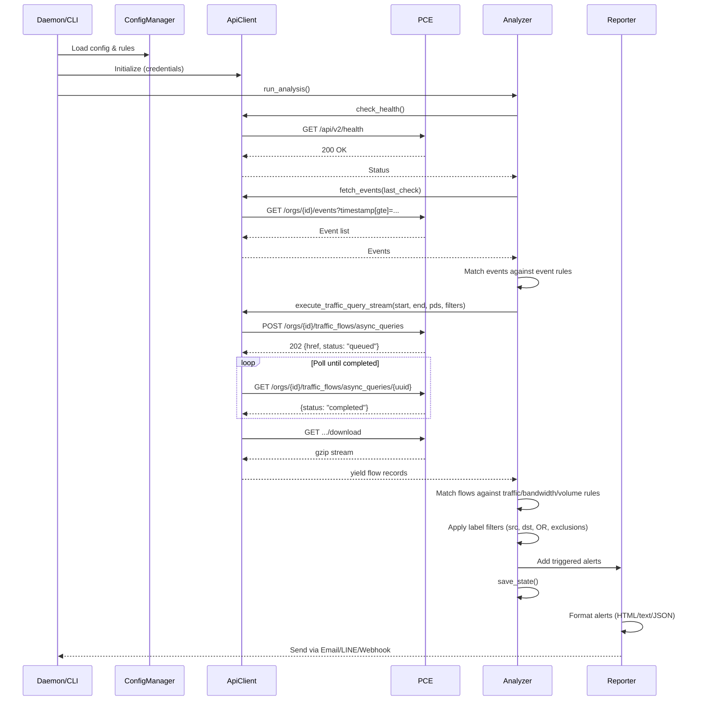
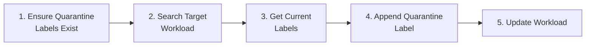
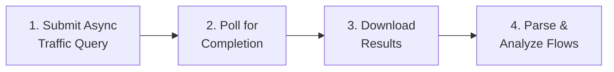
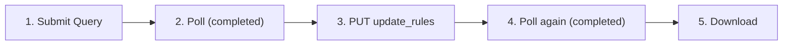
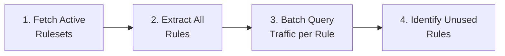
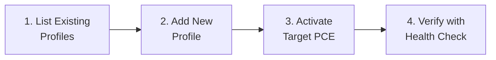

# Illumio PCE Ops — Project Architecture & Code Guide

<!-- BEGIN:doc-map -->
| Document | EN | 中文 |
|---|---|---|
| README | [README.md](../README.md) | [README_zh.md](../README_zh.md) |
| User Manual | [User_Manual.md](./User_Manual.md) | [User_Manual_zh.md](./User_Manual_zh.md) |
| Architecture | [Architecture.md](./Architecture.md) | [Architecture_zh.md](./Architecture_zh.md) |
| Security Rules | [Security_Rules_Reference.md](./Security_Rules_Reference.md) | [Security_Rules_Reference_zh.md](./Security_Rules_Reference_zh.md) |
<!-- END:doc-map -->

> **[English](Architecture.md)** | **[繁體中文](Architecture_zh.md)**

---

## Background — Illumio Platform

> Distilled from the official Illumio documentation 25.4 (Admin Guide and REST API Guide). This background section grounds the implementation-specific sections that follow.

### Background.1 PCE and VEN

At the core of the Illumio platform sits the **Policy Compute Engine (PCE)**: a server-side component that calculates and distributes security policy to every managed workload. For each workload, the PCE derives a tailored rule set and pushes it down to the resident enforcement agent — the **Virtual Enforcement Node** (**VEN**). Internally the PCE spans four service tiers — Front End, Processing, Service/Caching, and Persistence — which collectively provide management interfaces, authentication, traffic flow aggregation, and database storage.

The **Virtual Enforcement Node (VEN)** is a lightweight, multiple-process application that runs directly on a workload (bare-metal server, virtual machine, or container). Once installed, the VEN interacts with the host's native networking interfaces and OS-level firewall to collect traffic flow data and enforce the security policies it receives from the PCE. The VEN programs native firewall mechanisms: `iptables`/`nftables` on Linux, `pf`/`ipfilter` on Solaris, and the Windows Filtering Platform on Windows. It is optimized to remain idle in the background, consuming CPU only when calculating or applying rules, while periodically summarizing and reporting flow telemetry to the PCE.

**Supported VEN platforms** (25.4): Linux (RHEL 5/7/8, CentOS 8, Debian 11, SLES 11 SP2, IBM Z mainframe with RHEL 7/8), Windows (Server 2012/2016, Windows 10 64-bit), AIX, Solaris (up to 11.4 / Oracle Exadata), macOS (Illumio Edge only), and containerized VEN (C-VEN) for Kubernetes, OpenShift, Docker, ContainerD, and CRI-O.

**VEN–PCE communication** uses TLS throughout. On-premises: the VEN connects to PCE on TCP 8443 (HTTPS) and TCP 8444 (long-lived TLS-over-TCP lightning-bolt channel). SaaS: both channels use TCP 443. The VEN sends a heartbeat every 5 minutes and summarized flow logs every 10 minutes. The PCE pushes new firewall rules and real-time policy-update signals down the lightning-bolt channel; if that channel is unavailable, updates fall back to the next heartbeat response.

### Background.2 Label dimensions

Illumio abstracts workload identity from IP addresses using a four-dimension label system. Labels are key-value metadata attached to workloads and used by the PCE to compute policy scopes.

| Dimension | Key | Purpose | Example values |
|-----------|-----|---------|----------------|
| Role | `role` | Function of the workload within its application | `web`, `database`, `cache` |
| Application | `app` | Business application or service | `HRM`, `SAP`, `Storefront` |
| Environment | `env` | SDLC stage | `production`, `staging`, `development`, `QA` |
| Location | `loc` | Physical or logical geography | `aws-east1`, `dc-frankfurt`, `rack-3` |

Labels are applied to workloads via pairing profiles (at VEN install time), manual assignment in the PCE web console, REST API updates, bulk CSV import, or Container Workload Profiles (for Kubernetes/OpenShift pods). Once assigned, labels flow through to ruleset scopes and security rules: a rule that specifies `role=web, env=production` applies exactly to all workloads carrying those two label values, regardless of their IP address.

In `illumio_ops`, labels surface in the `Workload` model, report tables (policy usage, traffic analysis), and the SIEM event enrichment pipeline. The `src/api/` domain classes fetch label definitions from the PCE and cache them in SQLite for offline resolution.

### Background.3 Workload types

The PCE models three categories of workloads:

**Managed workloads** have a VEN installed and paired with the PCE. In the PCE REST API they appear as `workload` objects with `managed: true`, and include a `ven` property block tracking VEN version, operational status, heartbeat timestamp, and policy sync state. Managed workloads can be placed in any of the four enforcement modes and report live traffic telemetry to the PCE.

**Unmanaged workloads** are network entities without a VEN (laptops, appliances, systems with frequently changing IPs, PKI/Kerberos endpoints). They are represented in the PCE as `workload` objects with `managed: false`. Administrators create them manually via the web console, REST API, or bulk CSV import. Unmanaged workloads can be labelled and used as providers/consumers in security rules, but they do not report traffic or process data to the PCE.

**Container workloads** represent Kubernetes or OpenShift pods monitored through Illumio Kubelink. A single VEN is installed on the container host node rather than inside individual containers. The PCE creates `container_workload` objects for running pods and `container_workload_profile` objects that govern how new pods are labelled and paired as they start. This means policy for containerized applications is expressed in the same label-based ruleset model as for VMs and bare-metal.

### Background.4 Policy lifecycle

Policy objects in the PCE — including rulesets, IP lists, enforcement boundaries, and associated service and label-group definitions — move through three distinct states before taking effect on any workload:

1. **Draft**: Any write operation against a policy object (create, update, or delete) lands first in a Draft state that remains invisible to the enforcement plane. No firewall configuration on any managed workload changes until explicit provisioning occurs, giving security teams a safe environment to stage and validate complex segmentation changes.

2. **Pending**: Accumulated draft edits transition to Pending status once saved, forming a change queue ready for review. From this staging area, administrators can inspect the full delta, selectively revert items, verify co-provisioning requirements, and run impact analysis before committing.

3. **Active**: An explicit provisioning action promotes pending changes to Active. The PCE then recomputes the full policy graph and distributes the updated firewall rules to every affected VEN through the encrypted control channel. Each provisioning event is stamped with a timestamp, the responsible user, and a count of impacted workloads, supporting audit and rollback workflows.

The `compute_draft` logic in `illumio_ops` (see `Security_Rules_Reference.md` — R01–R05 rules) reads Draft-state rules from the PCE to evaluate policy intent before provisioning, surfacing gaps before they reach Active state.

### Background.5 Enforcement modes

The VEN's policy state governs how PCE-computed rules are applied to a workload's OS firewall. Four modes exist:

| Mode | Traffic blocked? | Logging behaviour |
|------|-----------------|-------------------|
| **Idle** | None — enforcement is off; VEN is dormant | Snapshot-only (state "S"); not exported to syslog/Fluentd |
| **Visibility Only** | None — passive monitoring only | Configurable: Off / Blocked (low) / Blocked+Allowed (high) / Enhanced Data Collection (with byte counts) |
| **Selective** | Only traffic violating configured Enforcement Boundaries | Same four logging tiers as Visibility Only |
| **Full** | Any traffic not explicitly allowed by an allow-list rule | Same four logging tiers; Illumio operates default-deny / zero-trust |

Selective mode lets administrators enforce specific network segments while merely observing the rest — a common transitional state when hardening an application incrementally. Full mode is the target state for production microsegmentation.

`illumio_ops` surfaces per-workload enforcement mode in the policy usage report and the R-Series rules (see `Security_Rules_Reference.md` §R02–R04) flag workloads that remain in Idle or Visibility Only in production environments.

> **References:** Illumio Admin Guide 25.4 (`Admin_25_4.pdf`).

---

## 1. System Architecture Overview



**Runtime modes**: Three launch modes are supported: (1) **CLI one-shot** (`illumio-ops <subcommand>`) for interactive and scripted operations; (2) **Daemon** (`--monitor` or `--monitor-gui`) which starts the APScheduler loop in `src/scheduler/jobs.py` for continuous monitoring, scheduled reports, and rule automation; (3) **Web GUI standalone** (`illumio-ops gui`) which starts only the Flask application on port 5001.

**Data Flow**: Entry Point → `ConfigManager` (loads rules/credentials) → `ApiClient` (queries PCE via domain layer `src/api/`) → `Analyzer` (evaluates rules against returned data) → `Reporter` (dispatches alerts). When cache is enabled, `CacheSubscriber` (`src/pce_cache/subscriber.py`) feeds pre-fetched data from the SQLite WAL cache into `Analyzer` instead of making live API calls, reducing the monitor tick latency to 30 seconds.

**Scheduler Flow**: `APScheduler` (`src/scheduler/jobs.py`) drives all timed jobs. `ReportScheduler.tick()` evaluates cron schedules → dispatches to report generators → emails results. `RuleScheduler.check()` evaluates recurring/one-time schedules → toggles PCE rules → provisions changes.

**SIEM Forwarder**: `src/siem/dispatcher.py` reads from the PCE cache (`siem_dispatch` table) and forwards events/flows through pluggable formatters (CEF, JSON-line, RFC-5424 Syslog) and transports (UDP, TCP, TLS, Splunk HEC) to external SIEM platforms.

---

## 2. Directory Structure

```text
illumio_ops/
├── illumio_ops.py         # Entry point — imports and calls src.main.main()
├── requirements.txt       # Python dependencies
│
├── config/
│   ├── config.json            # Runtime config (credentials, rules, alerts, settings)
│   ├── config.json.example    # Example config template
│   └── report_config.yaml     # Security Findings rule thresholds
│
├── src/
│   ├── __init__.py            # Package init, exports __version__
│   ├── main.py                # CLI argument parser, daemon/GUI orchestration, interactive menu
│   ├── api_client.py          # ApiClient facade (~765 LOC): HTTP core + delegation wrappers for all public methods
│   ├── api/                   # API domain classes (composed by ApiClient facade)
│   │   ├── labels.py          # LabelResolver: label/IP-list/service TTL cache management
│   │   ├── async_jobs.py      # AsyncJobManager: async query job lifecycle + state persistence
│   │   └── traffic_query.py   # TrafficQueryBuilder: traffic payload construction + streaming
│   ├── cli/                   # Click subcommand groups registered to illumio-ops entry point
│   │   ├── cache.py           # cache backfill / status / retention subcommands
│   │   ├── config.py          # config show / set subcommands
│   │   ├── monitor.py         # monitor daemon subcommand
│   │   ├── report.py          # report generate subcommand
│   │   ├── root.py            # root click group + version flag
│   │   └── ...                # siem.py, workload.py, gui_cmd.py, rule.py, status.py
│   ├── events/                # Event pipeline — polling, matching, normalization
│   │   ├── poller.py          # EventPoller: watermark-based polling with dedup semantics
│   │   ├── catalog.py         # KNOWN_EVENT_TYPES baseline (vendor + local extensions)
│   │   ├── matcher.py         # matches_event_rule(): regex/pipe/negation matching
│   │   ├── normalizer.py      # Normalized event field extraction
│   │   ├── shadow.py          # Legacy vs current matcher diagnostic comparator
│   │   ├── stats.py           # Dispatch history + event timeline tracking
│   │   └── throttle.py        # Per-rule alert throttle state
│   ├── pce_cache/             # PCE cache layer (SQLite WAL) — see §7 for full coverage
│   │   ├── subscriber.py      # CacheSubscriber: per-consumer cursor, feeds Analyzer when cache enabled
│   │   ├── ingestor_events.py # Writes PCE audit events into cache
│   │   ├── ingestor_traffic.py# Writes traffic flows into cache
│   │   ├── reader.py          # Read-side helpers for querying cached data
│   │   ├── backfill.py        # BackfillRunner: historical range ingest
│   │   ├── aggregator.py      # Daily traffic rollup (pce_traffic_flows_agg)
│   │   ├── lag_monitor.py     # APScheduler job: warns when ingestor stalls
│   │   ├── models.py          # SQLAlchemy ORM models for all cache tables
│   │   ├── rate_limiter.py    # Token-bucket rate limiter (shared across ingestors)
│   │   ├── retention.py       # Daily purge worker
│   │   ├── schema.py          # init_schema() — creates tables / migrations
│   │   ├── traffic_filter.py  # Post-ingest traffic sampling
│   │   ├── watermark.py       # ingestion_watermarks CRUD
│   │   └── web.py             # Flask Blueprint for /api/cache/* endpoints
│   ├── scheduler/             # APScheduler integration
│   │   └── jobs.py            # Job callables: run_monitor_cycle, report jobs, ingest jobs
│   ├── siem/                  # SIEM forwarder — pluggable formatters and transports
│   │   ├── dispatcher.py      # DestinationDispatcher: reads siem_dispatch queue, dispatches with retry + DLQ
│   │   ├── dlq.py             # Dead-letter queue helpers
│   │   ├── preview.py         # Preview formatter output for testing
│   │   ├── tester.py          # send_test_event(): synthetic event round-trip test
│   │   ├── web.py             # Flask Blueprint for /api/siem/* endpoints
│   │   ├── formatters/        # Pluggable log formatters
│   │   │   ├── base.py        # Formatter ABC
│   │   │   ├── cef.py         # ArcSight CEF format
│   │   │   ├── json_line.py   # JSON-line format
│   │   │   └── syslog_header.py # RFC-5424 header helper
│   │   └── transports/        # Pluggable output transports
│   │       ├── base.py        # Transport ABC
│   │       ├── syslog_udp.py  # UDP syslog
│   │       ├── syslog_tcp.py  # TCP syslog
│   │       ├── syslog_tls.py  # TLS syslog
│   │       └── splunk_hec.py  # Splunk HTTP Event Collector
│   ├── analyzer.py            # Rule engine: flow matching, metric calculation, state management
│   ├── reporter.py            # Alert aggregation and multi-channel dispatch
│   ├── config.py              # Configuration loading, saving, rule CRUD, atomic writes
│   ├── exceptions.py          # Typed exception hierarchy: IllumioOpsError → APIError/ConfigError/etc.
│   ├── interfaces.py          # typing.Protocol definitions: IApiClient, IReporter, IEventStore
│   ├── href_utils.py          # Canonical extract_id(href) helper
│   ├── loguru_config.py       # Central loguru setup: rotating file + TTY console + optional JSON SIEM sink
│   ├── gui.py                 # Flask Web application (~40 JSON API endpoints), login rate limiting, CSRF synchronizer token
│   ├── settings.py            # CLI interactive menus for rule/alert configuration
│   ├── report_scheduler.py    # Scheduled report generation and email delivery
│   ├── rule_scheduler.py      # Policy rule automation (recurring/one-time schedules, provision)
│   ├── rule_scheduler_cli.py  # CLI and Web GUI interface for rule scheduler
│   ├── i18n.py                # Internationalization dictionary (EN/ZH_TW) and language switching; _I18nState thread-safe singleton
│   ├── utils.py               # Helpers: logging setup, ANSI colors, unit formatting, CJK width; _InputState thread-safe singleton
│   ├── templates/             # Jinja2 HTML templates for Web GUI (SPA)
│   ├── static/                # CSS/JS frontend assets
│   └── report/                # Advanced report generation engine
│       ├── report_generator.py        # Traffic report orchestrator (15 modules + Security Findings)
│       ├── audit_generator.py         # Audit log report orchestrator (4 modules)
│       ├── ven_status_generator.py    # VEN status inventory report
│       ├── policy_usage_generator.py  # Policy rule usage analysis report
│       ├── rules_engine.py            # 19 automated Security Findings rules (B/L series)
│       ├── snapshot_store.py          # KPI snapshot store for Change Impact (reports/snapshots/)
│       ├── trend_store.py             # Trend KPI archive (per report type)
│       ├── analysis/                  # Per-module analysis logic
│       │   ├── mod01–mod15            # Traffic analysis modules
│       │   ├── mod_change_impact.py   # Compare current KPIs to previous snapshot
│       │   ├── audit/                 # Audit analysis modules (audit_mod00–03)
│       │   └── policy_usage/          # Policy usage modules (pu_mod00–05)
│       ├── exporters/                 # HTML, CSV, and policy usage export formatters
│       └── parsers/                   # API response and CSV data parsers
│
├── docs/                  # Documentation (this file, user manual, API cookbook)
├── tests/                 # Unit tests (pytest)
├── logs/                  # Runtime log files (rotating, 10MB × 5 backups)
│   └── state.json         # Persistent state (last_check timestamp, alert_history)
├── reports/               # Generated report output directory
└── deploy/                # Deployment helpers (NSSM, systemd configs)
```

---

## 3. Module Deep Dive

### 3.1 `api_client.py` — REST API Client

**Responsibility**: All HTTP communication with the Illumio PCE, using only Python `urllib` (zero external dependencies).

| Method | API Endpoint | HTTP | Purpose |
|:---|:---|:---|:---|
| `check_health()` | `/api/v2/health` | GET | PCE health status |
| `fetch_events()` | `/orgs/{id}/events` | GET | Security audit events |
| `execute_traffic_query_stream()` | `/orgs/{id}/traffic_flows/async_queries` | POST→GET→GET | Async traffic flow query (3-phase) |
| `fetch_traffic_for_report()` | (same async endpoint) | POST→GET→GET | Traffic query for report generation |
| `get_labels()` | `/orgs/{id}/labels` | GET | List labels by key |
| `create_label()` | `/orgs/{id}/labels` | POST | Create new label |
| `get_workload()` | `/api/v2{href}` | GET | Fetch single workload |
| `update_workload_labels()` | `/api/v2{href}` | PUT | Update workload's label set |
| `search_workloads()` | `/orgs/{id}/workloads` | GET | Search workloads by params |
| `fetch_managed_workloads()` | `/orgs/{id}/workloads` | GET | All managed workloads (VEN reports) |
| `get_all_rulesets()` | `/orgs/{id}/sec_policy/.../rule_sets` | GET | List rulesets (rule scheduler) |
| `get_active_rulesets()` | `/orgs/{id}/sec_policy/active/rule_sets` | GET | Active rulesets (policy usage) |
| `toggle_and_provision()` | Multiple | PUT→POST | Enable/disable rule and provision |
| `submit_async_query()` | `/orgs/{id}/traffic_flows/async_queries` | POST | Submit async traffic query |
| `poll_async_query()` | `.../async_queries/{uuid}` | GET | Poll query status until completed |
| `download_async_query()` | `.../async_queries/{uuid}/download` | GET | Download gzip-compressed results |
| `batch_get_rule_traffic_counts()` | (parallel async queries) | POST→GET→GET | Batch per-rule hit analysis |
| `check_and_create_quarantine_labels()` | `/orgs/{id}/labels` | GET/POST | Ensure quarantine label set exists |
| `provision_changes()` | `/orgs/{id}/sec_policy` | POST | Provision draft → active |
| `has_draft_changes()` | `/orgs/{id}/sec_policy/pending` | GET | Check for pending draft changes |

**Key Design Patterns**:
- **Retry with Exponential Backoff**: Automatically retries on `429` (rate limit), `502/503/504` (server errors) up to 3 attempts with base interval 2s
- **3-Phase Async Query Execution**: Submit → Poll → Download pattern for traffic queries; `batch_get_rule_traffic_counts()` parallelizes all three phases across multiple rules using `ThreadPoolExecutor` (max 10 concurrent)
- **Streaming Download**: Traffic query results (potentially gigabytes) are downloaded as gzip, decompressed in-memory, and yielded line-by-line via Python generators — O(1) memory consumption
- **Label/Ruleset Caching**: Internal caches (`label_cache`, `ruleset_cache`, `service_ports_cache`) avoid redundant API calls during batch operations
- **No External Dependencies**: Uses only `urllib.request` (no `requests` library)

> **Note**: Illumio Core 25.2 deprecated the synchronous traffic query API (`traffic_analysis_queries`). This tool uses exclusively the async API (`async_queries`) with support for up to 200,000 results.

### 3.2 `analyzer.py` — Rule Engine

**Responsibility**: Evaluate API data against user-defined rules, with support for flexible filter logic.

**Core Functions**:

| Function | Purpose |
|:---|:---|
| `run_analysis()` | Main orchestration: health check → events → traffic → save state |
| `check_flow_match()` | Evaluate a single traffic flow against a rule's filter criteria |
| `_check_flow_labels()` | Match flow labels against rule filters (src, dst, OR logic, exclusions) |
| `_check_ip_filter()` | Validate IP addresses against CIDR ranges (IPv4/IPv6) |
| `calculate_mbps()` | Hybrid bandwidth calculation with auto-scale units |
| `calculate_volume_mb()` | Data volume calculation with hybrid approach |
| `query_flows()` | Generic query endpoint used by Web GUI's Traffic Analyzer |
| `run_debug_mode()` | Interactive diagnostic showing raw rule evaluation results |
| `_check_cooldown()` | Prevent alert flooding via per-rule minimum re-alert intervals |

**Filter Matching Logic**:

The analyzer supports flexible filter conditions for traffic rules:

| Filter Field | Logic | Description |
|:---|:---|:---|
| `src_labels` + `dst_labels` | AND | Both source and destination must match |
| `src_labels` only | Src-side | Match by source label only |
| `dst_labels` only | Dst-side | Match by destination label only |
| `filter_direction: "src_or_dst"` | OR | Match if either source or destination matches any specified label |
| `ex_src_labels`, `ex_dst_labels` | Exclusion | Exclude flows matching these labels |
| `src_ip`, `dst_ip` | CIDR match | IPv4/IPv6 address filtering |
| `ex_src_ip`, `ex_dst_ip` | Exclusion | Exclude flows from/to these IPs |
| `port`, `proto` | Service match | Port and protocol filtering |

**State Management** (`state.json`):
- `last_check`: ISO timestamp of last successful check — used as anchor for event queries
- `history`: Rolling window of match counts per rule (pruned to 2 hours)
- `alert_history`: Per-rule last-alert timestamp for cooldown enforcement
- **Atomic Writes**: Uses `tempfile.mkstemp()` + `os.replace()` to prevent corruption on crash

### 3.3 `reporter.py` — Alert Dispatcher

**Responsibility**: Format and send alerts through configured channels.

**Alert Categories**: `health_alerts`, `event_alerts`, `traffic_alerts`, `metric_alerts`

**Output Formats**:
- **Email**: Rich HTML tables with color-coded severity badges, embedded flow snapshots, and auto-scaled bandwidth units. Event alerts include username and IP for login failure notifications.
- **LINE**: Plain text summary (LINE API character limits)
- **Webhook**: Raw JSON payload (full structured data for SOAR ingestion)

**Report Email Methods**:
| Method | Purpose |
|:---|:---|
| `send_alerts()` | Route alerts to configured channels |
| `send_report_email()` | Send on-demand report with single attachment |
| `send_scheduled_report_email()` | Send scheduled report with multiple attachments and custom recipients |

### 3.4 `config.py` — Configuration Manager

**Responsibility**: Load, save, and validate `config.json`.

- **Thread Safety**: Uses **`threading.RLock`** (Reentrant Lock) to prevent deadlocks during recursive load/save cycles or concurrent access from Daemon and GUI threads.
- **Deep Merge**: User config is merged over defaults — any missing fields are auto-populated.
- **Atomic Save**: Writes to `.tmp` file first, then `os.replace()` for crash safety.
- **Password storage**: web GUI password is stored in plaintext in `config.json` `web_gui.password`. The login endpoint compares the form input with this string directly. No hashing functions exist in `src/config.py`.
- **Rule CRUD**: `add_or_update_rule()`, `remove_rules_by_index()`, `load_best_practices()`.
- **PCE Profile Management**: `add_pce_profile()`, `update_pce_profile()`, `activate_pce_profile()`, `remove_pce_profile()`, `list_pce_profiles()` — supports multi-PCE environments with profile switching.
- **Report Schedule Management**: `add_report_schedule()`, `update_report_schedule()`, `remove_report_schedule()`, `list_report_schedules()`.

### 3.5 `gui.py` — Web GUI

**Architecture**: Flask backend exposing ~40 JSON API endpoints, consumed by a Vanilla JS frontend (`templates/index.html`).

- **Security Middleware**: Mandates login authentication for all routes and enforces IP Allowlisting (CIDR support) via `@app.before_request`. Unauthorized requests are blocked with 401/403 status.
- **Password storage**: web GUI password is **plaintext** in `config.json` `web_gui.password` (default `illumio`). Rationale: this tool runs only in offline-isolated PCE management networks; all other secrets in `config.json` (`api.key`, `api.secret`, `alerts.line_*`, `smtp.password`, `webhook_url`) are also plaintext, so hashing only the GUI password gives no defensive value while complicating maintenance. Operators should change the default `illumio` password on first login regardless.
- **Login Rate Limiting**: In-memory per-IP tracker with thread-safe locking. 5 attempts per 60-second window; returns HTTP 429 on excess.
- **CSRF Protection**: Uses the **Synchronizer Token Pattern**: token is stored in Flask session and injected into `index.html` via a `<meta name="csrf-token">` tag. JavaScript reads the token from the meta tag (not from a cookie). The CSRF cookie has been removed.
- **Session Security**: Cryptographically signed session cookies. The `session_secret` is automatically generated on first run.
- **SMTP Password**: Can be provided via `ILLUMIO_SMTP_PASSWORD` environment variable, which takes precedence over the config file value.
- **Threading Model (--monitor-gui)**: The daemon loop runs in a dedicated `threading.Thread` while the Flask app occupies the main thread to handle signals and web requests correctly.

**Key Endpoints**:

| Route | Method | Purpose |
|:---|:---|:---|
| `/api/login` | POST | Session authentication |
| `/api/security` | GET/POST | Security settings (password, allowed IPs) |
| `/api/status` | GET | Dashboard data (health, stats, rules, cooldowns) |
| `/api/event-catalog` | GET | Translated event type catalog |
| `/api/rules` | GET | List all rules |
| `/api/rules/event` | POST | Create event rule |
| `/api/rules/traffic` | POST | Create traffic rule |
| `/api/rules/bandwidth` | POST | Create bandwidth rule |
| `/api/rules/<idx>` | GET/PUT/DELETE | Rule CRUD by index |
| `/api/settings` | GET/POST | Read/write application settings |
| `/api/pce-profiles` | GET/POST | Multi-PCE profile management (list, add, update, delete, activate) |
| `/api/dashboard/queries` | GET/POST/DELETE | Saved query management |
| `/api/dashboard/snapshot` | GET | Latest traffic report snapshot |
| `/api/dashboard/top10` | POST | Top-10 flows by bandwidth/volume/connections |
| `/api/quarantine/search` | POST | Traffic search with flexible filters |
| `/api/quarantine/apply` | POST | Apply quarantine label to workload |
| `/api/quarantine/bulk_apply` | POST | Bulk quarantine (parallel, max 5 workers) |
| `/api/workloads` | GET/POST | Workload search and inventory |
| `/api/reports/generate` | POST | Generate reports (Traffic/Audit/VEN/Policy Usage) |
| `/api/reports` | GET | List generated reports |
| `/api/reports/<filename>` | DELETE | Delete report file |
| `/api/reports/bulk-delete` | POST | Bulk delete reports |
| `/api/audit_report/generate` | POST | Generate audit report |
| `/api/ven_status_report/generate` | POST | Generate VEN status report |
| `/api/policy_usage_report/generate` | POST | Generate policy usage report |
| `/api/report-schedules` | GET/POST | Report schedule CRUD |
| `/api/report-schedules/<id>` | PUT/DELETE | Update/delete schedule |
| `/api/report-schedules/<id>/toggle` | POST | Enable/disable schedule |
| `/api/report-schedules/<id>/run` | POST | Trigger immediate execution |
| `/api/report-schedules/<id>/history` | GET | Schedule execution history |
| `/api/init_quarantine` | POST | Ensure quarantine labels exist on PCE |
| `/api/actions/run` | POST | Execute one analysis cycle |
| `/api/actions/debug` | POST | Run debug mode |
| `/api/actions/test-alert` | POST | Send test alert |
| `/api/actions/best-practices` | POST | Load best practice rules |
| `/api/actions/test-connection` | POST | Test PCE connectivity |
| `/api/rule_scheduler/status` | GET | Rule scheduler status |
| `/api/rule_scheduler/rulesets` | GET | Browse PCE rulesets |
| `/api/rule_scheduler/rulesets/<id>` | GET | Ruleset detail with rules |
| `/api/rule_scheduler/schedules` | GET/POST | Rule schedule CRUD |
| `/api/rule_scheduler/schedules/<href>` | GET | Schedule detail |
| `/api/rule_scheduler/schedules/delete` | POST | Delete rule schedule |
| `/api/rule_scheduler/check` | POST | Trigger schedule evaluation |

### 3.6 `i18n.py` — Internationalization

**Responsibility**: Provide translated strings for all UI text.

- Contains a ~900+ entry dictionary mapping keys to translations in `{"en": {...}, "zh_TW": {...}}` structure
- `t(key, **kwargs)` function returns the string in the current language with variable substitution
- Language is set globally via `set_language("en"|"zh_TW")`
- Covers: CLI menus, event descriptions, alert templates, Web GUI labels, report terminology, filter labels, schedule types

### 3.7 `report_scheduler.py` — Report Scheduler

**Responsibility**: Manage scheduled report generation and email delivery.

- Supports daily, weekly, and monthly schedules
- Generates **4 report types**: Traffic, Audit, VEN Status, and Policy Usage
- `tick()` called every minute from daemon loop to evaluate schedules
- `run_schedule()` dispatches to appropriate generator based on report type
- Emails reports as HTML attachments with configurable recipients
- Handles report retention via `_prune_old_reports()` (auto-cleanup by `retention_days`)
- Schedule times stored as UTC, displayed in configured timezone
- State tracked in `logs/state.json` under `report_schedule_states`

### 3.8 `rule_scheduler.py` + `rule_scheduler_cli.py` — Rule Scheduler

**Responsibility**: Automate PCE policy rule enable/disable on schedule.

**Schedule Types**:
- **Recurring**: Enable/disable rules on specific days and time windows (e.g., Mon–Fri 09:00–17:00). Supports midnight wraparound (e.g., 22:00–06:00).
- **One-time**: Enable/disable a rule until a specific expiration datetime, then auto-revert.

**Features**:
- Browse and search all PCE rulesets and individual rules
- Enable or disable specific rules or entire rulesets
- **Draft protection**: Multi-layer checks ensure only provisioned rules are toggled; prevents enforcement on draft-only items
- Provision changes to PCE (push draft → active)
- Interactive CLI (`rule_scheduler_cli.py`) with paginated rule browsing
- Web GUI API endpoints under `/api/rule_scheduler/*`
- Schedule note tags added to PCE rule descriptions (📅 recurring / ⏳ one-time)
- Day name normalization (mon→monday, etc.)

### 3.9 `src/report/` — Advanced Report Engine

**Responsibility**: Generate comprehensive security analysis reports.

| Component | Purpose |
|:---|:---|
| `report_generator.py` | Orchestrate 15 analysis modules + Security Findings for Traffic Reports |
| `audit_generator.py` | Orchestrate 4 modules for Audit Log Reports |
| `ven_status_generator.py` | VEN inventory report with heartbeat-based online/offline classification |
| `policy_usage_generator.py` | Policy rule usage analysis with per-rule hit counts |
| `rules_engine.py` | 19 automated detection rules (B001–B009, L001–L010) with configurable thresholds |
| `analysis/mod01–mod15` | Traffic analysis modules (overview, policy decisions, ransomware, remote access, etc.) |
| `analysis/audit/` | 4 audit modules (executive summary, health events, user activity, policy changes) |
| `analysis/policy_usage/` | 4 policy usage modules (executive, overview, hit detail, unused detail) |
| `exporters/` | HTML template rendering, CSV export, policy usage HTML export |
| `parsers/` | API response parsing (`api_parser.py`), CSV ingestion (`csv_parser.py`), data validation |

**Report Types**:

| Report | Modules | Description |
|:---|:---|:---|
| **Traffic** | 15 modules (mod01–mod15) + 19 Security Findings | Comprehensive traffic analysis with ransomware, remote access, cross-env, bandwidth, lateral movement detection |
| **Audit** | 4 modules (audit_mod00–03) | PCE health events, user login/authentication, policy change tracking |
| **VEN Status** | Single generator | VEN inventory with online/offline status based on heartbeat (≤1h threshold) |
| **Policy Usage** | 4 modules (pu_mod00–03) | Per-rule traffic hit analysis, unused rule identification, executive summary |

**Policy Usage Report** supports two data sources:
- **API**: Fetches active rulesets from PCE, runs parallel 3-phase async queries per rule
- **CSV Import**: Accepts Workloader CSV export with pre-computed flow counts

**Export Formats**: HTML (primary) and CSV ZIP (stdlib `zipfile`, zero external dependencies).

### 3.10 `src/api/` — PCE API Domain Layer

**Path**: `src/api/`
**Entry points**: `labels.py`, `async_jobs.py`, `traffic_query.py` (all composed by `ApiClient` facade in `api_client.py`)

These three domain classes were extracted from `ApiClient` in Phase 9 to keep the facade under a manageable size. The `ApiClient` continues to own the shared state (TTLCaches, `_cache_lock`, job tracking dict) so that existing callers and tests remain unaffected.

- `LabelResolver` — label/IP-list/service lookup with TTL caching and filter normalization
- `AsyncJobManager` — submit/poll/download lifecycle for PCE async traffic queries; persists job state to `state.json` so jobs survive daemon restarts
- `TrafficQueryBuilder` — builds Illumio workloader-style async query payloads; handles up to 200,000 results with gzip streaming; powers `batch_get_rule_traffic_counts()` via `ThreadPoolExecutor` (max 10 concurrent)

### 3.11 `src/events/` — Event Pipeline

**Path**: `src/events/`
**Dominant entry point**: `poller.py` (`EventPoller`)

Provides safe, watermark-based PCE audit event polling with dedup semantics. Events are polled on an interval, normalized, matched against user-defined rules, and dispatched to alerts or the SIEM forwarder.

- `poller.py` — watermark cursor, `event_identity()` dedup hashing, timestamp parsing
- `catalog.py` — `KNOWN_EVENT_TYPES` baseline (vendor list + locally observed extensions)
- `matcher.py` — `matches_event_rule()` supporting exact, pipe-OR, regex, negation (`!`), and wildcard patterns
- `normalizer.py` — extracts canonical fields (resource type, actor, severity) from raw PCE event JSON
- `shadow.py` — diagnostic comparator between legacy and current matcher (used by `/api/events/shadow_compare`)
- `stats.py` — dispatch history and event timeline tracking written to `state.json`
- `throttle.py` — per-rule alert throttle state management

### 3.12 `src/siem/` — SIEM Forwarder

**Path**: `src/siem/`
**Dominant entry point**: `dispatcher.py` (`DestinationDispatcher`)

Reads events and flows from the PCE cache (`siem_dispatch` table) and forwards them to external SIEM platforms. A Flask Blueprint in `web.py` exposes `/api/siem/*` configuration and test endpoints.

Formatters (pluggable via config): CEF (ArcSight), JSON-line, RFC-5424 Syslog.
Transports (pluggable): UDP, TCP, TLS (all syslog), Splunk HTTP Event Collector.

The dispatcher implements retry with exponential backoff (capped at 1 hour) and routes failed records to the dead-letter queue (`dead_letter` table, auto-purged after 30 days). Use `tester.py` to send a synthetic test event to a destination without polluting real data.

### 3.13 `src/scheduler/` — APScheduler Integration

**Path**: `src/scheduler/`
**Dominant entry point**: `jobs.py`

Thin wrapper around APScheduler's `BackgroundScheduler`. Contains all job callables dispatched by the scheduler so that individual job functions can be tested in isolation without starting the full daemon.

- `run_monitor_cycle()` — one analysis + alert dispatch tick (wraps `Analyzer.run_analysis()` + `Reporter.send_alerts()`)
- Report jobs, ingestor jobs, cache lag monitor, and rule scheduler check are registered here

The scheduler is initialized in `src/main.py` during daemon startup. Optional SQLAlchemy job store (`scheduler.persist = true` in config) enables job durability across daemon restarts.

### 3.14 `src/pce_cache/` — PCE Cache Layer

**Path**: `src/pce_cache/`
**Dominant entry points**: `ingestor_events.py`, `ingestor_traffic.py`, `subscriber.py`

Local SQLite (WAL mode) database acting as a shared buffer between the PCE API, the SIEM forwarder, and the monitoring/analysis subsystems. Full coverage in **§7 PCE Cache** — see that section for table schema, retention tuning, cache-miss semantics, backfill, and operator CLI commands.

Key files: `models.py` (SQLAlchemy ORM), `schema.py` (`init_schema()`), `rate_limiter.py` (token-bucket shared across ingestors), `watermark.py` (ingestion cursor CRUD), `retention.py` (daily purge), `aggregator.py` (daily traffic rollup), `lag_monitor.py` (APScheduler stall detection).

---

## 4. Data Flow Diagram



### 4.1 Event Pipeline (`src/events/`) → Alerts / SIEM

PCE audit events follow a separate pipeline from traffic flows:

```
PCE REST API
    ↓  EventPoller (src/events/poller.py)
    │  — watermark cursor in state.json
    │  — dedup via event_identity() SHA-256 hash
    ↓
EventNormalizer (src/events/normalizer.py)
    — extracts resource_type, actor, severity from raw JSON
    ↓
EventMatcher (src/events/matcher.py)
    — matches_event_rule(): regex/pipe-OR/negation/wildcard
    — shadow.py comparator available for diagnostics
    ↓
Reporter.send_alerts()               pce_cache (siem_dispatch table)
    — Email / LINE / Webhook              ↓
                                   DestinationDispatcher (src/siem/dispatcher.py)
                                      — Formatter: CEF / JSON / Syslog
                                      — Transport: UDP / TCP / TLS / Splunk HEC
                                      → External SIEM platform
```

When `pce_cache.enabled = true`, the monitor runs on a 30-second tick by reading only rows inserted since the last `CacheSubscriber` cursor position, avoiding direct PCE API calls on every tick.

### 4.2 JSON Snapshot Store

After each Traffic Report run, `ReportGenerator` writes two JSON artifacts:

| Artifact | Path | Purpose |
|---|---|---|
| Latest dashboard snapshot | `reports/latest_snapshot.json` | Web GUI `/api/dashboard/snapshot` endpoint |
| KPI change-impact snapshot | `reports/snapshots/<type>/<YYYY-MM-DD>_<profile>.json` | `mod_change_impact.py` delta calculation |

**Naming convention**: `<YYYY-MM-DD>_<profile>.json` — e.g. `2026-04-28_security_risk.json`. Same date + profile overwrites atomically (`.tmp` → `os.replace()`).

**Retention**: controlled by `report.snapshot_retention_days` in `config.json` (default **90**, range 1–3650). `cleanup_old()` in `src/report/snapshot_store.py` deletes snapshots older than this threshold; it is called at the end of every report run.

**Change Impact calculation** (`src/report/analysis/mod_change_impact.py`): `compare()` loads the most recent previous snapshot via `snapshot_store.read_latest()`, then computes per-KPI deltas (direction: improved / regressed / unchanged / neutral) based on whether lower or higher values are desirable. If `previous_snapshot` is `None` (first ever run or all snapshots expired), the module returns `{"skipped": True, "reason": "no_previous_snapshot"}` — this guard prevents a `KeyError` on `previous_snapshot_at` and was hardened in commit `354ac0d`.

Trend KPIs (for chart sparklines) are stored in a separate `src/report/trend_store.py` — one JSON file per report type, appended on each run, independent of the snapshot store.

### 4.3 Report Generation Pipeline

```
generate_from_api() / generate_from_csv()
    ↓
Parsers (src/report/parsers/)
    — api_parser.py: PCE response → DataFrame
    — csv_parser.py: Workloader CSV → DataFrame
    ↓
Analysis modules (src/report/analysis/)
    — mod01–mod15: traffic analysis (policy decisions, ransomware, remote access, …)
    — mod_change_impact.py: KPI delta vs previous snapshot
    — audit_mod00–03: health events, logins, policy changes
    — pu_mod00–05: policy usage executive, overview, hit detail, unused detail
    ↓
RulesEngine (src/report/rules_engine.py)
    — 19 detection rules: B001–B009 (baseline), L001–L010 (lateral)
    ↓
Exporters (src/report/exporters/)
    — html_exporter.py: Jinja2 → standalone HTML (inline CSS/JS)
    — policy_usage_html_exporter.py: policy usage HTML
    — CSV ZIP (stdlib zipfile)
    ↓
Output: reports/<timestamp>_<type>.<ext>
    + reports/snapshots/<type>/<date>_<profile>.json  (KPI snapshot)
    + reports/latest_snapshot.json                    (dashboard cache)
```

Report HTML files embed a colored data-source pill: **green** = served from local SQLite cache; **blue** = live PCE API; **yellow** = mixed (partial cache + API).

---

## 5. Multi-PCE Profile Architecture

The system supports managing multiple PCE instances through profiles:

```text
config.json
├── api: { url, org_id, key, secret }    ← active profile credentials
├── active_pce_id: "production"           ← current active profile name
└── pce_profiles: [
      { name: "production", url: "...", org_id: 1, key: "...", secret: "..." },
      { name: "staging",    url: "...", org_id: 2, key: "...", secret: "..." }
    ]
```

- **Profile Switch**: `activate_pce_profile()` copies profile credentials into the top-level `api` section and reinitializes `ApiClient`
- **GUI**: `/api/pce-profiles` endpoints for listing, adding, updating, deleting, and activating profiles
- **CLI**: Interactive profile management via settings menu

---

## 6. How to Modify This Project

### 6.1 Add a New Rule Type

1. **Define the rule schema** in `settings.py` — create a new `add_xxx_menu()` function
2. **Add matching logic** in `analyzer.py` → `run_analysis()` — handle the new type in the traffic loop
3. **Add GUI support** in `gui.py` — create a new API endpoint for the rule type
4. **Add i18n keys** in `i18n.py` for any new UI strings

### 6.2 Add a New Alert Channel

1. **Add config fields** in `config.py` → `_DEFAULT_CONFIG["alerts"]`
2. **Implement the sender** in `reporter.py` — create `_send_xxx()` method
3. **Register in dispatcher** in `reporter.py` → `send_alerts()` — add the new channel check
4. **Add GUI settings** in `gui.py` → `api_save_settings()` and frontend

### 6.3 Add a New API Endpoint

1. **Add the method** in `api_client.py` — follow the pattern of existing methods
2. **URL format**: Use `self.base_url` for org-scoped endpoints, `self.api_cfg['url']/api/v2` for global ones
3. **Error handling**: Return `(status, body)` tuple, let callers handle specific status codes
4. **Refer to** `docs/REST_APIs_25_2.md` for endpoint schemas

### 6.4 Add a New i18n Language

1. Add a new top-level key in `i18n.py`'s `MESSAGES` dictionary (alongside `"en"` and `"zh_TW"`)
2. Add the language option in `gui.py` → settings endpoint
3. Update `config.py` defaults to include the new language code
4. Update `set_language()` in `i18n.py` to accept the new code

### 6.5 Add a New Report Type

1. **Create generator** in `src/report/` — follow `policy_usage_generator.py` pattern with `generate_from_api()` and `export()` methods
2. **Create analysis modules** in `src/report/analysis/<type>/` — `pu_mod00_executive.py` pattern
3. **Create exporter** in `src/report/exporters/` — HTML and/or CSV export
4. **Register in scheduler** in `report_scheduler.py` — add dispatch case in `run_schedule()`
5. **Add GUI endpoint** in `gui.py` — `api_generate_<type>_report()`
6. **Add CLI option** in `main.py` — argparse `--report-type` choices
7. **Add i18n keys** for report-specific terminology

---

# 7. PCE Cache

## What It Is

The PCE cache is an optional local SQLite database that stores a rolling window of PCE audit events and traffic flows. It acts as a shared buffer between:

- **SIEM Forwarder** — reads from cache to forward events off-box
- **Reports** (Phase 14) — reads from cache to avoid repeated PCE API calls
- **Alerts/Monitor** (Phase 15) — subscribes to cache for 30-second tick cadence

## Why Use It

Without the cache, every report generation and monitor tick makes direct PCE API calls. The PCE enforces a 500 req/min rate limit. With the cache:

- Ingestors use a shared token-bucket rate limiter (default 400/min)
- Reports and alerts read from SQLite (zero PCE API calls for cached ranges)
- Traffic sampler reduces `allowed` flow volume (default: keep all; set `sample_ratio_allowed=10` for 1-in-10)

## Enabling

Add to `config/config.json`:

```json
"pce_cache": {
  "enabled": true,
  "db_path": "data/pce_cache.sqlite",
  "events_retention_days": 90,
  "traffic_raw_retention_days": 7,
  "traffic_agg_retention_days": 90,
  "events_poll_interval_seconds": 300,
  "traffic_poll_interval_seconds": 3600,
  "rate_limit_per_minute": 400
}
```

The cache starts on the next `--monitor` or `--monitor-gui` start. First poll may take a few minutes depending on event volume.

## Table Reference

| Table | Retention column | Default TTL | Notes |
|---|---|---|---|
| `pce_events` | `ingested_at` | 90 days | Full event JSON + indexes on type/severity/timestamp |
| `pce_traffic_flows_raw` | `ingested_at` | 7 days | Raw flow per unique src+dst+port+first_detected |
| `pce_traffic_flows_agg` | `bucket_day` | 90 days | Daily rollup; idempotent UPSERT |
| `ingestion_watermarks` | — | permanent | Per-source cursor; survives restarts |
| `siem_dispatch` | — | — | SIEM outbound queue; sent rows auto-age out |
| `dead_letter` | `quarantined_at` | 30 days (via purge) | Failed SIEM sends after max retries |

## Disk Sizing

Rough estimate (gzip-compressed JSON):
- 1,000 events/day × 90 days × ~1 KB/event ≈ **90 MB** for `pce_events`
- 50,000 flows/day × 7 days × ~0.5 KB/flow ≈ **175 MB** for raw flows
- Aggregated flows are much smaller; ~5 MB/year typical

Tune `traffic_raw_retention_days` first if disk pressure appears.

## Retention Tuning

The retention worker runs daily and purges rows older than the configured TTL. To view the current retention policy:

```bash
illumio-ops cache retention
```

The retention worker runs automatically as an APScheduler job; there is no `--run-now` flag. To force a purge manually, restart the daemon — the retention job fires on startup.

## Monitoring

Search loguru output for:
- `Events ingest: N rows inserted` — healthy ingest
- `Traffic ingest: N rows inserted` — healthy ingest
- `Cache retention purged:` — daily cleanup ran
- `Global rate limiter timeout` — PCE budget exhausted; lower `rate_limit_per_minute`

## Troubleshooting

| Symptom | Likely cause | Fix |
|---|---|---|
| `429` errors in log | PCE rate limit hit | Lower `rate_limit_per_minute` to 200–300 |
| DB growing fast | `traffic_raw_retention_days` too high | Drop to 3–5 days |
| Watermark not advancing | Events ingest error | Check log for `Events ingest failed` |
| Cache DB locked | Multiple processes | Ensure only one `--monitor` runs |

## Cache-miss semantics

When a report generator requests data for a time range, `CacheReader.cover_state()` returns one of three states:

- **`full`** — the entire range lies within the configured retention window; data is served from cache, no API call is made.
- **`partial`** — the range start precedes the retention cutoff but the end is within it; the generator falls back to the API for the full range.
- **`miss`** — the entire range predates the retention window; the generator falls back to the API.

### Backfill

To populate the cache for historical ranges use the CLI:

```bash
illumio-ops cache backfill --source events --since 2026-01-01 --until 2026-03-01
illumio-ops cache backfill --source traffic --since 2026-01-01 --until 2026-03-01
```

Backfill writes directly into `pce_events` / `pce_traffic_flows_raw`, bypassing the normal ingestor watermark. The retention worker will purge backfilled data on its next tick if it falls outside the configured retention window.

Check cache status and retention policy:

```bash
illumio-ops cache status
illumio-ops cache retention
```

### Data source indicator

Generated HTML reports display a colored pill in the report header indicating the data source:
- **Green** — data served from local cache
- **Blue** — data fetched from live PCE API
- **Yellow** — mixed (partial cache + API)

## Operator CLI Commands

The `illumio-ops cache` subcommand group (implemented in `src/cli/cache.py`) provides all cache management operations.

### `illumio-ops cache status`

```
illumio-ops cache status
```

Displays a table of row counts and last-ingested timestamps for each cache table (`events`, `traffic_raw`, `traffic_agg`). Reads directly from the SQLite DB; does not require the daemon to be running.

### `illumio-ops cache retention`

```
illumio-ops cache retention
```

Shows the configured retention policy as a table of TTL values:

| Setting | Default |
|---|---|
| `events_retention_days` | 90 |
| `traffic_raw_retention_days` | 7 |
| `traffic_agg_retention_days` | 90 |

### `illumio-ops cache backfill`

```
illumio-ops cache backfill --source events --since YYYY-MM-DD [--until YYYY-MM-DD]
illumio-ops cache backfill --source traffic --since YYYY-MM-DD [--until YYYY-MM-DD]
```

Populates the cache for historical date ranges by fetching from the PCE API. Writes directly to `pce_events` / `pce_traffic_flows_raw`, bypassing the normal ingestor watermark. On completion, prints rows inserted, duplicates skipped, and elapsed time. The retention worker will purge backfilled data on its next tick if it falls outside the configured retention window.

---

## Alerts on Cache

When `pce_cache.enabled = true`, the Analyzer subscribes to the PCE cache
via `CacheSubscriber` instead of querying the PCE API directly. This enables:

- **30-second alert latency** — the monitor tick drops from `interval_minutes`
  (default 10 min) to 30 seconds when cache is enabled.
- **No API budget impact** — each tick reads local SQLite only; PCE API calls
  happen only via the ingestor on its own schedule.

### How it works

```
PCE API  →  Ingestor  →  pce_cache.db
                              ↓
                        CacheSubscriber
                              ↓
                          Analyzer  →  Reporter  →  Alerts
```

Each consumer (analyzer) holds an independent cursor in the `ingestion_cursors`
table. On each 30-second tick, the Analyzer reads only rows inserted since the
last cursor position.

### Cache lag monitoring

A separate APScheduler job (`cache_lag_monitor`) runs every 60 seconds and
checks `ingestion_watermarks.last_sync_at`. If the ingestor has not synced
within `3 × max(events_poll_interval, traffic_poll_interval)` seconds, it
emits a `WARNING` log. If lag exceeds twice that threshold, it emits `ERROR`.
This catches ingestor stalls before alerts silently drift.

### Fallback

When `pce_cache.enabled = false` (default), every code path reverts to the
original PCE API behaviour. No configuration change is needed for existing
deployments.

---

# 8. PCE REST API Integration Cookbook

> **[English](Architecture.md#8-pce-rest-api-integration-cookbook)** | **[繁體中文](Architecture_zh.md)**

This guide provides scenario-based API tutorials specifically designed for **SIEM/SOAR engineers** writing Actions, Playbooks, or automation scripts. Each scenario lists the exact API calls, parameters, and Python code snippets needed.

All examples use the `ApiClient` class from this project's `src/api_client.py`.

---

## §8.1 Authentication

The Illumio PCE REST API uses HTTP Basic Authentication with an **API key + secret** pair. Unlike session credentials, API keys do not expire unless explicitly deleted, making them the preferred mechanism for automated scripts.

**Generating credentials:** In the PCE web console navigate to My Profile → API Keys. The system returns:
- `auth_username` — the API key ID, formatted like `api_xxxxxxxx`
- `secret` — a one-time-visible secret value

**HTTP header format:** Concatenate `api_key:secret`, Base64-encode the result, and pass it as an `Authorization: Basic <b64>` header. `illumio_ops` builds this header in `_build_auth_header()`:

```python
# src/api_client.py — _build_auth_header()
credentials = f"{self.api_cfg['key']}:{self.api_cfg['secret']}"
encoded = base64.b64encode(credentials.encode('utf-8')).decode('ascii')
return f"Basic {encoded}"
```

`illumio_ops` reads `api.key` and `api.secret` from `config/config.json`. The header is attached to the shared `requests.Session` at init time so all subsequent calls inherit it automatically.

**Required headers by method:**

| HTTP method | Required header |
|-------------|----------------|
| GET | `Accept: application/json` (recommended) |
| PUT / POST | `Content-Type: application/json` |
| Async request | `Prefer: respond-async` (see §8.3) |

The PCE strictly requires **case-insensitive header name matching** per RFC 7230 §3.2. All responses include an `X-Request-Id` header useful for troubleshooting with Illumio Support.

---

## §8.2 Pagination

By default, synchronous `GET` collection endpoints return at most **500 objects**. Two mechanisms control pagination:

**`max_results` query parameter:** Pass `?max_results=N` to adjust the per-request ceiling (some endpoints allow up to 10,000, e.g., the Events API). To probe the total count cheaply, request `?max_results=1` and read the `X-Total-Count` response header.

**Handling large collections:** When `X-Total-Count` exceeds the endpoint's ceiling, the PCE does not use a `Link` header for page-by-page traversal. Instead, use the **async bulk collection** pattern (§8.3): inject `Prefer: respond-async` and the PCE collects all matching records offline as a batch job, returning a single downloadable result file.

`illumio_ops` uses `max_results=10000` for ruleset fetches (`/sec_policy/active/rule_sets`) and `max_results=5000` for event fetches. For traffic flows, it always uses the async path due to the 200,000-result ceiling.

---

## §8.3 Async Job Pattern

Long-running or large-collection requests use the PCE async job pattern. The full lifecycle is:

**1. Submit** — POST the query with `Prefer: respond-async`. The PCE responds `202 Accepted` and includes a `Location` header with the job HREF (e.g., `/orgs/1/traffic_flows/async_queries/<uuid>`).

**2. Poll** — GET the job HREF repeatedly until `status` is `"completed"` or `"failed"`. Respect any `Retry-After` header. The `_wait_for_async_query()` method in `src/api/async_jobs.py` implements the polling loop:

```python
# src/api/async_jobs.py — _wait_for_async_query() (condensed)
for poll_num in range(max_polls):         # polls every 2 s, default 60 polls (120 s)
    time.sleep(2)
    poll_status, poll_body = c._request(poll_url, timeout=15)
    poll_result = orjson.loads(poll_body)
    state = poll_result.get("status")
    if state == "completed":
        break
    if state == "failed":
        return poll_result
```

**3. Retrieve** — GET `<job_href>/download` to stream the gzip-compressed JSONL result file. `iter_async_query_results()` decompresses on the fly and yields flow dicts one at a time for memory efficiency.

**Draft policy extension:** After `completed`, `illumio_ops` optionally PUTs `<job_href>/update_rules` (body `{}`) then re-polls until `rules` status also reaches `"completed"`. This unlocks `draft_policy_decision`, `rules`, `enforcement_boundaries`, and `override_deny_rules` fields in the download.

---

## §8.4 Common Endpoints Used by illumio_ops

| Endpoint | Method | `illumio_ops` implementation | Purpose |
|----------|--------|------------------------------|---------|
| `/api/v2/health` | GET | `ApiClient.check_health()` | PCE connectivity heartbeat |
| `/orgs/{id}/events` | GET | `ApiClient.fetch_events()` | Security events (SIEM ingestion) |
| `/orgs/{id}/labels` | GET | `LabelResolver.get_labels()` | Label dimension lookup |
| `/orgs/{id}/workloads` | GET | `ApiClient.search_workloads()` | Workload inventory / search |
| `/orgs/{id}/sec_policy/active/rule_sets` | GET | `ApiClient.get_active_rulesets()` | Active ruleset fetch |
| `/orgs/{id}/traffic_flows/async_queries` | POST | `AsyncJobManager.submit_async_query()` | Submit traffic query |
| `/orgs/{id}/traffic_flows/async_queries/{uuid}` | GET | `AsyncJobManager._wait_for_async_query()` | Poll job status |
| `/orgs/{id}/traffic_flows/async_queries/{uuid}/download` | GET | `AsyncJobManager.iter_async_query_results()` | Stream results |
| `/orgs/{id}/traffic_flows/async_queries/{uuid}/update_rules` | PUT | `AsyncJobManager._wait_for_async_query()` | Enable draft policy fields |

---

## §8.5 Error Handling and Retry Strategy

`illumio_ops` mounts a `urllib3.Retry` adapter on the shared `requests.Session`:

```python
retry = Retry(
    total=MAX_RETRIES,            # 3 attempts
    backoff_factor=1.0,
    status_forcelist=[429, 502, 503, 504],
    allowed_methods=frozenset(["GET", "POST", "PUT", "DELETE", "HEAD"]),
    respect_retry_after_header=True,
    raise_on_status=False,
)
```

HTTP 429 (rate limit) and 5xx transient errors are retried automatically with exponential backoff. `EventFetchError` is raised for non-retryable failures and caught by the caller, which logs the status code and returns an empty list to keep the daemon loop running.

---

## §8.6 Rate Limiting

The PCE enforces an API rate budget (default 500 requests/minute in most deployments). `illumio_ops` exposes a token-bucket rate limiter in `src/pce_cache/rate_limiter.py`. Callers pass `rate_limit=True` to `_request()` to acquire a token before each call:

```python
# src/api_client.py — _request() with rate_limit=True
if not get_rate_limiter(rate_per_minute=rpm).acquire(timeout=30.0):
    raise APIError("Global rate limiter timeout — PCE 500/min budget exhausted")
```

The `rate_limit_per_minute` value is read from `config_models.pce_cache.rate_limit_per_minute` and defaults to 400 (leaving headroom for concurrent PCE web-console traffic).

> **References:** Illumio REST API Guide 25.4 (`REST_APIs_25_4.pdf`).

---

## Quick Setup

```python
from src.config import ConfigManager
from src.api_client import ApiClient

cm = ConfigManager()        # Loads config.json
api = ApiClient(cm)          # Initializes with PCE credentials
```

> **Prerequisites**: Configure `config.json` with valid `api.url`, `api.org_id`, `api.key`, and `api.secret`. The API user needs the appropriate role (see each scenario below).

---

## Scenario 1: Health Check — Verify PCE Connectivity

**Use Case**: Heartbeat check in a monitoring playbook.
**Required Role**: Any (read_only or above)

### API Call

| Step | Method | Endpoint | Response |
|:---|:---|:---|:---|
| 1 | GET | `/api/v2/health` | `200 OK` = healthy |

### Python Code

```python
status, message = api.check_health()
if status == 200:
    print("PCE is healthy")
else:
    print(f"PCE health check failed: {status} - {message}")
```

---

## Scenario 2: Workload Quarantine (Isolation)

**Use Case**: Incident response — isolate a compromised host by tagging it with a Quarantine label.
**Required Role**: `owner` or `admin`

### Workflow



### Step-by-Step API Calls

| Step | Method | Endpoint | Purpose |
|:---|:---|:---|:---|
| 1a | GET | `/orgs/{org_id}/labels?key=Quarantine` | Check if Quarantine labels exist |
| 1b | POST | `/orgs/{org_id}/labels` | Create missing label (`{"key":"Quarantine","value":"Severe"}`) |
| 2 | GET | `/orgs/{org_id}/workloads?hostname=<target>` | Find the target workload |
| 3 | GET | `/api/v2{workload_href}` | Get workload's current labels |
| 4-5 | PUT | `/api/v2{workload_href}` | Update labels = existing + quarantine label |

### Complete Python Code

```python
from src.config import ConfigManager
from src.api_client import ApiClient

cm = ConfigManager()
api = ApiClient(cm)

# --- Step 1: Ensure Quarantine labels exist ---
label_hrefs = api.check_and_create_quarantine_labels()
# Returns: {"Mild": "/orgs/1/labels/XX", "Moderate": "/orgs/1/labels/YY", "Severe": "/orgs/1/labels/ZZ"}
print(f"Quarantine label hrefs: {label_hrefs}")

# --- Step 2: Search for the target workload ---
results = api.search_workloads({"hostname": "infected-server-01"})
if not results:
    print("Workload not found!")
    exit(1)

target = results[0]
workload_href = target["href"]
print(f"Found workload: {target.get('name')} ({workload_href})")

# --- Step 3: Get current labels ---
workload = api.get_workload(workload_href)
current_labels = [{"href": lbl["href"]} for lbl in workload.get("labels", [])]
print(f"Current labels: {current_labels}")

# --- Step 4: Append the Quarantine label ---
quarantine_level = "Severe"  # Choose: "Mild", "Moderate", or "Severe"
quarantine_href = label_hrefs[quarantine_level]
current_labels.append({"href": quarantine_href})

# --- Step 5: Update the workload ---
success = api.update_workload_labels(workload_href, current_labels)
if success:
    print(f"Workload quarantined at level: {quarantine_level}")
else:
    print("Failed to apply quarantine label")
```

> **SOAR Playbook Tip**: The above code can be wrapped as a single Action. Input parameters: `hostname` (string), `quarantine_level` (enum: Mild/Moderate/Severe).

---

## Scenario 3: Traffic Flow Analysis

**Use Case**: Query blocked or anomalous traffic in the last N minutes for investigation.
**Required Role**: `read_only` or above

> **Important — Illumio Core 25.2 Change**: Synchronous traffic queries are deprecated. This tool uses exclusively **async queries** (`async_queries`) with support for up to **200,000 results** per query. All traffic analysis — including streaming downloads — goes through the async workflow below.

### Workflow

**Standard (Reported view):** 3 steps



**With Draft Policy Analysis:** 4 steps — insert `update_rules` before download to unlock hidden fields (`draft_policy_decision`, `rules`, `enforcement_boundaries`, `override_deny_rules`).



### API Calls

| Step | Method | Endpoint | Purpose |
|:---|:---|:---|:---|
| 1 | POST | `/orgs/{org_id}/traffic_flows/async_queries` | Submit query |
| 2 | GET | `/orgs/{org_id}/traffic_flows/async_queries/{uuid}` | Poll status |
| 3 *(optional)* | PUT | `.../async_queries/{uuid}/update_rules` | Trigger draft policy computation |
| 4 *(optional)* | GET | `/orgs/{org_id}/traffic_flows/async_queries/{uuid}` | Re-poll after update_rules |
| 5 | GET | `.../async_queries/{uuid}/download` | Download results (JSON array) |

> **update_rules notes**: Request body is empty (`{}`). Returns `202 Accepted`. PCE status stays `"completed"` during computation — wait ~10 s before re-polling. This tool passes `compute_draft=True` to `execute_traffic_query_stream()` to trigger this automatically.

### Request Body (Step 1)

```json
{
    "start_date": "2026-03-03T00:00:00Z",
    "end_date": "2026-03-03T23:59:59Z",
    "policy_decisions": ["blocked", "potentially_blocked"],
    "max_results": 200000,
    "query_name": "SOAR_Investigation",
    "sources": {"include": [], "exclude": []},
    "destinations": {"include": [], "exclude": []},
    "services": {"include": [], "exclude": []}
}
```

### Python Code

```python
from src.config import ConfigManager
from src.api_client import ApiClient
from src.analyzer import Analyzer
from src.reporter import Reporter

cm = ConfigManager()
api = ApiClient(cm)

# Option A: Low-level streaming (memory efficient)
for flow in api.execute_traffic_query_stream(
    "2026-03-03T00:00:00Z",
    "2026-03-03T23:59:59Z",
    ["blocked", "potentially_blocked"]
):
    src_ip = flow.get("src", {}).get("ip", "N/A")
    dst_ip = flow.get("dst", {}).get("ip", "N/A")
    port = flow.get("service", {}).get("port", "N/A")
    decision = flow.get("policy_decision", "N/A")
    print(f"{src_ip} -> {dst_ip}:{port} [{decision}]")

# Option B: High-level query with sorting (via Analyzer)
rep = Reporter(cm)
ana = Analyzer(cm, api, rep)
results = ana.query_flows({
    "start_time": "2026-03-03T00:00:00Z",
    "end_time": "2026-03-03T23:59:59Z",
    "policy_decisions": ["blocked"],
    "sort_by": "bandwidth",       # "bandwidth", "volume", or "connections"
    "search": "10.0.1.50"         # Optional text filter
})

for r in results[:10]:
    print(f"{r['source']['name']} -> {r['destination']['name']} "
          f"| {r['formatted_bandwidth']} | {r['policy_decision']}")
```

### Advanced Filtering (Post-Download)

Traffic flows are downloaded in bulk from the PCE, then filtered client-side using `ApiClient.check_flow_match()`. This provides richer filtering than the PCE API itself supports.

| Filter Key | Type | Description |
|:---|:---|:---|
| `src_labels` | list of `"key:value"` | Match by source label |
| `dst_labels` | list of `"key:value"` | Match by destination label |
| `any_label` | `"key:value"` | OR logic — match if **either** source or destination has the label |
| `src_ip` / `dst_ip` | string (IP or CIDR) | Match by source/destination IP |
| `any_ip` | string (IP or CIDR) | OR logic — match if either side matches the IP |
| `port` / `proto` | int | Service port and IP protocol filter |
| `ex_src_labels` / `ex_dst_labels` | list of `"key:value"` | **Exclude** flows matching these labels |
| `ex_src_ip` / `ex_dst_ip` | string (IP or CIDR) | **Exclude** flows from/to these IPs |
| `ex_any_label` / `ex_any_ip` | string | **Exclude** if either side matches |
| `ex_port` | int | Exclude flows on this port |

> **Filter Direction**: When using `filter_direction: "src_or_dst"`, label and IP filters use OR logic (match if either source or destination satisfies the condition). The default is `"src_and_dst"` (both sides must match their respective filters).

### Flow Record — Complete Field Reference

#### Policy & Decision Fields

| Field | Required | Description |
|:---|:---|:---|
| `policy_decision` | Yes | Reported policy result based on **active** rules. Values: `allowed` / `potentially_blocked` / `blocked` / `unknown` |
| `boundary_decision` | No | Reported boundary result. Values: `blocked` / `blocked_by_override_deny` / `blocked_non_illumio_rule` |
| `draft_policy_decision` | No ⚠️ | **Requires `update_rules`**. Draft policy diagnosis combining action + reason (see table below) |
| `rules` | No ⚠️ | **Requires `update_rules`**. HREFs of draft allow rules matching this flow |
| `enforcement_boundaries` | No ⚠️ | **Requires `update_rules`**. HREFs of draft enforcement boundaries blocking this flow |
| `override_deny_rules` | No ⚠️ | **Requires `update_rules`**. HREFs of draft override deny rules blocking this flow |

**`draft_policy_decision` value reference** (action + reason formula):

| Value | Meaning |
|:---|:---|
| `allowed` | Draft rules allow the flow |
| `allowed_across_boundary` | Flow hits a deny boundary but an explicit allow rule overrides it (exception) |
| `blocked_by_boundary` | Draft enforcement boundary will block this flow |
| `blocked_by_override_deny` | Highest-priority override deny rule will block — no allow rule can override |
| `blocked_no_rule` | Blocked by default-deny because no matching allow rule exists |
| `potentially_blocked` | Same as blocked reason but destination host is in Visibility Only mode |
| `potentially_blocked_by_boundary` | Boundary block, but destination host is in Visibility Only mode |
| `potentially_blocked_by_override_deny` | Override deny block, but destination host is in Visibility Only mode |
| `potentially_blocked_no_rule` | No allow rule, but destination host is in Visibility Only mode |

**`boundary_decision` value reference** (reported view only):

| Value | Meaning |
|:---|:---|
| `blocked` | Blocked by an enforcement boundary or deny rule |
| `blocked_by_override_deny` | Blocked by an override deny rule (highest priority) |
| `blocked_non_illumio_rule` | Blocked by a native host firewall rule (e.g. iptables, GPO) — not an Illumio rule |

#### Connection Fields

| Field | Required | Description |
|:---|:---|:---|
| `num_connections` | Yes | Number of times this aggregated flow was seen |
| `flow_direction` | Yes | VEN capture perspective: `inbound` (destination VEN) / `outbound` (source VEN) |
| `timestamp_range.first_detected` | Yes | First seen (ISO 8601 UTC) |
| `timestamp_range.last_detected` | Yes | Last seen (ISO 8601 UTC) |
| `state` | No | Connection state: `A` (Active) / `C` (Closed) / `T` (Timed out) / `S` (Snapshot) / `N` (New/SYN) |
| `transmission` | No | `broadcast` / `multicast` / `unicast` |

#### Service Object (`service`)

> Process and user belong to the VEN-side host: **destination** for `inbound`, **source** for `outbound`.

| Field | Required | Description |
|:---|:---|:---|
| `service.port` | Yes | Destination port |
| `service.proto` | Yes | IANA protocol number (6=TCP, 17=UDP, 1=ICMP) |
| `service.process_name` | No | Application process name (e.g. `sshd`, `nginx`) |
| `service.windows_service_name` | No | Windows service name |
| `service.user_name` | No | OS account running the process |

#### Source / Destination Objects (`src`, `dst`)

| Field | Description |
|:---|:---|
| `src.ip` / `dst.ip` | IPv4 or IPv6 address |
| `src.workload.href` | Workload unique URI |
| `src.workload.hostname` / `name` | Hostname and friendly name |
| `src.workload.enforcement_mode` | `idle` / `visibility_only` / `selective` / `full` |
| `src.workload.managed` | `true` if VEN is installed |
| `src.workload.labels` | Array of `{href, key, value}` label objects |
| `src.ip_lists` | IP Lists this address falls into |
| `src.fqdn_name` | Resolved FQDN (if DNS data available) |
| `src.virtual_server` / `virtual_service` | Kubernetes / load balancer virtual service |
| `src.cloud_resource` | Cloud-native resource (e.g. AWS RDS) |

#### Bandwidth & Network Fields

| Field | Description |
|:---|:---|
| `dst_bi` | Destination bytes in (= source bytes out) |
| `dst_bo` | Destination bytes out (= source bytes in) |
| `icmp_type` / `icmp_code` | ICMP type and code (proto=1 only) |
| `network` | PCE network object (`name`, `href`) |
| `client_type` | Agent type reporting this flow: `server` / `endpoint` / `flowlink` / `scanner` |

---

## Scenario 4: Security Event Monitoring

**Use Case**: Retrieve recent security events for a SIEM dashboard.
**Required Role**: `read_only` or above

### API Call

| Step | Method | Endpoint | Purpose |
|:---|:---|:---|:---|
| 1 | GET | `/orgs/{org_id}/events?timestamp[gte]=<ISO_TIME>&max_results=1000` | Fetch events |

### Python Code

```python
from datetime import datetime, timezone, timedelta
from src.config import ConfigManager
from src.api_client import ApiClient

cm = ConfigManager()
api = ApiClient(cm)

# Query events from the last 30 minutes
since = (datetime.now(timezone.utc) - timedelta(minutes=30)).strftime('%Y-%m-%dT%H:%M:%SZ')
events = api.fetch_events(since, max_results=500)

for evt in events:
    print(f"[{evt.get('timestamp')}] {evt.get('event_type')} - "
          f"Severity: {evt.get('severity')} - "
          f"Host: {evt.get('created_by', {}).get('agent', {}).get('hostname', 'System')}")
```

### Common Event Types

| Event Type | Category | Description |
|:---|:---|:---|
| `agent.tampering` | Agent Health | VEN tampering detected |
| `system_task.agent_offline_check` | Agent Health | Agent went offline |
| `system_task.agent_missed_heartbeats_check` | Agent Health | Agent missed heartbeats |
| `user.sign_in` | Authentication | User sign in (success or failure) |
| `request.authentication_failed` | Authentication | API key authentication failure |
| `rule_set.create` / `rule_set.update` | Policy | Ruleset created or modified |
| `sec_rule.create` / `sec_rule.delete` | Policy | Security rule created or deleted |
| `sec_policy.create` | Policy | Policy provisioned |
| `workload.create` / `workload.delete` | Workload | Workload paired or unpaired |

---

## Scenario 5: Workload Search & Inventory

**Use Case**: Search for workloads by hostname, IP, or labels.
**Required Role**: `read_only` or above

### API Call

| Step | Method | Endpoint | Purpose |
|:---|:---|:---|:---|
| 1 | GET | `/orgs/{org_id}/workloads?<params>` | Search workloads |

### Python Code

```python
from src.config import ConfigManager
from src.api_client import ApiClient

cm = ConfigManager()
api = ApiClient(cm)

# Search by hostname (partial match)
results = api.search_workloads({"hostname": "web-server"})

# Search by IP address
results = api.search_workloads({"ip_address": "10.0.1.50"})

for wl in results:
    labels = ", ".join([f"{l['key']}={l['value']}" for l in wl.get("labels", [])])
    managed = "Managed" if wl.get("agent", {}).get("config", {}).get("mode") else "Unmanaged"
    print(f"{wl.get('name', 'N/A')} | {wl.get('hostname', 'N/A')} | {managed} | Labels: [{labels}]")
```

---

## Scenario 6: Label Management

**Use Case**: List or create labels for policy automation.
**Required Role**: `admin` or above (for create)

### Python Code

```python
from src.config import ConfigManager
from src.api_client import ApiClient

cm = ConfigManager()
api = ApiClient(cm)

# List all labels of type "env"
env_labels = api.get_labels("env")
for lbl in env_labels:
    print(f"{lbl['key']}={lbl['value']}  (href: {lbl['href']})")

# Create a new label
new_label = api.create_label("env", "Staging")
if new_label:
    print(f"Created label: {new_label['href']}")
```

---

---

## Scenario 7: Internal Tool API (Auth & Security)

**Use Case**: Automating against the Illumio PCE Ops tool itself (e.g., bulk updating rules, triggering reports via script).
**Required**: Valid tool credentials (default: username `illumio` / password `illumio` — change on first login).

### Workflow

1. **Login**: POST to `/api/login` to receive a session cookie.
2. **Authenticated Requests**: Include the session cookie in subsequent calls.

### Python Code

```python
import requests

BASE_URL = "http://127.0.0.1:5001"
session = requests.Session()

# 1. Login (default: illumio / illumio)
login_payload = {"username": "illumio", "password": "<your_password>"}
res = session.post(f"{BASE_URL}/api/login", json=login_payload)

if res.json().get("ok"):
    print("Login successful")

    # 2. Example: Trigger a Traffic Report
    report_res = session.post(f"{BASE_URL}/api/reports/generate", json={
        "type": "traffic",
        "days": 7
    })
    print(f"Report triggered: {report_res.json()}")
else:
    print("Login failed")
```

---

## Scenario 8: Policy Usage Analysis

**Use Case**: Identify unused or underused security rules by querying per-rule traffic hit counts. Helps with policy hygiene, compliance audits, and rule lifecycle management.
**Required Role**: `read_only` or above (PCE API); tool login required for GUI endpoint.

### Workflow



### How It Works

The policy usage analysis uses a three-phase concurrent approach:

1. **Phase 1 (Submit)**: For each rule, build a targeted async traffic query based on the rule's consumers, providers, ingress services, and parent ruleset scope. Submit all queries in parallel.
2. **Phase 2 (Poll)**: Poll all pending async jobs concurrently until every job completes or fails.
3. **Phase 3 (Download)**: Download results in parallel and count matching flows per rule.

Rules with zero matching flows in the analysis window are flagged as "unused".

### PCE API Calls

| Step | Method | Endpoint | Purpose |
|:---|:---|:---|:---|
| 1 | GET | `/orgs/{org_id}/sec_policy/active/rule_sets?max_results=10000` | Fetch all active (provisioned) rulesets |
| 2 | POST | `/orgs/{org_id}/traffic_flows/async_queries` | Submit per-rule traffic query (one per rule) |
| 3 | GET | `/orgs/{org_id}/traffic_flows/async_queries/{uuid}` | Poll query status |
| 4 | GET | `.../async_queries/{uuid}/download` | Download query results |

### Python Code (Direct API)

```python
from src.config import ConfigManager
from src.api_client import ApiClient

cm = ConfigManager()
api = ApiClient(cm)

# Step 1: Fetch all active rulesets with their rules
rulesets = api.get_active_rulesets()
print(f"Found {len(rulesets)} active rulesets")

# Step 2: Flatten all rules from all rulesets
all_rules = []
for rs in rulesets:
    for rule in rs.get("rules", []):
        rule["_ruleset_name"] = rs.get("name", "Unknown")
        rule["_ruleset_scopes"] = rs.get("scopes", [])
        all_rules.append(rule)

print(f"Total rules to analyze: {len(all_rules)}")

# Step 3: Batch query traffic counts (parallel, up to 10 concurrent)
hit_hrefs, hit_counts = api.batch_get_rule_traffic_counts(
    rules=all_rules,
    start_date="2026-03-01T00:00:00Z",
    end_date="2026-04-01T00:00:00Z",
    max_concurrent=10,
    on_progress=lambda msg: print(f"  {msg}")
)

# Step 4: Report results
used_count = len(hit_hrefs)
unused_count = len(all_rules) - used_count
print(f"\nResults: {used_count} rules with traffic, {unused_count} rules unused")

for rule in all_rules:
    href = rule.get("href", "")
    count = hit_counts.get(href, 0)
    status = "HIT" if href in hit_hrefs else "UNUSED"
    print(f"  [{status}] {rule['_ruleset_name']} / "
          f"{rule.get('description', 'No description')} — {count} flows")
```

### Python Code (GUI Endpoint)

```python
import requests

BASE_URL = "http://127.0.0.1:5001"
session = requests.Session()
session.post(f"{BASE_URL}/api/login", json={"username": "illumio", "password": "<your_password>"})

# Generate policy usage report (defaults to last 30 days)
res = session.post(f"{BASE_URL}/api/policy_usage_report/generate", json={
    "start_date": "2026-03-01T00:00:00Z",
    "end_date": "2026-04-01T00:00:00Z"
})

data = res.json()
if data.get("ok"):
    print(f"Report files: {data['files']}")
    print(f"Total rules analyzed: {data['record_count']}")
    for kpi in data.get("kpis", []):
        print(f"  {kpi}")
else:
    print(f"Error: {data.get('error')}")
```

> **Performance Note**: `batch_get_rule_traffic_counts()` uses `ThreadPoolExecutor` with configurable concurrency (`max_concurrent`, default 10). For environments with 500+ rules, consider increasing to 15-20 if the PCE can handle the load. The overall timeout is 5 minutes.

---

## Scenario 9: Multi-PCE Profile Management

**Use Case**: Manage connections to multiple PCE instances (e.g., Production, Staging, DR) from a single Illumio Ops deployment. Switch the active PCE without editing `config.json` manually.
**Required**: Tool login (GUI endpoint).

### Workflow



### GUI API Endpoints

| Action | Method | Endpoint | Request Body |
|:---|:---|:---|:---|
| List profiles | GET | `/api/pce-profiles` | — |
| Add profile | POST | `/api/pce-profiles` | `{"action":"add", "name":"...", "url":"...", ...}` |
| Update profile | POST | `/api/pce-profiles` | `{"action":"update", "id":123, "name":"...", ...}` |
| Activate profile | POST | `/api/pce-profiles` | `{"action":"activate", "id":123}` |
| Delete profile | POST | `/api/pce-profiles` | `{"action":"delete", "id":123}` |

### curl Examples

```bash
BASE="http://127.0.0.1:5001"
COOKIE=$(curl -s -c - "$BASE/api/login" \
  -H "Content-Type: application/json" \
  -d '{"username":"illumio","password":"<your_password>"}' | grep session | awk '{print $NF}')

# List all PCE profiles
curl -s -b "session=$COOKIE" "$BASE/api/pce-profiles" | python -m json.tool

# Add a new PCE profile
curl -s -b "session=$COOKIE" "$BASE/api/pce-profiles" \
  -H "Content-Type: application/json" \
  -d '{
    "action": "add",
    "name": "Production PCE",
    "url": "https://pce-prod.example.com:8443",
    "org_id": "1",
    "key": "api_key_here",
    "secret": "api_secret_here",
    "verify_ssl": true
  }'

# Activate a profile (switch active PCE)
curl -s -b "session=$COOKIE" "$BASE/api/pce-profiles" \
  -H "Content-Type: application/json" \
  -d '{"action": "activate", "id": 1700000000}'

# Delete a profile
curl -s -b "session=$COOKIE" "$BASE/api/pce-profiles" \
  -H "Content-Type: application/json" \
  -d '{"action": "delete", "id": 1700000000}'
```

### Python Code

```python
import requests

BASE_URL = "http://127.0.0.1:5001"
session = requests.Session()
session.post(f"{BASE_URL}/api/login", json={"username": "illumio", "password": "<your_password>"})

# List current profiles
res = session.get(f"{BASE_URL}/api/pce-profiles")
profiles = res.json()
print(f"Active PCE ID: {profiles['active_pce_id']}")
for p in profiles["profiles"]:
    marker = " [ACTIVE]" if p.get("id") == profiles["active_pce_id"] else ""
    print(f"  {p['id']}: {p['name']} — {p['url']}{marker}")

# Add a new profile
new_profile = session.post(f"{BASE_URL}/api/pce-profiles", json={
    "action": "add",
    "name": "DR Site PCE",
    "url": "https://pce-dr.example.com:8443",
    "org_id": "1",
    "key": "api_12345",
    "secret": "secret_67890",
    "verify_ssl": True
})
profile_data = new_profile.json()
print(f"Added profile: {profile_data['profile']['id']}")

# Activate the new profile
session.post(f"{BASE_URL}/api/pce-profiles", json={
    "action": "activate",
    "id": profile_data["profile"]["id"]
})
print("Switched active PCE to DR site")
```

> **Note**: Activating a profile updates `config.json` with the selected profile's API credentials. All subsequent API calls (health check, events, traffic queries) will target the newly activated PCE. Existing daemon loops will pick up the change on the next iteration.

---

## SIEM/SOAR Quick Reference Table

### PCE API Endpoints (Direct)

| Operation | API Endpoint | HTTP | Request Body | Expected Response |
|:---|:---|:---|:---|:---|
| Health Check | `/api/v2/health` | GET | — | `200` |
| Fetch Events | `/orgs/{id}/events?timestamp[gte]=...` | GET | — | `200` + JSON array |
| Submit Traffic Query | `/orgs/{id}/traffic_flows/async_queries` | POST | See Scenario 3 | `201`/`202` + `{href}` |
| Poll Query Status | `/orgs/{id}/traffic_flows/async_queries/{uuid}` | GET | — | `200` + `{status}` |
| Download Query Results | `.../async_queries/{uuid}/download` | GET | — | `200` + gzip data |
| List Labels | `/orgs/{id}/labels?key=<key>` | GET | — | `200` + JSON array |
| Create Label | `/orgs/{id}/labels` | POST | `{key, value}` | `201` + `{href}` |
| Search Workloads | `/orgs/{id}/workloads?hostname=...` | GET | — | `200` + JSON array |
| Get Workload | `/api/v2{workload_href}` | GET | — | `200` + workload JSON |
| Update Workload Labels | `/api/v2{workload_href}` | PUT | `{labels: [{href}]}` | `204` |
| List Active Rulesets | `/orgs/{id}/sec_policy/active/rule_sets?max_results=10000` | GET | — | `200` + JSON array |

### Tool GUI API Endpoints (Session Auth)

| Operation | API Endpoint | HTTP | Request Body | Expected Response |
|:---|:---|:---|:---|:---|
| Login | `/api/login` | POST | `{username, password}` | `{ok: true}` + session cookie |
| PCE Profiles — List | `/api/pce-profiles` | GET | — | `{profiles: [...], active_pce_id}` |
| PCE Profiles — Action | `/api/pce-profiles` | POST | `{action: "add"\|"update"\|"activate"\|"delete", ...}` | `{ok: true}` |
| Policy Usage Report | `/api/policy_usage_report/generate` | POST | `{start_date?, end_date?}` | `{ok, files, record_count, kpis}` |
| Bulk Quarantine | `/api/quarantine/bulk_apply` | POST | `{hrefs: [...], level: "Severe"}` | `{ok, success, failed}` |
| Trigger Report Schedule | `/api/report-schedules/<id>/run` | POST | — | `{ok, message}` |
| Schedule History | `/api/report-schedules/<id>/history` | GET | — | `{ok, history: [...]}` |
| Browse PCE Rulesets | `/api/rule_scheduler/rulesets` | GET | `?q=<search>&page=1&size=50` | `{items, total, page, size}` |
| Rule Schedules — List | `/api/rule_scheduler/schedules` | GET | — | JSON array of schedules |
| Rule Schedules — Create | `/api/rule_scheduler/schedules` | POST | `{href, ...}` | `{ok: true}` |

> **Base URL Pattern (PCE Direct)**: `https://<pce_host>:<port>/api/v2/orgs/<org_id>/...`
> **Auth (PCE Direct)**: HTTP Basic with API Key as username and Secret as password.
> **Auth (Tool GUI)**: Session cookie obtained from `/api/login`.
---

## Updated Traffic Filter Reference

The current `Analyzer.query_flows()` and `ApiClient.build_traffic_query_spec()` path separates filters into three execution classes:

- `native_filters`: pushed into the PCE async Explorer query
- `fallback_filters`: evaluated client-side after flow download
- `report_only_filters`: used only for sorting, search, pagination, or draft comparison

### Native filters

These reduce the server-side result set and are also the only filters accepted by raw Explorer CSV export.

| Filter Key | Type | Example | Notes |
|:---|:---|:---|:---|
| `src_label`, `dst_label` | `key:value` string | `role:web` | Resolved to label href |
| `src_labels`, `dst_labels` | list of `key:value` | `["env:prod", "app:web"]` | Multiple values on the same side |
| `src_label_group`, `dst_label_group` | name or href | `Critical Apps` | Resolved to label group href |
| `src_label_groups`, `dst_label_groups` | list of names or hrefs | `["Critical Apps", "PCI Apps"]` | Multiple group filters |
| `src_ip_in`, `src_ip`, `dst_ip_in`, `dst_ip` | IP, workload href, or IP list name/href | `10.0.0.5`, `corp-net` | Supports IP literal or resolved actor |
| `ex_src_label`, `ex_dst_label` | `key:value` string | `env:dev` | Exclude by label |
| `ex_src_labels`, `ex_dst_labels` | list of `key:value` | `["role:test"]` | Exclude multiple labels |
| `ex_src_label_group`, `ex_dst_label_group` | name or href | `Legacy Apps` | Exclude by label group |
| `ex_src_label_groups`, `ex_dst_label_groups` | list of names or hrefs | `["Legacy Apps"]` | Exclude multiple label groups |
| `ex_src_ip`, `ex_dst_ip` | IP, workload href, or IP list name/href | `10.20.0.0/16` | Exclude actor/IP |
| `port`, `proto` | int or string | `443`, `6` | Single service port/protocol |
| `port_range`, `ex_port_range` | range string or tuple | `"8080-8090/6"` | One range expression |
| `port_ranges`, `ex_port_ranges` | list of range strings or tuples | `["1000-2000/6"]` | Multiple range expressions |
| `ex_port` | int or string | `22` | Exclude a port |
| `process_name`, `windows_service_name` | string | `nginx`, `WinRM` | Service-side process/service filters |
| `ex_process_name`, `ex_windows_service_name` | string | `sshd` | Exclude service-side process/service |
| `query_operator` | `and` or `or` | `or` | Maps to `sources_destinations_query_op` |
| `exclude_workloads_from_ip_list_query` | bool | `true` | Passed through to async payload |
| `src_ams`, `dst_ams` | bool | `true` | Adds `actors:"ams"` to include side |
| `ex_src_ams`, `ex_dst_ams` | bool | `true` | Adds `actors:"ams"` to exclude side |
| `transmission_excludes`, `ex_transmission` | string or list | `["broadcast", "multicast"]` | Filters by `unicast`/`broadcast`/`multicast` |
| `src_include_groups`, `dst_include_groups` | list of actor groups | `[["role:web", "env:prod"], ["ams"]]` | Outer list is OR, inner list is AND |

### Fallback filters

These are intentionally kept client-side because they express either-side semantics that do not map cleanly to Explorer payloads.

| Filter Key | Type | Example | Notes |
|:---|:---|:---|:---|
| `any_label` | `key:value` string | `app:web` | Match if source or destination has the label |
| `any_ip` | IP/CIDR/string | `10.0.0.5` | Match if source or destination matches |
| `ex_any_label` | `key:value` string | `env:dev` | Exclude if either side matches |
| `ex_any_ip` | IP/CIDR/string | `172.16.0.0/16` | Exclude if either side matches |

### Report-only filters

These do not alter the PCE query body.

| Filter Key | Type | Example | Notes |
|:---|:---|:---|:---|
| `search` | string | `db01` | Text match across names, IPs, ports, process, and user |
| `sort_by` | string | `bandwidth` | `bandwidth`, `volume`, or `connections` |
| `draft_policy_decision` | string | `blocked_no_rule` | Requires `compute_draft=True` query path |
| `page`, `page_size`, `limit`, `offset` | int | `100` | UI/report pagination only |

### Example: mixed native and fallback filters

```python
results = ana.query_flows({
    "start_time": "2026-04-01T00:00:00Z",
    "end_time": "2026-04-01T23:59:59Z",
    "policy_decisions": ["blocked", "potentially_blocked"],
    "src_label_group": "Critical Apps",
    "dst_ip_in": "corp-net",
    "src_ams": True,
    "transmission_excludes": ["broadcast", "multicast"],
    "port_range": "8000-8100/6",
    "any_label": "env:prod",
    "search": "nginx",
    "sort_by": "bandwidth",
})
```

In that example:

- `src_label_group`, `dst_ip_in`, `src_ams`, `transmission_excludes`, and `port_range` are native
- `any_label` is fallback
- `search` and `sort_by` are report-only

### Raw Explorer CSV export constraint

`ApiClient.export_traffic_query_csv()` accepts only filters that resolve fully as `native_filters`. If a filter remains in `fallback_filters` or `report_only_filters`, the raw CSV export will reject the request instead of silently changing query semantics.

## See also

- [User Manual](./User_Manual.md) — CLI / GUI / Daemon / Reports / SIEM
- [Security Rules Reference](./Security_Rules_Reference.md) — Rule catalogue
- [README](../README.md) — Project entry and Quickstart
