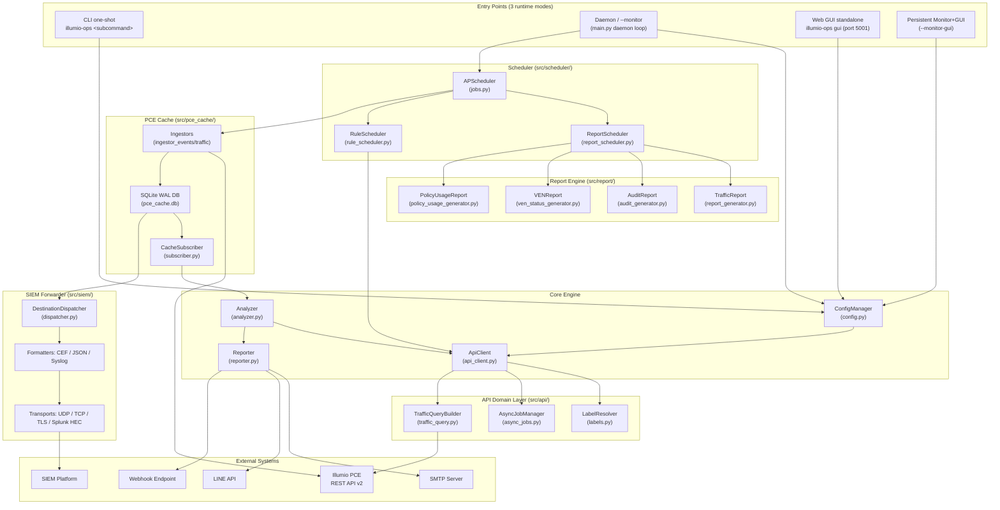
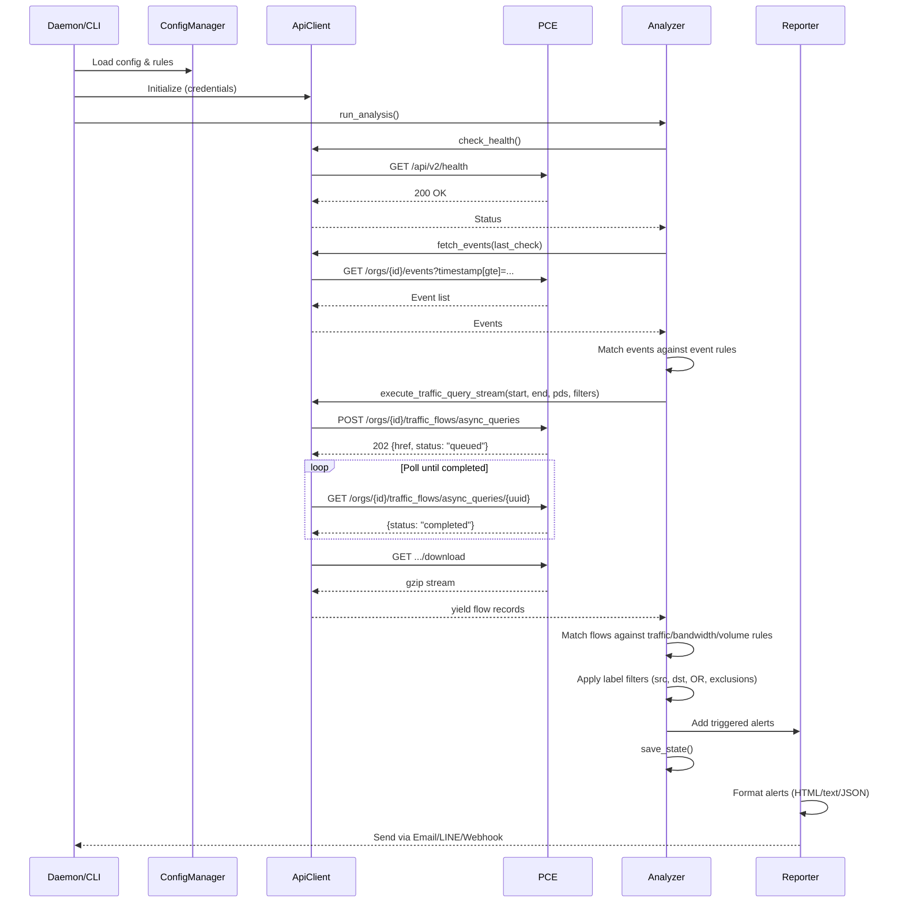

# Illumio PCE Ops — Project Architecture & Code Guide

<!-- BEGIN:doc-map -->
| Document | EN | 中文 |
|---|---|---|
| README | [README.md](../README.md) | [README_zh.md](../README_zh.md) |
| User Manual | [User_Manual.md](./User_Manual.md) | [User_Manual_zh.md](./User_Manual_zh.md) |
| Architecture | [Architecture.md](./Architecture.md) | [Architecture_zh.md](./Architecture_zh.md) |
| Security Rules | [Security_Rules_Reference.md](./Security_Rules_Reference.md) | [Security_Rules_Reference_zh.md](./Security_Rules_Reference_zh.md) |
<!-- END:doc-map -->

> **[English](Architecture.md)** | **[繁體中文](Architecture_zh.md)**

---

## Background — Illumio Platform

> Distilled from the official Illumio documentation 25.4 (Admin Guide and REST API Guide). This background section grounds the implementation-specific sections that follow.

### Background.1 PCE and VEN

At the core of the Illumio platform sits the **Policy Compute Engine (PCE)**: a server-side component that calculates and distributes security policy to every managed workload. For each workload, the PCE derives a tailored rule set and pushes it down to the resident enforcement agent — the **Virtual Enforcement Node** (**VEN**). Internally the PCE spans four service tiers — Front End, Processing, Service/Caching, and Persistence — which collectively provide management interfaces, authentication, traffic flow aggregation, and database storage.

The **Virtual Enforcement Node (VEN)** is a lightweight, multiple-process application that runs directly on a workload (bare-metal server, virtual machine, or container). Once installed, the VEN interacts with the host's native networking interfaces and OS-level firewall to collect traffic flow data and enforce the security policies it receives from the PCE. The VEN programs native firewall mechanisms: `iptables`/`nftables` on Linux, `pf`/`ipfilter` on Solaris, and the Windows Filtering Platform on Windows. It is optimized to remain idle in the background, consuming CPU only when calculating or applying rules, while periodically summarizing and reporting flow telemetry to the PCE.

**Supported VEN platforms** (25.4): Linux (RHEL 5/7/8, CentOS 8, Debian 11, SLES 11 SP2, IBM Z mainframe with RHEL 7/8), Windows (Server 2012/2016, Windows 10 64-bit), AIX, Solaris (up to 11.4 / Oracle Exadata), macOS (Illumio Edge only), and containerized VEN (C-VEN) for Kubernetes, OpenShift, Docker, ContainerD, and CRI-O.

**VEN–PCE communication** uses TLS throughout. On-premises: the VEN connects to PCE on TCP 8443 (HTTPS) and TCP 8444 (long-lived TLS-over-TCP lightning-bolt channel). SaaS: both channels use TCP 443. The VEN sends a heartbeat every 5 minutes and summarized flow logs every 10 minutes. The PCE pushes new firewall rules and real-time policy-update signals down the lightning-bolt channel; if that channel is unavailable, updates fall back to the next heartbeat response.

### Background.2 Label dimensions

Illumio abstracts workload identity from IP addresses using a four-dimension label system. Labels are key-value metadata attached to workloads and used by the PCE to compute policy scopes.

| Dimension | Key | Purpose | Example values |
|-----------|-----|---------|----------------|
| Role | `role` | Function of the workload within its application | `web`, `database`, `cache` |
| Application | `app` | Business application or service | `HRM`, `SAP`, `Storefront` |
| Environment | `env` | SDLC stage | `production`, `staging`, `development`, `QA` |
| Location | `loc` | Physical or logical geography | `aws-east1`, `dc-frankfurt`, `rack-3` |

Labels are applied to workloads via pairing profiles (at VEN install time), manual assignment in the PCE web console, REST API updates, bulk CSV import, or Container Workload Profiles (for Kubernetes/OpenShift pods). Once assigned, labels flow through to ruleset scopes and security rules: a rule that specifies `role=web, env=production` applies exactly to all workloads carrying those two label values, regardless of their IP address.

In `illumio_ops`, labels surface in the `Workload` model, report tables (policy usage, traffic analysis), and the SIEM event enrichment pipeline. The `src/api/` domain classes fetch label definitions from the PCE and cache them in SQLite for offline resolution.

### Background.3 Workload types

The PCE models three categories of workloads:

**Managed workloads** have a VEN installed and paired with the PCE. In the PCE REST API they appear as `workload` objects with `managed: true`, and include a `ven` property block tracking VEN version, operational status, heartbeat timestamp, and policy sync state. Managed workloads can be placed in any of the four enforcement modes and report live traffic telemetry to the PCE.

**Unmanaged workloads** are network entities without a VEN (laptops, appliances, systems with frequently changing IPs, PKI/Kerberos endpoints). They are represented in the PCE as `workload` objects with `managed: false`. Administrators create them manually via the web console, REST API, or bulk CSV import. Unmanaged workloads can be labelled and used as providers/consumers in security rules, but they do not report traffic or process data to the PCE.

**Container workloads** represent Kubernetes or OpenShift pods monitored through Illumio Kubelink. A single VEN is installed on the container host node rather than inside individual containers. The PCE creates `container_workload` objects for running pods and `container_workload_profile` objects that govern how new pods are labelled and paired as they start. This means policy for containerized applications is expressed in the same label-based ruleset model as for VMs and bare-metal.

### Background.4 Policy lifecycle

Policy objects in the PCE — including rulesets, IP lists, enforcement boundaries, and associated service and label-group definitions — move through three distinct states before taking effect on any workload:

1. **Draft**: Any write operation against a policy object (create, update, or delete) lands first in a Draft state that remains invisible to the enforcement plane. No firewall configuration on any managed workload changes until explicit provisioning occurs, giving security teams a safe environment to stage and validate complex segmentation changes.

2. **Pending**: Accumulated draft edits transition to Pending status once saved, forming a change queue ready for review. From this staging area, administrators can inspect the full delta, selectively revert items, verify co-provisioning requirements, and run impact analysis before committing.

3. **Active**: An explicit provisioning action promotes pending changes to Active. The PCE then recomputes the full policy graph and distributes the updated firewall rules to every affected VEN through the encrypted control channel. Each provisioning event is stamped with a timestamp, the responsible user, and a count of impacted workloads, supporting audit and rollback workflows.

The `compute_draft` logic in `illumio_ops` (see `Security_Rules_Reference.md` — R01–R05 rules) reads Draft-state rules from the PCE to evaluate policy intent before provisioning, surfacing gaps before they reach Active state.

### Background.5 Enforcement modes

The VEN's policy state governs how PCE-computed rules are applied to a workload's OS firewall. Four modes exist:

| Mode | Traffic blocked? | Logging behaviour |
|------|-----------------|-------------------|
| **Idle** | None — enforcement is off; VEN is dormant | Snapshot-only (state "S"); not exported to syslog/Fluentd |
| **Visibility Only** | None — passive monitoring only | Configurable: Off / Blocked (low) / Blocked+Allowed (high) / Enhanced Data Collection (with byte counts) |
| **Selective** | Only traffic violating configured Enforcement Boundaries | Same four logging tiers as Visibility Only |
| **Full** | Any traffic not explicitly allowed by an allow-list rule | Same four logging tiers; Illumio operates default-deny / zero-trust |

Selective mode lets administrators enforce specific network segments while merely observing the rest — a common transitional state when hardening an application incrementally. Full mode is the target state for production microsegmentation.

`illumio_ops` surfaces per-workload enforcement mode in the policy usage report and the R-Series rules (see `Security_Rules_Reference.md` §R02–R04) flag workloads that remain in Idle or Visibility Only in production environments.

> **References:** Illumio Admin Guide 25.4 (`Admin_25_4.pdf`).

---

## 1. System Architecture Overview



**Runtime modes**: Three launch modes are supported: (1) **CLI one-shot** (`illumio-ops <subcommand>`) for interactive and scripted operations; (2) **Daemon** (`--monitor` or `--monitor-gui`) which starts the APScheduler loop in `src/scheduler/jobs.py` for continuous monitoring, scheduled reports, and rule automation; (3) **Web GUI standalone** (`illumio-ops gui`) which starts only the Flask application on port 5001.

**Data Flow**: Entry Point → `ConfigManager` (loads rules/credentials) → `ApiClient` (queries PCE via domain layer `src/api/`) → `Analyzer` (evaluates rules against returned data) → `Reporter` (dispatches alerts). When cache is enabled, `CacheSubscriber` (`src/pce_cache/subscriber.py`) feeds pre-fetched data from the SQLite WAL cache into `Analyzer` instead of making live API calls, reducing the monitor tick latency to 30 seconds.

**Scheduler Flow**: `APScheduler` (`src/scheduler/jobs.py`) drives all timed jobs. `ReportScheduler.tick()` evaluates cron schedules → dispatches to report generators → emails results. `RuleScheduler.check()` evaluates recurring/one-time schedules → toggles PCE rules → provisions changes.

**SIEM Forwarder**: `src/siem/dispatcher.py` reads from the PCE cache (`siem_dispatch` table) and forwards events/flows through pluggable formatters (CEF, JSON-line, RFC-5424 Syslog) and transports (UDP, TCP, TLS, Splunk HEC) to external SIEM platforms.

---

## 2. Directory Structure

```text
illumio_ops/
├── illumio_ops.py         # Entry point — imports and calls src.main.main()
├── requirements.txt       # Python dependencies
│
├── config/
│   ├── config.json            # Runtime config (credentials, rules, alerts, settings)
│   ├── config.json.example    # Example config template
│   └── report_config.yaml     # Security Findings rule thresholds
│
├── src/
│   ├── __init__.py            # Package init, exports __version__
│   ├── main.py                # CLI argument parser, daemon/GUI orchestration, interactive menu
│   ├── api_client.py          # ApiClient facade (~765 LOC): HTTP core + delegation wrappers for all public methods
│   ├── api/                   # API domain classes (composed by ApiClient facade)
│   │   ├── labels.py          # LabelResolver: label/IP-list/service TTL cache management
│   │   ├── async_jobs.py      # AsyncJobManager: async query job lifecycle + state persistence
│   │   └── traffic_query.py   # TrafficQueryBuilder: traffic payload construction + streaming
│   ├── cli/                   # Click subcommand groups registered to illumio-ops entry point
│   │   ├── cache.py           # cache backfill / status / retention subcommands
│   │   ├── config.py          # config show / set subcommands
│   │   ├── monitor.py         # monitor daemon subcommand
│   │   ├── report.py          # report generate subcommand
│   │   ├── root.py            # root click group + version flag
│   │   └── ...                # siem.py, workload.py, gui_cmd.py, rule.py, status.py
│   ├── events/                # Event pipeline — polling, matching, normalization
│   │   ├── poller.py          # EventPoller: watermark-based polling with dedup semantics
│   │   ├── catalog.py         # KNOWN_EVENT_TYPES baseline (vendor + local extensions)
│   │   ├── matcher.py         # matches_event_rule(): regex/pipe/negation matching
│   │   ├── normalizer.py      # Normalized event field extraction
│   │   ├── shadow.py          # Legacy vs current matcher diagnostic comparator
│   │   ├── stats.py           # Dispatch history + event timeline tracking
│   │   └── throttle.py        # Per-rule alert throttle state
│   ├── pce_cache/             # PCE cache layer (SQLite WAL) — see [PCE Cache](PCE_Cache.md) for full coverage
│   │   ├── subscriber.py      # CacheSubscriber: per-consumer cursor, feeds Analyzer when cache enabled
│   │   ├── ingestor_events.py # Writes PCE audit events into cache
│   │   ├── ingestor_traffic.py# Writes traffic flows into cache
│   │   ├── reader.py          # Read-side helpers for querying cached data
│   │   ├── backfill.py        # BackfillRunner: historical range ingest
│   │   ├── aggregator.py      # Daily traffic rollup (pce_traffic_flows_agg)
│   │   ├── lag_monitor.py     # APScheduler job: warns when ingestor stalls
│   │   ├── models.py          # SQLAlchemy ORM models for all cache tables
│   │   ├── rate_limiter.py    # Token-bucket rate limiter (shared across ingestors)
│   │   ├── retention.py       # Daily purge worker
│   │   ├── schema.py          # init_schema() — creates tables / migrations
│   │   ├── traffic_filter.py  # Post-ingest traffic sampling
│   │   ├── watermark.py       # ingestion_watermarks CRUD
│   │   └── web.py             # Flask Blueprint for /api/cache/* endpoints
│   ├── scheduler/             # APScheduler integration
│   │   └── jobs.py            # Job callables: run_monitor_cycle, report jobs, ingest jobs
│   ├── siem/                  # SIEM forwarder — pluggable formatters and transports
│   │   ├── dispatcher.py      # DestinationDispatcher: reads siem_dispatch queue, dispatches with retry + DLQ
│   │   ├── dlq.py             # Dead-letter queue helpers
│   │   ├── preview.py         # Preview formatter output for testing
│   │   ├── tester.py          # send_test_event(): synthetic event round-trip test
│   │   ├── web.py             # Flask Blueprint for /api/siem/* endpoints
│   │   ├── formatters/        # Pluggable log formatters
│   │   │   ├── base.py        # Formatter ABC
│   │   │   ├── cef.py         # ArcSight CEF format
│   │   │   ├── json_line.py   # JSON-line format
│   │   │   └── syslog_header.py # RFC-5424 header helper
│   │   └── transports/        # Pluggable output transports
│   │       ├── base.py        # Transport ABC
│   │       ├── syslog_udp.py  # UDP syslog
│   │       ├── syslog_tcp.py  # TCP syslog
│   │       ├── syslog_tls.py  # TLS syslog
│   │       └── splunk_hec.py  # Splunk HTTP Event Collector
│   ├── analyzer.py            # Rule engine: flow matching, metric calculation, state management
│   ├── reporter.py            # Alert aggregation and multi-channel dispatch
│   ├── config.py              # Configuration loading, saving, rule CRUD, atomic writes
│   ├── exceptions.py          # Typed exception hierarchy: IllumioOpsError → APIError/ConfigError/etc.
│   ├── interfaces.py          # typing.Protocol definitions: IApiClient, IReporter, IEventStore
│   ├── href_utils.py          # Canonical extract_id(href) helper
│   ├── loguru_config.py       # Central loguru setup: rotating file + TTY console + optional JSON SIEM sink
│   ├── gui.py                 # Flask Web application (~40 JSON API endpoints), login rate limiting, CSRF synchronizer token
│   ├── settings.py            # CLI interactive menus for rule/alert configuration
│   ├── report_scheduler.py    # Scheduled report generation and email delivery
│   ├── rule_scheduler.py      # Policy rule automation (recurring/one-time schedules, provision)
│   ├── rule_scheduler_cli.py  # CLI and Web GUI interface for rule scheduler
│   ├── i18n.py                # Internationalization dictionary (EN/ZH_TW) and language switching; _I18nState thread-safe singleton
│   ├── utils.py               # Helpers: logging setup, ANSI colors, unit formatting, CJK width; _InputState thread-safe singleton
│   ├── templates/             # Jinja2 HTML templates for Web GUI (SPA)
│   ├── static/                # CSS/JS frontend assets
│   └── report/                # Advanced report generation engine
│       ├── report_generator.py        # Traffic report orchestrator (15 modules + Security Findings)
│       ├── audit_generator.py         # Audit log report orchestrator (4 modules)
│       ├── ven_status_generator.py    # VEN status inventory report
│       ├── policy_usage_generator.py  # Policy rule usage analysis report
│       ├── rules_engine.py            # 19 automated Security Findings rules (B/L series)
│       ├── snapshot_store.py          # KPI snapshot store for Change Impact (reports/snapshots/)
│       ├── trend_store.py             # Trend KPI archive (per report type)
│       ├── analysis/                  # Per-module analysis logic
│       │   ├── mod01–mod15            # Traffic analysis modules
│       │   ├── mod_change_impact.py   # Compare current KPIs to previous snapshot
│       │   ├── audit/                 # Audit analysis modules (audit_mod00–03)
│       │   └── policy_usage/          # Policy usage modules (pu_mod00–05)
│       ├── exporters/                 # HTML, CSV, and policy usage export formatters
│       └── parsers/                   # API response and CSV data parsers
│
├── docs/                  # Documentation (this file, user manual, API cookbook)
├── tests/                 # Unit tests (pytest)
├── logs/                  # Runtime log files (rotating, 10MB × 5 backups)
│   └── state.json         # Persistent state (last_check timestamp, alert_history)
├── reports/               # Generated report output directory
└── deploy/                # Deployment helpers (NSSM, systemd configs)
```

---

## 3. Module Deep Dive

### 3.1 `api_client.py` — REST API Client

**Responsibility**: All HTTP communication with the Illumio PCE, using only Python `urllib` (zero external dependencies).

| Method | API Endpoint | HTTP | Purpose |
|:---|:---|:---|:---|
| `check_health()` | `/api/v2/health` | GET | PCE health status |
| `fetch_events()` | `/orgs/{id}/events` | GET | Security audit events |
| `execute_traffic_query_stream()` | `/orgs/{id}/traffic_flows/async_queries` | POST→GET→GET | Async traffic flow query (3-phase) |
| `fetch_traffic_for_report()` | (same async endpoint) | POST→GET→GET | Traffic query for report generation |
| `get_labels()` | `/orgs/{id}/labels` | GET | List labels by key |
| `create_label()` | `/orgs/{id}/labels` | POST | Create new label |
| `get_workload()` | `/api/v2{href}` | GET | Fetch single workload |
| `update_workload_labels()` | `/api/v2{href}` | PUT | Update workload's label set |
| `search_workloads()` | `/orgs/{id}/workloads` | GET | Search workloads by params |
| `fetch_managed_workloads()` | `/orgs/{id}/workloads` | GET | All managed workloads (VEN reports) |
| `get_all_rulesets()` | `/orgs/{id}/sec_policy/.../rule_sets` | GET | List rulesets (rule scheduler) |
| `get_active_rulesets()` | `/orgs/{id}/sec_policy/active/rule_sets` | GET | Active rulesets (policy usage) |
| `toggle_and_provision()` | Multiple | PUT→POST | Enable/disable rule and provision |
| `submit_async_query()` | `/orgs/{id}/traffic_flows/async_queries` | POST | Submit async traffic query |
| `poll_async_query()` | `.../async_queries/{uuid}` | GET | Poll query status until completed |
| `download_async_query()` | `.../async_queries/{uuid}/download` | GET | Download gzip-compressed results |
| `batch_get_rule_traffic_counts()` | (parallel async queries) | POST→GET→GET | Batch per-rule hit analysis |
| `check_and_create_quarantine_labels()` | `/orgs/{id}/labels` | GET/POST | Ensure quarantine label set exists |
| `provision_changes()` | `/orgs/{id}/sec_policy` | POST | Provision draft → active |
| `has_draft_changes()` | `/orgs/{id}/sec_policy/pending` | GET | Check for pending draft changes |

**Key Design Patterns**:
- **Retry with Exponential Backoff**: Automatically retries on `429` (rate limit), `502/503/504` (server errors) up to 3 attempts with base interval 2s
- **3-Phase Async Query Execution**: Submit → Poll → Download pattern for traffic queries; `batch_get_rule_traffic_counts()` parallelizes all three phases across multiple rules using `ThreadPoolExecutor` (max 10 concurrent)
- **Streaming Download**: Traffic query results (potentially gigabytes) are downloaded as gzip, decompressed in-memory, and yielded line-by-line via Python generators — O(1) memory consumption
- **Label/Ruleset Caching**: Internal caches (`label_cache`, `ruleset_cache`, `service_ports_cache`) avoid redundant API calls during batch operations
- **No External Dependencies**: Uses only `urllib.request` (no `requests` library)

> **Note**: Illumio Core 25.2 deprecated the synchronous traffic query API (`traffic_analysis_queries`). This tool uses exclusively the async API (`async_queries`) with support for up to 200,000 results.

### 3.2 `analyzer.py` — Rule Engine

**Responsibility**: Evaluate API data against user-defined rules, with support for flexible filter logic.

**Core Functions**:

| Function | Purpose |
|:---|:---|
| `run_analysis()` | Main orchestration: health check → events → traffic → save state |
| `check_flow_match()` | Evaluate a single traffic flow against a rule's filter criteria |
| `_check_flow_labels()` | Match flow labels against rule filters (src, dst, OR logic, exclusions) |
| `_check_ip_filter()` | Validate IP addresses against CIDR ranges (IPv4/IPv6) |
| `calculate_mbps()` | Hybrid bandwidth calculation with auto-scale units |
| `calculate_volume_mb()` | Data volume calculation with hybrid approach |
| `query_flows()` | Generic query endpoint used by Web GUI's Traffic Analyzer |
| `run_debug_mode()` | Interactive diagnostic showing raw rule evaluation results |
| `_check_cooldown()` | Prevent alert flooding via per-rule minimum re-alert intervals |

**Filter Matching Logic**:

The analyzer supports flexible filter conditions for traffic rules:

| Filter Field | Logic | Description |
|:---|:---|:---|
| `src_labels` + `dst_labels` | AND | Both source and destination must match |
| `src_labels` only | Src-side | Match by source label only |
| `dst_labels` only | Dst-side | Match by destination label only |
| `filter_direction: "src_or_dst"` | OR | Match if either source or destination matches any specified label |
| `ex_src_labels`, `ex_dst_labels` | Exclusion | Exclude flows matching these labels |
| `src_ip`, `dst_ip` | CIDR match | IPv4/IPv6 address filtering |
| `ex_src_ip`, `ex_dst_ip` | Exclusion | Exclude flows from/to these IPs |
| `port`, `proto` | Service match | Port and protocol filtering |

**State Management** (`state.json`):
- `last_check`: ISO timestamp of last successful check — used as anchor for event queries
- `history`: Rolling window of match counts per rule (pruned to 2 hours)
- `alert_history`: Per-rule last-alert timestamp for cooldown enforcement
- **Atomic Writes**: Uses `tempfile.mkstemp()` + `os.replace()` to prevent corruption on crash

### 3.3 `reporter.py` — Alert Dispatcher

**Responsibility**: Format and send alerts through configured channels.

**Alert Categories**: `health_alerts`, `event_alerts`, `traffic_alerts`, `metric_alerts`

**Output Formats**:
- **Email**: Rich HTML tables with color-coded severity badges, embedded flow snapshots, and auto-scaled bandwidth units. Event alerts include username and IP for login failure notifications.
- **LINE**: Plain text summary (LINE API character limits)
- **Webhook**: Raw JSON payload (full structured data for SOAR ingestion)

**Report Email Methods**:
| Method | Purpose |
|:---|:---|
| `send_alerts()` | Route alerts to configured channels |
| `send_report_email()` | Send on-demand report with single attachment |
| `send_scheduled_report_email()` | Send scheduled report with multiple attachments and custom recipients |

### 3.4 `config.py` — Configuration Manager

**Responsibility**: Load, save, and validate `config.json`.

- **Thread Safety**: Uses **`threading.RLock`** (Reentrant Lock) to prevent deadlocks during recursive load/save cycles or concurrent access from Daemon and GUI threads.
- **Deep Merge**: User config is merged over defaults — any missing fields are auto-populated.
- **Atomic Save**: Writes to `.tmp` file first, then `os.replace()` for crash safety.
- **Password storage**: web GUI password is stored in plaintext in `config.json` `web_gui.password`. The login endpoint compares the form input with this string directly. No hashing functions exist in `src/config.py`.
- **Rule CRUD**: `add_or_update_rule()`, `remove_rules_by_index()`, `load_best_practices()`.
- **PCE Profile Management**: `add_pce_profile()`, `update_pce_profile()`, `activate_pce_profile()`, `remove_pce_profile()`, `list_pce_profiles()` — supports multi-PCE environments with profile switching.
- **Report Schedule Management**: `add_report_schedule()`, `update_report_schedule()`, `remove_report_schedule()`, `list_report_schedules()`.

### 3.5 `gui.py` — Web GUI

**Architecture**: Flask backend exposing ~40 JSON API endpoints, consumed by a Vanilla JS frontend (`templates/index.html`).

- **Security Middleware**: Mandates login authentication for all routes and enforces IP Allowlisting (CIDR support) via `@app.before_request`. Unauthorized requests are blocked with 401/403 status.
- **Password storage**: web GUI password is **plaintext** in `config.json` `web_gui.password` (default `illumio`). Rationale: this tool runs only in offline-isolated PCE management networks; all other secrets in `config.json` (`api.key`, `api.secret`, `alerts.line_*`, `smtp.password`, `webhook_url`) are also plaintext, so hashing only the GUI password gives no defensive value while complicating maintenance. Operators should change the default `illumio` password on first login regardless.
- **Login Rate Limiting**: In-memory per-IP tracker with thread-safe locking. 5 attempts per 60-second window; returns HTTP 429 on excess.
- **CSRF Protection**: Uses the **Synchronizer Token Pattern**: token is stored in Flask session and injected into `index.html` via a `<meta name="csrf-token">` tag. JavaScript reads the token from the meta tag (not from a cookie). The CSRF cookie has been removed.
- **Session Security**: Cryptographically signed session cookies. The `session_secret` is automatically generated on first run.
- **SMTP Password**: Can be provided via `ILLUMIO_SMTP_PASSWORD` environment variable, which takes precedence over the config file value.
- **Threading Model (--monitor-gui)**: The daemon loop runs in a dedicated `threading.Thread` while the Flask app occupies the main thread to handle signals and web requests correctly.

**Key Endpoints**:

| Route | Method | Purpose |
|:---|:---|:---|
| `/api/login` | POST | Session authentication |
| `/api/security` | GET/POST | Security settings (password, allowed IPs) |
| `/api/status` | GET | Dashboard data (health, stats, rules, cooldowns) |
| `/api/event-catalog` | GET | Translated event type catalog |
| `/api/rules` | GET | List all rules |
| `/api/rules/event` | POST | Create event rule |
| `/api/rules/traffic` | POST | Create traffic rule |
| `/api/rules/bandwidth` | POST | Create bandwidth rule |
| `/api/rules/<idx>` | GET/PUT/DELETE | Rule CRUD by index |
| `/api/settings` | GET/POST | Read/write application settings |
| `/api/pce-profiles` | GET/POST | Multi-PCE profile management (list, add, update, delete, activate) |
| `/api/dashboard/queries` | GET/POST/DELETE | Saved query management |
| `/api/dashboard/snapshot` | GET | Latest traffic report snapshot |
| `/api/dashboard/top10` | POST | Top-10 flows by bandwidth/volume/connections |
| `/api/quarantine/search` | POST | Traffic search with flexible filters |
| `/api/quarantine/apply` | POST | Apply quarantine label to workload |
| `/api/quarantine/bulk_apply` | POST | Bulk quarantine (parallel, max 5 workers) |
| `/api/workloads` | GET/POST | Workload search and inventory |
| `/api/reports/generate` | POST | Generate reports (Traffic/Audit/VEN/Policy Usage) |
| `/api/reports` | GET | List generated reports |
| `/api/reports/<filename>` | DELETE | Delete report file |
| `/api/reports/bulk-delete` | POST | Bulk delete reports |
| `/api/audit_report/generate` | POST | Generate audit report |
| `/api/ven_status_report/generate` | POST | Generate VEN status report |
| `/api/policy_usage_report/generate` | POST | Generate policy usage report |
| `/api/report-schedules` | GET/POST | Report schedule CRUD |
| `/api/report-schedules/<id>` | PUT/DELETE | Update/delete schedule |
| `/api/report-schedules/<id>/toggle` | POST | Enable/disable schedule |
| `/api/report-schedules/<id>/run` | POST | Trigger immediate execution |
| `/api/report-schedules/<id>/history` | GET | Schedule execution history |
| `/api/init_quarantine` | POST | Ensure quarantine labels exist on PCE |
| `/api/actions/run` | POST | Execute one analysis cycle |
| `/api/actions/debug` | POST | Run debug mode |
| `/api/actions/test-alert` | POST | Send test alert |
| `/api/actions/best-practices` | POST | Load best practice rules |
| `/api/actions/test-connection` | POST | Test PCE connectivity |
| `/api/rule_scheduler/status` | GET | Rule scheduler status |
| `/api/rule_scheduler/rulesets` | GET | Browse PCE rulesets |
| `/api/rule_scheduler/rulesets/<id>` | GET | Ruleset detail with rules |
| `/api/rule_scheduler/schedules` | GET/POST | Rule schedule CRUD |
| `/api/rule_scheduler/schedules/<href>` | GET | Schedule detail |
| `/api/rule_scheduler/schedules/delete` | POST | Delete rule schedule |
| `/api/rule_scheduler/check` | POST | Trigger schedule evaluation |

### 3.6 `i18n.py` — Internationalization

**Responsibility**: Provide translated strings for all UI text.

- Contains a ~900+ entry dictionary mapping keys to translations in `{"en": {...}, "zh_TW": {...}}` structure
- `t(key, **kwargs)` function returns the string in the current language with variable substitution
- Language is set globally via `set_language("en"|"zh_TW")`
- Covers: CLI menus, event descriptions, alert templates, Web GUI labels, report terminology, filter labels, schedule types

### 3.7 `report_scheduler.py` — Report Scheduler

**Responsibility**: Manage scheduled report generation and email delivery.

- Supports daily, weekly, and monthly schedules
- Generates **4 report types**: Traffic, Audit, VEN Status, and Policy Usage
- `tick()` called every minute from daemon loop to evaluate schedules
- `run_schedule()` dispatches to appropriate generator based on report type
- Emails reports as HTML attachments with configurable recipients
- Handles report retention via `_prune_old_reports()` (auto-cleanup by `retention_days`)
- Schedule times stored as UTC, displayed in configured timezone
- State tracked in `logs/state.json` under `report_schedule_states`

### 3.8 `rule_scheduler.py` + `rule_scheduler_cli.py` — Rule Scheduler

**Responsibility**: Automate PCE policy rule enable/disable on schedule.

**Schedule Types**:
- **Recurring**: Enable/disable rules on specific days and time windows (e.g., Mon–Fri 09:00–17:00). Supports midnight wraparound (e.g., 22:00–06:00).
- **One-time**: Enable/disable a rule until a specific expiration datetime, then auto-revert.

**Features**:
- Browse and search all PCE rulesets and individual rules
- Enable or disable specific rules or entire rulesets
- **Draft protection**: Multi-layer checks ensure only provisioned rules are toggled; prevents enforcement on draft-only items
- Provision changes to PCE (push draft → active)
- Interactive CLI (`rule_scheduler_cli.py`) with paginated rule browsing
- Web GUI API endpoints under `/api/rule_scheduler/*`
- Schedule note tags added to PCE rule descriptions (📅 recurring / ⏳ one-time)
- Day name normalization (mon→monday, etc.)

### 3.9 `src/report/` — Advanced Report Engine

**Responsibility**: Generate comprehensive security analysis reports.

| Component | Purpose |
|:---|:---|
| `report_generator.py` | Orchestrate 15 analysis modules + Security Findings for Traffic Reports |
| `audit_generator.py` | Orchestrate 4 modules for Audit Log Reports |
| `ven_status_generator.py` | VEN inventory report with heartbeat-based online/offline classification |
| `policy_usage_generator.py` | Policy rule usage analysis with per-rule hit counts |
| `rules_engine.py` | 19 automated detection rules (B001–B009, L001–L010) with configurable thresholds |
| `analysis/mod01–mod15` | Traffic analysis modules (overview, policy decisions, ransomware, remote access, etc.) |
| `analysis/audit/` | 4 audit modules (executive summary, health events, user activity, policy changes) |
| `analysis/policy_usage/` | 4 policy usage modules (executive, overview, hit detail, unused detail) |
| `exporters/` | HTML template rendering, CSV export, policy usage HTML export |
| `parsers/` | API response parsing (`api_parser.py`), CSV ingestion (`csv_parser.py`), data validation |

**Report Types**:

| Report | Modules | Description |
|:---|:---|:---|
| **Traffic** | 15 modules (mod01–mod15) + 19 Security Findings | Comprehensive traffic analysis with ransomware, remote access, cross-env, bandwidth, lateral movement detection |
| **Audit** | 4 modules (audit_mod00–03) | PCE health events, user login/authentication, policy change tracking |
| **VEN Status** | Single generator | VEN inventory with online/offline status based on heartbeat (≤1h threshold) |
| **Policy Usage** | 4 modules (pu_mod00–03) | Per-rule traffic hit analysis, unused rule identification, executive summary |

**Policy Usage Report** supports two data sources:
- **API**: Fetches active rulesets from PCE, runs parallel 3-phase async queries per rule
- **CSV Import**: Accepts Workloader CSV export with pre-computed flow counts

**Export Formats**: HTML (primary) and CSV ZIP (stdlib `zipfile`, zero external dependencies).

### 3.10 `src/api/` — PCE API Domain Layer

**Path**: `src/api/`
**Entry points**: `labels.py`, `async_jobs.py`, `traffic_query.py` (all composed by `ApiClient` facade in `api_client.py`)

These three domain classes were extracted from `ApiClient` in Phase 9 to keep the facade under a manageable size. The `ApiClient` continues to own the shared state (TTLCaches, `_cache_lock`, job tracking dict) so that existing callers and tests remain unaffected.

- `LabelResolver` — label/IP-list/service lookup with TTL caching and filter normalization
- `AsyncJobManager` — submit/poll/download lifecycle for PCE async traffic queries; persists job state to `state.json` so jobs survive daemon restarts
- `TrafficQueryBuilder` — builds Illumio workloader-style async query payloads; handles up to 200,000 results with gzip streaming; powers `batch_get_rule_traffic_counts()` via `ThreadPoolExecutor` (max 10 concurrent)

### 3.11 `src/events/` — Event Pipeline

**Path**: `src/events/`
**Dominant entry point**: `poller.py` (`EventPoller`)

Provides safe, watermark-based PCE audit event polling with dedup semantics. Events are polled on an interval, normalized, matched against user-defined rules, and dispatched to alerts or the SIEM forwarder.

- `poller.py` — watermark cursor, `event_identity()` dedup hashing, timestamp parsing
- `catalog.py` — `KNOWN_EVENT_TYPES` baseline (vendor list + locally observed extensions)
- `matcher.py` — `matches_event_rule()` supporting exact, pipe-OR, regex, negation (`!`), and wildcard patterns
- `normalizer.py` — extracts canonical fields (resource type, actor, severity) from raw PCE event JSON
- `shadow.py` — diagnostic comparator between legacy and current matcher (used by `/api/events/shadow_compare`)
- `stats.py` — dispatch history and event timeline tracking written to `state.json`
- `throttle.py` — per-rule alert throttle state management

### 3.12 `src/siem/` — SIEM Forwarder

**Path**: `src/siem/`
**Dominant entry point**: `dispatcher.py` (`DestinationDispatcher`)

Reads events and flows from the PCE cache (`siem_dispatch` table) and forwards them to external SIEM platforms. A Flask Blueprint in `web.py` exposes `/api/siem/*` configuration and test endpoints.

Formatters (pluggable via config): CEF (ArcSight), JSON-line, RFC-5424 Syslog.
Transports (pluggable): UDP, TCP, TLS (all syslog), Splunk HTTP Event Collector.

The dispatcher implements retry with exponential backoff (capped at 1 hour) and routes failed records to the dead-letter queue (`dead_letter` table, auto-purged after 30 days). Use `tester.py` to send a synthetic test event to a destination without polluting real data.

### 3.13 `src/scheduler/` — APScheduler Integration

**Path**: `src/scheduler/`
**Dominant entry point**: `jobs.py`

Thin wrapper around APScheduler's `BackgroundScheduler`. Contains all job callables dispatched by the scheduler so that individual job functions can be tested in isolation without starting the full daemon.

- `run_monitor_cycle()` — one analysis + alert dispatch tick (wraps `Analyzer.run_analysis()` + `Reporter.send_alerts()`)
- Report jobs, ingestor jobs, cache lag monitor, and rule scheduler check are registered here

The scheduler is initialized in `src/main.py` during daemon startup. Optional SQLAlchemy job store (`scheduler.persist = true` in config) enables job durability across daemon restarts.

### 3.14 `src/pce_cache/` — PCE Cache Layer

**Path**: `src/pce_cache/`
**Dominant entry points**: `ingestor_events.py`, `ingestor_traffic.py`, `subscriber.py`

Local SQLite (WAL mode) database acting as a shared buffer between the PCE API, the SIEM forwarder, and the monitoring/analysis subsystems. Full coverage in **[PCE Cache](PCE_Cache.md)** — see that document for table schema, retention tuning, cache-miss semantics, backfill, and operator CLI commands.

Key files: `models.py` (SQLAlchemy ORM), `schema.py` (`init_schema()`), `rate_limiter.py` (token-bucket shared across ingestors), `watermark.py` (ingestion cursor CRUD), `retention.py` (daily purge), `aggregator.py` (daily traffic rollup), `lag_monitor.py` (APScheduler stall detection).

---

## 4. Data Flow Diagram



### 4.1 Event Pipeline (`src/events/`) → Alerts / SIEM

PCE audit events follow a separate pipeline from traffic flows:

```
PCE REST API
    ↓  EventPoller (src/events/poller.py)
    │  — watermark cursor in state.json
    │  — dedup via event_identity() SHA-256 hash
    ↓
EventNormalizer (src/events/normalizer.py)
    — extracts resource_type, actor, severity from raw JSON
    ↓
EventMatcher (src/events/matcher.py)
    — matches_event_rule(): regex/pipe-OR/negation/wildcard
    — shadow.py comparator available for diagnostics
    ↓
Reporter.send_alerts()               pce_cache (siem_dispatch table)
    — Email / LINE / Webhook              ↓
                                   DestinationDispatcher (src/siem/dispatcher.py)
                                      — Formatter: CEF / JSON / Syslog
                                      — Transport: UDP / TCP / TLS / Splunk HEC
                                      → External SIEM platform
```

When `pce_cache.enabled = true`, the monitor runs on a 30-second tick by reading only rows inserted since the last `CacheSubscriber` cursor position, avoiding direct PCE API calls on every tick.

### 4.2 JSON Snapshot Store

After each Traffic Report run, `ReportGenerator` writes two JSON artifacts:

| Artifact | Path | Purpose |
|---|---|---|
| Latest dashboard snapshot | `reports/latest_snapshot.json` | Web GUI `/api/dashboard/snapshot` endpoint |
| KPI change-impact snapshot | `reports/snapshots/<type>/<YYYY-MM-DD>_<profile>.json` | `mod_change_impact.py` delta calculation |

**Naming convention**: `<YYYY-MM-DD>_<profile>.json` — e.g. `2026-04-28_security_risk.json`. Same date + profile overwrites atomically (`.tmp` → `os.replace()`).

**Retention**: controlled by `report.snapshot_retention_days` in `config.json` (default **90**, range 1–3650). `cleanup_old()` in `src/report/snapshot_store.py` deletes snapshots older than this threshold; it is called at the end of every report run.

**Change Impact calculation** (`src/report/analysis/mod_change_impact.py`): `compare()` loads the most recent previous snapshot via `snapshot_store.read_latest()`, then computes per-KPI deltas (direction: improved / regressed / unchanged / neutral) based on whether lower or higher values are desirable. If `previous_snapshot` is `None` (first ever run or all snapshots expired), the module returns `{"skipped": True, "reason": "no_previous_snapshot"}` — this guard prevents a `KeyError` on `previous_snapshot_at` and was hardened in commit `354ac0d`.

Trend KPIs (for chart sparklines) are stored in a separate `src/report/trend_store.py` — one JSON file per report type, appended on each run, independent of the snapshot store.

### 4.3 Report Generation Pipeline

```
generate_from_api() / generate_from_csv()
    ↓
Parsers (src/report/parsers/)
    — api_parser.py: PCE response → DataFrame
    — csv_parser.py: Workloader CSV → DataFrame
    ↓
Analysis modules (src/report/analysis/)
    — mod01–mod15: traffic analysis (policy decisions, ransomware, remote access, …)
    — mod_change_impact.py: KPI delta vs previous snapshot
    — audit_mod00–03: health events, logins, policy changes
    — pu_mod00–05: policy usage executive, overview, hit detail, unused detail
    ↓
RulesEngine (src/report/rules_engine.py)
    — 19 detection rules: B001–B009 (baseline), L001–L010 (lateral)
    ↓
Exporters (src/report/exporters/)
    — html_exporter.py: Jinja2 → standalone HTML (inline CSS/JS)
    — policy_usage_html_exporter.py: policy usage HTML
    — CSV ZIP (stdlib zipfile)
    ↓
Output: reports/<timestamp>_<type>.<ext>
    + reports/snapshots/<type>/<date>_<profile>.json  (KPI snapshot)
    + reports/latest_snapshot.json                    (dashboard cache)
```

Report HTML files embed a colored data-source pill: **green** = served from local SQLite cache; **blue** = live PCE API; **yellow** = mixed (partial cache + API).

---

## 5. Multi-PCE Profile Architecture

The system supports managing multiple PCE instances through profiles:

```text
config.json
├── api: { url, org_id, key, secret }    ← active profile credentials
├── active_pce_id: "production"           ← current active profile name
└── pce_profiles: [
      { name: "production", url: "...", org_id: 1, key: "...", secret: "..." },
      { name: "staging",    url: "...", org_id: 2, key: "...", secret: "..." }
    ]
```

- **Profile Switch**: `activate_pce_profile()` copies profile credentials into the top-level `api` section and reinitializes `ApiClient`
- **GUI**: `/api/pce-profiles` endpoints for listing, adding, updating, deleting, and activating profiles
- **CLI**: Interactive profile management via settings menu

---

## 6. How to Modify This Project

### 6.1 Add a New Rule Type

1. **Define the rule schema** in `settings.py` — create a new `add_xxx_menu()` function
2. **Add matching logic** in `analyzer.py` → `run_analysis()` — handle the new type in the traffic loop
3. **Add GUI support** in `gui.py` — create a new API endpoint for the rule type
4. **Add i18n keys** in `i18n.py` for any new UI strings

### 6.2 Add a New Alert Channel

1. **Add config fields** in `config.py` → `_DEFAULT_CONFIG["alerts"]`
2. **Implement the sender** in `reporter.py` — create `_send_xxx()` method
3. **Register in dispatcher** in `reporter.py` → `send_alerts()` — add the new channel check
4. **Add GUI settings** in `gui.py` → `api_save_settings()` and frontend

### 6.3 Add a New API Endpoint

1. **Add the method** in `api_client.py` — follow the pattern of existing methods
2. **URL format**: Use `self.base_url` for org-scoped endpoints, `self.api_cfg['url']/api/v2` for global ones
3. **Error handling**: Return `(status, body)` tuple, let callers handle specific status codes
4. **Refer to** `docs/REST_APIs_25_2.md` for endpoint schemas

### 6.4 Add a New i18n Language

1. Add a new top-level key in `i18n.py`'s `MESSAGES` dictionary (alongside `"en"` and `"zh_TW"`)
2. Add the language option in `gui.py` → settings endpoint
3. Update `config.py` defaults to include the new language code
4. Update `set_language()` in `i18n.py` to accept the new code

### 6.5 Add a New Report Type

1. **Create generator** in `src/report/` — follow `policy_usage_generator.py` pattern with `generate_from_api()` and `export()` methods
2. **Create analysis modules** in `src/report/analysis/<type>/` — `pu_mod00_executive.py` pattern
3. **Create exporter** in `src/report/exporters/` — HTML and/or CSV export
4. **Register in scheduler** in `report_scheduler.py` — add dispatch case in `run_schedule()`
5. **Add GUI endpoint** in `gui.py` — `api_generate_<type>_report()`
6. **Add CLI option** in `main.py` — argparse `--report-type` choices
7. **Add i18n keys** for report-specific terminology

---

## See also

- [PCE Cache](PCE_Cache.md) — cache layer details: table schema, retention, backfill, operator CLI
- [API Cookbook](API_Cookbook.md) — REST API patterns: auth, pagination, async job, 9 scenarios
- [User Manual](./User_Manual.md) — operator interface: CLI / GUI / Daemon / Reports / SIEM
- [README](../README.md) — project entry and Quickstart
