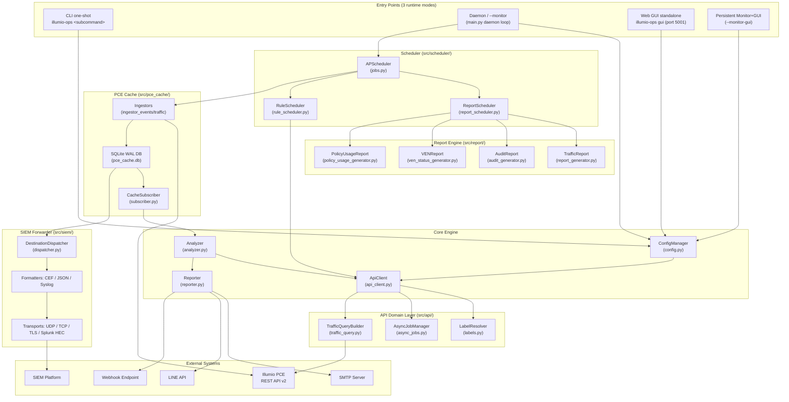
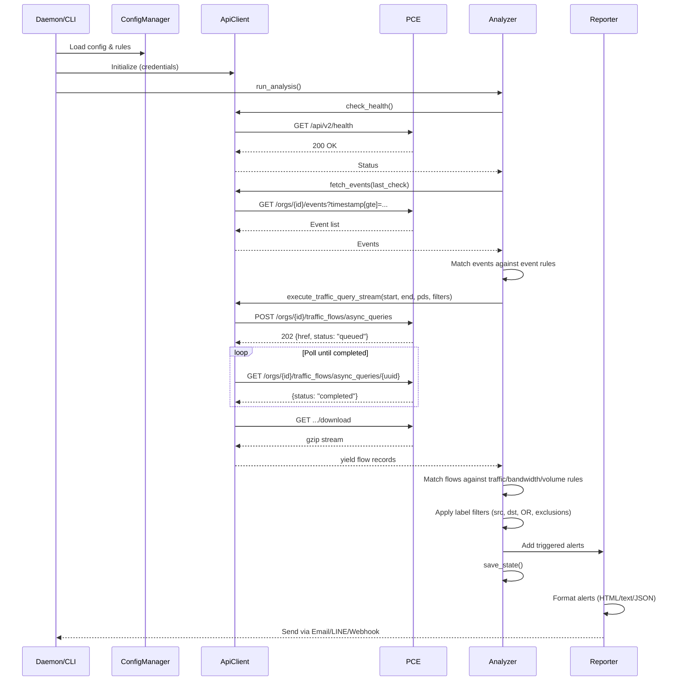
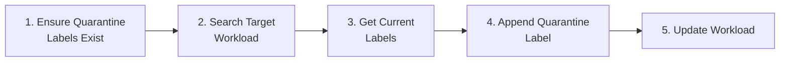
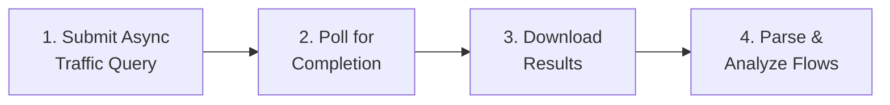
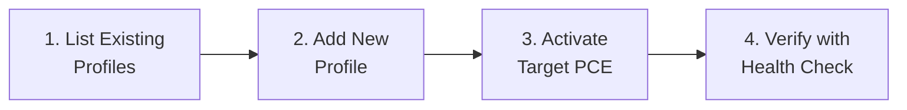

# Illumio PCE Ops — 專案架構與程式碼指南

<!-- BEGIN:doc-map -->
| Document | EN | 中文 |
|---|---|---|
| README | [README.md](../README.md) | [README_zh.md](../README_zh.md) |
| User Manual | [User_Manual.md](./User_Manual.md) | [User_Manual_zh.md](./User_Manual_zh.md) |
| Architecture | [Architecture.md](./Architecture.md) | [Architecture_zh.md](./Architecture_zh.md) |
| Security Rules | [Security_Rules_Reference.md](./Security_Rules_Reference.md) | [Security_Rules_Reference_zh.md](./Security_Rules_Reference_zh.md) |
<!-- END:doc-map -->

> **[English](Architecture.md)** | **[繁體中文](Architecture_zh.md)**

---

## Background — Illumio 平台

> 摘錄自 Illumio 官方文件 25.4（Admin Guide 及 REST API Guide）。本背景章節為後續實作細節章節提供基礎知識。

### Background.1 PCE 與 VEN

Illumio 平台的核心是 **Policy Compute Engine（PCE）**：一個伺服器端元件，負責計算並將安全策略分發至每一個受管 workload。對每個 workload，PCE 衍生出量身訂製的規則集，並將其推送至駐留於該 workload 的強制執行代理程式 —— **Virtual Enforcement Node**（**VEN**）。PCE 內部跨越四個服務層 —— Front End、Processing、Service/Caching 及 Persistence —— 共同提供管理介面、認證、流量聚合及資料庫儲存功能。

**Virtual Enforcement Node（VEN）** 是一個輕量級的多行程應用程式，直接執行於 workload（裸機伺服器、虛擬機器或容器）之上。安裝後，VEN 與主機的原生網路介面及 OS 層防火牆互動，以收集流量資料並執行從 PCE 接收的安全策略。VEN 對原生防火牆機制進行程式設定：Linux 上使用 `iptables`/`nftables`，Solaris 上使用 `pf`/`ipfilter`，Windows 上使用 Windows Filtering Platform。其設計目標是在背景中保持閒置，僅在計算或套用規則時消耗 CPU，同時定期彙總流量遙測並回報給 PCE。

**支援的 VEN 平台**（25.4）：Linux（RHEL 5/7/8、CentOS 8、Debian 11、SLES 11 SP2、IBM Z 大型主機搭配 RHEL 7/8）、Windows（Server 2012/2016、Windows 10 64-bit）、AIX、Solaris（最高 11.4 / Oracle Exadata）、macOS（僅限 Illumio Edge），以及容器化 VEN（C-VEN），適用於 Kubernetes、OpenShift、Docker、ContainerD 及 CRI-O。

**VEN–PCE 通訊**全程使用 TLS。內部部署：VEN 連接至 PCE 的 TCP 8443（HTTPS）及 TCP 8444（長連線 TLS-over-TCP lightning-bolt 通道）。SaaS：兩個通道均使用 TCP 443。VEN 每 5 分鐘發送一次心跳，每 10 分鐘發送一次彙總流量記錄。PCE 透過 lightning-bolt 通道下推新的防火牆規則及即時策略更新訊號；若該通道不可用，更新會退回至下一次心跳回應時處理。

### Background.2 Label 維度

Illumio 使用四維度 label 系統，將 workload 身份從 IP 位址中抽象出來。Label 是附加於 workload 的鍵值中繼資料，PCE 利用這些資料計算策略範圍。

| 維度 | 鍵 | 用途 | 範例值 |
|-----------|-----|---------|----------------|
| Role | `role` | Workload 在其應用程式中的功能 | `web`、`database`、`cache` |
| Application | `app` | 業務應用程式或服務 | `HRM`、`SAP`、`Storefront` |
| Environment | `env` | SDLC 階段 | `production`、`staging`、`development`、`QA` |
| Location | `loc` | 實體或邏輯地理位置 | `aws-east1`、`dc-frankfurt`、`rack-3` |

Label 透過配對設定檔（VEN 安裝時）、PCE Web 主控台手動指派、REST API 更新、批次 CSV 匯入，或容器 Workload Profile（用於 Kubernetes/OpenShift Pod）等方式套用至 workload。一旦指派，label 便會流向 ruleset 範圍及安全規則：指定 `role=web, env=production` 的規則，恰好適用於所有攜帶這兩個 label 值的 workload，而無論其 IP 位址為何。

在 `illumio_ops` 中，label 出現於 `Workload` 模型、報表表格（policy usage、流量分析）以及 SIEM 事件豐富化 pipeline 中。`src/api/` 領域類別從 PCE 擷取 label 定義，並將其快取至 SQLite 以供離線解析。

### Background.3 Workload 類型

PCE 將 workload 分為三大類：

**受管 workload** 已安裝並與 PCE 配對 VEN。在 PCE REST API 中，它們以 `workload` 物件的形式出現，`managed: true`，並包含 `ven` 屬性區塊，追蹤 VEN 版本、作業狀態、心跳時間戳記及策略同步狀態。受管 workload 可置於四種強制模式的任一種，並向 PCE 回報即時流量遙測。

**非受管 workload** 是沒有安裝 VEN 的網路實體（筆記型電腦、設備、IP 頻繁變動的系統、PKI/Kerberos 端點）。它們在 PCE 中以 `workload` 物件的形式表示，`managed: false`。管理員透過 Web 主控台、REST API 或批次 CSV 匯入手動建立。非受管 workload 可以被標記 label 並在安全規則中作為 provider/consumer 使用，但不會向 PCE 回報流量或處理資料。

**容器 workload** 代表透過 Illumio Kubelink 監控的 Kubernetes 或 OpenShift Pod。單一 VEN 安裝於容器主機節點，而非個別容器內部。PCE 為運行中的 Pod 建立 `container_workload` 物件，並為 `container_workload_profile` 物件定義新 Pod 啟動時如何被標記 label 及配對。這意味著容器化應用程式的策略，與 VM 及裸機的策略使用相同的基於 label 的 ruleset 模型來表達。

### Background.4 Policy 生命週期

PCE 中的策略物件 —— 包括 ruleset、IP list、enforcement boundary，以及相關的服務與 label group 定義 —— 在對任何 workload 生效前，需經過三個不同的狀態：

1. **Draft**：任何對策略物件的寫入操作（建立、更新或刪除）首先落入 Draft 狀態，對強制執行層不可見。在明確的佈建（Provision）操作發生之前，任何受管 workload 上的防火牆組態都不會變更，讓資安團隊擁有一個安全的環境來暫存及驗證複雜的分段變更。

2. **Pending**：儲存後，累積的草稿編輯會轉換為 Pending 狀態，形成等待審查的變更佇列。從此暫存區域，管理員可以檢查完整的差異、選擇性地還原項目、驗證共同佈建需求，並在提交前執行影響分析。

3. **Active**：明確的佈建操作將 Pending 中的變更提升至 Active。PCE 隨後重新計算完整的策略圖，並透過加密控制通道將更新後的防火牆規則分發至每個受影響的 VEN。每個佈建事件均標記時間戳記、負責人及受影響的 workload 數量，以支援稽核和回滾工作流程。

`illumio_ops` 中的 `compute_draft` 邏輯（參見 `Security_Rules_Reference.md` — R01–R05 規則）在佈建前從 PCE 讀取 Draft 狀態的規則，以評估策略意圖，在策略進入 Active 狀態前顯示差距。

### Background.5 強制模式

VEN 的策略狀態決定了 PCE 計算的規則如何套用至 workload 的 OS 防火牆。共有四種模式：

| 模式 | 是否封鎖流量？ | 日誌行為 |
|------|-----------------|-------------------|
| **Idle** | 否 — 強制執行已關閉；VEN 處於休眠狀態 | 僅快照（狀態 "S"）；不匯出至 syslog/Fluentd |
| **Visibility Only** | 否 — 僅被動監控 | 可設定：Off / Blocked（低）/ Blocked+Allowed（高）/ Enhanced Data Collection（含位元組計數） |
| **Selective** | 僅封鎖違反已設定 Enforcement Boundary 的流量 | 與 Visibility Only 相同的四種日誌層級 |
| **Full** | 任何未被允許清單規則明確允許的流量 | 與 Visibility Only 相同的四種日誌層級；Illumio 採用 default-deny / zero-trust |

Selective 模式讓管理員在僅觀察其餘流量的同時，對特定網路區段實施強制執行 —— 這是逐步強化應用程式時常見的過渡狀態。Full 模式是生產環境微分段的目標狀態。

`illumio_ops` 在 policy usage 報表中顯示每個 workload 的強制模式，R 系列規則（參見 `Security_Rules_Reference.md` §R02–R04）會標記在生產環境中仍處於 Idle 或 Visibility Only 的 workload。

> **參考資料：** Illumio Admin Guide 25.4（`Admin_25_4.pdf`）。

---

## 1. 系統架構概觀



**執行模式**：支援三種啟動模式：（1）**CLI one-shot**（`illumio-ops <subcommand>`）用於互動式及腳本化操作；（2）**Daemon**（`--monitor` 或 `--monitor-gui`），在 `src/scheduler/jobs.py` 中啟動 APScheduler 迴圈，進行持續監控、排程報表及規則自動化；（3）**Web GUI 獨立模式**（`illumio-ops gui`），僅啟動 Flask 應用程式，監聽 port 5001。

**資料流**：進入點 → `ConfigManager`（載入規則/憑證）→ `ApiClient`（透過領域層 `src/api/` 查詢 PCE）→ `Analyzer`（根據回傳資料評估規則）→ `Reporter`（派送告警）。當快取啟用時，`CacheSubscriber`（`src/pce_cache/subscriber.py`）將 SQLite WAL 快取中預先擷取的資料送入 `Analyzer`，而非每次進行即時 API 呼叫，將監控週期延遲降低至 30 秒。

**排程流程**：`APScheduler`（`src/scheduler/jobs.py`）驅動所有定時任務。`ReportScheduler.tick()` 評估 cron 排程 → 派送至報表產生器 → 以電子郵件寄送結果。`RuleScheduler.check()` 評估週期性/一次性排程 → 切換 PCE 規則 → 佈建變更。

**SIEM 轉發器**：`src/siem/dispatcher.py` 從 PCE 快取（`siem_dispatch` 表）讀取資料，並透過可插拔的格式化器（CEF、JSON-line、RFC-5424 Syslog）及傳輸協議（UDP、TCP、TLS、Splunk HEC）將事件/流量轉發至外部 SIEM 平台。

---
## 2. 目錄結構

```text
illumio_ops/
├── illumio_ops.py         # 進入點 — 匯入並呼叫 src.main.main()
├── requirements.txt       # Python 相依套件
│
├── config/
│   ├── config.json            # 執行期設定（憑證、規則、告警、設定）
│   ├── config.json.example    # 設定範本範例
│   └── report_config.yaml     # Security Findings 規則閾值
│
├── src/
│   ├── __init__.py            # 套件初始化，匯出 __version__
│   ├── main.py                # CLI 引數解析器、daemon/GUI 協調、互動式選單
│   ├── api_client.py          # ApiClient facade（~765 LOC）：HTTP 核心 + 所有公開方法的委派包裝器
│   ├── api/                   # API 領域類別（由 ApiClient facade 組合）
│   │   ├── labels.py          # LabelResolver：label/IP-list/service TTL 快取管理
│   │   ├── async_jobs.py      # AsyncJobManager：非同步查詢作業生命週期 + 狀態持久化
│   │   └── traffic_query.py   # TrafficQueryBuilder：流量 payload 建構 + 串流
│   ├── cli/                   # 向 illumio-ops 進入點註冊的 Click 子命令群組
│   │   ├── cache.py           # cache backfill / status / retention 子命令
│   │   ├── config.py          # config show / set 子命令
│   │   ├── monitor.py         # monitor daemon 子命令
│   │   ├── report.py          # report generate 子命令
│   │   ├── root.py            # 根 click 群組 + version 旗標
│   │   └── ...                # siem.py、workload.py、gui_cmd.py、rule.py、status.py
│   ├── events/                # 事件 pipeline — 輪詢、匹配、正規化
│   │   ├── poller.py          # EventPoller：基於水位線的輪詢，具有去重語意
│   │   ├── catalog.py         # KNOWN_EVENT_TYPES 基準（廠商 + 本地擴充）
│   │   ├── matcher.py         # matches_event_rule()：正規表示式/管道/否定匹配
│   │   ├── normalizer.py      # 正規化事件欄位擷取
│   │   ├── shadow.py          # 舊版與當前匹配器的診斷比較器
│   │   ├── stats.py           # 派送歷史 + 事件時間軸追蹤
│   │   └── throttle.py        # 每規則告警節流狀態
│   ├── pce_cache/             # PCE 快取層（SQLite WAL）— 完整說明見 §7
│   │   ├── subscriber.py      # CacheSubscriber：每消費者游標，快取啟用時送入 Analyzer
│   │   ├── ingestor_events.py # 將 PCE 稽核事件寫入快取
│   │   ├── ingestor_traffic.py# 將流量記錄寫入快取
│   │   ├── reader.py          # 查詢快取資料的讀取端輔助工具
│   │   ├── backfill.py        # BackfillRunner：歷史範圍回填
│   │   ├── aggregator.py      # 每日流量彙總（pce_traffic_flows_agg）
│   │   ├── lag_monitor.py     # APScheduler 任務：當 ingestor 停頓時發出警告
│   │   ├── models.py          # 所有快取表的 SQLAlchemy ORM 模型
│   │   ├── rate_limiter.py    # 令牌桶速率限制器（跨 ingestor 共享）
│   │   ├── retention.py       # 每日清除工作程序
│   │   ├── schema.py          # init_schema() — 建立表格 / 執行遷移
│   │   ├── traffic_filter.py  # 後擷取流量取樣
│   │   ├── watermark.py       # ingestion_watermarks CRUD
│   │   └── web.py             # /api/cache/* endpoints 的 Flask Blueprint
│   ├── scheduler/             # APScheduler 整合
│   │   └── jobs.py            # 任務可呼叫物件：run_monitor_cycle、報表任務、擷取任務
│   ├── siem/                  # SIEM 轉發器 — 可插拔格式化器與傳輸協議
│   │   ├── dispatcher.py      # DestinationDispatcher：讀取 siem_dispatch 佇列，以重試 + DLQ 方式派送
│   │   ├── dlq.py             # 死信佇列輔助工具
│   │   ├── preview.py         # 預覽格式化器輸出，用於測試
│   │   ├── tester.py          # send_test_event()：合成事件端對端測試
│   │   ├── web.py             # /api/siem/* endpoints 的 Flask Blueprint
│   │   ├── formatters/        # 可插拔日誌格式化器
│   │   │   ├── base.py        # 格式化器 ABC
│   │   │   ├── cef.py         # ArcSight CEF 格式
│   │   │   ├── json_line.py   # JSON-line 格式
│   │   │   └── syslog_header.py # RFC-5424 標頭輔助工具
│   │   └── transports/        # 可插拔輸出傳輸協議
│   │       ├── base.py        # 傳輸協議 ABC
│   │       ├── syslog_udp.py  # UDP syslog
│   │       ├── syslog_tcp.py  # TCP syslog
│   │       ├── syslog_tls.py  # TLS syslog
│   │       └── splunk_hec.py  # Splunk HTTP Event Collector
│   ├── analyzer.py            # 規則引擎：流量匹配、指標計算、狀態管理
│   ├── reporter.py            # 告警聚合與多通道派送
│   ├── config.py              # 設定載入、儲存、規則 CRUD、原子寫入
│   ├── exceptions.py          # 類型化例外階層：IllumioOpsError → APIError/ConfigError/等
│   ├── interfaces.py          # typing.Protocol 定義：IApiClient、IReporter、IEventStore
│   ├── href_utils.py          # 正規 extract_id(href) 輔助工具
│   ├── loguru_config.py       # 中央 loguru 設定：輪替檔案 + TTY 主控台 + 選用 JSON SIEM sink
│   ├── gui.py                 # Flask Web 應用程式（~40 個 JSON API endpoints）、登入速率限制、CSRF synchronizer token
│   ├── settings.py            # 規則/告警設定的 CLI 互動式選單
│   ├── report_scheduler.py    # 排程報表產生與電子郵件交付
│   ├── rule_scheduler.py      # Policy 規則自動化（週期性/一次性排程、佈建）
│   ├── rule_scheduler_cli.py  # rule scheduler 的 CLI 與 Web GUI 介面
│   ├── i18n.py                # 國際化字典（EN/ZH_TW）與語言切換；_I18nState 執行緒安全單例
│   ├── utils.py               # 輔助工具：日誌設定、ANSI 顏色、單位格式化、CJK 寬度；_InputState 執行緒安全單例
│   ├── templates/             # Web GUI 的 Jinja2 HTML 範本（SPA）
│   ├── static/                # CSS/JS 前端資產
│   └── report/                # 進階報表產生引擎
│       ├── report_generator.py        # 流量報表協調器（15 個模組 + Security Findings）
│       ├── audit_generator.py         # 稽核日誌報表協調器（4 個模組）
│       ├── ven_status_generator.py    # VEN 狀態清單報表
│       ├── policy_usage_generator.py  # Policy 規則使用率分析報表
│       ├── rules_engine.py            # 19 條自動化 Security Findings 規則（B/L 系列）
│       ├── snapshot_store.py          # Change Impact 的 KPI 快照儲存（reports/snapshots/）
│       ├── trend_store.py             # 趨勢 KPI 存檔（按報表類型）
│       ├── analysis/                  # 每模組分析邏輯
│       │   ├── mod01–mod15            # 流量分析模組
│       │   ├── mod_change_impact.py   # 將當前 KPI 與前次快照比較
│       │   ├── audit/                 # 稽核分析模組（audit_mod00–03）
│       │   └── policy_usage/          # Policy usage 模組（pu_mod00–05）
│       ├── exporters/                 # HTML、CSV 及 policy usage 匯出格式化器
│       └── parsers/                   # API 回應與 CSV 資料解析器
│
├── docs/                  # 文件（本檔案、使用者手冊、API Cookbook）
├── tests/                 # 單元測試（pytest）
├── logs/                  # 執行期日誌檔案（輪替，10MB × 5 備份）
│   └── state.json         # 持久狀態（last_check 時間戳記、alert_history）
├── reports/               # 產生的報表輸出目錄
└── deploy/                # 部署輔助工具（NSSM、systemd 設定）
```

---

## 3. 模組深入剖析

### 3.1 `api_client.py` — REST API 用戶端

**職責**：所有與 Illumio PCE 的 HTTP 通訊，僅使用 Python `urllib`（零外部相依性）。

| 方法 | API Endpoint | HTTP | 用途 |
|:---|:---|:---|:---|
| `check_health()` | `/api/v2/health` | GET | PCE 健康狀態 |
| `fetch_events()` | `/orgs/{id}/events` | GET | 安全稽核事件 |
| `execute_traffic_query_stream()` | `/orgs/{id}/traffic_flows/async_queries` | POST→GET→GET | 非同步流量查詢（三階段） |
| `fetch_traffic_for_report()` | （同一非同步 endpoint） | POST→GET→GET | 報表產生的流量查詢 |
| `get_labels()` | `/orgs/{id}/labels` | GET | 依鍵列出 label |
| `create_label()` | `/orgs/{id}/labels` | POST | 建立新 label |
| `get_workload()` | `/api/v2{href}` | GET | 擷取單一 workload |
| `update_workload_labels()` | `/api/v2{href}` | PUT | 更新 workload 的 label 集合 |
| `search_workloads()` | `/orgs/{id}/workloads` | GET | 依參數搜尋 workload |
| `fetch_managed_workloads()` | `/orgs/{id}/workloads` | GET | 所有受管 workload（VEN 報表） |
| `get_all_rulesets()` | `/orgs/{id}/sec_policy/.../rule_sets` | GET | 列出 ruleset（rule scheduler） |
| `get_active_rulesets()` | `/orgs/{id}/sec_policy/active/rule_sets` | GET | 活躍 ruleset（policy usage） |
| `toggle_and_provision()` | 多個 | PUT→POST | 啟用/停用規則並佈建 |
| `submit_async_query()` | `/orgs/{id}/traffic_flows/async_queries` | POST | 提交非同步流量查詢 |
| `poll_async_query()` | `.../async_queries/{uuid}` | GET | 輪詢查詢狀態直至完成 |
| `download_async_query()` | `.../async_queries/{uuid}/download` | GET | 下載 gzip 壓縮結果 |
| `batch_get_rule_traffic_counts()` | （並行非同步查詢） | POST→GET→GET | 批次每規則命中率分析 |
| `check_and_create_quarantine_labels()` | `/orgs/{id}/labels` | GET/POST | 確保隔離 label 集合存在 |
| `provision_changes()` | `/orgs/{id}/sec_policy` | POST | 佈建 draft → active |
| `has_draft_changes()` | `/orgs/{id}/sec_policy/pending` | GET | 檢查是否有待佈建的 draft 變更 |

**關鍵設計模式**：
- **指數退避重試**：對 `429`（速率限制）、`502/503/504`（伺服器錯誤）自動重試，最多 3 次，基礎間隔 2 秒
- **三階段非同步查詢執行**：提交 → 輪詢 → 下載模式，用於流量查詢；`batch_get_rule_traffic_counts()` 使用 `ThreadPoolExecutor`（最多 10 個並行）跨多個規則並行化三個階段
- **串流下載**：流量查詢結果（可能達 GB 級別）以 gzip 方式下載，在記憶體中解壓縮，並透過 Python 產生器逐行 yield —— O(1) 記憶體消耗
- **Label/Ruleset 快取**：內部快取（`label_cache`、`ruleset_cache`、`service_ports_cache`）避免批次操作期間的冗餘 API 呼叫
- **無外部相依性**：僅使用 `urllib.request`（不使用 `requests` 函式庫）

> **注意**：Illumio Core 25.2 已棄用同步流量查詢 API（`traffic_analysis_queries`）。本工具專門使用非同步 API（`async_queries`），支援最多 200,000 筆結果。

### 3.2 `analyzer.py` — 規則引擎

**職責**：根據使用者定義的規則評估 API 資料，支援彈性的篩選邏輯。

**核心函式**：

| 函式 | 用途 |
|:---|:---|
| `run_analysis()` | 主要協調：健康檢查 → 事件 → 流量 → 儲存狀態 |
| `check_flow_match()` | 根據規則的篩選條件評估單一流量記錄 |
| `_check_flow_labels()` | 根據規則篩選器匹配流量 label（src、dst、OR 邏輯、排除） |
| `_check_ip_filter()` | 根據 CIDR 範圍驗證 IP 位址（IPv4/IPv6） |
| `calculate_mbps()` | 混合頻寬計算，自動縮放單位 |
| `calculate_volume_mb()` | 混合方式的資料量計算 |
| `query_flows()` | Web GUI 流量分析器使用的通用查詢 endpoint |
| `run_debug_mode()` | 互動式診斷，顯示原始規則評估結果 |
| `_check_cooldown()` | 透過每規則最短重新告警間隔防止告警洪泛 |

**篩選匹配邏輯**：

Analyzer 支援流量規則的彈性篩選條件：

| 篩選欄位 | 邏輯 | 說明 |
|:---|:---|:---|
| `src_labels` + `dst_labels` | AND | 來源與目的地都必須匹配 |
| 僅 `src_labels` | 來源端 | 僅依來源 label 匹配 |
| 僅 `dst_labels` | 目的地端 | 僅依目的地 label 匹配 |
| `filter_direction: "src_or_dst"` | OR | 若來源或目的地任一匹配指定 label 則符合 |
| `ex_src_labels`、`ex_dst_labels` | 排除 | 排除匹配這些 label 的流量 |
| `src_ip`、`dst_ip` | CIDR 匹配 | IPv4/IPv6 位址篩選 |
| `ex_src_ip`、`ex_dst_ip` | 排除 | 排除來自/前往這些 IP 的流量 |
| `port`、`proto` | 服務匹配 | Port 及協定篩選 |

**狀態管理**（`state.json`）：
- `last_check`：最後一次成功檢查的 ISO 時間戳記 —— 作為事件查詢的錨點
- `history`：每規則匹配計數的滾動窗口（修剪至 2 小時）
- `alert_history`：每規則最後告警時間戳記，用於冷卻強制執行
- **原子寫入**：使用 `tempfile.mkstemp()` + `os.replace()` 防止當機時資料損毀

### 3.3 `reporter.py` — 告警派送器

**職責**：透過已設定的通道格式化並發送告警。

**告警類別**：`health_alerts`、`event_alerts`、`traffic_alerts`、`metric_alerts`

**輸出格式**：
- **電子郵件**：含顏色編碼嚴重性徽章的豐富 HTML 表格、內嵌流量快照，以及自動縮放頻寬單位。事件告警包含使用者名稱及 IP，用於登入失敗通知。
- **LINE**：純文字摘要（LINE API 字元限制）
- **Webhook**：原始 JSON payload（完整結構化資料，用於 SOAR 攝取）

**報表電子郵件方法**：
| 方法 | 用途 |
|:---|:---|
| `send_alerts()` | 將告警路由至已設定的通道 |
| `send_report_email()` | 發送含單一附件的隨需報表 |
| `send_scheduled_report_email()` | 發送含多個附件及自訂收件人的排程報表 |

### 3.4 `config.py` — 設定管理器

**職責**：載入、儲存並驗證 `config.json`。

- **執行緒安全**：使用 **`threading.RLock`**（可重入鎖），防止遞迴載入/儲存週期或 Daemon 與 GUI 執行緒並行存取時發生死鎖。
- **深度合併**：使用者設定與預設值合併 —— 任何缺失欄位均會自動填入。
- **原子儲存**：先寫入 `.tmp` 檔案，再透過 `os.replace()` 確保當機安全。
- **密碼儲存**：Web GUI 密碼以明文儲存於 `config.json` 的 `web_gui.password`。登入端點直接將表單輸入與此字串比對。`src/config.py` 中不存在任何雜湊函式。
- **規則 CRUD**：`add_or_update_rule()`、`remove_rules_by_index()`、`load_best_practices()`。
- **PCE Profile 管理**：`add_pce_profile()`、`update_pce_profile()`、`activate_pce_profile()`、`remove_pce_profile()`、`list_pce_profiles()` —— 支援多 PCE 環境與 profile 切換。
- **報表排程管理**：`add_report_schedule()`、`update_report_schedule()`、`remove_report_schedule()`、`list_report_schedules()`。

### 3.5 `gui.py` — Web GUI

**架構**：Flask 後端提供 ~40 個 JSON API endpoint，由 Vanilla JS 前端（`templates/index.html`）呼叫。

- **安全性中介層**：透過 `@app.before_request` 強制所有路由進行登入認證，並實施 IP 允許清單（支援 CIDR）。未授權請求以 401/403 狀態封鎖。
- **密碼儲存**：Web GUI 密碼以**明文**儲存於 `config.json` 的 `web_gui.password`（預設 `illumio`）。設計理由：此工具僅在離線隔離的 PCE 管理網路中執行；`config.json` 中所有其他密鑰（`api.key`、`api.secret`、`alerts.line_*`、`smtp.password`、`webhook_url`）同樣為明文，僅對 GUI 密碼加密無防禦效果且增加維護複雜度。操作人員應在首次登入後變更預設值 `illumio`。
- **登入速率限制**：記憶體內每 IP 追蹤器，具執行緒安全鎖定。每 60 秒窗口 5 次嘗試；超出時回傳 HTTP 429。
- **CSRF 保護**：使用 **Synchronizer Token Pattern**：token 儲存於 Flask session 中，並透過 `<meta name="csrf-token">` 標籤注入 `index.html`。JavaScript 從 meta 標籤讀取 token（而非從 cookie 讀取）。CSRF cookie 已移除。
- **Session 安全**：加密簽名的 session cookie。`session_secret` 在首次執行時自動產生。
- **SMTP 密碼**：可透過 `ILLUMIO_SMTP_PASSWORD` 環境變數提供，優先於設定檔中的值。
- **執行緒模型（--monitor-gui）**：Daemon 迴圈在專用的 `threading.Thread` 中執行，Flask 應用程式佔用主執行緒以正確處理訊號與 Web 請求。

**關鍵 Endpoints**：

| 路由 | 方法 | 用途 |
|:---|:---|:---|
| `/api/login` | POST | Session 認證 |
| `/api/security` | GET/POST | 安全性設定（密碼、允許 IP） |
| `/api/status` | GET | 儀表板資料（健康狀態、統計、規則、冷卻） |
| `/api/event-catalog` | GET | 已翻譯的事件類型目錄 |
| `/api/rules` | GET | 列出所有規則 |
| `/api/rules/event` | POST | 建立事件規則 |
| `/api/rules/traffic` | POST | 建立流量規則 |
| `/api/rules/bandwidth` | POST | 建立頻寬規則 |
| `/api/rules/<idx>` | GET/PUT/DELETE | 依索引進行規則 CRUD |
| `/api/settings` | GET/POST | 讀取/寫入應用程式設定 |
| `/api/pce-profiles` | GET/POST | 多 PCE profile 管理（列出、新增、更新、刪除、啟用） |
| `/api/dashboard/queries` | GET/POST/DELETE | 已儲存查詢管理 |
| `/api/dashboard/snapshot` | GET | 最新流量報表快照 |
| `/api/dashboard/top10` | POST | 依頻寬/流量/連線數排序的前 10 筆流量 |
| `/api/quarantine/search` | POST | 含彈性篩選器的流量搜尋 |
| `/api/quarantine/apply` | POST | 套用隔離 label 至 workload |
| `/api/quarantine/bulk_apply` | POST | 批次隔離（並行，最多 5 個 worker） |
| `/api/workloads` | GET/POST | Workload 搜尋與清單 |
| `/api/reports/generate` | POST | 產生報表（流量/稽核/VEN/Policy Usage） |
| `/api/reports` | GET | 列出已產生的報表 |
| `/api/reports/<filename>` | DELETE | 刪除報表檔案 |
| `/api/reports/bulk-delete` | POST | 批次刪除報表 |
| `/api/audit_report/generate` | POST | 產生稽核報表 |
| `/api/ven_status_report/generate` | POST | 產生 VEN 狀態報表 |
| `/api/policy_usage_report/generate` | POST | 產生 policy usage 報表 |
| `/api/report-schedules` | GET/POST | 報表排程 CRUD |
| `/api/report-schedules/<id>` | PUT/DELETE | 更新/刪除排程 |
| `/api/report-schedules/<id>/toggle` | POST | 啟用/停用排程 |
| `/api/report-schedules/<id>/run` | POST | 觸發立即執行 |
| `/api/report-schedules/<id>/history` | GET | 排程執行歷史 |
| `/api/init_quarantine` | POST | 確保隔離 label 存在於 PCE |
| `/api/actions/run` | POST | 執行一次分析週期 |
| `/api/actions/debug` | POST | 執行除錯模式 |
| `/api/actions/test-alert` | POST | 發送測試告警 |
| `/api/actions/best-practices` | POST | 載入最佳實踐規則 |
| `/api/actions/test-connection` | POST | 測試 PCE 連線 |
| `/api/rule_scheduler/status` | GET | Rule scheduler 狀態 |
| `/api/rule_scheduler/rulesets` | GET | 瀏覽 PCE ruleset |
| `/api/rule_scheduler/rulesets/<id>` | GET | Ruleset 詳細資訊含規則 |
| `/api/rule_scheduler/schedules` | GET/POST | 規則排程 CRUD |
| `/api/rule_scheduler/schedules/<href>` | GET | 排程詳細資訊 |
| `/api/rule_scheduler/schedules/delete` | POST | 刪除規則排程 |
| `/api/rule_scheduler/check` | POST | 觸發排程評估 |

### 3.6 `i18n.py` — 國際化

**職責**：為所有 UI 文字提供翻譯字串。

- 包含 ~900+ 條目的字典，以 `{"en": {...}, "zh_TW": {...}}` 結構將鍵對應至翻譯
- `t(key, **kwargs)` 函式以當前語言及變數替換回傳字串
- 透過 `set_language("en"|"zh_TW")` 全域設定語言
- 涵蓋：CLI 選單、事件描述、告警範本、Web GUI label、報表術語、篩選 label、排程類型

### 3.7 `report_scheduler.py` — 報表排程器

**職責**：管理排程報表產生與電子郵件交付。

- 支援每日、每週及每月排程
- 產生 **4 種報表類型**：流量、稽核、VEN 狀態及 Policy Usage
- 每分鐘從 daemon 迴圈呼叫 `tick()` 以評估排程
- `run_schedule()` 根據報表類型派送至對應的產生器
- 以 HTML 附件形式透過電子郵件寄送報表，收件人可設定
- 透過 `_prune_old_reports()`（按 `retention_days` 自動清理）處理報表保留
- 排程時間以 UTC 儲存，依設定的時區顯示
- 狀態追蹤於 `logs/state.json` 的 `report_schedule_states` 中

### 3.8 `rule_scheduler.py` + `rule_scheduler_cli.py` — 規則排程器

**職責**：依排程自動化 PCE policy 規則的啟用/停用。

**排程類型**：
- **週期性**：在特定日期和時間窗口啟用/停用規則（例如，週一至週五 09:00–17:00）。支援跨午夜（例如，22:00–06:00）。
- **一次性**：啟用/停用規則直至特定到期日時間，之後自動還原。

**功能**：
- 瀏覽及搜尋所有 PCE ruleset 和個別規則
- 啟用或停用特定規則或整個 ruleset
- **Draft 保護**：多層檢查確保只有已佈建的規則被切換；防止對僅 draft 項目執行強制
- 佈建變更至 PCE（推送 draft → active）
- 互動式 CLI（`rule_scheduler_cli.py`），具分頁規則瀏覽功能
- `/api/rule_scheduler/*` 下的 Web GUI API endpoints
- 排程備註標籤新增至 PCE 規則描述（📅 週期性 / ⏳ 一次性）
- 日期名稱正規化（mon→monday 等）

### 3.9 `src/report/` — 進階報表引擎

**職責**：產生完整的安全分析報表。

| 元件 | 用途 |
|:---|:---|
| `report_generator.py` | 協調 15 個分析模組 + Security Findings，用於流量報表 |
| `audit_generator.py` | 協調 4 個模組，用於稽核日誌報表 |
| `ven_status_generator.py` | VEN 清單報表，以心跳為基礎進行線上/離線分類 |
| `policy_usage_generator.py` | Policy 規則使用率分析，含每規則命中計數 |
| `rules_engine.py` | 19 條自動化偵測規則（B001–B009、L001–L010），可設定閾值 |
| `analysis/mod01–mod15` | 流量分析模組（概觀、policy 決策、勒索軟體、遠端存取等） |
| `analysis/audit/` | 4 個稽核模組（主管摘要、健康事件、使用者活動、policy 變更） |
| `analysis/policy_usage/` | 4 個 policy usage 模組（主管、概觀、命中詳細、未使用詳細） |
| `exporters/` | HTML 範本渲染、CSV 匯出、policy usage HTML 匯出 |
| `parsers/` | API 回應解析（`api_parser.py`）、CSV 擷取（`csv_parser.py`）、資料驗證 |

**報表類型**：

| 報表 | 模組 | 說明 |
|:---|:---|:---|
| **流量** | 15 個模組（mod01–mod15）+ 19 條 Security Findings | 完整流量分析，含勒索軟體、遠端存取、跨環境、頻寬、橫向移動偵測 |
| **稽核** | 4 個模組（audit_mod00–03） | PCE 健康事件、使用者登入/認證、policy 變更追蹤 |
| **VEN 狀態** | 單一產生器 | VEN 清單，以心跳為基礎的線上/離線狀態（≤1h 閾值） |
| **Policy Usage** | 4 個模組（pu_mod00–03） | 每規則流量命中分析、未使用規則識別、主管摘要 |

**Policy Usage 報表**支援兩種資料來源：
- **API**：從 PCE 擷取活躍 ruleset，對每條規則並行執行三階段非同步查詢
- **CSV 匯入**：接受含預先計算流量計數的 Workloader CSV 匯出

**匯出格式**：HTML（主要）及 CSV ZIP（標準函式庫 `zipfile`，零外部相依性）。

### 3.10 `src/api/` — PCE API 領域層

**路徑**：`src/api/`
**進入點**：`labels.py`、`async_jobs.py`、`traffic_query.py`（均由 `api_client.py` 中的 `ApiClient` facade 組合）

這三個領域類別在 Phase 9 從 `ApiClient` 中提取，以將 facade 保持在可管理的大小。`ApiClient` 繼續擁有共享狀態（TTLCache、`_cache_lock`、作業追蹤字典），使現有的呼叫者和測試不受影響。

- `LabelResolver` — 具 TTL 快取及篩選正規化的 label/IP-list/service 查詢
- `AsyncJobManager` — PCE 非同步流量查詢的提交/輪詢/下載生命週期；將作業狀態持久化至 `state.json`，使作業在 daemon 重啟後得以存續
- `TrafficQueryBuilder` — 建構 Illumio workloader 風格的非同步查詢 payload；透過 gzip 串流支援最多 200,000 筆結果；透過 `ThreadPoolExecutor`（最多 10 個並行）驅動 `batch_get_rule_traffic_counts()`

### 3.11 `src/events/` — 事件 Pipeline

**路徑**：`src/events/`
**主要進入點**：`poller.py`（`EventPoller`）

提供安全的、基於水位線的 PCE 稽核事件輪詢，具去重語意。事件以固定間隔輪詢、正規化、與使用者定義的規則匹配，並派送至告警或 SIEM 轉發器。

- `poller.py` — 水位線游標、`event_identity()` 去重雜湊、時間戳記解析
- `catalog.py` — `KNOWN_EVENT_TYPES` 基準（廠商清單 + 本地觀察到的擴充）
- `matcher.py` — `matches_event_rule()`，支援精確匹配、管道 OR、正規表示式、否定（`!`）及萬用字元模式
- `normalizer.py` — 從原始 PCE 事件 JSON 提取正規欄位（resource type、actor、severity）
- `shadow.py` — 舊版與當前匹配器的診斷比較器（由 `/api/events/shadow_compare` 使用）
- `stats.py` — 派送歷史及事件時間軸追蹤，寫入 `state.json`
- `throttle.py` — 每規則告警節流狀態管理

### 3.12 `src/siem/` — SIEM 轉發器

**路徑**：`src/siem/`
**主要進入點**：`dispatcher.py`（`DestinationDispatcher`）

從 PCE 快取（`siem_dispatch` 表）讀取事件和流量，並將其轉發至外部 SIEM 平台。`web.py` 中的 Flask Blueprint 提供 `/api/siem/*` 設定和測試 endpoints。

格式化器（可透過設定插拔）：CEF（ArcSight）、JSON-line、RFC-5424 Syslog。
傳輸協議（可插拔）：UDP、TCP、TLS（均為 syslog）、Splunk HTTP Event Collector。

dispatcher 實作了指數退避重試（上限為 1 小時），並將失敗記錄路由至死信佇列（`dead_letter` 表，30 天後自動清除）。使用 `tester.py` 發送合成測試事件至目的地，而不污染真實資料。

### 3.13 `src/scheduler/` — APScheduler 整合

**路徑**：`src/scheduler/`
**主要進入點**：`jobs.py`

APScheduler `BackgroundScheduler` 的薄包裝層。包含所有由排程器派送的任務可呼叫物件，使個別任務函式可在不啟動完整 daemon 的情況下進行隔離測試。

- `run_monitor_cycle()` — 一次分析 + 告警派送週期（包裝 `Analyzer.run_analysis()` + `Reporter.send_alerts()`）
- 報表任務、ingestor 任務、快取延遲監控及規則排程器檢查均在此處註冊

排程器在 daemon 啟動期間於 `src/main.py` 中初始化。選用的 SQLAlchemy 任務儲存（設定中 `scheduler.persist = true`）可在 daemon 重啟後保持任務持久性。

### 3.14 `src/pce_cache/` — PCE 快取層

**路徑**：`src/pce_cache/`
**主要進入點**：`ingestor_events.py`、`ingestor_traffic.py`、`subscriber.py`

本機 SQLite（WAL 模式）資料庫，作為 PCE API、SIEM 轉發器及監控/分析子系統之間的共享緩衝區。完整說明請見 **§7 PCE 快取** —— 表格 schema、保留調整、快取未命中語意、回填及操作命令 CLI 均在該章節。

關鍵檔案：`models.py`（SQLAlchemy ORM）、`schema.py`（`init_schema()`）、`rate_limiter.py`（跨 ingestor 共享的令牌桶）、`watermark.py`（擷取游標 CRUD）、`retention.py`（每日清除）、`aggregator.py`（每日流量彙總）、`lag_monitor.py`（APScheduler 停頓偵測）。

---
## 4. 資料流圖



### 4.1 事件 Pipeline（`src/events/`）→ 告警 / SIEM

PCE 稽核事件遵循與流量記錄不同的獨立 pipeline：

```
PCE REST API
    ↓  EventPoller (src/events/poller.py)
    │  — watermark cursor in state.json
    │  — dedup via event_identity() SHA-256 hash
    ↓
EventNormalizer (src/events/normalizer.py)
    — extracts resource_type, actor, severity from raw JSON
    ↓
EventMatcher (src/events/matcher.py)
    — matches_event_rule(): regex/pipe-OR/negation/wildcard
    — shadow.py comparator available for diagnostics
    ↓
Reporter.send_alerts()               pce_cache (siem_dispatch table)
    — Email / LINE / Webhook              ↓
                                   DestinationDispatcher (src/siem/dispatcher.py)
                                      — Formatter: CEF / JSON / Syslog
                                      — Transport: UDP / TCP / TLS / Splunk HEC
                                      → External SIEM platform
```

當 `pce_cache.enabled = true` 時，監控器以 30 秒週期執行，僅讀取自上次 `CacheSubscriber` 游標位置以來插入的資料列，避免在每次週期中直接呼叫 PCE API。

### 4.2 JSON 快照儲存

每次流量報表執行後，`ReportGenerator` 寫入兩個 JSON 產物：

| 產物 | 路徑 | 用途 |
|---|---|---|
| 最新儀表板快照 | `reports/latest_snapshot.json` | Web GUI `/api/dashboard/snapshot` endpoint |
| KPI change-impact 快照 | `reports/snapshots/<type>/<YYYY-MM-DD>_<profile>.json` | `mod_change_impact.py` delta 計算 |

**命名慣例**：`<YYYY-MM-DD>_<profile>.json` —— 例如 `2026-04-28_security_risk.json`。相同日期 + profile 以原子方式覆寫（`.tmp` → `os.replace()`）。

**保留**：由 `config.json` 中的 `report.snapshot_retention_days` 控制（預設 **90**，範圍 1–3650）。`src/report/snapshot_store.py` 中的 `cleanup_old()` 刪除超過此閾值的快照；在每次報表執行結束時呼叫。

**Change Impact 計算**（`src/report/analysis/mod_change_impact.py`）：`compare()` 透過 `snapshot_store.read_latest()` 載入最近一次前次快照，然後根據較低或較高值是否理想，計算每個 KPI 的 delta（方向：improved / regressed / unchanged / neutral）。若 `previous_snapshot` 為 `None`（首次執行或所有快照已過期），模組回傳 `{"skipped": True, "reason": "no_previous_snapshot"}` —— 此保護措施防止 `previous_snapshot_at` 上的 `KeyError`，已在 commit `354ac0d` 中強化。

趨勢 KPI（用於圖表迷你走勢圖）儲存於獨立的 `src/report/trend_store.py` —— 每種報表類型一個 JSON 檔案，每次執行時追加，與快照儲存獨立。

### 4.3 報表產生 Pipeline

```
generate_from_api() / generate_from_csv()
    ↓
Parsers (src/report/parsers/)
    — api_parser.py: PCE response → DataFrame
    — csv_parser.py: Workloader CSV → DataFrame
    ↓
Analysis modules (src/report/analysis/)
    — mod01–mod15: traffic analysis (policy decisions, ransomware, remote access, …)
    — mod_change_impact.py: KPI delta vs previous snapshot
    — audit_mod00–03: health events, logins, policy changes
    — pu_mod00–05: policy usage executive, overview, hit detail, unused detail
    ↓
RulesEngine (src/report/rules_engine.py)
    — 19 detection rules: B001–B009 (baseline), L001–L010 (lateral)
    ↓
Exporters (src/report/exporters/)
    — html_exporter.py: Jinja2 → standalone HTML (inline CSS/JS)
    — policy_usage_html_exporter.py: policy usage HTML
    — CSV ZIP (stdlib zipfile)
    ↓
Output: reports/<timestamp>_<type>.<ext>
    + reports/snapshots/<type>/<date>_<profile>.json  (KPI snapshot)
    + reports/latest_snapshot.json                    (dashboard cache)
```

報表 HTML 檔案在報表標頭中嵌入彩色的資料來源標籤：**綠色** = 從本機 SQLite 快取提供；**藍色** = 即時 PCE API；**黃色** = 混合（部分快取 + API）。

---

## 5. 多 PCE Profile 架構

系統透過 profile 支援管理多個 PCE 實例：

```text
config.json
├── api: { url, org_id, key, secret }    ← 活躍 profile 憑證
├── active_pce_id: "production"           ← 當前活躍 profile 名稱
└── pce_profiles: [
      { name: "production", url: "...", org_id: 1, key: "...", secret: "..." },
      { name: "staging",    url: "...", org_id: 2, key: "...", secret: "..." }
    ]
```

- **Profile 切換**：`activate_pce_profile()` 將 profile 憑證複製至頂層 `api` 區段並重新初始化 `ApiClient`
- **GUI**：`/api/pce-profiles` endpoints 用於列出、新增、更新、刪除及啟用 profile
- **CLI**：透過設定選單進行互動式 profile 管理

---

## 6. 如何修改此專案

### 6.1 新增規則類型

1. **在 `settings.py` 中定義規則 schema** —— 建立新的 `add_xxx_menu()` 函式
2. **在 `analyzer.py` 中新增匹配邏輯** → `run_analysis()` —— 在流量迴圈中處理新類型
3. **在 `gui.py` 中新增 GUI 支援** —— 為規則類型建立新的 API endpoint
4. **在 `i18n.py` 中新增 i18n 鍵** —— 用於任何新的 UI 字串

### 6.2 新增告警通道

1. **在 `config.py` 中新增設定欄位** → `_DEFAULT_CONFIG["alerts"]`
2. **在 `reporter.py` 中實作傳送器** —— 建立 `_send_xxx()` 方法
3. **在 `reporter.py` 的 dispatcher 中註冊** → `send_alerts()` —— 新增新的通道檢查
4. **在 `gui.py` 中新增 GUI 設定** → `api_save_settings()` 及前端

### 6.3 新增 API Endpoint

1. **在 `api_client.py` 中新增方法** —— 遵循現有方法的模式
2. **URL 格式**：組織範圍的 endpoint 使用 `self.base_url`，全域 endpoint 使用 `self.api_cfg['url']/api/v2`
3. **錯誤處理**：回傳 `(status, body)` 元組，讓呼叫者處理特定狀態碼
4. **參考** `docs/REST_APIs_25_2.md` 以取得 endpoint schema

### 6.4 新增 i18n 語言

1. 在 `i18n.py` 的 `MESSAGES` 字典中新增頂層鍵（與 `"en"` 和 `"zh_TW"` 並列）
2. 在 `gui.py` 的設定 endpoint 中新增語言選項
3. 更新 `config.py` 預設值以包含新語言代碼
4. 更新 `i18n.py` 中的 `set_language()` 以接受新代碼

### 6.5 新增報表類型

1. **在 `src/report/` 中建立產生器** —— 遵循 `policy_usage_generator.py` 模式，具備 `generate_from_api()` 及 `export()` 方法
2. **在 `src/report/analysis/<type>/` 中建立分析模組** —— `pu_mod00_executive.py` 模式
3. **在 `src/report/exporters/` 中建立匯出器** —— HTML 及/或 CSV 匯出
4. **在 `report_scheduler.py` 中向排程器註冊** —— 在 `run_schedule()` 中新增派送案例
5. **在 `gui.py` 中新增 GUI endpoint** —— `api_generate_<type>_report()`
6. **在 `main.py` 中新增 CLI 選項** —— argparse `--report-type` 選項
7. **新增 i18n 鍵** —— 用於報表特定術語

---

# 7. PCE 快取

## What It Is

PCE 快取是一個選用的本機 SQLite 資料庫，儲存 PCE 稽核事件和流量記錄的滾動窗口。它作為以下子系統之間的共享緩衝區：

- **SIEM 轉發器** —— 從快取讀取以將事件轉發至機外
- **報表**（Phase 14）—— 從快取讀取以避免重複 PCE API 呼叫
- **告警/監控**（Phase 15）—— 訂閱快取以實現 30 秒週期

## Why Use It

沒有快取時，每次報表產生和監控週期都會直接呼叫 PCE API。PCE 實施 500 req/min 速率限制。有了快取：

- Ingestor 使用共享的令牌桶速率限制器（預設 400/min）
- 報表和告警從 SQLite 讀取（快取範圍內零 PCE API 呼叫）
- 流量取樣器減少 `allowed` 流量量（預設：保留全部；設定 `sample_ratio_allowed=10` 為 1/10 取樣）

## Enabling

新增至 `config/config.json`：

```json
"pce_cache": {
  "enabled": true,
  "db_path": "data/pce_cache.sqlite",
  "events_retention_days": 90,
  "traffic_raw_retention_days": 7,
  "traffic_agg_retention_days": 90,
  "events_poll_interval_seconds": 300,
  "traffic_poll_interval_seconds": 3600,
  "rate_limit_per_minute": 400
}
```

快取在下次 `--monitor` 或 `--monitor-gui` 啟動時開始。根據事件量，首次輪詢可能需要幾分鐘。

## Table Reference

| 表格 | 保留欄位 | 預設 TTL | 備注 |
|---|---|---|---|
| `pce_events` | `ingested_at` | 90 天 | 完整事件 JSON + type/severity/timestamp 索引 |
| `pce_traffic_flows_raw` | `ingested_at` | 7 天 | 每個唯一 src+dst+port+first_detected 的原始流量 |
| `pce_traffic_flows_agg` | `bucket_day` | 90 天 | 每日彙總；冪等 UPSERT |
| `ingestion_watermarks` | — | 永久 | 每來源游標；重啟後存續 |
| `siem_dispatch` | — | — | SIEM 出站佇列；已傳送資料列自動老化 |
| `dead_letter` | `quarantined_at` | 30 天（透過清除） | 達到最大重試次數後的 SIEM 傳送失敗記錄 |

## Disk Sizing

粗略估計（gzip 壓縮 JSON）：
- 1,000 事件/天 × 90 天 × ~1 KB/事件 ≈ **90 MB** 用於 `pce_events`
- 50,000 流量/天 × 7 天 × ~0.5 KB/流量 ≈ **175 MB** 用於原始流量
- 彙總流量小得多；典型每年約 ~5 MB

若出現磁碟壓力，先調整 `traffic_raw_retention_days`。

## Retention Tuning

保留工作程序每日執行，清除超過設定 TTL 的資料列。查看當前保留策略：

```bash
illumio-ops cache retention
```

保留工作程序作為 APScheduler 任務自動執行；沒有 `--run-now` 旗標。若要強制手動清除，重啟 daemon —— 保留任務在啟動時觸發。

## Monitoring

搜尋 loguru 輸出以尋找：
- `Events ingest: N rows inserted` —— 健康的擷取
- `Traffic ingest: N rows inserted` —— 健康的擷取
- `Cache retention purged:` —— 每日清理已執行
- `Global rate limiter timeout` —— PCE 配額耗盡；降低 `rate_limit_per_minute`

## Troubleshooting

| 症狀 | 可能原因 | 修正 |
|---|---|---|
| 日誌中出現 `429` 錯誤 | PCE 速率限制命中 | 將 `rate_limit_per_minute` 降至 200–300 |
| DB 增長過快 | `traffic_raw_retention_days` 過高 | 降至 3–5 天 |
| Watermark 未推進 | Events ingest 錯誤 | 在日誌中檢查 `Events ingest failed` |
| 快取 DB 鎖定 | 多個行程 | 確保只有一個 `--monitor` 在執行 |

## 快取未命中語意

當報表產生器請求某個時間範圍的資料時，`CacheReader.cover_state()` 回傳三種狀態之一：

- **`full`** —— 整個範圍都在設定的保留窗口內；資料從快取提供，不呼叫 API。
- **`partial`** —— 範圍起始早於保留截止點，但結束在窗口內；產生器退回至使用 API 取得整個範圍。
- **`miss`** —— 整個範圍早於保留窗口；產生器退回至 API。

### Backfill

若要為歷史範圍填充快取，請使用 CLI：

```bash
illumio-ops cache backfill --source events --since 2026-01-01 --until 2026-03-01
illumio-ops cache backfill --source traffic --since 2026-01-01 --until 2026-03-01
```

Backfill 直接寫入 `pce_events` / `pce_traffic_flows_raw`，繞過正常的 ingestor watermark。若回填資料超出設定的保留窗口，保留工作程序在下次執行時將其清除。

檢查快取狀態和保留策略：

```bash
illumio-ops cache status
illumio-ops cache retention
```

### Data source indicator

產生的 HTML 報表在報表標頭中顯示彩色標籤，指示資料來源：
- **綠色** —— 資料從本機快取提供
- **藍色** —— 資料從即時 PCE API 擷取
- **黃色** —— 混合（部分快取 + API）

## 操作命令

`illumio-ops cache` 子命令群組（實作於 `src/cli/cache.py`）提供所有快取管理操作。

### `illumio-ops cache status`

```
illumio-ops cache status
```

顯示每個快取表（`events`、`traffic_raw`、`traffic_agg`）的資料列計數及最後擷取時間戳記的表格。直接從 SQLite DB 讀取；不需要 daemon 在執行中。

### `illumio-ops cache retention`

```
illumio-ops cache retention
```

以表格顯示已設定的保留策略，列出 TTL 值：

| 設定 | 預設值 |
|---|---|
| `events_retention_days` | 90 |
| `traffic_raw_retention_days` | 7 |
| `traffic_agg_retention_days` | 90 |

### `illumio-ops cache backfill`

```
illumio-ops cache backfill --source events --since YYYY-MM-DD [--until YYYY-MM-DD]
illumio-ops cache backfill --source traffic --since YYYY-MM-DD [--until YYYY-MM-DD]
```

透過從 PCE API 擷取，為歷史日期範圍填充快取。直接寫入 `pce_events` / `pce_traffic_flows_raw`，繞過正常的 ingestor watermark。完成時，印出插入的資料列數、跳過的重複數及耗用時間。若回填資料超出設定的保留窗口，保留工作程序在下次執行時將其清除。

---

## Alerts on Cache

當 `pce_cache.enabled = true` 時，Analyzer 透過 `CacheSubscriber` 訂閱 PCE 快取，而非直接查詢 PCE API。這樣可實現：

- **30 秒告警延遲** —— 快取啟用時，監控週期從 `interval_minutes`（預設 10 分鐘）降至 30 秒。
- **不佔用 API 配額** —— 每次週期僅讀取本機 SQLite；PCE API 呼叫只透過 ingestor 依其自身排程進行。

### How it works

```
PCE API  →  Ingestor  →  pce_cache.db
                              ↓
                        CacheSubscriber
                              ↓
                          Analyzer  →  Reporter  →  Alerts
```

每個消費者（analyzer）在 `ingestion_cursors` 表中持有獨立游標。每 30 秒週期，Analyzer 僅讀取自上次游標位置以來插入的資料列。

### Cache lag monitoring

獨立的 APScheduler 任務（`cache_lag_monitor`）每 60 秒執行一次，並檢查 `ingestion_watermarks.last_sync_at`。若 ingestor 在 `3 × max(events_poll_interval, traffic_poll_interval)` 秒內未同步，則發出 `WARNING` 日誌。若延遲超過該閾值的兩倍，則發出 `ERROR`。這可在告警靜默漂移之前捕捉 ingestor 停頓。

### Fallback

當 `pce_cache.enabled = false`（預設）時，每個程式碼路徑都恢復至原始 PCE API 行為。現有部署無需任何設定變更。

---
# 8. PCE REST API 整合手冊

> **[English](Architecture.md#8-pce-rest-api-integration-cookbook)** | **[繁體中文](Architecture_zh.md)**

本指南提供以情境為基礎的 API 教學，專為撰寫 Action、Playbook 或自動化腳本的 **SIEM/SOAR 工程師**設計。每個情境列出所需的確切 API 呼叫、參數及 Python 程式碼片段。

所有範例均使用本專案 `src/api_client.py` 中的 `ApiClient` 類別。

---

## §8.1 認證

Illumio PCE REST API 使用 HTTP Basic 認證，搭配 **API key + secret** 對。與 session 憑證不同，API key 除非明確刪除，否則不會過期，使其成為自動化腳本的首選機制。

**產生憑證：** 在 PCE Web 主控台中，導覽至 My Profile → API Keys。系統回傳：
- `auth_username` —— API key ID，格式如 `api_xxxxxxxx`
- `secret` —— 一次性可見的 secret 值

**HTTP 標頭格式：** 串接 `api_key:secret`，對結果進行 Base64 編碼，並以 `Authorization: Basic <b64>` 標頭傳遞。`illumio_ops` 在 `_build_auth_header()` 中建立此標頭：

```python
# src/api_client.py — _build_auth_header()
credentials = f"{self.api_cfg['key']}:{self.api_cfg['secret']}"
encoded = base64.b64encode(credentials.encode('utf-8')).decode('ascii')
return f"Basic {encoded}"
```

`illumio_ops` 從 `config/config.json` 讀取 `api.key` 和 `api.secret`。標頭在初始化時附加至共享的 `requests.Session`，使後續所有呼叫自動繼承。

**各方法所需標頭：**

| HTTP 方法 | 必要標頭 |
|-------------|----------------|
| GET | `Accept: application/json`（建議） |
| PUT / POST | `Content-Type: application/json` |
| 非同步請求 | `Prefer: respond-async`（見 §8.3） |

PCE 嚴格要求符合 RFC 7230 §3.2 的**不區分大小寫的標頭名稱匹配**。所有回應均包含 `X-Request-Id` 標頭，可用於向 Illumio Support 排除故障。

---

## §8.2 分頁

預設情況下，同步 `GET` 集合 endpoint 最多回傳 **500 個物件**。兩種機制控制分頁：

**`max_results` 查詢參數：** 傳遞 `?max_results=N` 以調整每次請求的上限（部分 endpoint 允許最多 10,000，例如 Events API）。若要以低成本探查總計數，請求 `?max_results=1` 並讀取 `X-Total-Count` 回應標頭。

**處理大型集合：** 當 `X-Total-Count` 超過 endpoint 的上限時，PCE 不使用 `Link` 標頭進行逐頁遍歷。相反，使用**非同步批次集合**模式（§8.3）：注入 `Prefer: respond-async`，PCE 將以批次作業的方式離線收集所有匹配記錄，回傳單一可下載的結果檔案。

`illumio_ops` 對 ruleset 擷取（`/sec_policy/active/rule_sets`）使用 `max_results=10000`，對事件擷取使用 `max_results=5000`。對於流量記錄，由於 200,000 筆結果的上限，始終使用非同步路徑。

---

## §8.3 非同步作業模式

長時間執行或大型集合請求使用 PCE 非同步作業模式。完整生命週期為：

**1. 提交** —— 以 `Prefer: respond-async` POST 查詢。PCE 回應 `202 Accepted`，並在 `Location` 標頭中包含作業 HREF（例如 `/orgs/1/traffic_flows/async_queries/<uuid>`）。

**2. 輪詢** —— 重複 GET 作業 HREF，直到 `status` 為 `"completed"` 或 `"failed"`。遵守任何 `Retry-After` 標頭。`src/api/async_jobs.py` 中的 `_wait_for_async_query()` 方法實作輪詢迴圈：

```python
# src/api/async_jobs.py — _wait_for_async_query() (condensed)
for poll_num in range(max_polls):         # polls every 2 s, default 60 polls (120 s)
    time.sleep(2)
    poll_status, poll_body = c._request(poll_url, timeout=15)
    poll_result = orjson.loads(poll_body)
    state = poll_result.get("status")
    if state == "completed":
        break
    if state == "failed":
        return poll_result
```

**3. 擷取** —— GET `<job_href>/download` 以串流方式取得 gzip 壓縮的 JSONL 結果檔案。`iter_async_query_results()` 即時解壓縮並逐一 yield 流量字典以節省記憶體。

**Draft policy 擴充：** 在 `completed` 後，`illumio_ops` 選擇性地 PUT `<job_href>/update_rules`（body `{}`），然後重新輪詢直至 `rules` 狀態也達到 `"completed"`。這解鎖下載中的 `draft_policy_decision`、`rules`、`enforcement_boundaries` 及 `override_deny_rules` 欄位。

---

## §8.4 illumio_ops 使用的常用 Endpoint

| Endpoint | 方法 | `illumio_ops` 實作 | 用途 |
|----------|--------|------------------------------|---------|
| `/api/v2/health` | GET | `ApiClient.check_health()` | PCE 連線心跳 |
| `/orgs/{id}/events` | GET | `ApiClient.fetch_events()` | 安全事件（SIEM 攝取） |
| `/orgs/{id}/labels` | GET | `LabelResolver.get_labels()` | Label 維度查詢 |
| `/orgs/{id}/workloads` | GET | `ApiClient.search_workloads()` | Workload 清單 / 搜尋 |
| `/orgs/{id}/sec_policy/active/rule_sets` | GET | `ApiClient.get_active_rulesets()` | 活躍 ruleset 擷取 |
| `/orgs/{id}/traffic_flows/async_queries` | POST | `AsyncJobManager.submit_async_query()` | 提交流量查詢 |
| `/orgs/{id}/traffic_flows/async_queries/{uuid}` | GET | `AsyncJobManager._wait_for_async_query()` | 輪詢作業狀態 |
| `/orgs/{id}/traffic_flows/async_queries/{uuid}/download` | GET | `AsyncJobManager.iter_async_query_results()` | 串流結果 |
| `/orgs/{id}/traffic_flows/async_queries/{uuid}/update_rules` | PUT | `AsyncJobManager._wait_for_async_query()` | 啟用 draft policy 欄位 |

---

## §8.5 錯誤處理與重試策略

`illumio_ops` 在共享的 `requests.Session` 上掛載 `urllib3.Retry` adapter：

```python
retry = Retry(
    total=MAX_RETRIES,            # 3 attempts
    backoff_factor=1.0,
    status_forcelist=[429, 502, 503, 504],
    allowed_methods=frozenset(["GET", "POST", "PUT", "DELETE", "HEAD"]),
    respect_retry_after_header=True,
    raise_on_status=False,
)
```

HTTP 429（速率限制）及 5xx 暫時性錯誤會以指數退避自動重試。`EventFetchError` 針對不可重試的失敗觸發，由呼叫者捕獲，記錄狀態碼並回傳空清單以保持 daemon 迴圈繼續執行。

---

## §8.6 速率限制

PCE 實施 API 速率配額（大多數部署中預設 500 requests/min）。`illumio_ops` 在 `src/pce_cache/rate_limiter.py` 中提供令牌桶速率限制器。呼叫者在每次呼叫前傳遞 `rate_limit=True` 給 `_request()` 以取得令牌：

```python
# src/api_client.py — _request() with rate_limit=True
if not get_rate_limiter(rate_per_minute=rpm).acquire(timeout=30.0):
    raise APIError("Global rate limiter timeout — PCE 500/min budget exhausted")
```

`rate_limit_per_minute` 值從 `config_models.pce_cache.rate_limit_per_minute` 讀取，預設為 400（為並行 PCE Web 主控台流量保留餘裕）。

> **參考資料：** Illumio REST API Guide 25.4（`REST_APIs_25_4.pdf`）。

---

## Quick Setup

```python
from src.config import ConfigManager
from src.api_client import ApiClient

cm = ConfigManager()        # Loads config.json
api = ApiClient(cm)          # Initializes with PCE credentials
```

> **前置條件**：在 `config.json` 中設定有效的 `api.url`、`api.org_id`、`api.key` 及 `api.secret`。API 使用者需要適當的角色（詳見以下各情境）。

---

## Scenario 1: Health Check — Verify PCE Connectivity

**使用案例**：監控 Playbook 中的心跳檢查。
**所需角色**：任何角色（read_only 或以上）

### API Call

| 步驟 | 方法 | Endpoint | 回應 |
|:---|:---|:---|:---|
| 1 | GET | `/api/v2/health` | `200 OK` = 健康 |

### Python Code

```python
status, message = api.check_health()
if status == 200:
    print("PCE is healthy")
else:
    print(f"PCE health check failed: {status} - {message}")
```

---

## Scenario 2: Workload Quarantine (Isolation)

**使用案例**：事件回應 —— 透過標記隔離 label 隔離受損主機。
**所需角色**：`owner` 或 `admin`

### Workflow



### Step-by-Step API Calls

| 步驟 | 方法 | Endpoint | 用途 |
|:---|:---|:---|:---|
| 1a | GET | `/orgs/{org_id}/labels?key=Quarantine` | 檢查隔離 label 是否存在 |
| 1b | POST | `/orgs/{org_id}/labels` | 建立缺少的 label（`{"key":"Quarantine","value":"Severe"}`） |
| 2 | GET | `/orgs/{org_id}/workloads?hostname=<target>` | 尋找目標 workload |
| 3 | GET | `/api/v2{workload_href}` | 取得 workload 當前的 label |
| 4-5 | PUT | `/api/v2{workload_href}` | 更新 label = 現有 + 隔離 label |

### Complete Python Code

```python
from src.config import ConfigManager
from src.api_client import ApiClient

cm = ConfigManager()
api = ApiClient(cm)

# --- Step 1: Ensure Quarantine labels exist ---
label_hrefs = api.check_and_create_quarantine_labels()
# Returns: {"Mild": "/orgs/1/labels/XX", "Moderate": "/orgs/1/labels/YY", "Severe": "/orgs/1/labels/ZZ"}
print(f"Quarantine label hrefs: {label_hrefs}")

# --- Step 2: Search for the target workload ---
results = api.search_workloads({"hostname": "infected-server-01"})
if not results:
    print("Workload not found!")
    exit(1)

target = results[0]
workload_href = target["href"]
print(f"Found workload: {target.get('name')} ({workload_href})")

# --- Step 3: Get current labels ---
workload = api.get_workload(workload_href)
current_labels = [{"href": lbl["href"]} for lbl in workload.get("labels", [])]
print(f"Current labels: {current_labels}")

# --- Step 4: Append the Quarantine label ---
quarantine_level = "Severe"  # Choose: "Mild", "Moderate", or "Severe"
quarantine_href = label_hrefs[quarantine_level]
current_labels.append({"href": quarantine_href})

# --- Step 5: Update the workload ---
success = api.update_workload_labels(workload_href, current_labels)
if success:
    print(f"Workload quarantined at level: {quarantine_level}")
else:
    print("Failed to apply quarantine label")
```

> **SOAR Playbook 提示**：上述程式碼可包裝為單一 Action。輸入參數：`hostname`（字串）、`quarantine_level`（列舉：Mild/Moderate/Severe）。

---

## Scenario 3: Traffic Flow Analysis

**使用案例**：查詢過去 N 分鐘內被封鎖或異常的流量以進行調查。
**所需角色**：`read_only` 或以上

> **重要 —— Illumio Core 25.2 變更**：同步流量查詢已棄用。本工具專門使用**非同步查詢**（`async_queries`），每次查詢支援最多 **200,000 筆結果**。所有流量分析 —— 包括串流下載 —— 均透過以下非同步工作流程進行。

### Workflow

**標準（Reported 視圖）：** 3 步驟



**含 Draft Policy 分析：** 4 步驟 —— 在下載前插入 `update_rules` 以解鎖隱藏欄位（`draft_policy_decision`、`rules`、`enforcement_boundaries`、`override_deny_rules`）。


### API Calls

| 步驟 | 方法 | Endpoint | 用途 |
|:---|:---|:---|:---|
| 1 | POST | `/orgs/{org_id}/traffic_flows/async_queries` | 提交查詢 |
| 2 | GET | `/orgs/{org_id}/traffic_flows/async_queries/{uuid}` | 輪詢狀態 |
| 3 *（選用）* | PUT | `.../async_queries/{uuid}/update_rules` | 觸發 draft policy 計算 |
| 4 *（選用）* | GET | `/orgs/{org_id}/traffic_flows/async_queries/{uuid}` | update_rules 後重新輪詢 |
| 5 | GET | `.../async_queries/{uuid}/download` | 下載結果（JSON 陣列） |

> **update_rules 注意事項**：Request body 為空（`{}`）。回傳 `202 Accepted`。PCE 狀態在計算期間保持 `"completed"` —— 重新輪詢前等待約 10 秒。本工具向 `execute_traffic_query_stream()` 傳遞 `compute_draft=True` 以自動觸發。

### Request Body (Step 1)

```json
{
    "start_date": "2026-03-03T00:00:00Z",
    "end_date": "2026-03-03T23:59:59Z",
    "policy_decisions": ["blocked", "potentially_blocked"],
    "max_results": 200000,
    "query_name": "SOAR_Investigation",
    "sources": {"include": [], "exclude": []},
    "destinations": {"include": [], "exclude": []},
    "services": {"include": [], "exclude": []}
}
```

### Python Code

```python
from src.config import ConfigManager
from src.api_client import ApiClient
from src.analyzer import Analyzer
from src.reporter import Reporter

cm = ConfigManager()
api = ApiClient(cm)

# Option A: Low-level streaming (memory efficient)
for flow in api.execute_traffic_query_stream(
    "2026-03-03T00:00:00Z",
    "2026-03-03T23:59:59Z",
    ["blocked", "potentially_blocked"]
):
    src_ip = flow.get("src", {}).get("ip", "N/A")
    dst_ip = flow.get("dst", {}).get("ip", "N/A")
    port = flow.get("service", {}).get("port", "N/A")
    decision = flow.get("policy_decision", "N/A")
    print(f"{src_ip} -> {dst_ip}:{port} [{decision}]")

# Option B: High-level query with sorting (via Analyzer)
rep = Reporter(cm)
ana = Analyzer(cm, api, rep)
results = ana.query_flows({
    "start_time": "2026-03-03T00:00:00Z",
    "end_time": "2026-03-03T23:59:59Z",
    "policy_decisions": ["blocked"],
    "sort_by": "bandwidth",       # "bandwidth", "volume", or "connections"
    "search": "10.0.1.50"         # Optional text filter
})

for r in results[:10]:
    print(f"{r['source']['name']} -> {r['destination']['name']} "
          f"| {r['formatted_bandwidth']} | {r['policy_decision']}")
```

### Advanced Filtering (Post-Download)

流量記錄從 PCE 批次下載後，使用 `ApiClient.check_flow_match()` 在客戶端進行篩選。這提供比 PCE API 本身支援更豐富的篩選功能。

| 篩選鍵 | 類型 | 說明 |
|:---|:---|:---|
| `src_labels` | `"key:value"` 清單 | 依來源 label 匹配 |
| `dst_labels` | `"key:value"` 清單 | 依目的地 label 匹配 |
| `any_label` | `"key:value"` | OR 邏輯 —— 若**來源或目的地**具有該 label 則匹配 |
| `src_ip` / `dst_ip` | 字串（IP 或 CIDR） | 依來源/目的地 IP 匹配 |
| `any_ip` | 字串（IP 或 CIDR） | OR 邏輯 —— 若任一端匹配 IP 則符合 |
| `port` / `proto` | int | 服務 port 和 IP 協定篩選 |
| `ex_src_labels` / `ex_dst_labels` | `"key:value"` 清單 | **排除**匹配這些 label 的流量 |
| `ex_src_ip` / `ex_dst_ip` | 字串（IP 或 CIDR） | **排除**來自/前往這些 IP 的流量 |
| `ex_any_label` / `ex_any_ip` | 字串 | 若任一端匹配則**排除** |
| `ex_port` | int | 排除此 port 上的流量 |

> **篩選方向**：使用 `filter_direction: "src_or_dst"` 時，label 和 IP 篩選使用 OR 邏輯（若來源或目的地滿足條件則匹配）。預設為 `"src_and_dst"`（兩端必須各自匹配其篩選器）。

### Flow Record — Complete Field Reference

#### Policy & Decision Fields

| 欄位 | 必要 | 說明 |
|:---|:---|:---|
| `policy_decision` | 是 | 基於**活躍**規則的回報 policy 結果。值：`allowed` / `potentially_blocked` / `blocked` / `unknown` |
| `boundary_decision` | 否 | 回報的 boundary 結果。值：`blocked` / `blocked_by_override_deny` / `blocked_non_illumio_rule` |
| `draft_policy_decision` | 否 ⚠️ | **需要 `update_rules`**。Draft policy 診斷，結合 action + reason（見下表） |
| `rules` | 否 ⚠️ | **需要 `update_rules`**。匹配此流量的 draft allow 規則 HREF |
| `enforcement_boundaries` | 否 ⚠️ | **需要 `update_rules`**。封鎖此流量的 draft enforcement boundary HREF |
| `override_deny_rules` | 否 ⚠️ | **需要 `update_rules`**。封鎖此流量的 draft override deny 規則 HREF |

**`draft_policy_decision` 值參考**（action + reason 公式）：

| 值 | 含義 |
|:---|:---|
| `allowed` | Draft 規則允許此流量 |
| `allowed_across_boundary` | 流量命中 deny boundary，但明確的 allow 規則覆蓋（例外） |
| `blocked_by_boundary` | Draft enforcement boundary 將封鎖此流量 |
| `blocked_by_override_deny` | 最高優先級的 override deny 規則將封鎖 —— 任何 allow 規則均無法覆蓋 |
| `blocked_no_rule` | 因沒有匹配的 allow 規則而被 default-deny 封鎖 |
| `potentially_blocked` | 與 blocked 原因相同，但目的地主機處於 Visibility Only 模式 |
| `potentially_blocked_by_boundary` | Boundary 封鎖，但目的地主機處於 Visibility Only 模式 |
| `potentially_blocked_by_override_deny` | Override deny 封鎖，但目的地主機處於 Visibility Only 模式 |
| `potentially_blocked_no_rule` | 無 allow 規則，但目的地主機處於 Visibility Only 模式 |

**`boundary_decision` 值參考**（僅限 reported 視圖）：

| 值 | 含義 |
|:---|:---|
| `blocked` | 被 enforcement boundary 或 deny 規則封鎖 |
| `blocked_by_override_deny` | 被 override deny 規則封鎖（最高優先級） |
| `blocked_non_illumio_rule` | 被原生主機防火牆規則封鎖（例如 iptables、GPO）—— 非 Illumio 規則 |

#### Connection Fields

| 欄位 | 必要 | 說明 |
|:---|:---|:---|
| `num_connections` | 是 | 此聚合流量被看到的次數 |
| `flow_direction` | 是 | VEN 捕獲視角：`inbound`（目的地 VEN）/ `outbound`（來源 VEN） |
| `timestamp_range.first_detected` | 是 | 首次看到（ISO 8601 UTC） |
| `timestamp_range.last_detected` | 是 | 最後看到（ISO 8601 UTC） |
| `state` | 否 | 連線狀態：`A`（Active）/ `C`（Closed）/ `T`（Timed out）/ `S`（Snapshot）/ `N`（New/SYN） |
| `transmission` | 否 | `broadcast` / `multicast` / `unicast` |

#### Service Object (`service`)

> 行程和使用者屬於 VEN 端主機：`inbound` 的**目的地**，`outbound` 的**來源**。

| 欄位 | 必要 | 說明 |
|:---|:---|:---|
| `service.port` | 是 | 目的地 port |
| `service.proto` | 是 | IANA 協定編號（6=TCP、17=UDP、1=ICMP） |
| `service.process_name` | 否 | 應用程式行程名稱（例如 `sshd`、`nginx`） |
| `service.windows_service_name` | 否 | Windows 服務名稱 |
| `service.user_name` | 否 | 執行行程的 OS 帳戶 |

#### Source / Destination Objects (`src`, `dst`)

| 欄位 | 說明 |
|:---|:---|
| `src.ip` / `dst.ip` | IPv4 或 IPv6 位址 |
| `src.workload.href` | Workload 唯一 URI |
| `src.workload.hostname` / `name` | 主機名稱和友好名稱 |
| `src.workload.enforcement_mode` | `idle` / `visibility_only` / `selective` / `full` |
| `src.workload.managed` | 若 VEN 已安裝則為 `true` |
| `src.workload.labels` | `{href, key, value}` label 物件陣列 |
| `src.ip_lists` | 此位址所屬的 IP List |
| `src.fqdn_name` | 解析的 FQDN（若 DNS 資料可用） |
| `src.virtual_server` / `virtual_service` | Kubernetes / 負載均衡器虛擬服務 |
| `src.cloud_resource` | 雲端原生資源（例如 AWS RDS） |

#### Bandwidth & Network Fields

| 欄位 | 說明 |
|:---|:---|
| `dst_bi` | 目的地接收位元組（= 來源送出位元組） |
| `dst_bo` | 目的地送出位元組（= 來源接收位元組） |
| `icmp_type` / `icmp_code` | ICMP 類型和代碼（僅 proto=1） |
| `network` | PCE 網路物件（`name`、`href`） |
| `client_type` | 回報此流量的代理類型：`server` / `endpoint` / `flowlink` / `scanner` |

---

## Scenario 4: Security Event Monitoring

**使用案例**：擷取 SIEM 儀表板的最近安全事件。
**所需角色**：`read_only` 或以上

### API Call

| 步驟 | 方法 | Endpoint | 用途 |
|:---|:---|:---|:---|
| 1 | GET | `/orgs/{org_id}/events?timestamp[gte]=<ISO_TIME>&max_results=1000` | 擷取事件 |

### Python Code

```python
from datetime import datetime, timezone, timedelta
from src.config import ConfigManager
from src.api_client import ApiClient

cm = ConfigManager()
api = ApiClient(cm)

# Query events from the last 30 minutes
since = (datetime.now(timezone.utc) - timedelta(minutes=30)).strftime('%Y-%m-%dT%H:%M:%SZ')
events = api.fetch_events(since, max_results=500)

for evt in events:
    print(f"[{evt.get('timestamp')}] {evt.get('event_type')} - "
          f"Severity: {evt.get('severity')} - "
          f"Host: {evt.get('created_by', {}).get('agent', {}).get('hostname', 'System')}")
```

### Common Event Types

| 事件類型 | 類別 | 說明 |
|:---|:---|:---|
| `agent.tampering` | Agent 健康 | 偵測到 VEN 篡改 |
| `system_task.agent_offline_check` | Agent 健康 | Agent 離線 |
| `system_task.agent_missed_heartbeats_check` | Agent 健康 | Agent 錯過心跳 |
| `user.sign_in` | 認證 | 使用者登入（成功或失敗） |
| `request.authentication_failed` | 認證 | API key 認證失敗 |
| `rule_set.create` / `rule_set.update` | Policy | Ruleset 建立或修改 |
| `sec_rule.create` / `sec_rule.delete` | Policy | 安全規則建立或刪除 |
| `sec_policy.create` | Policy | Policy 已佈建 |
| `workload.create` / `workload.delete` | Workload | Workload 配對或取消配對 |

---

## Scenario 5: Workload Search & Inventory

**使用案例**：依主機名稱、IP 或 label 搜尋 workload。
**所需角色**：`read_only` 或以上

### API Call

| 步驟 | 方法 | Endpoint | 用途 |
|:---|:---|:---|:---|
| 1 | GET | `/orgs/{org_id}/workloads?<params>` | 搜尋 workload |

### Python Code

```python
from src.config import ConfigManager
from src.api_client import ApiClient

cm = ConfigManager()
api = ApiClient(cm)

# Search by hostname (partial match)
results = api.search_workloads({"hostname": "web-server"})

# Search by IP address
results = api.search_workloads({"ip_address": "10.0.1.50"})

for wl in results:
    labels = ", ".join([f"{l['key']}={l['value']}" for l in wl.get("labels", [])])
    managed = "Managed" if wl.get("agent", {}).get("config", {}).get("mode") else "Unmanaged"
    print(f"{wl.get('name', 'N/A')} | {wl.get('hostname', 'N/A')} | {managed} | Labels: [{labels}]")
```

---

## Scenario 6: Label Management

**使用案例**：列出或建立 label 以進行 policy 自動化。
**所需角色**：`admin` 或以上（用於建立）

### Python Code

```python
from src.config import ConfigManager
from src.api_client import ApiClient

cm = ConfigManager()
api = ApiClient(cm)

# List all labels of type "env"
env_labels = api.get_labels("env")
for lbl in env_labels:
    print(f"{lbl['key']}={lbl['value']}  (href: {lbl['href']})")

# Create a new label
new_label = api.create_label("env", "Staging")
if new_label:
    print(f"Created label: {new_label['href']}")
```

---

---

## Scenario 7: Internal Tool API (Auth & Security)

**使用案例**：對 Illumio PCE Ops 工具本身進行自動化（例如，批次更新規則、透過腳本觸發報表）。
**必要條件**：有效的工具憑證（預設：使用者名稱 `illumio` / 密碼 `illumio` —— 首次登入時請變更）。

### Workflow

1. **登入**：POST 至 `/api/login` 以取得 session cookie。
2. **已認證請求**：在後續呼叫中包含 session cookie。

### Python Code

```python
import requests

BASE_URL = "http://127.0.0.1:5001"
session = requests.Session()

# 1. Login (default: illumio / illumio)
login_payload = {"username": "illumio", "password": "<your_password>"}
res = session.post(f"{BASE_URL}/api/login", json=login_payload)

if res.json().get("ok"):
    print("Login successful")

    # 2. Example: Trigger a Traffic Report
    report_res = session.post(f"{BASE_URL}/api/reports/generate", json={
        "type": "traffic",
        "days": 7
    })
    print(f"Report triggered: {report_res.json()}")
else:
    print("Login failed")
```

---

## Scenario 8: Policy Usage Analysis

**使用案例**：透過查詢每規則流量命中計數，識別未使用或使用率低的安全規則。有助於 policy 清理、合規性稽核及規則生命週期管理。
**所需角色**：`read_only` 或以上（PCE API）；GUI endpoint 需要工具登入。

### Workflow


### How It Works

Policy usage 分析使用三階段並行方式：

1. **Phase 1（提交）**：對每條規則，根據規則的 consumer、provider、ingress service 及父 ruleset 範圍，建構目標化的非同步流量查詢。並行提交所有查詢。
2. **Phase 2（輪詢）**：並行輪詢所有待處理的非同步作業，直到每個作業完成或失敗。
3. **Phase 3（下載）**：並行下載結果，並計算每條規則的匹配流量數。

在分析窗口內，零匹配流量的規則被標記為「未使用」。

### PCE API Calls

| 步驟 | 方法 | Endpoint | 用途 |
|:---|:---|:---|:---|
| 1 | GET | `/orgs/{org_id}/sec_policy/active/rule_sets?max_results=10000` | 擷取所有活躍（已佈建）ruleset |
| 2 | POST | `/orgs/{org_id}/traffic_flows/async_queries` | 提交每規則流量查詢（每條規則一個） |
| 3 | GET | `/orgs/{org_id}/traffic_flows/async_queries/{uuid}` | 輪詢查詢狀態 |
| 4 | GET | `.../async_queries/{uuid}/download` | 下載查詢結果 |

### Python Code (Direct API)

```python
from src.config import ConfigManager
from src.api_client import ApiClient

cm = ConfigManager()
api = ApiClient(cm)

# Step 1: Fetch all active rulesets with their rules
rulesets = api.get_active_rulesets()
print(f"Found {len(rulesets)} active rulesets")

# Step 2: Flatten all rules from all rulesets
all_rules = []
for rs in rulesets:
    for rule in rs.get("rules", []):
        rule["_ruleset_name"] = rs.get("name", "Unknown")
        rule["_ruleset_scopes"] = rs.get("scopes", [])
        all_rules.append(rule)

print(f"Total rules to analyze: {len(all_rules)}")

# Step 3: Batch query traffic counts (parallel, up to 10 concurrent)
hit_hrefs, hit_counts = api.batch_get_rule_traffic_counts(
    rules=all_rules,
    start_date="2026-03-01T00:00:00Z",
    end_date="2026-04-01T00:00:00Z",
    max_concurrent=10,
    on_progress=lambda msg: print(f"  {msg}")
)

# Step 4: Report results
used_count = len(hit_hrefs)
unused_count = len(all_rules) - used_count
print(f"\nResults: {used_count} rules with traffic, {unused_count} rules unused")

for rule in all_rules:
    href = rule.get("href", "")
    count = hit_counts.get(href, 0)
    status = "HIT" if href in hit_hrefs else "UNUSED"
    print(f"  [{status}] {rule['_ruleset_name']} / "
          f"{rule.get('description', 'No description')} — {count} flows")
```

### Python Code (GUI Endpoint)

```python
import requests

BASE_URL = "http://127.0.0.1:5001"
session = requests.Session()
session.post(f"{BASE_URL}/api/login", json={"username": "illumio", "password": "<your_password>"})

# Generate policy usage report (defaults to last 30 days)
res = session.post(f"{BASE_URL}/api/policy_usage_report/generate", json={
    "start_date": "2026-03-01T00:00:00Z",
    "end_date": "2026-04-01T00:00:00Z"
})

data = res.json()
if data.get("ok"):
    print(f"Report files: {data['files']}")
    print(f"Total rules analyzed: {data['record_count']}")
    for kpi in data.get("kpis", []):
        print(f"  {kpi}")
else:
    print(f"Error: {data.get('error')}")
```

> **效能注意事項**：`batch_get_rule_traffic_counts()` 使用 `ThreadPoolExecutor`，並行度可設定（`max_concurrent`，預設 10）。對於具有 500+ 條規則的環境，若 PCE 可承受負載，可考慮增加至 15-20。整體逾時為 5 分鐘。

---

## Scenario 9: Multi-PCE Profile Management

**使用案例**：從單一 Illumio Ops 部署管理多個 PCE 實例（例如 Production、Staging、DR）的連線。無需手動編輯 `config.json` 即可切換活躍 PCE。
**必要條件**：工具登入（GUI endpoint）。

### Workflow



### GUI API Endpoints

| 操作 | 方法 | Endpoint | Request Body |
|:---|:---|:---|:---|
| 列出 profile | GET | `/api/pce-profiles` | — |
| 新增 profile | POST | `/api/pce-profiles` | `{"action":"add", "name":"...", "url":"...", ...}` |
| 更新 profile | POST | `/api/pce-profiles` | `{"action":"update", "id":123, "name":"...", ...}` |
| 啟用 profile | POST | `/api/pce-profiles` | `{"action":"activate", "id":123}` |
| 刪除 profile | POST | `/api/pce-profiles` | `{"action":"delete", "id":123}` |

### curl Examples

```bash
BASE="http://127.0.0.1:5001"
COOKIE=$(curl -s -c - "$BASE/api/login" \
  -H "Content-Type: application/json" \
  -d '{"username":"illumio","password":"<your_password>"}' | grep session | awk '{print $NF}')

# List all PCE profiles
curl -s -b "session=$COOKIE" "$BASE/api/pce-profiles" | python -m json.tool

# Add a new PCE profile
curl -s -b "session=$COOKIE" "$BASE/api/pce-profiles" \
  -H "Content-Type: application/json" \
  -d '{
    "action": "add",
    "name": "Production PCE",
    "url": "https://pce-prod.example.com:8443",
    "org_id": "1",
    "key": "api_key_here",
    "secret": "api_secret_here",
    "verify_ssl": true
  }'

# Activate a profile (switch active PCE)
curl -s -b "session=$COOKIE" "$BASE/api/pce-profiles" \
  -H "Content-Type: application/json" \
  -d '{"action": "activate", "id": 1700000000}'

# Delete a profile
curl -s -b "session=$COOKIE" "$BASE/api/pce-profiles" \
  -H "Content-Type: application/json" \
  -d '{"action": "delete", "id": 1700000000}'
```

### Python Code

```python
import requests

BASE_URL = "http://127.0.0.1:5001"
session = requests.Session()
session.post(f"{BASE_URL}/api/login", json={"username": "illumio", "password": "<your_password>"})

# List current profiles
res = session.get(f"{BASE_URL}/api/pce-profiles")
profiles = res.json()
print(f"Active PCE ID: {profiles['active_pce_id']}")
for p in profiles["profiles"]:
    marker = " [ACTIVE]" if p.get("id") == profiles["active_pce_id"] else ""
    print(f"  {p['id']}: {p['name']} — {p['url']}{marker}")

# Add a new profile
new_profile = session.post(f"{BASE_URL}/api/pce-profiles", json={
    "action": "add",
    "name": "DR Site PCE",
    "url": "https://pce-dr.example.com:8443",
    "org_id": "1",
    "key": "api_12345",
    "secret": "secret_67890",
    "verify_ssl": True
})
profile_data = new_profile.json()
print(f"Added profile: {profile_data['profile']['id']}")

# Activate the new profile
session.post(f"{BASE_URL}/api/pce-profiles", json={
    "action": "activate",
    "id": profile_data["profile"]["id"]
})
print("Switched active PCE to DR site")
```

> **注意**：啟用 profile 會以所選 profile 的 API 憑證更新 `config.json`。後續所有 API 呼叫（健康檢查、事件、流量查詢）都將以新啟用的 PCE 為目標。現有的 daemon 迴圈將在下一次迭代時接收變更。

---

## SIEM/SOAR Quick Reference Table

### PCE API Endpoints (Direct)

| 操作 | API Endpoint | HTTP | Request Body | 預期回應 |
|:---|:---|:---|:---|:---|
| Health Check | `/api/v2/health` | GET | — | `200` |
| Fetch Events | `/orgs/{id}/events?timestamp[gte]=...` | GET | — | `200` + JSON 陣列 |
| Submit Traffic Query | `/orgs/{id}/traffic_flows/async_queries` | POST | 見 Scenario 3 | `201`/`202` + `{href}` |
| Poll Query Status | `/orgs/{id}/traffic_flows/async_queries/{uuid}` | GET | — | `200` + `{status}` |
| Download Query Results | `.../async_queries/{uuid}/download` | GET | — | `200` + gzip 資料 |
| List Labels | `/orgs/{id}/labels?key=<key>` | GET | — | `200` + JSON 陣列 |
| Create Label | `/orgs/{id}/labels` | POST | `{key, value}` | `201` + `{href}` |
| Search Workloads | `/orgs/{id}/workloads?hostname=...` | GET | — | `200` + JSON 陣列 |
| Get Workload | `/api/v2{workload_href}` | GET | — | `200` + workload JSON |
| Update Workload Labels | `/api/v2{workload_href}` | PUT | `{labels: [{href}]}` | `204` |
| List Active Rulesets | `/orgs/{id}/sec_policy/active/rule_sets?max_results=10000` | GET | — | `200` + JSON 陣列 |

### Tool GUI API Endpoints (Session Auth)

| 操作 | API Endpoint | HTTP | Request Body | 預期回應 |
|:---|:---|:---|:---|:---|
| Login | `/api/login` | POST | `{username, password}` | `{ok: true}` + session cookie |
| PCE Profiles — List | `/api/pce-profiles` | GET | — | `{profiles: [...], active_pce_id}` |
| PCE Profiles — Action | `/api/pce-profiles` | POST | `{action: "add"\|"update"\|"activate"\|"delete", ...}` | `{ok: true}` |
| Policy Usage Report | `/api/policy_usage_report/generate` | POST | `{start_date?, end_date?}` | `{ok, files, record_count, kpis}` |
| Bulk Quarantine | `/api/quarantine/bulk_apply` | POST | `{hrefs: [...], level: "Severe"}` | `{ok, success, failed}` |
| Trigger Report Schedule | `/api/report-schedules/<id>/run` | POST | — | `{ok, message}` |
| Schedule History | `/api/report-schedules/<id>/history` | GET | — | `{ok, history: [...]}` |
| Browse PCE Rulesets | `/api/rule_scheduler/rulesets` | GET | `?q=<search>&page=1&size=50` | `{items, total, page, size}` |
| Rule Schedules — List | `/api/rule_scheduler/schedules` | GET | — | 排程 JSON 陣列 |
| Rule Schedules — Create | `/api/rule_scheduler/schedules` | POST | `{href, ...}` | `{ok: true}` |

> **Base URL 模式（PCE 直連）**：`https://<pce_host>:<port>/api/v2/orgs/<org_id>/...`
> **認證（PCE 直連）**：HTTP Basic，API Key 為使用者名稱，Secret 為密碼。
> **認證（工具 GUI）**：從 `/api/login` 取得的 session cookie。
---

## Updated Traffic Filter Reference

當前的 `Analyzer.query_flows()` 和 `ApiClient.build_traffic_query_spec()` 路徑將篩選器分為三個執行類別：

- `native_filters`：推送至 PCE 非同步 Explorer 查詢
- `fallback_filters`：流量下載後在客戶端評估
- `report_only_filters`：僅用於排序、搜尋、分頁或 draft 比較

### Native filters

這些篩選器縮小伺服器端結果集，也是原始 Explorer CSV 匯出唯一接受的篩選器。

| 篩選鍵 | 類型 | 範例 | 備注 |
|:---|:---|:---|:---|
| `src_label`, `dst_label` | `key:value` 字串 | `role:web` | 解析至 label href |
| `src_labels`, `dst_labels` | `key:value` 清單 | `["env:prod", "app:web"]` | 同一端的多個值 |
| `src_label_group`, `dst_label_group` | 名稱或 href | `Critical Apps` | 解析至 label group href |
| `src_label_groups`, `dst_label_groups` | 名稱或 href 清單 | `["Critical Apps", "PCI Apps"]` | 多個 group 篩選器 |
| `src_ip_in`, `src_ip`, `dst_ip_in`, `dst_ip` | IP、workload href 或 IP list 名稱/href | `10.0.0.5`、`corp-net` | 支援 IP 字面值或已解析的 actor |
| `ex_src_label`, `ex_dst_label` | `key:value` 字串 | `env:dev` | 依 label 排除 |
| `ex_src_labels`, `ex_dst_labels` | `key:value` 清單 | `["role:test"]` | 排除多個 label |
| `ex_src_label_group`, `ex_dst_label_group` | 名稱或 href | `Legacy Apps` | 依 label group 排除 |
| `ex_src_label_groups`, `ex_dst_label_groups` | 名稱或 href 清單 | `["Legacy Apps"]` | 排除多個 label group |
| `ex_src_ip`, `ex_dst_ip` | IP、workload href 或 IP list 名稱/href | `10.20.0.0/16` | 排除 actor/IP |
| `port`, `proto` | int 或字串 | `443`、`6` | 單一服務 port/協定 |
| `port_range`, `ex_port_range` | 範圍字串或元組 | `"8080-8090/6"` | 一個範圍運算式 |
| `port_ranges`, `ex_port_ranges` | 範圍字串或元組清單 | `["1000-2000/6"]` | 多個範圍運算式 |
| `ex_port` | int 或字串 | `22` | 排除某個 port |
| `process_name`, `windows_service_name` | 字串 | `nginx`、`WinRM` | 服務端行程/服務篩選器 |
| `ex_process_name`, `ex_windows_service_name` | 字串 | `sshd` | 排除服務端行程/服務 |
| `query_operator` | `and` 或 `or` | `or` | 對應至 `sources_destinations_query_op` |
| `exclude_workloads_from_ip_list_query` | bool | `true` | 直接傳遞至非同步 payload |
| `src_ams`, `dst_ams` | bool | `true` | 在包含端新增 `actors:"ams"` |
| `ex_src_ams`, `ex_dst_ams` | bool | `true` | 在排除端新增 `actors:"ams"` |
| `transmission_excludes`, `ex_transmission` | 字串或清單 | `["broadcast", "multicast"]` | 依 `unicast`/`broadcast`/`multicast` 篩選 |
| `src_include_groups`, `dst_include_groups` | actor group 清單 | `[["role:web", "env:prod"], ["ams"]]` | 外層清單為 OR，內層清單為 AND |

### Fallback filters

這些篩選器刻意保留在客戶端，因為它們表達了無法完整對應至 Explorer payload 的任一端語意。

| 篩選鍵 | 類型 | 範例 | 備注 |
|:---|:---|:---|:---|
| `any_label` | `key:value` 字串 | `app:web` | 若來源或目的地具有該 label 則匹配 |
| `any_ip` | IP/CIDR/字串 | `10.0.0.5` | 若來源或目的地匹配則符合 |
| `ex_any_label` | `key:value` 字串 | `env:dev` | 若任一端匹配則排除 |
| `ex_any_ip` | IP/CIDR/字串 | `172.16.0.0/16` | 若任一端匹配則排除 |

### Report-only filters

這些篩選器不更改 PCE 查詢 body。

| 篩選鍵 | 類型 | 範例 | 備注 |
|:---|:---|:---|:---|
| `search` | 字串 | `db01` | 跨名稱、IP、port、行程及使用者的文字匹配 |
| `sort_by` | 字串 | `bandwidth` | `bandwidth`、`volume` 或 `connections` |
| `draft_policy_decision` | 字串 | `blocked_no_rule` | 需要 `compute_draft=True` 查詢路徑 |
| `page`, `page_size`, `limit`, `offset` | int | `100` | 僅限 UI/報表分頁 |

### Example: mixed native and fallback filters

```python
results = ana.query_flows({
    "start_time": "2026-04-01T00:00:00Z",
    "end_time": "2026-04-01T23:59:59Z",
    "policy_decisions": ["blocked", "potentially_blocked"],
    "src_label_group": "Critical Apps",
    "dst_ip_in": "corp-net",
    "src_ams": True,
    "transmission_excludes": ["broadcast", "multicast"],
    "port_range": "8000-8100/6",
    "any_label": "env:prod",
    "search": "nginx",
    "sort_by": "bandwidth",
})
```

在此範例中：

- `src_label_group`、`dst_ip_in`、`src_ams`、`transmission_excludes` 及 `port_range` 為 native
- `any_label` 為 fallback
- `search` 及 `sort_by` 為 report-only

### Raw Explorer CSV export constraint

`ApiClient.export_traffic_query_csv()` 僅接受能完整解析為 `native_filters` 的篩選器。若篩選器保留在 `fallback_filters` 或 `report_only_filters` 中，原始 CSV 匯出將拒絕請求，而非靜默地改變查詢語意。

## 延伸閱讀

- [User Manual](./User_Manual.md) — CLI / GUI / Daemon / 報表 / SIEM
- [Security Rules Reference](./Security_Rules_Reference.md) — 規則目錄
- [README](../README.md) — 專案入口與快速開始
