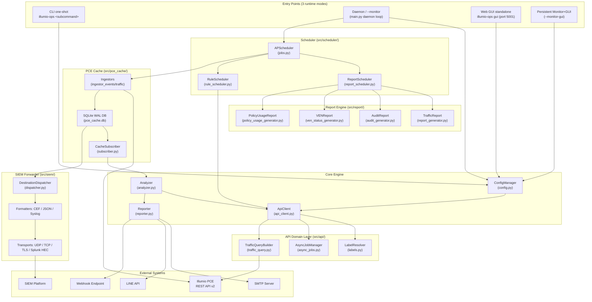
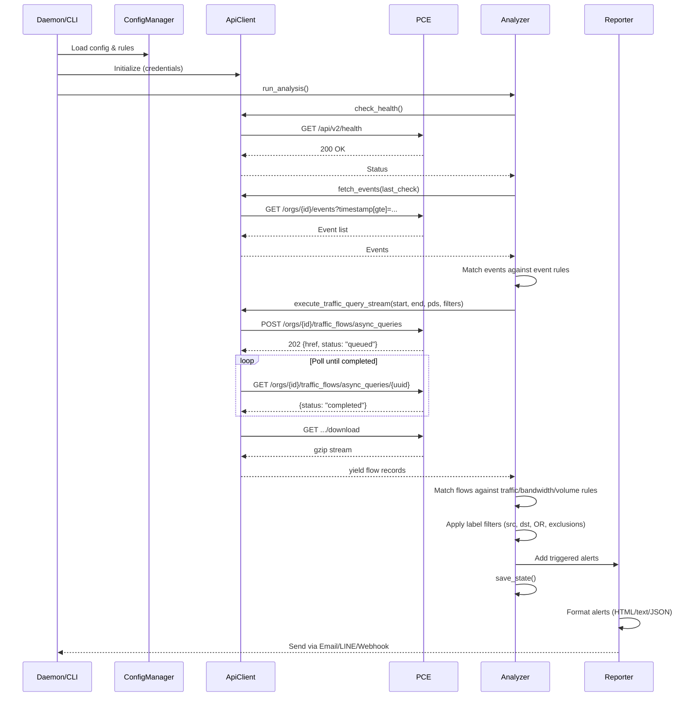

# Illumio PCE Ops — 專案架構與程式碼指南

<!-- BEGIN:doc-map -->
| Document | EN | 中文 |
|---|---|---|
| README | [README.md](../README.md) | [README_zh.md](../README_zh.md) |
| Installation | [Installation.md](./Installation.md) | [Installation_zh.md](./Installation_zh.md) |
| User Manual | [User_Manual.md](./User_Manual.md) | [User_Manual_zh.md](./User_Manual_zh.md) |
| Report Modules | [Report_Modules.md](./Report_Modules.md) | [Report_Modules_zh.md](./Report_Modules_zh.md) |
| Security Rules | [Security_Rules_Reference.md](./Security_Rules_Reference.md) | [Security_Rules_Reference_zh.md](./Security_Rules_Reference_zh.md) |
| SIEM Integration | [SIEM_Integration.md](./SIEM_Integration.md) | [SIEM_Integration_zh.md](./SIEM_Integration_zh.md) |
| Architecture | [Architecture.md](./Architecture.md) | [Architecture_zh.md](./Architecture_zh.md) |
| PCE Cache | [PCE_Cache.md](./PCE_Cache.md) | [PCE_Cache_zh.md](./PCE_Cache_zh.md) |
| API Cookbook | [API_Cookbook.md](./API_Cookbook.md) | [API_Cookbook_zh.md](./API_Cookbook_zh.md) |
| Glossary | [Glossary.md](./Glossary.md) | [Glossary_zh.md](./Glossary_zh.md) |
| Troubleshooting | [Troubleshooting.md](./Troubleshooting.md) | [Troubleshooting_zh.md](./Troubleshooting_zh.md) |
<!-- END:doc-map -->

> **[English](Architecture.md)** | **[繁體中文](Architecture_zh.md)**

---

## 閱讀指引

本文件偏長，請依角色挑選路徑：

| 您是… | 請看 |
|---|---|
| **Illumio 新手** — 想理解 workload、label、policy、enforcement | [Background](#background--illumio-平台)（5 段短小節）→ 接著看[詞彙表](Glossary_zh.md)，其餘章節可略過。 |
| **運維 / SRE** — 想建立工具如何搬資料的心智模型 | [§1 系統架構概觀](#1-系統架構概觀)（Mermaid 圖 + 5-box 概念流程）、[§4 Data Flow Diagram](#4-data-flow-diagram)。 |
| **維護者 / 二開者** — 即將動程式碼 | [§2 Directory Structure](#2-directory-structure)、[§3 Module Deep Dive](#3-module-deep-dive)、[§6 How to Modify This Project](#6-how-to-modify-this-project)。 |

若您想找的是「怎麼安裝、怎麼跑報表、怎麼設定 SIEM」這類步驟性任務，本文件不是合適的入口 — 請見 [README §文件](../README_zh.md#文件--依角色) 的依角色導引。

---

## Background — Illumio 平台

> 摘錄自 Illumio 官方文件 25.4（Admin Guide 及 REST API Guide）。本背景章節為後續實作細節章節提供基礎知識。

### Background.1 PCE 與 VEN

Illumio 平台的核心是 **Policy Compute Engine（PCE）**：一個伺服器端元件，負責計算並將安全策略分發至每一個受管 workload。對每個 workload，PCE 衍生出量身訂製的規則集，並將其推送至駐留於該 workload 的強制執行代理程式 —— **Virtual Enforcement Node**（**VEN**）。PCE 內部跨越四個服務層 —— Front End、Processing、Service/Caching 及 Persistence —— 共同提供管理介面、認證、流量聚合及資料庫儲存功能。

**Virtual Enforcement Node（VEN）** 是一個輕量級的多行程應用程式，直接執行於 workload（裸機伺服器、虛擬機器或容器）之上。安裝後，VEN 與主機的原生網路介面及 OS 層防火牆互動，以收集流量資料並執行從 PCE 接收的安全策略。VEN 對原生防火牆機制進行程式設定：Linux 上使用 `iptables`/`nftables`，Solaris 上使用 `pf`/`ipfilter`，Windows 上使用 Windows Filtering Platform。其設計目標是在背景中保持閒置，僅在計算或套用規則時消耗 CPU，同時定期彙總流量遙測並回報給 PCE。

**支援的 VEN 平台**（25.4）：Linux（RHEL 5/7/8、CentOS 8、Debian 11、SLES 11 SP2、IBM Z 大型主機搭配 RHEL 7/8）、Windows（Server 2012/2016、Windows 10 64-bit）、AIX、Solaris（最高 11.4 / Oracle Exadata）、macOS（僅限 Illumio Edge），以及容器化 VEN（C-VEN），適用於 Kubernetes、OpenShift、Docker、ContainerD 及 CRI-O。

**VEN–PCE 通訊**全程使用 TLS。內部部署：VEN 連接至 PCE 的 TCP 8443（HTTPS）及 TCP 8444（長連線 TLS-over-TCP lightning-bolt 通道）。SaaS：兩個通道均使用 TCP 443。VEN 每 5 分鐘發送一次心跳，每 10 分鐘發送一次彙總流量記錄。PCE 透過 lightning-bolt 通道下推新的防火牆規則及即時策略更新訊號；若該通道不可用，更新會退回至下一次心跳回應時處理。

### Background.2 Label 維度

Illumio 使用四維度 label 系統，將 workload 身份從 IP 位址中抽象出來。Label 是附加於 workload 的鍵值中繼資料，PCE 利用這些資料計算策略範圍。

| 維度 | 鍵 | 用途 | 範例值 |
|-----------|-----|---------|----------------|
| Role | `role` | Workload 在其應用程式中的功能 | `web`、`database`、`cache` |
| Application | `app` | 業務應用程式或服務 | `HRM`、`SAP`、`Storefront` |
| Environment | `env` | SDLC 階段 | `production`、`staging`、`development`、`QA` |
| Location | `loc` | 實體或邏輯地理位置 | `aws-east1`、`dc-frankfurt`、`rack-3` |

Label 透過配對設定檔（VEN 安裝時）、PCE Web 主控台手動指派、REST API 更新、批次 CSV 匯入，或容器 Workload Profile（用於 Kubernetes/OpenShift Pod）等方式套用至 workload。一旦指派，label 便會流向 ruleset 範圍及安全規則：指定 `role=web, env=production` 的規則，恰好適用於所有攜帶這兩個 label 值的 workload，而無論其 IP 位址為何。

在 `illumio-ops` 中，label 出現於 `Workload` 模型、報表表格（policy usage、流量分析）以及 SIEM 事件豐富化 pipeline 中。`src/api/` 領域類別從 PCE 擷取 label 定義，並將其快取至 SQLite 以供離線解析。

### Background.3 Workload 類型

PCE 將 workload 分為三大類：

**受管 workload** 已安裝並與 PCE 配對 VEN。在 PCE REST API 中，它們以 `workload` 物件的形式出現，`managed: true`，並包含 `ven` 屬性區塊，追蹤 VEN 版本、作業狀態、心跳時間戳記及策略同步狀態。受管 workload 可置於四種強制模式的任一種，並向 PCE 回報即時流量遙測。

**非受管 workload** 是沒有安裝 VEN 的網路實體（筆記型電腦、設備、IP 頻繁變動的系統、PKI/Kerberos 端點）。它們在 PCE 中以 `workload` 物件的形式表示，`managed: false`。管理員透過 Web 主控台、REST API 或批次 CSV 匯入手動建立。非受管 workload 可以被標記 label 並在安全規則中作為 provider/consumer 使用，但不會向 PCE 回報流量或處理資料。

**容器 workload** 代表透過 Illumio Kubelink 監控的 Kubernetes 或 OpenShift Pod。單一 VEN 安裝於容器主機節點，而非個別容器內部。PCE 為運行中的 Pod 建立 `container_workload` 物件，並為 `container_workload_profile` 物件定義新 Pod 啟動時如何被標記 label 及配對。這意味著容器化應用程式的策略，與 VM 及裸機的策略使用相同的基於 label 的 ruleset 模型來表達。

### Background.4 Policy 生命週期

PCE 中的策略物件 —— 包括 ruleset、IP list、enforcement boundary，以及相關的服務與 label group 定義 —— 在對任何 workload 生效前，需經過三個不同的狀態：

1. **Draft**：任何對策略物件的寫入操作（建立、更新或刪除）首先落入 Draft 狀態，對強制執行層不可見。在明確的佈建（Provision）操作發生之前，任何受管 workload 上的防火牆組態都不會變更，讓資安團隊擁有一個安全的環境來暫存及驗證複雜的分段變更。

2. **Pending**：儲存後，累積的草稿編輯會轉換為 Pending 狀態，形成等待審查的變更佇列。從此暫存區域，管理員可以檢查完整的差異、選擇性地還原項目、驗證共同佈建需求，並在提交前執行影響分析。

3. **Active**：明確的佈建操作將 Pending 中的變更提升至 Active。PCE 隨後重新計算完整的策略圖，並透過加密控制通道將更新後的防火牆規則分發至每個受影響的 VEN。每個佈建事件均標記時間戳記、負責人及受影響的 workload 數量，以支援稽核和回滾工作流程。

`illumio-ops` 中的 `compute_draft` 邏輯（參見 `Security_Rules_Reference.md` — R01–R05 規則）在佈建前從 PCE 讀取 Draft 狀態的規則，以評估策略意圖，在策略進入 Active 狀態前顯示差距。

### Background.5 強制模式

VEN 的策略狀態決定了 PCE 計算的規則如何套用至 workload 的 OS 防火牆。共有四種模式：

| 模式 | 是否封鎖流量？ | 日誌行為 |
|------|-----------------|-------------------|
| **Idle** | 否 — 強制執行已關閉；VEN 處於休眠狀態 | 僅快照（狀態 "S"）；不匯出至 syslog/Fluentd |
| **Visibility Only** | 否 — 僅被動監控 | 可設定：Off / Blocked（低）/ Blocked+Allowed（高）/ Enhanced Data Collection（含位元組計數） |
| **Selective** | 僅封鎖違反已設定 Enforcement Boundary 的流量 | 與 Visibility Only 相同的四種日誌層級 |
| **Full** | 任何未被允許清單規則明確允許的流量 | 與 Visibility Only 相同的四種日誌層級；Illumio 採用 default-deny / zero-trust |

Selective 模式讓管理員在僅觀察其餘流量的同時，對特定網路區段實施強制執行 —— 這是逐步強化應用程式時常見的過渡狀態。Full 模式是生產環境微分段的目標狀態。

`illumio-ops` 在 policy usage 報表中顯示每個 workload 的強制模式，R 系列規則（參見 `Security_Rules_Reference.md` §R02–R04）會標記在生產環境中仍處於 Idle 或 Visibility Only 的 workload。

> **參考資料：** Illumio Admin Guide 25.4（`Admin_25_4.pdf`）。

---

## 1. 系統架構概觀

### 1.0 30 秒心智模型

在進入完整圖之前，先以五個方塊呈現概念流程：

```text
   ┌──────────────┐      ┌──────────────┐      ┌──────────────────────────────┐
   │  Illumio PCE │ ───► │  PCE 快取    │ ───► │  消費端                      │
   │  (REST API)  │ poll │  (SQLite WAL)│ read │  • 報表（HTML/CSV）          │
   └──────────────┘      └──────────────┘      │  • 警示（Email/LINE/Webhook）│
                                ▲              │  • SIEM（CEF/JSON/HEC）      │
                                │              │  • Web GUI（即時儀表板）     │
                                │              └──────────────────────────────┘
                          ingestor 由排程器
                          （APScheduler）驅動
```

快取將 PCE 輪詢與報表 / 警示 / SIEM 消費端解耦。若停用快取（`pce_cache.enabled=false`），報表會回退到即時 API 查詢；啟用時警示與 SIEM 也會以快取為來源。

下面的 Mermaid 圖以實際元件呈現相同流程。



**執行模式**：支援三種啟動模式：（1）**CLI one-shot**（`illumio-ops <subcommand>`）用於互動式及腳本化操作；（2）**Daemon**（`--monitor` 或 `--monitor-gui`），在 `src/scheduler/jobs.py` 中啟動 APScheduler 迴圈，進行持續監控、排程報表及規則自動化；（3）**Web GUI 獨立模式**（`illumio-ops gui`），僅啟動 Flask 應用程式，監聽 port 5001。

**資料流**：進入點 → `ConfigManager`（載入規則/憑證）→ `ApiClient`（透過領域層 `src/api/` 查詢 PCE）→ `Analyzer`（根據回傳資料評估規則）→ `Reporter`（派送告警）。當快取啟用時，`CacheSubscriber`（`src/pce_cache/subscriber.py`）將 SQLite WAL 快取中預先擷取的資料送入 `Analyzer`，而非每次進行即時 API 呼叫，將監控週期延遲降低至 30 秒。

**排程流程**：`APScheduler`（`src/scheduler/jobs.py`）驅動所有定時任務。`ReportScheduler.tick()` 評估 cron 排程 → 派送至報表產生器 → 以電子郵件寄送結果。`RuleScheduler.check()` 評估週期性/一次性排程 → 切換 PCE 規則 → 佈建變更。

**SIEM 轉發器**：`src/siem/dispatcher.py` 從 PCE 快取（`siem_dispatch` 表）讀取資料，並透過可插拔的格式化器（CEF、JSON-line、RFC-5424 Syslog）及傳輸協議（UDP、TCP、TLS、Splunk HEC）將事件/流量轉發至外部 SIEM 平台。

---
## 2. 目錄結構

```text
illumio-ops/
├── illumio-ops.py         # 進入點 — 匯入並呼叫 src.main.main()
├── requirements.txt       # Python 相依套件
│
├── config/
│   ├── config.json            # 執行期設定（憑證、規則、告警、設定）
│   ├── config.json.example    # 設定範本範例
│   └── report_config.yaml     # Security Findings 規則閾值
│
├── src/
│   ├── __init__.py            # 套件初始化，匯出 __version__
│   ├── main.py                # CLI 引數解析器、daemon/GUI 協調、互動式選單
│   ├── api_client.py          # ApiClient facade（~765 LOC）：HTTP 核心 + 所有公開方法的委派包裝器
│   ├── api/                   # API 領域類別（由 ApiClient facade 組合）
│   │   ├── labels.py          # LabelResolver：label/IP-list/service TTL 快取管理
│   │   ├── async_jobs.py      # AsyncJobManager：非同步查詢作業生命週期 + 狀態持久化
│   │   └── traffic_query.py   # TrafficQueryBuilder：流量 payload 建構 + 串流
│   ├── cli/                   # 向 illumio-ops 進入點註冊的 Click 子命令群組
│   │   ├── cache.py           # cache backfill / status / retention 子命令
│   │   ├── config.py          # config show / set 子命令
│   │   ├── monitor.py         # monitor daemon 子命令
│   │   ├── report.py          # report generate 子命令
│   │   ├── root.py            # 根 click 群組 + version 旗標
│   │   └── ...                # siem.py、workload.py、gui_cmd.py、rule.py、status.py
│   ├── events/                # 事件 pipeline — 輪詢、匹配、正規化
│   │   ├── poller.py          # EventPoller：基於水位線的輪詢，具有去重語意
│   │   ├── catalog.py         # KNOWN_EVENT_TYPES 基準（廠商 + 本地擴充）
│   │   ├── matcher.py         # matches_event_rule()：正規表示式/管道/否定匹配
│   │   ├── normalizer.py      # 正規化事件欄位擷取
│   │   ├── shadow.py          # 舊版與當前匹配器的診斷比較器
│   │   ├── stats.py           # 派送歷史 + 事件時間軸追蹤
│   │   └── throttle.py        # 每規則告警節流狀態
│   ├── pce_cache/             # PCE 快取層（SQLite WAL）— 完整說明見 [PCE 快取](PCE_Cache_zh.md)
│   │   ├── subscriber.py      # CacheSubscriber：每消費者游標，快取啟用時送入 Analyzer
│   │   ├── ingestor_events.py # 將 PCE 稽核事件寫入快取
│   │   ├── ingestor_traffic.py# 將流量記錄寫入快取
│   │   ├── reader.py          # 查詢快取資料的讀取端輔助工具
│   │   ├── backfill.py        # BackfillRunner：歷史範圍回填
│   │   ├── aggregator.py      # 每日流量彙總（pce_traffic_flows_agg）
│   │   ├── lag_monitor.py     # APScheduler 任務：當 ingestor 停頓時發出警告
│   │   ├── models.py          # 所有快取表的 SQLAlchemy ORM 模型
│   │   ├── rate_limiter.py    # 令牌桶速率限制器（跨 ingestor 共享）
│   │   ├── retention.py       # 每日清除工作程序
│   │   ├── schema.py          # init_schema() — 建立表格 / 執行遷移
│   │   ├── traffic_filter.py  # 後擷取流量取樣
│   │   ├── watermark.py       # ingestion_watermarks CRUD
│   │   └── web.py             # /api/cache/* endpoints 的 Flask Blueprint
│   ├── scheduler/             # APScheduler 整合
│   │   └── jobs.py            # 任務可呼叫物件：run_monitor_cycle、報表任務、擷取任務
│   ├── siem/                  # SIEM 轉發器 — 可插拔格式化器與傳輸協議
│   │   ├── dispatcher.py      # DestinationDispatcher：讀取 siem_dispatch 佇列，以重試 + DLQ 方式派送
│   │   ├── dlq.py             # 死信佇列輔助工具
│   │   ├── preview.py         # 預覽格式化器輸出，用於測試
│   │   ├── tester.py          # send_test_event()：合成事件端對端測試
│   │   ├── web.py             # /api/siem/* endpoints 的 Flask Blueprint
│   │   ├── formatters/        # 可插拔日誌格式化器
│   │   │   ├── base.py        # 格式化器 ABC
│   │   │   ├── cef.py         # ArcSight CEF 格式
│   │   │   ├── json_line.py   # JSON-line 格式
│   │   │   └── syslog_header.py # RFC-5424 標頭輔助工具
│   │   └── transports/        # 可插拔輸出傳輸協議
│   │       ├── base.py        # 傳輸協議 ABC
│   │       ├── syslog_udp.py  # UDP syslog
│   │       ├── syslog_tcp.py  # TCP syslog
│   │       ├── syslog_tls.py  # TLS syslog
│   │       └── splunk_hec.py  # Splunk HTTP Event Collector
│   ├── analyzer.py            # 規則引擎：流量匹配、指標計算、狀態管理
│   ├── reporter.py            # 告警聚合與多通道派送
│   ├── config.py              # 設定載入、儲存、規則 CRUD、原子寫入
│   ├── exceptions.py          # 類型化例外階層：IllumioOpsError → APIError/ConfigError/等
│   ├── interfaces.py          # typing.Protocol 定義：IApiClient、IReporter、IEventStore
│   ├── href_utils.py          # 正規 extract_id(href) 輔助工具
│   ├── loguru_config.py       # 中央 loguru 設定：輪替檔案 + TTY 主控台 + 選用 JSON SIEM sink
│   ├── gui.py                 # Flask Web 應用程式（~40 個 JSON API endpoints）、登入速率限制、CSRF synchronizer token
│   ├── settings.py            # 規則/告警設定的 CLI 互動式選單
│   ├── report_scheduler.py    # 排程報表產生與電子郵件交付
│   ├── rule_scheduler.py      # Policy 規則自動化（週期性/一次性排程、佈建）
│   ├── rule_scheduler_cli.py  # rule scheduler 的 CLI 與 Web GUI 介面
│   ├── i18n.py                # 國際化字典（EN/ZH_TW）與語言切換；_I18nState 執行緒安全單例
│   ├── utils.py               # 輔助工具：日誌設定、ANSI 顏色、單位格式化、CJK 寬度；_InputState 執行緒安全單例
│   ├── templates/             # Web GUI 的 Jinja2 HTML 範本（SPA）
│   ├── static/                # CSS/JS 前端資產
│   └── report/                # 進階報表產生引擎
│       ├── report_generator.py        # 流量報表協調器（15 個模組 + Security Findings）
│       ├── audit_generator.py         # 稽核日誌報表協調器（4 個模組）
│       ├── ven_status_generator.py    # VEN 狀態清單報表
│       ├── policy_usage_generator.py  # Policy 規則使用率分析報表
│       ├── rules_engine.py            # 19 條自動化 Security Findings 規則（B/L 系列）
│       ├── snapshot_store.py          # Change Impact 的 KPI 快照儲存（reports/snapshots/）
│       ├── trend_store.py             # 趨勢 KPI 存檔（按報表類型）
│       ├── analysis/                  # 每模組分析邏輯
│       │   ├── mod01–mod15            # 流量分析模組
│       │   ├── mod_change_impact.py   # 將當前 KPI 與前次快照比較
│       │   ├── audit/                 # 稽核分析模組（audit_mod00–03）
│       │   └── policy_usage/          # Policy usage 模組（pu_mod00–05）
│       ├── exporters/                 # HTML、CSV 及 policy usage 匯出格式化器
│       └── parsers/                   # API 回應與 CSV 資料解析器
│
├── docs/                  # 文件（本檔案、使用者手冊、API Cookbook）
├── tests/                 # 單元測試（pytest）
├── logs/                  # 執行期日誌檔案（輪替，10MB × 5 備份）
│   └── state.json         # 持久狀態（last_check 時間戳記、alert_history）
├── reports/               # 產生的報表輸出目錄
└── deploy/                # 部署輔助工具（NSSM、systemd 設定）
```

---

## 3. 模組深入剖析

### 3.1 `api_client.py` — REST API 用戶端

**職責**：所有與 Illumio PCE 的 HTTP 通訊，僅使用 Python `urllib`（零外部相依性）。

| 方法 | API Endpoint | HTTP | 用途 |
|:---|:---|:---|:---|
| `check_health()` | `/api/v2/health` | GET | PCE 健康狀態 |
| `fetch_events()` | `/orgs/{id}/events` | GET | 安全稽核事件 |
| `execute_traffic_query_stream()` | `/orgs/{id}/traffic_flows/async_queries` | POST→GET→GET | 非同步流量查詢（三階段） |
| `fetch_traffic_for_report()` | （同一非同步 endpoint） | POST→GET→GET | 報表產生的流量查詢 |
| `get_labels()` | `/orgs/{id}/labels` | GET | 依鍵列出 label |
| `create_label()` | `/orgs/{id}/labels` | POST | 建立新 label |
| `get_workload()` | `/api/v2{href}` | GET | 擷取單一 workload |
| `update_workload_labels()` | `/api/v2{href}` | PUT | 更新 workload 的 label 集合 |
| `search_workloads()` | `/orgs/{id}/workloads` | GET | 依參數搜尋 workload |
| `fetch_managed_workloads()` | `/orgs/{id}/workloads` | GET | 所有受管 workload（VEN 報表） |
| `get_all_rulesets()` | `/orgs/{id}/sec_policy/.../rule_sets` | GET | 列出 ruleset（rule scheduler） |
| `get_active_rulesets()` | `/orgs/{id}/sec_policy/active/rule_sets` | GET | 活躍 ruleset（policy usage） |
| `toggle_and_provision()` | 多個 | PUT→POST | 啟用/停用規則並佈建 |
| `submit_async_query()` | `/orgs/{id}/traffic_flows/async_queries` | POST | 提交非同步流量查詢 |
| `poll_async_query()` | `.../async_queries/{uuid}` | GET | 輪詢查詢狀態直至完成 |
| `download_async_query()` | `.../async_queries/{uuid}/download` | GET | 下載 gzip 壓縮結果 |
| `batch_get_rule_traffic_counts()` | （並行非同步查詢） | POST→GET→GET | 批次每規則命中率分析 |
| `check_and_create_quarantine_labels()` | `/orgs/{id}/labels` | GET/POST | 確保隔離 label 集合存在 |
| `provision_changes()` | `/orgs/{id}/sec_policy` | POST | 佈建 draft → active |
| `has_draft_changes()` | `/orgs/{id}/sec_policy/pending` | GET | 檢查是否有待佈建的 draft 變更 |

**關鍵設計模式**：
- **指數退避重試**：對 `429`（速率限制）、`502/503/504`（伺服器錯誤）自動重試，最多 3 次，基礎間隔 2 秒
- **三階段非同步查詢執行**：提交 → 輪詢 → 下載模式，用於流量查詢；`batch_get_rule_traffic_counts()` 使用 `ThreadPoolExecutor`（最多 10 個並行）跨多個規則並行化三個階段
- **串流下載**：流量查詢結果（可能達 GB 級別）以 gzip 方式下載，在記憶體中解壓縮，並透過 Python 產生器逐行 yield —— O(1) 記憶體消耗
- **Label/Ruleset 快取**：內部快取（`label_cache`、`ruleset_cache`、`service_ports_cache`）避免批次操作期間的冗餘 API 呼叫
- **無外部相依性**：僅使用 `urllib.request`（不使用 `requests` 函式庫）

> **注意**：Illumio Core 25.2 已棄用同步流量查詢 API（`traffic_analysis_queries`）。本工具專門使用非同步 API（`async_queries`），支援最多 200,000 筆結果。

### 3.2 `analyzer.py` — 規則引擎

**職責**：根據使用者定義的規則評估 API 資料，支援彈性的篩選邏輯。

**核心函式**：

| 函式 | 用途 |
|:---|:---|
| `run_analysis()` | 主要協調：健康檢查 → 事件 → 流量 → 儲存狀態 |
| `check_flow_match()` | 根據規則的篩選條件評估單一流量記錄 |
| `_check_flow_labels()` | 根據規則篩選器匹配流量 label（src、dst、OR 邏輯、排除） |
| `_check_ip_filter()` | 根據 CIDR 範圍驗證 IP 位址（IPv4/IPv6） |
| `calculate_mbps()` | 混合頻寬計算，自動縮放單位 |
| `calculate_volume_mb()` | 混合方式的資料量計算 |
| `query_flows()` | Web GUI 流量分析器使用的通用查詢 endpoint |
| `run_debug_mode()` | 互動式診斷，顯示原始規則評估結果 |
| `_check_cooldown()` | 透過每規則最短重新告警間隔防止告警洪泛 |

**篩選匹配邏輯**：

Analyzer 支援流量規則的彈性篩選條件：

| 篩選欄位 | 邏輯 | 說明 |
|:---|:---|:---|
| `src_labels` + `dst_labels` | AND | 來源與目的地都必須匹配 |
| 僅 `src_labels` | 來源端 | 僅依來源 label 匹配 |
| 僅 `dst_labels` | 目的地端 | 僅依目的地 label 匹配 |
| `filter_direction: "src_or_dst"` | OR | 若來源或目的地任一匹配指定 label 則符合 |
| `ex_src_labels`、`ex_dst_labels` | 排除 | 排除匹配這些 label 的流量 |
| `src_ip`、`dst_ip` | CIDR 匹配 | IPv4/IPv6 位址篩選 |
| `ex_src_ip`、`ex_dst_ip` | 排除 | 排除來自/前往這些 IP 的流量 |
| `port`、`proto` | 服務匹配 | Port 及協定篩選 |

**狀態管理**（`state.json`）：
- `last_check`：最後一次成功檢查的 ISO 時間戳記 —— 作為事件查詢的錨點
- `history`：每規則匹配計數的滾動窗口（修剪至 2 小時）
- `alert_history`：每規則最後告警時間戳記，用於冷卻強制執行
- **原子寫入**：使用 `tempfile.mkstemp()` + `os.replace()` 防止當機時資料損毀

### 3.3 `reporter.py` — 告警派送器

**職責**：格式化並路由告警至已設定通道。

內部派送進入點：

| 方法 | 用途 |
|:---|:---|
| `send_alerts()` | 將四類告警（`health_alerts`、`event_alerts`、`traffic_alerts`、`metric_alerts`）路由至啟用的通道 |
| `send_report_email()` | 發送含單一附件的隨需報表 |
| `send_scheduled_report_email()` | 發送含多個附件及每個排程自訂收件人的排程報表 |

各通道的設定（Email/LINE/Webhook 啟用、payload schema、SMTP 環境變數覆寫）請見 [使用手冊 §4 警示通道](User_Manual_zh.md#4-警示通道) — 本節僅說明內部結構。

### 3.4 `config.py` — 設定管理器

**職責**：載入、儲存並驗證 `config.json`。

- **執行緒安全**：使用 **`threading.RLock`**（可重入鎖），防止遞迴載入/儲存週期或 Daemon 與 GUI 執行緒並行存取時發生死鎖。
- **深度合併**：使用者設定與預設值合併 —— 任何缺失欄位均會自動填入。
- **原子儲存**：先寫入 `.tmp` 檔案，再透過 `os.replace()` 確保當機安全。
- **密碼儲存**：Web GUI 密碼以 Argon2id 雜湊（`$argon2id$…`）儲存於 `config.json` 的 `web_gui.password`，由 `argon2-cffi` 產生（`time_cost=3`、`memory_cost=64MiB`、`parallelism=4`）。`src/config.py` 提供 `hash_password(plain)` 與 `verify_password(plain, stored)`；管理員手動填入的明文於下次 `_ensure_web_gui_secret()` 執行時自動雜湊。
- **規則 CRUD**：`add_or_update_rule()`、`remove_rules_by_index()`、`load_best_practices()`。
- **PCE Profile 管理**：`add_pce_profile()`、`update_pce_profile()`、`activate_pce_profile()`、`remove_pce_profile()`、`list_pce_profiles()` —— 支援多 PCE 環境與 profile 切換。
- **報表排程管理**：`add_report_schedule()`、`update_report_schedule()`、`remove_report_schedule()`、`list_report_schedules()`。

### 3.5 `gui.py` — Web GUI

**架構**：Flask 後端提供 ~40 個 JSON API endpoint，由 Vanilla JS 前端（`templates/index.html`）呼叫。

使用者可見的驗證行為（初始密碼產生、強制變更流程、可調整設定、rate limit / CSRF / TLS / IP 白名單 / 安全標頭），請見 [使用手冊 §3 Web GUI 安全性](User_Manual_zh.md#3-web-gui-安全性) — 該節為單一真相源。本節僅描述內部結構。

實作對照：

| 關注點 | 實作位置 |
|---|---|
| 登入速率限制 | `flask-limiter` `@limiter.limit("5 per minute")` 套用於 `/api/login` |
| CSRF | `flask-wtf` CSRFProtect；token 存於 Flask session，透過 `<meta name="csrf-token">` 暴露 |
| Session | `flask-login` strong 模式；簽章 cookie；`session_secret` 由 `_ensure_web_gui_secret()` 自動產生 |
| 強制變更閘 | `@app.before_request` 在 `must_change_password=true` 時回傳 HTTP 423（見 `src/gui/__init__.py:714`） |
| 安全標頭 | `gui.py` 的 `_init_security_middleware()` 初始化 `flask-talisman`。CSP 的 `script-src`、`style-src` 帶 `'unsafe-inline'`（不使用 nonce）以支援 GUI JS 動態注入的 inline event handler；XSS 風險由 CSRF 與所有動態 HTML 插入的 `escapeHtml`/`escapeAttr` 控制 |
| TLS 終結 | `cheroot` HTTPS server；未提供憑證時由 `src/web_gui/tls.py` 產生 |
| 執行緒模型（`--monitor-gui`） | Daemon 迴圈於獨立 `threading.Thread`；Flask 在主執行緒處理訊號 |

**關鍵 Endpoints**：

| 路由 | 方法 | 用途 |
|:---|:---|:---|
| `/api/login` | POST | Session 認證 |
| `/api/security` | GET/POST | 安全性設定（密碼、允許 IP） |
| `/api/status` | GET | 儀表板資料（健康狀態、統計、規則、冷卻） |
| `/api/event-catalog` | GET | 已翻譯的事件類型目錄 |
| `/api/rules` | GET | 列出所有規則 |
| `/api/rules/event` | POST | 建立事件規則 |
| `/api/rules/traffic` | POST | 建立流量規則 |
| `/api/rules/bandwidth` | POST | 建立頻寬規則 |
| `/api/rules/<idx>` | GET/PUT/DELETE | 依索引進行規則 CRUD |
| `/api/settings` | GET/POST | 讀取/寫入應用程式設定 |
| `/api/pce-profiles` | GET/POST | 多 PCE profile 管理（列出、新增、更新、刪除、啟用） |
| `/api/dashboard/queries` | GET/POST/DELETE | 已儲存查詢管理 |
| `/api/dashboard/snapshot` | GET | 最新流量報表快照 |
| `/api/dashboard/top10` | POST | 依頻寬/流量/連線數排序的前 10 筆流量 |
| `/api/quarantine/search` | POST | 含彈性篩選器的流量搜尋 |
| `/api/quarantine/apply` | POST | 套用隔離 label 至 workload |
| `/api/quarantine/bulk_apply` | POST | 批次隔離（並行，最多 5 個 worker） |
| `/api/workloads` | GET/POST | Workload 搜尋與清單 |
| `/api/reports/generate` | POST | 產生報表（流量/稽核/VEN/Policy Usage） |
| `/api/reports` | GET | 列出已產生的報表 |
| `/api/reports/<filename>` | DELETE | 刪除報表檔案 |
| `/api/reports/bulk-delete` | POST | 批次刪除報表 |
| `/api/audit_report/generate` | POST | 產生稽核報表 |
| `/api/ven_status_report/generate` | POST | 產生 VEN 狀態報表 |
| `/api/policy_usage_report/generate` | POST | 產生 policy usage 報表 |
| `/api/report-schedules` | GET/POST | 報表排程 CRUD |
| `/api/report-schedules/<id>` | PUT/DELETE | 更新/刪除排程 |
| `/api/report-schedules/<id>/toggle` | POST | 啟用/停用排程 |
| `/api/report-schedules/<id>/run` | POST | 觸發立即執行 |
| `/api/report-schedules/<id>/history` | GET | 排程執行歷史 |
| `/api/init_quarantine` | POST | 確保隔離 label 存在於 PCE |
| `/api/actions/run` | POST | 執行一次分析週期 |
| `/api/actions/debug` | POST | 執行除錯模式 |
| `/api/actions/test-alert` | POST | 發送測試告警 |
| `/api/actions/best-practices` | POST | 載入最佳實踐規則 |
| `/api/actions/test-connection` | POST | 測試 PCE 連線 |
| `/api/rule_scheduler/status` | GET | Rule scheduler 狀態 |
| `/api/rule_scheduler/rulesets` | GET | 瀏覽 PCE ruleset |
| `/api/rule_scheduler/rulesets/<id>` | GET | Ruleset 詳細資訊含規則 |
| `/api/rule_scheduler/schedules` | GET/POST | 規則排程 CRUD |
| `/api/rule_scheduler/schedules/<href>` | GET | 排程詳細資訊 |
| `/api/rule_scheduler/schedules/delete` | POST | 刪除規則排程 |
| `/api/rule_scheduler/check` | POST | 觸發排程評估 |

### 3.6 `i18n.py` — 國際化

**職責**：為所有 UI 文字提供翻譯字串。

- 包含 ~900+ 條目的字典，以 `{"en": {...}, "zh_TW": {...}}` 結構將鍵對應至翻譯
- `t(key, **kwargs)` 函式以當前語言及變數替換回傳字串
- 透過 `set_language("en"|"zh_TW")` 全域設定語言
- 涵蓋：CLI 選單、事件描述、告警範本、Web GUI label、報表術語、篩選 label、排程類型

### 3.7 `report_scheduler.py` — 報表排程器

**職責**：管理排程報表產生與電子郵件交付。

- 支援每日、每週及每月排程
- 產生 **4 種報表類型**：流量、稽核、VEN 狀態及 Policy Usage
- 每分鐘從 daemon 迴圈呼叫 `tick()` 以評估排程
- `run_schedule()` 根據報表類型派送至對應的產生器
- 以 HTML 附件形式透過電子郵件寄送報表，收件人可設定
- 透過 `_prune_old_reports()`（按 `retention_days` 自動清理）處理報表保留
- 排程時間以 UTC 儲存，依設定的時區顯示
- 狀態追蹤於 `logs/state.json` 的 `report_schedule_states` 中

### 3.8 `rule_scheduler.py` + `rule_scheduler_cli.py` — 規則排程器

**職責**：依排程自動化 PCE policy 規則的啟用/停用。

**排程類型**：
- **週期性**：在特定日期和時間窗口啟用/停用規則（例如，週一至週五 09:00–17:00）。支援跨午夜（例如，22:00–06:00）。
- **一次性**：啟用/停用規則直至特定到期日時間，之後自動還原。

**功能**：
- 瀏覽及搜尋所有 PCE ruleset 和個別規則
- 啟用或停用特定規則或整個 ruleset
- **Draft 保護**：多層檢查確保只有已佈建的規則被切換；防止對僅 draft 項目執行強制
- 佈建變更至 PCE（推送 draft → active）
- 互動式 CLI（`rule_scheduler_cli.py`），具分頁規則瀏覽功能
- `/api/rule_scheduler/*` 下的 Web GUI API endpoints
- 排程備註標籤新增至 PCE 規則描述（📅 週期性 / ⏳ 一次性）
- 日期名稱正規化（mon→monday 等）

### 3.9 `src/report/` — 進階報表引擎

**職責**：產生完整的安全分析報表。

| 元件 | 用途 |
|:---|:---|
| `report_generator.py` | 協調 15 個分析模組 + Security Findings，用於流量報表 |
| `audit_generator.py` | 協調 4 個模組，用於稽核日誌報表 |
| `ven_status_generator.py` | VEN 清單報表，以心跳為基礎進行線上/離線分類 |
| `policy_usage_generator.py` | Policy 規則使用率分析，含每規則命中計數 |
| `rules_engine.py` | 19 條自動化偵測規則（B001–B009、L001–L010），可設定閾值 |
| `analysis/mod01–mod15` | 流量分析模組（概觀、policy 決策、勒索軟體、遠端存取等） |
| `analysis/audit/` | 4 個稽核模組（主管摘要、健康事件、使用者活動、policy 變更） |
| `analysis/policy_usage/` | 4 個 policy usage 模組（主管、概觀、命中詳細、未使用詳細） |
| `exporters/` | HTML 範本渲染、CSV 匯出、policy usage HTML 匯出 |
| `parsers/` | API 回應解析（`api_parser.py`）、CSV 擷取（`csv_parser.py`）、資料驗證 |

**報表類型**：

| 報表 | 模組 | 說明 |
|:---|:---|:---|
| **流量** | 15 個模組（mod01–mod15）+ 19 條 Security Findings | 完整流量分析，含勒索軟體、遠端存取、跨環境、頻寬、橫向移動偵測 |
| **稽核** | 4 個模組（audit_mod00–03） | PCE 健康事件、使用者登入/認證、policy 變更追蹤 |
| **VEN 狀態** | 單一產生器 | VEN 清單，以心跳為基礎的線上/離線狀態（≤1h 閾值） |
| **Policy Usage** | 4 個模組（pu_mod00–03） | 每規則流量命中分析、未使用規則識別、主管摘要 |

**Policy Usage 報表**支援兩種資料來源：
- **API**：從 PCE 擷取活躍 ruleset，對每條規則並行執行三階段非同步查詢
- **CSV 匯入**：接受含預先計算流量計數的 Workloader CSV 匯出

**匯出格式**：HTML（主要）及 CSV ZIP（標準函式庫 `zipfile`，零外部相依性）。

### 3.10 `src/api/` — PCE API 領域層

**路徑**：`src/api/`
**進入點**：`labels.py`、`async_jobs.py`、`traffic_query.py`（均由 `api_client.py` 中的 `ApiClient` facade 組合）

這三個領域類別在 Phase 9 從 `ApiClient` 中提取，以將 facade 保持在可管理的大小。`ApiClient` 繼續擁有共享狀態（TTLCache、`_cache_lock`、作業追蹤字典），使現有的呼叫者和測試不受影響。

- `LabelResolver` — 具 TTL 快取及篩選正規化的 label/IP-list/service 查詢
- `AsyncJobManager` — PCE 非同步流量查詢的提交/輪詢/下載生命週期；將作業狀態持久化至 `state.json`，使作業在 daemon 重啟後得以存續
- `TrafficQueryBuilder` — 建構 Illumio workloader 風格的非同步查詢 payload；透過 gzip 串流支援最多 200,000 筆結果；透過 `ThreadPoolExecutor`（最多 10 個並行）驅動 `batch_get_rule_traffic_counts()`

### 3.11 `src/events/` — 事件 Pipeline

**路徑**：`src/events/`
**主要進入點**：`poller.py`（`EventPoller`）

提供安全的、基於水位線的 PCE 稽核事件輪詢，具去重語意。事件以固定間隔輪詢、正規化、與使用者定義的規則匹配，並派送至告警或 SIEM 轉發器。

- `poller.py` — 水位線游標、`event_identity()` 去重雜湊、時間戳記解析
- `catalog.py` — `KNOWN_EVENT_TYPES` 基準（廠商清單 + 本地觀察到的擴充）
- `matcher.py` — `matches_event_rule()`，支援精確匹配、管道 OR、正規表示式、否定（`!`）及萬用字元模式
- `normalizer.py` — 從原始 PCE 事件 JSON 提取正規欄位（resource type、actor、severity）
- `shadow.py` — 舊版與當前匹配器的診斷比較器（由 `/api/events/shadow_compare` 使用）
- `stats.py` — 派送歷史及事件時間軸追蹤，寫入 `state.json`
- `throttle.py` — 每規則告警節流狀態管理

### 3.12 `src/siem/` — SIEM 轉發器

**路徑**：`src/siem/`
**主要進入點**：`dispatcher.py`（`DestinationDispatcher`）

從 PCE 快取（`siem_dispatch` 表）讀取事件和流量，並將其轉發至外部 SIEM 平台。`web.py` 中的 Flask Blueprint 提供 `/api/siem/*` 設定和測試 endpoints。

格式化器（可透過設定插拔）：CEF（ArcSight）、JSON-line、RFC-5424 Syslog。
傳輸協議（可插拔）：UDP、TCP、TLS（均為 syslog）、Splunk HTTP Event Collector。

dispatcher 實作了指數退避重試（上限為 1 小時），並將失敗記錄路由至死信佇列（`dead_letter` 表，30 天後自動清除）。使用 `tester.py` 發送合成測試事件至目的地，而不污染真實資料。

### 3.13 `src/scheduler/` — APScheduler 整合

**路徑**：`src/scheduler/`
**主要進入點**：`jobs.py`

APScheduler `BackgroundScheduler` 的薄包裝層。包含所有由排程器派送的任務可呼叫物件，使個別任務函式可在不啟動完整 daemon 的情況下進行隔離測試。

- `run_monitor_cycle()` — 一次分析 + 告警派送週期（包裝 `Analyzer.run_analysis()` + `Reporter.send_alerts()`）
- 報表任務、ingestor 任務、快取延遲監控及規則排程器檢查均在此處註冊

排程器在 daemon 啟動期間於 `src/main.py` 中初始化。選用的 SQLAlchemy 任務儲存（設定中 `scheduler.persist = true`）可在 daemon 重啟後保持任務持久性。

### 3.14 `src/pce_cache/` — PCE 快取層

**路徑**：`src/pce_cache/`
**主要進入點**：`ingestor_events.py`、`ingestor_traffic.py`、`subscriber.py`

本機 SQLite（WAL 模式）資料庫，作為 PCE API、SIEM 轉發器及監控/分析子系統之間的共享緩衝區。完整說明請見 **[PCE 快取](PCE_Cache_zh.md)** —— 表格 schema、保留調整、快取未命中語意、回填及操作命令 CLI 均在該文件。

關鍵檔案：`models.py`（SQLAlchemy ORM）、`schema.py`（`init_schema()`）、`rate_limiter.py`（跨 ingestor 共享的令牌桶）、`watermark.py`（擷取游標 CRUD）、`retention.py`（每日清除）、`aggregator.py`（每日流量彙總）、`lag_monitor.py`（APScheduler 停頓偵測）。

---
## 4. 資料流圖



### 4.1 事件 Pipeline（`src/events/`）→ 告警 / SIEM

PCE 稽核事件遵循與流量記錄不同的獨立 pipeline：

```
PCE REST API
    ↓  EventPoller (src/events/poller.py)
    │  — watermark cursor in state.json
    │  — dedup via event_identity() SHA-256 hash
    ↓
EventNormalizer (src/events/normalizer.py)
    — extracts resource_type, actor, severity from raw JSON
    ↓
EventMatcher (src/events/matcher.py)
    — matches_event_rule(): regex/pipe-OR/negation/wildcard
    — shadow.py comparator available for diagnostics
    ↓
Reporter.send_alerts()               pce_cache (siem_dispatch table)
    — Email / LINE / Webhook              ↓
                                   DestinationDispatcher (src/siem/dispatcher.py)
                                      — Formatter: CEF / JSON / Syslog
                                      — Transport: UDP / TCP / TLS / Splunk HEC
                                      → External SIEM platform
```

當 `pce_cache.enabled = true` 時，監控器以 30 秒週期執行，僅讀取自上次 `CacheSubscriber` 游標位置以來插入的資料列，避免在每次週期中直接呼叫 PCE API。

### 4.2 JSON 快照儲存

每次流量報表執行後，`ReportGenerator` 寫入兩個 JSON 產物：

| 產物 | 路徑 | 用途 |
|---|---|---|
| 最新儀表板快照 | `reports/latest_snapshot.json` | Web GUI `/api/dashboard/snapshot` endpoint |
| KPI change-impact 快照 | `reports/snapshots/<type>/<YYYY-MM-DD>_<profile>.json` | `mod_change_impact.py` delta 計算 |

**命名慣例**：`<YYYY-MM-DD>_<profile>.json` —— 例如 `2026-04-28_security_risk.json`。相同日期 + profile 以原子方式覆寫（`.tmp` → `os.replace()`）。

**保留**：由 `config.json` 中的 `report.snapshot_retention_days` 控制（預設 **90**，範圍 1–3650）。`src/report/snapshot_store.py` 中的 `cleanup_old()` 刪除超過此閾值的快照；在每次報表執行結束時呼叫。

**Change Impact 計算**（`src/report/analysis/mod_change_impact.py`）：`compare()` 透過 `snapshot_store.read_latest()` 載入最近一次前次快照，然後根據較低或較高值是否理想，計算每個 KPI 的 delta（方向：improved / regressed / unchanged / neutral）。若 `previous_snapshot` 為 `None`（首次執行或所有快照已過期），模組回傳 `{"skipped": True, "reason": "no_previous_snapshot"}` —— 此保護措施防止 `previous_snapshot_at` 上的 `KeyError`，已在 commit `354ac0d` 中強化。

趨勢 KPI（用於圖表迷你走勢圖）儲存於獨立的 `src/report/trend_store.py` —— 每種報表類型一個 JSON 檔案，每次執行時追加，與快照儲存獨立。

### 4.3 報表產生 Pipeline

```
generate_from_api() / generate_from_csv()
    ↓
Parsers (src/report/parsers/)
    — api_parser.py: PCE response → DataFrame
    — csv_parser.py: Workloader CSV → DataFrame
    ↓
Analysis modules (src/report/analysis/)
    — mod01–mod15: traffic analysis (policy decisions, ransomware, remote access, …)
    — mod_change_impact.py: KPI delta vs previous snapshot
    — audit_mod00–03: health events, logins, policy changes
    — pu_mod00–05: policy usage executive, overview, hit detail, unused detail
    ↓
RulesEngine (src/report/rules_engine.py)
    — 19 detection rules: B001–B009 (baseline), L001–L010 (lateral)
    ↓
Exporters (src/report/exporters/)
    — html_exporter.py: Jinja2 → standalone HTML (inline CSS/JS)
    — policy_usage_html_exporter.py: policy usage HTML
    — CSV ZIP (stdlib zipfile)
    ↓
Output: reports/<timestamp>_<type>.<ext>
    + reports/snapshots/<type>/<date>_<profile>.json  (KPI snapshot)
    + reports/latest_snapshot.json                    (dashboard cache)
```

報表 HTML 檔案在報表標頭中嵌入彩色的資料來源標籤：**綠色** = 從本機 SQLite 快取提供；**藍色** = 即時 PCE API；**黃色** = 混合（部分快取 + API）。

---

## 5. 多 PCE Profile 架構

系統透過 profile 支援管理多個 PCE 實例：

```text
config.json
├── api: { url, org_id, key, secret }    ← 活躍 profile 憑證
├── active_pce_id: "production"           ← 當前活躍 profile 名稱
└── pce_profiles: [
      { name: "production", url: "...", org_id: 1, key: "...", secret: "..." },
      { name: "staging",    url: "...", org_id: 2, key: "...", secret: "..." }
    ]
```

- **Profile 切換**：`activate_pce_profile()` 將 profile 憑證複製至頂層 `api` 區段並重新初始化 `ApiClient`
- **GUI**：`/api/pce-profiles` endpoints 用於列出、新增、更新、刪除及啟用 profile
- **CLI**：透過設定選單進行互動式 profile 管理

---

## 6. 如何修改此專案

### 6.1 新增規則類型

1. **在 `settings.py` 中定義規則 schema** —— 建立新的 `add_xxx_menu()` 函式
2. **在 `analyzer.py` 中新增匹配邏輯** → `run_analysis()` —— 在流量迴圈中處理新類型
3. **在 `gui.py` 中新增 GUI 支援** —— 為規則類型建立新的 API endpoint
4. **在 `i18n.py` 中新增 i18n 鍵** —— 用於任何新的 UI 字串

### 6.2 新增告警通道

1. **在 `config.py` 中新增設定欄位** → `_DEFAULT_CONFIG["alerts"]`
2. **在 `reporter.py` 中實作傳送器** —— 建立 `_send_xxx()` 方法
3. **在 `reporter.py` 的 dispatcher 中註冊** → `send_alerts()` —— 新增新的通道檢查
4. **在 `gui.py` 中新增 GUI 設定** → `api_save_settings()` 及前端

### 6.3 新增 API Endpoint

1. **在 `api_client.py` 中新增方法** —— 遵循現有方法的模式
2. **URL 格式**：組織範圍的 endpoint 使用 `self.base_url`，全域 endpoint 使用 `self.api_cfg['url']/api/v2`
3. **錯誤處理**：回傳 `(status, body)` 元組，讓呼叫者處理特定狀態碼
4. **參考** `docs/REST_APIs_25_2.md` 以取得 endpoint schema

### 6.4 新增 i18n 語言

1. 在 `i18n.py` 的 `MESSAGES` 字典中新增頂層鍵（與 `"en"` 和 `"zh_TW"` 並列）
2. 在 `gui.py` 的設定 endpoint 中新增語言選項
3. 更新 `config.py` 預設值以包含新語言代碼
4. 更新 `i18n.py` 中的 `set_language()` 以接受新代碼

### 6.5 新增報表類型

1. **在 `src/report/` 中建立產生器** —— 遵循 `policy_usage_generator.py` 模式，具備 `generate_from_api()` 及 `export()` 方法
2. **在 `src/report/analysis/<type>/` 中建立分析模組** —— `pu_mod00_executive.py` 模式
3. **在 `src/report/exporters/` 中建立匯出器** —— HTML 及/或 CSV 匯出
4. **在 `report_scheduler.py` 中向排程器註冊** —— 在 `run_schedule()` 中新增派送案例
5. **在 `gui.py` 中新增 GUI endpoint** —— `api_generate_<type>_report()`
6. **在 `main.py` 中新增 CLI 選項** —— argparse `--report-type` 選項
7. **新增 i18n 鍵** —— 用於報表特定術語

---

## 延伸閱讀

- [PCE 快取](PCE_Cache_zh.md) — 快取層詳情：表格 schema、保留策略、回填、操作命令
- [API 手冊](API_Cookbook_zh.md) — REST API 模式：認證、分頁、非同步作業、9 個情境
- [User Manual](./User_Manual_zh.md) — 操作介面：CLI / GUI / Daemon / 報表 / SIEM
- [README](../README.md) — 專案入口與快速開始
