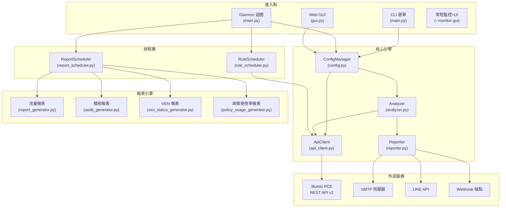
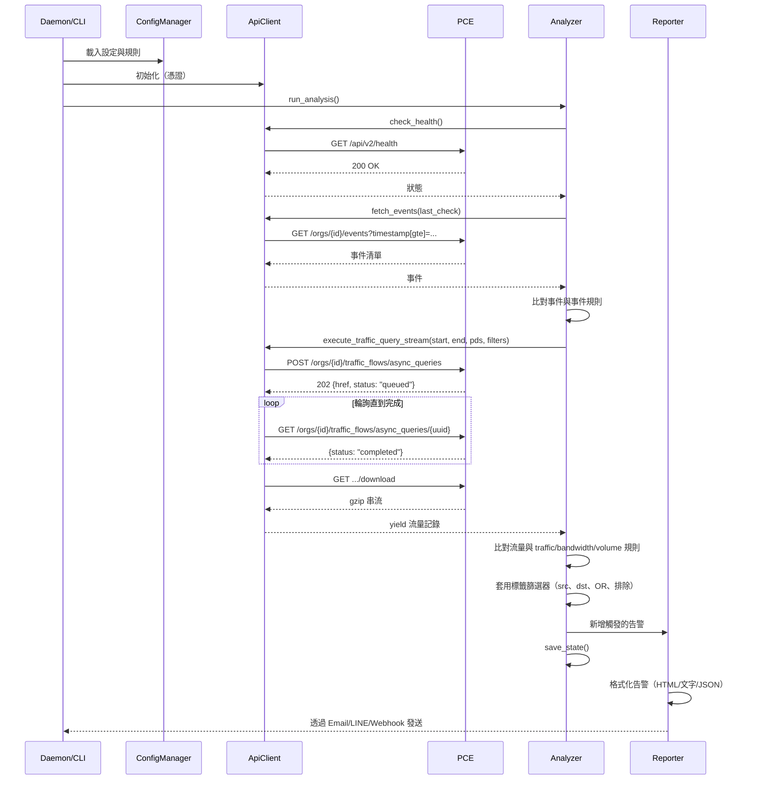
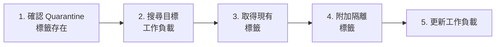
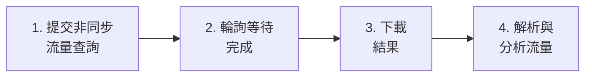
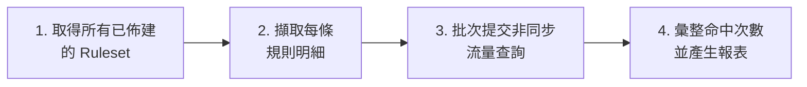
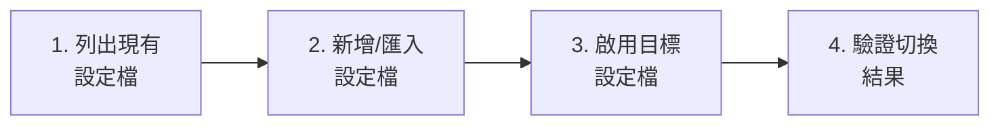

# Illumio PCE Ops — 專案架構與程式碼指南

<!-- BEGIN:doc-map -->
| Document | EN | 中文 |
|---|---|---|
| README | [README.md](../README.md) | [README_zh.md](../README_zh.md) |
| User Manual | [User_Manual.md](./User_Manual.md) | [User_Manual_zh.md](./User_Manual_zh.md) |
| Architecture | [Architecture.md](./Architecture.md) | [Architecture_zh.md](./Architecture_zh.md) |
| Security Rules | [Security_Rules_Reference.md](./Security_Rules_Reference.md) | [Security_Rules_Reference_zh.md](./Security_Rules_Reference_zh.md) |
<!-- END:doc-map -->

> **[English](Architecture.md)** | **[繁體中文](Architecture_zh.md)**

---

## 1. 系統架構概覽



**資料流向**：進入點 → `ConfigManager`（載入規則/憑證）→ `ApiClient`（查詢 PCE）→ `Analyzer`（比對規則與回傳資料）→ `Reporter`（發送告警）。啟用快取時，`CacheSubscriber`（`src/pce_cache/subscriber.py`）從 PCE 快取層讀取預先擷取的資料，直接提供給 `Analyzer`，取代即時 API 呼叫。

**排程流向**：`ReportScheduler.tick()` 評估排程 → 派送至報表產生器 → Email 寄送結果。`RuleScheduler.check()` 評估循環/一次性排程 → 切換 PCE 規則 → 部署變更。

---

## 2. 目錄結構

```text
illumio_ops/
├── illumio_ops.py         # 進入點 — 匯入並呼叫 src.main.main()
├── requirements.txt       # Python 相依套件
│
├── config/
│   ├── config.json            # 執行時設定（憑證、規則、告警、偏好設定）
│   ├── config.json.example    # 設定檔範本
│   └── report_config.yaml     # 安全發現規則閾值
│
├── src/
│   ├── __init__.py            # 套件初始化，匯出 __version__
│   ├── main.py                # CLI 參數解析、Daemon/GUI 執行序協調、互動選單
│   ├── api_client.py          # ApiClient Facade（~765 LOC）：HTTP 核心 + 所有公開方法的委派包裝
│   ├── api/                   # Phase 9 領域類別（由 ApiClient facade 組合）
│   │   ├── __init__.py
│   │   ├── labels.py          # LabelResolver：標籤/IP 列表/服務 TTL 快取管理
│   │   ├── async_jobs.py      # AsyncJobManager：非同步查詢工作生命週期 + 狀態持久化
│   │   └── traffic_query.py   # TrafficQueryBuilder：流量查詢負載建構 + 串流
│   ├── pce_cache/             # PCE 快取層（SQLite WAL）— 由 ingestor 寫入，供 Analyzer 讀取
│   │   ├── subscriber.py      # CacheSubscriber：每消費者游標，快取啟用時向 Analyzer 提供資料
│   │   ├── ingestor_traffic.py  # 將流量記錄寫入快取
│   │   ├── ingestor_events.py   # 將 PCE 事件寫入快取
│   │   └── reader.py          # 快取資料查詢的讀取端輔助函式
│   ├── analyzer.py            # 規則引擎：流量比對、指標計算、狀態管理
│   ├── reporter.py            # 告警聚合與多通道發送
│   ├── config.py              # 設定載入/儲存、規則 CRUD、原子寫入、PBKDF2 密碼雜湊
│   ├── exceptions.py          # 型別化例外階層：IllumioOpsError → APIError/ConfigError 等
│   ├── interfaces.py          # typing.Protocol 定義：IApiClient、IReporter、IEventStore
│   ├── href_utils.py          # 標準 extract_id(href) 輔助函式
│   ├── loguru_config.py       # 集中式 loguru 設定：輪轉檔案 + TTY 彩色控制台 + 可選 JSON SIEM sink
│   ├── gui.py                 # Flask Web 應用程式（約 40 個 JSON API 端點）、登入速率限制、CSRF Synchronizer Token
│   ├── settings.py            # CLI 互動選單（規則/告警設定）
│   ├── report_scheduler.py    # 排程報表產生與 Email 寄送
│   ├── rule_scheduler.py      # 政策規則自動化（循環/一次性排程、部署）
│   ├── rule_scheduler_cli.py  # 規則排程器的 CLI 與 Web GUI 介面
│   ├── i18n.py                # 國際化字典（EN/ZH_TW）與語言切換；_I18nState 執行緒安全單例
│   ├── utils.py               # 工具函式：日誌設定、ANSI 色碼、單位格式化、CJK 寬度；_InputState 執行緒安全單例
│   ├── templates/             # Jinja2 HTML 模板（Web GUI SPA）
│   ├── static/                # CSS/JS 前端資源
│   └── report/                # 進階報表產生引擎
│       ├── report_generator.py        # 流量報表編排器（15 模組 + 安全發現）
│       ├── audit_generator.py         # 稽核日誌報表編排器（4 模組）
│       ├── ven_status_generator.py    # VEN 狀態盤點報表
│       ├── policy_usage_generator.py  # 政策規則使用率分析報表
│       ├── rules_engine.py            # 19 條自動化安全發現規則（B/L 系列）
│       ├── analysis/                  # 各模組分析邏輯
│       │   ├── mod01–mod15            # 流量分析模組
│       │   ├── audit/                 # 稽核分析模組（audit_mod00–03）
│       │   └── policy_usage/          # 政策使用率模組（pu_mod00–03）
│       ├── exporters/                 # HTML、CSV 及政策使用率匯出格式器
│       └── parsers/                   # API 回應與 CSV 資料解析器
│
├── docs/                  # 文件（本文件、使用手冊、API Cookbook）
├── tests/                 # 單元測試 (pytest)
├── logs/                  # 執行時日誌（輪替，10MB × 5 備份）
│   └── state.json         # 持久化狀態（last_check 時間戳、告警歷史）
├── reports/               # 報表輸出目錄
└── deploy/                # 部署輔助腳本（NSSM、systemd 設定）
```

---

## 3. 各模組深度分析

### 3.1 `api_client.py` — REST API 客戶端

**職責**：與 Illumio PCE 的所有 HTTP 通訊，僅使用 Python `urllib`（零外部相依）。

| 方法 | API 端點 | HTTP | 用途 |
|:---|:---|:---|:---|
| `check_health()` | `/api/v2/health` | GET | PCE 健康狀態 |
| `fetch_events()` | `/orgs/{id}/events` | GET | 安全稽核事件 |
| `execute_traffic_query_stream()` | `/orgs/{id}/traffic_flows/async_queries` | POST→GET→GET | 非同步流量查詢（三階段） |
| `fetch_traffic_for_report()` | （同上非同步端點） | POST→GET→GET | 報表用流量查詢 |
| `get_labels()` | `/orgs/{id}/labels` | GET | 依 key 列出標籤 |
| `create_label()` | `/orgs/{id}/labels` | POST | 建立新標籤 |
| `get_workload()` | `/api/v2{href}` | GET | 取得單一工作負載 |
| `update_workload_labels()` | `/api/v2{href}` | PUT | 更新工作負載標籤集 |
| `search_workloads()` | `/orgs/{id}/workloads` | GET | 依參數搜尋工作負載 |
| `fetch_managed_workloads()` | `/orgs/{id}/workloads` | GET | 所有受管工作負載（VEN 報表用） |
| `get_all_rulesets()` | `/orgs/{id}/sec_policy/.../rule_sets` | GET | 列出規則集（規則排程器用） |
| `get_active_rulesets()` | `/orgs/{id}/sec_policy/active/rule_sets` | GET | 生效規則集（政策使用率用） |
| `toggle_and_provision()` | Multiple | PUT→POST | 啟用/停用規則並部署 |
| `submit_async_query()` | `/orgs/{id}/traffic_flows/async_queries` | POST | 提交非同步流量查詢 |
| `poll_async_query()` | `.../async_queries/{uuid}` | GET | 輪詢查詢狀態至完成 |
| `download_async_query()` | `.../async_queries/{uuid}/download` | GET | 下載 gzip 壓縮結果 |
| `batch_get_rule_traffic_counts()` | （並行非同步查詢） | POST→GET→GET | 批次逐規則命中分析 |
| `check_and_create_quarantine_labels()` | `/orgs/{id}/labels` | GET/POST | 確保隔離標籤集存在 |
| `provision_changes()` | `/orgs/{id}/sec_policy` | POST | 部署草稿 → 生效 |
| `has_draft_changes()` | `/orgs/{id}/sec_policy/pending` | GET | 檢查待處理草稿變更 |

**關鍵設計模式**：
- **指數退避重試**：遇到 `429`（速率限制）、`502/503/504`（伺服器錯誤）自動重試，最多 3 次，基底間隔 2 秒
- **三階段非同步查詢**：Submit → Poll → Download 模式；`batch_get_rule_traffic_counts()` 透過 `ThreadPoolExecutor` 並行化三個階段（最多 10 個並行工作者）
- **串流下載**：流量查詢結果（可能數 GB）以 gzip 下載，在記憶體中解壓縮，透過 Python 生成器逐行 yield — O(1) 記憶體消耗
- **標籤/規則集快取**：內部快取（`label_cache`、`ruleset_cache`、`service_ports_cache`）避免批次操作時重複 API 呼叫
- **無外部相依**：僅使用 `urllib.request`（不需要 `requests` 函式庫）

> **注意**：Illumio Core 25.2 已棄用同步流量查詢 API（`traffic_analysis_queries`）。本工具專門使用非同步 API（`async_queries`），支援最多 200,000 筆結果。

### 3.2 `analyzer.py` — 規則引擎

**職責**：根據使用者定義的規則評估 API 資料，支援彈性篩選邏輯。

**核心函式**：

| 函式 | 用途 |
|:---|:---|
| `run_analysis()` | 主流程編排：健康檢查 → 事件 → 流量 → 儲存狀態 |
| `check_flow_match()` | 評估單一流量記錄是否符合規則的篩選條件 |
| `_check_flow_labels()` | 比對流量標籤與規則篩選器（src、dst、OR 邏輯、排除） |
| `_check_ip_filter()` | 驗證 IP 位址是否符合 CIDR 範圍（IPv4/IPv6） |
| `calculate_mbps()` | 混合頻寬計算含自動縮放單位 |
| `calculate_volume_mb()` | 資料量計算（同樣的混合方式） |
| `query_flows()` | Web GUI 流量分析器使用的通用查詢端點 |
| `run_debug_mode()` | 互動式診斷，顯示原始規則評估結果 |
| `_check_cooldown()` | 透過每規則最小重新告警間隔防止告警洪水 |

**篩選比對邏輯**：

分析器支援彈性的流量規則篩選條件：

| 篩選欄位 | 邏輯 | 說明 |
|:---|:---|:---|
| `src_labels` + `dst_labels` | AND | 來源和目的地都必須符合 |
| 僅 `src_labels` | 來源端 | 僅比對來源標籤 |
| 僅 `dst_labels` | 目的地端 | 僅比對目的地標籤 |
| `filter_direction: "src_or_dst"` | OR | 來源或目的地任一符合即可 |
| `ex_src_labels`、`ex_dst_labels` | 排除 | 排除符合這些標籤的流量 |
| `src_ip`、`dst_ip` | CIDR 比對 | IPv4/IPv6 位址篩選 |
| `ex_src_ip`、`ex_dst_ip` | 排除 | 排除來自/前往這些 IP 的流量 |
| `port`、`proto` | 服務比對 | 連接埠與協定篩選 |

**狀態管理** (`state.json`)：
- `last_check`：上次成功檢查的 ISO 時間戳 — 用作事件查詢的錨點
- `history`：每條規則的匹配計數滾動視窗（修剪至 2 小時）
- `alert_history`：每條規則的上次告警時間戳（冷卻機制）
- **原子寫入**：使用 `tempfile.mkstemp()` + `os.replace()` 防止當機時損壞

### 3.3 `reporter.py` — 告警發送器

**職責**：格式化並透過設定的通道發送告警。

**告警分類**：`health_alerts`、`event_alerts`、`traffic_alerts`、`metric_alerts`

**輸出格式**：
- **Email**：豐富的 HTML 表格，含色彩編碼的嚴重等級標章、嵌入式流量快照和自動縮放的頻寬單位。事件告警包含登入失敗的使用者名稱與 IP。
- **LINE**：純文字摘要（LINE API 字元限制）
- **Webhook**：原始 JSON 酬載（完整結構化資料供 SOAR 擷取）

**報表 Email 方法**：
| 方法 | 用途 |
|:---|:---|
| `send_alerts()` | 路由告警至設定的通道 |
| `send_report_email()` | 寄送隨選報表（單一附件） |
| `send_scheduled_report_email()` | 寄送排程報表（多附件、自訂收件人） |

### 3.4 `config.py` — 設定管理器

**職責**：載入、儲存和驗證 `config.json`。

- **執行緒安全**：使用 **`threading.RLock`**（重入鎖）防止在遞迴載入/儲存或 Daemon 與 GUI 執行緒同時存取時發生死結。
- **深度合併**：使用者設定覆蓋預設值 — 缺失欄位自動補齊。
- **原子儲存**：先寫至 `.tmp` 檔案，再透過 `os.replace()` 確保當機安全。
- **密碼雜湊**：`config.py` 中的 `hash_password()` 和 `verify_password()` 函式同時支援新的 PBKDF2 格式（前綴 `pbkdf2:`）和舊版 SHA256 格式。
- **規則 CRUD**：`add_or_update_rule()`、`remove_rules_by_index()`、`load_best_practices()`。
- **PCE 設定檔管理**：`add_pce_profile()`、`update_pce_profile()`、`activate_pce_profile()`、`remove_pce_profile()`、`list_pce_profiles()` — 支援多 PCE 環境的設定檔切換。
- **報表排程管理**：`add_report_schedule()`、`update_report_schedule()`、`remove_report_schedule()`、`list_report_schedules()`。

### 3.5 `gui.py` — Web GUI

**架構**：Flask 後端提供約 40 個 JSON API 端點，由 Vanilla JS 前端（`templates/index.html`）消費。

- **安全邊界**：所有路由強制要求登入驗證，並透過 `@app.before_request` 實作 IP 白名單過濾（支援 CIDR）。未經授權的請求回傳 401/403。
- **密碼雜湊**：密碼雜湊使用 **PBKDF2-HMAC-SHA256**，260,000 次迭代（Python `hashlib.pbkdf2_hmac`，僅使用標準函式庫）。舊版 SHA256 雜湊會在下次成功登入時自動升級。預設帳號密碼為 `illumio` / `illumio`，使用者應於首次登入後修改密碼。
- **登入速率限制**：記憶體內逐 IP 追蹤器，支援執行緒安全鎖定。每 60 秒視窗內最多 5 次嘗試；超過回傳 HTTP 429。
- **CSRF 防護**：使用 **Synchronizer Token Pattern**：Token 儲存在 Flask session 中，並透過 `<meta name="csrf-token">` 標籤注入 `index.html`。JavaScript 從 meta 標籤讀取 Token（非從 Cookie）。CSRF Cookie 已移除。
- **連線安全**：Session Cookies 經過加密簽署。`session_secret` 在首次執行時自動產生。
- **SMTP 密碼**：可透過 `ILLUMIO_SMTP_PASSWORD` 環境變數提供，優先於設定檔中的值。
- **執行緒模型 (--monitor-gui)**：Daemon 迴圈運行於獨立的 `threading.Thread` 中，而 Flask 應用程式佔用主執行緒。

**關鍵路由**：

| 路由 | 方法 | 用途 |
|:---|:---|:---|
| `/api/login` | POST | 登入驗證 |
| `/api/security` | GET/POST | 安全設定（密碼、IP 白名單） |
| `/api/status` | GET | Dashboard 資料（健康、統計、規則、冷卻） |
| `/api/event-catalog` | GET | 翻譯後的事件類型目錄 |
| `/api/rules` | GET | 列出所有規則 |
| `/api/rules/event` | POST | 建立事件規則 |
| `/api/rules/traffic` | POST | 建立流量規則 |
| `/api/rules/bandwidth` | POST | 建立頻寬規則 |
| `/api/rules/<idx>` | GET/PUT/DELETE | 規則 CRUD |
| `/api/settings` | GET/POST | 讀取/寫入應用程式設定 |
| `/api/pce-profiles` | GET/POST | 多 PCE 設定檔管理（列出、新增、更新、刪除、啟用） |
| `/api/dashboard/queries` | GET/POST/DELETE | 儲存的查詢管理 |
| `/api/dashboard/snapshot` | GET | 最新流量報表快照 |
| `/api/dashboard/top10` | POST | 依頻寬/流量/連線數的 Top-10 |
| `/api/quarantine/search` | POST | 彈性篩選的流量搜尋 |
| `/api/quarantine/apply` | POST | 對工作負載套用隔離標籤 |
| `/api/quarantine/bulk_apply` | POST | 批次隔離（並行，最多 5 工作者） |
| `/api/workloads` | GET/POST | 工作負載搜尋與盤點 |
| `/api/reports/generate` | POST | 產生報表（流量/稽核/VEN/政策使用率） |
| `/api/reports` | GET | 列出已產生報表 |
| `/api/reports/<filename>` | DELETE | 刪除報表檔案 |
| `/api/reports/bulk-delete` | POST | 批次刪除報表 |
| `/api/audit_report/generate` | POST | 產生稽核報表 |
| `/api/ven_status_report/generate` | POST | 產生 VEN 狀態報表 |
| `/api/policy_usage_report/generate` | POST | 產生政策使用率報表 |
| `/api/report-schedules` | GET/POST | 報表排程 CRUD |
| `/api/report-schedules/<id>` | PUT/DELETE | 更新/刪除排程 |
| `/api/report-schedules/<id>/toggle` | POST | 啟用/停用排程 |
| `/api/report-schedules/<id>/run` | POST | 立即觸發執行 |
| `/api/report-schedules/<id>/history` | GET | 排程執行歷史 |
| `/api/init_quarantine` | POST | 確保 PCE 上隔離標籤存在 |
| `/api/actions/run` | POST | 執行一次分析循環 |
| `/api/actions/debug` | POST | 執行除錯模式 |
| `/api/actions/test-alert` | POST | 發送測試告警 |
| `/api/actions/best-practices` | POST | 載入最佳實務規則 |
| `/api/actions/test-connection` | POST | 測試 PCE 連線 |
| `/api/rule_scheduler/status` | GET | 規則排程器狀態 |
| `/api/rule_scheduler/rulesets` | GET | 瀏覽 PCE 規則集 |
| `/api/rule_scheduler/rulesets/<id>` | GET | 規則集詳情含規則 |
| `/api/rule_scheduler/schedules` | GET/POST | 規則排程 CRUD |
| `/api/rule_scheduler/schedules/<href>` | GET | 排程詳情 |
| `/api/rule_scheduler/schedules/delete` | POST | 刪除規則排程 |
| `/api/rule_scheduler/check` | POST | 觸發排程評估 |

### 3.6 `i18n.py` — 國際化

**職責**：為所有 UI 文字提供翻譯字串。

- 包含約 900+ 筆字典，以 `{"en": {...}, "zh_TW": {...}}` 結構對應翻譯
- `t(key, **kwargs)` 函式回傳目前語言的字串，支援變數替換
- 語言透過 `set_language("en"|"zh_TW")` 全域設定
- 涵蓋：CLI 選單、事件說明、告警模板、Web GUI 標籤、報表用語、篩選標籤、排程類型

### 3.7 `report_scheduler.py` — 報表排程器

**職責**：管理排程報表產生與 Email 寄送。

- 支援每日、每週、每月排程
- 產生 **4 種報表類型**：流量、稽核、VEN 狀態、政策使用率
- `tick()` 由 daemon 迴圈每分鐘呼叫以評估排程
- `run_schedule()` 依報表類型派送至對應的產生器
- 以 HTML 附件方式 Email 寄送報表，可設定自訂收件人
- 透過 `_prune_old_reports()` 處理報表保留（依 `retention_days` 自動清理）
- 排程時間以 UTC 儲存，依設定時區顯示
- 狀態追蹤於 `logs/state.json` 的 `report_schedule_states` 下

### 3.8 `rule_scheduler.py` + `rule_scheduler_cli.py` — 規則排程器

**職責**：自動化 PCE 政策規則的排程啟用/停用。

**排程類型**：
- **循環 (Recurring)**：在特定日期和時間窗口啟用/停用規則（如 週一至週五 09:00–17:00）。支援跨午夜（如 22:00–06:00）。
- **一次性 (One-time)**：啟用/停用規則直到指定的到期日期時間，然後自動回復。

**功能**：
- 瀏覽並搜尋 PCE 上所有規則集與個別規則
- 啟用或停用特定規則或整個規則集
- **草稿保護**：多層檢查確保僅切換已部署的規則；防止對草稿專用項目進行強制執行
- 部署變更至 PCE（將草稿推送成生效）
- CLI 互動選單（`rule_scheduler_cli.py`）含分頁規則瀏覽
- Web GUI API 端點於 `/api/rule_scheduler/*` 下
- 排程備註標籤加入 PCE 規則說明（📅 循環 / ⏳ 一次性）
- 星期名稱正規化（mon→monday 等）

### 3.9 `src/report/` — 進階報表引擎

**職責**：產生全面的安全分析報表。

| 元件 | 用途 |
|:---|:---|
| `report_generator.py` | 編排 15 個分析模組 + 安全發現產生流量報表 |
| `audit_generator.py` | 編排 4 個模組產生稽核日誌報表 |
| `ven_status_generator.py` | VEN 盤點報表，以心跳為基礎的線上/離線分類 |
| `policy_usage_generator.py` | 政策規則使用率分析，含逐規則命中數 |
| `rules_engine.py` | 19 條自動化偵測規則（B001–B009、L001–L010），可設定閾值 |
| `analysis/mod01–mod15` | 流量分析模組（概覽、政策決策、勒索軟體、遠端存取等） |
| `analysis/audit/` | 4 個稽核模組（摘要、健康事件、使用者活動、政策變更） |
| `analysis/policy_usage/` | 4 個政策使用率模組（摘要、概覽、命中詳情、未使用詳情） |
| `exporters/` | HTML 模板渲染、CSV 匯出、政策使用率 HTML 匯出 |
| `parsers/` | API 回應解析（`api_parser.py`）、CSV 匯入（`csv_parser.py`）、資料驗證 |

**報表類型**：

| 報表 | 模組 | 說明 |
|:---|:---|:---|
| **流量** | 15 模組 (mod01–mod15) + 19 安全發現 | 全面流量分析含勒索軟體、遠端存取、跨環境、頻寬、橫向移動偵測 |
| **稽核** | 4 模組 (audit_mod00–03) | PCE 健康事件、使用者登入/驗證、政策變更追蹤 |
| **VEN 狀態** | 單一產生器 | VEN 盤點含線上/離線狀態（心跳 ≤1 小時閾值） |
| **政策使用率** | 4 模組 (pu_mod00–03) | 逐規則流量命中分析、未使用規則辨識、摘要 |

**政策使用率報表**支援兩種資料來源：
- **API**：從 PCE 取得生效規則集，並行執行三階段非同步查詢
- **CSV 匯入**：接受 Workloader CSV 匯出檔含預先計算的流量數

**匯出格式**：HTML（主要）和 CSV ZIP（stdlib `zipfile`，零外部相依）。

---

## 4. 資料流程圖



---

## 5. 多 PCE 設定檔架構

系統透過設定檔支援管理多個 PCE 實例：

```text
config.json
├── api: { url, org_id, key, secret }    ← 啟用中設定檔的憑證
├── active_pce_id: "production"           ← 目前啟用的設定檔名稱
└── pce_profiles: [
      { name: "production", url: "...", org_id: 1, key: "...", secret: "..." },
      { name: "staging",    url: "...", org_id: 2, key: "...", secret: "..." }
    ]
```

- **設定檔切換**：`activate_pce_profile()` 將設定檔憑證複製到頂層 `api` 區段並重新初始化 `ApiClient`
- **GUI**：`/api/pce-profiles` 端點用於列出、新增、更新、刪除和啟用設定檔
- **CLI**：透過設定選單進行互動式設定檔管理

---

## 6. 如何修改此專案

### 6.1 新增規則類型

1. 在 `settings.py` 中**定義規則結構** — 建立新的 `add_xxx_menu()` 函式
2. 在 `analyzer.py` → `run_analysis()` 中**新增比對邏輯** — 在流量迴圈中處理新類型
3. 在 `gui.py` 中**新增 GUI 支援** — 為新規則類型建立 API 端點
4. 在 `i18n.py` 中**新增 i18n 鍵值** — 為任何新的 UI 字串新增翻譯

### 6.2 新增告警通道

1. 在 `config.py` → `_DEFAULT_CONFIG["alerts"]` 中**新增設定欄位**
2. 在 `reporter.py` 中**實作發送器** — 建立 `_send_xxx()` 方法
3. 在 `reporter.py` → `send_alerts()` 中**註冊到分派器** — 加入新通道檢查
4. 在 `gui.py` 的 **GUI 設定**中 → `api_save_settings()` 和前端新增對應欄位

### 6.3 新增 API 端點

1. 在 `api_client.py` 中**新增方法** — 遵循現有方法的模式
2. **URL 格式**：org-scoped 端點使用 `self.base_url`，全域端點使用 `self.api_cfg['url']/api/v2`
3. **錯誤處理**：回傳 `(status, body)` 元組，讓呼叫端處理特定狀態碼
4. **參考** `docs/REST_APIs_25_2.md` 取得端點 Schema

### 6.4 新增 i18n 語言

1. 在 `i18n.py` 的 `MESSAGES` 字典中新增一個頂層 key（與 `"en"` 和 `"zh_TW"` 並列）
2. 在 `gui.py` → settings 端點中新增語言選項
3. 更新 `config.py` 預設值以包含新語言代碼
4. 更新 `i18n.py` 中的 `set_language()` 以接受新代碼

### 6.5 新增報表類型

1. 在 `src/report/` 中**建立產生器** — 參考 `policy_usage_generator.py` 模式，含 `generate_from_api()` 和 `export()` 方法
2. 在 `src/report/analysis/<type>/` 中**建立分析模組** — 參考 `pu_mod00_executive.py` 模式
3. 在 `src/report/exporters/` 中**建立匯出器** — HTML 及/或 CSV 匯出
4. 在 `report_scheduler.py` 中**註冊至排程器** — 在 `run_schedule()` 中新增派送案例
5. 在 `gui.py` 中**新增 GUI 端點** — `api_generate_<type>_report()`
6. 在 `main.py` 中**新增 CLI 選項** — argparse `--report-type` 選項
7. **新增 i18n 鍵值**用於報表特定用語

---

# 5. PCE Cache（待翻譯）

# PCE Cache

## What It Is

The PCE cache is an optional local SQLite database that stores a rolling window of PCE audit events and traffic flows. It acts as a shared buffer between:

- **SIEM Forwarder** — reads from cache to forward events off-box
- **Reports** (Phase 14) — reads from cache to avoid repeated PCE API calls
- **Alerts/Monitor** (Phase 15) — subscribes to cache for 30-second tick cadence

## Why Use It

Without the cache, every report generation and monitor tick makes direct PCE API calls. The PCE enforces a 500 req/min rate limit. With the cache:

- Ingestors use a shared token-bucket rate limiter (default 400/min)
- Reports and alerts read from SQLite (zero PCE API calls for cached ranges)
- Traffic sampler reduces `allowed` flow volume (default: keep all; set `sample_ratio_allowed=10` for 1-in-10)

## Enabling

Add to `config/config.json`:

```json
"pce_cache": {
  "enabled": true,
  "db_path": "data/pce_cache.sqlite",
  "events_retention_days": 90,
  "traffic_raw_retention_days": 7,
  "traffic_agg_retention_days": 90,
  "events_poll_interval_seconds": 300,
  "traffic_poll_interval_seconds": 3600,
  "rate_limit_per_minute": 400
}
```

The cache starts on the next `--monitor` or `--monitor-gui` start. First poll may take a few minutes depending on event volume.

## Table Reference

| Table | Retention column | Default TTL | Notes |
|---|---|---|---|
| `pce_events` | `ingested_at` | 90 days | Full event JSON + indexes on type/severity/timestamp |
| `pce_traffic_flows_raw` | `ingested_at` | 7 days | Raw flow per unique src+dst+port+first_detected |
| `pce_traffic_flows_agg` | `bucket_day` | 90 days | Daily rollup; idempotent UPSERT |
| `ingestion_watermarks` | — | permanent | Per-source cursor; survives restarts |
| `siem_dispatch` | — | — | SIEM outbound queue; sent rows auto-age out |
| `dead_letter` | `quarantined_at` | 30 days (via purge) | Failed SIEM sends after max retries |

## Disk Sizing

Rough estimate (gzip-compressed JSON):
- 1,000 events/day × 90 days × ~1 KB/event ≈ **90 MB** for `pce_events`
- 50,000 flows/day × 7 days × ~0.5 KB/flow ≈ **175 MB** for raw flows
- Aggregated flows are much smaller; ~5 MB/year typical

Tune `traffic_raw_retention_days` first if disk pressure appears.

## Retention Tuning

The retention worker runs daily and purges rows older than the configured TTL. To force a purge:

```bash
# Coming in Phase 14: illumio-ops cache retention --run-now
```

## Monitoring

Search loguru output for:
- `Events ingest: N rows inserted` — healthy ingest
- `Traffic ingest: N rows inserted` — healthy ingest
- `Cache retention purged:` — daily cleanup ran
- `Global rate limiter timeout` — PCE budget exhausted; lower `rate_limit_per_minute`

## Troubleshooting

| Symptom | Likely cause | Fix |
|---|---|---|
| `429` errors in log | PCE rate limit hit | Lower `rate_limit_per_minute` to 200–300 |
| DB growing fast | `traffic_raw_retention_days` too high | Drop to 3–5 days |
| Watermark not advancing | Events ingest error | Check log for `Events ingest failed` |
| Cache DB locked | Multiple processes | Ensure only one `--monitor` runs |

## Cache-miss semantics

When a report generator requests data for a time range, `CacheReader.cover_state()` returns one of three states:

- **`full`** — the entire range lies within the configured retention window; data is served from cache, no API call is made.
- **`partial`** — the range start precedes the retention cutoff but the end is within it; the generator falls back to the API for the full range.
- **`miss`** — the entire range predates the retention window; the generator falls back to the API.

### Backfill

To populate the cache for historical ranges use the CLI:

```bash
illumio-ops cache backfill --source events --since 2026-01-01 --until 2026-03-01
illumio-ops cache backfill --source traffic --since 2026-01-01 --until 2026-03-01
```

Backfill writes directly into `pce_events` / `pce_traffic_flows_raw`, bypassing the normal ingestor watermark. The retention worker will purge backfilled data on its next tick if it falls outside the configured retention window.

Check cache status and retention policy:

```bash
illumio-ops cache status
illumio-ops cache retention
```

### Data source indicator

Generated HTML reports display a colored pill in the report header indicating the data source:
- **Green** — data served from local cache
- **Blue** — data fetched from live PCE API
- **Yellow** — mixed (partial cache + API)

---

## Alerts on Cache

When `pce_cache.enabled = true`, the Analyzer subscribes to the PCE cache
via `CacheSubscriber` instead of querying the PCE API directly. This enables:

- **30-second alert latency** — the monitor tick drops from `interval_minutes`
  (default 10 min) to 30 seconds when cache is enabled.
- **No API budget impact** — each tick reads local SQLite only; PCE API calls
  happen only via the ingestor on its own schedule.

### How it works

```
PCE API  →  Ingestor  →  pce_cache.db
                              ↓
                        CacheSubscriber
                              ↓
                          Analyzer  →  Reporter  →  Alerts
```

Each consumer (analyzer) holds an independent cursor in the `ingestion_cursors`
table. On each 30-second tick, the Analyzer reads only rows inserted since the
last cursor position.

### Cache lag monitoring

A separate APScheduler job (`cache_lag_monitor`) runs every 60 seconds and
checks `ingestion_watermarks.last_sync_at`. If the ingestor has not synced
within `3 × max(events_poll_interval, traffic_poll_interval)` seconds, it
emits a `WARNING` log. If lag exceeds twice that threshold, it emits `ERROR`.
This catches ingestor stalls before alerts silently drift.

### Fallback

When `pce_cache.enabled = false` (default), every code path reverts to the
original PCE API behaviour. No configuration change is needed for existing
deployments.

---

# 6. PCE REST API 整合手冊

# Illumio PCE Ops — API 教學與 SIEM/SOAR 整合指南


> **[English](Architecture.md#8-pce-rest-api-integration-cookbook)** | **[繁體中文](Architecture_zh.md)**

本指南專為 **SIEM/SOAR 工程師** 設計，用於撰寫 Action、Playbook 或自動化腳本時參考。每個場景列出精確的 API 呼叫、參數和可直接複製的 Python 程式碼片段。

所有範例使用本專案 `src/api_client.py` 中的 `ApiClient` 類別。

---

## 快速設定

```python
from src.config import ConfigManager
from src.api_client import ApiClient

cm = ConfigManager()        # 載入 config.json
api = ApiClient(cm)          # 使用 PCE 憑證初始化
```

> **前置條件**：在 `config.json` 中設定有效的 `api.url`、`api.org_id`、`api.key` 和 `api.secret`。API 使用者需要適當的角色權限（見各場景說明）。

---

## 場景一：健康檢查 — 驗證 PCE 連線

**使用場景**：監控 Playbook 中的心跳檢測。
**所需角色**：任意（`read_only` 以上）

### API 呼叫

| 步驟 | 方法 | 端點 | 回應 |
|:---|:---|:---|:---|
| 1 | GET | `/api/v2/health` | `200 OK` = 健康 |

### Python 程式碼

```python
status, message = api.check_health()
if status == 200:
    print("PCE 連線正常")
else:
    print(f"PCE 健康檢查失敗: {status} - {message}")
```

---

## 場景二：工作負載隔離（Quarantine）

**使用場景**：事件回應 — 透過標記 Quarantine 標籤來隔離遭入侵的主機。
**所需角色**：`owner` 或 `admin`

### 操作流程



### 分步 API 呼叫

| 步驟 | 方法 | 端點 | 用途 |
|:---|:---|:---|:---|
| 1a | GET | `/orgs/{org_id}/labels?key=Quarantine` | 檢查 Quarantine 標籤是否存在 |
| 1b | POST | `/orgs/{org_id}/labels` | 建立缺失的標籤 (`{"key":"Quarantine","value":"Severe"}`) |
| 2 | GET | `/orgs/{org_id}/workloads?hostname=<目標>` | 尋找目標工作負載 |
| 3 | GET | `/api/v2{workload_href}` | 取得工作負載的現有標籤 |
| 4-5 | PUT | `/api/v2{workload_href}` | 更新標籤 = 現有標籤 + 隔離標籤 |

### 完整 Python 程式碼

```python
from src.config import ConfigManager
from src.api_client import ApiClient

cm = ConfigManager()
api = ApiClient(cm)

# --- 步驟 1：確認 Quarantine 標籤存在 ---
label_hrefs = api.check_and_create_quarantine_labels()
# 回傳: {"Mild": "/orgs/1/labels/XX", "Moderate": "/orgs/1/labels/YY", "Severe": "/orgs/1/labels/ZZ"}
print(f"Quarantine 標籤 href: {label_hrefs}")

# --- 步驟 2：搜尋目標工作負載 ---
results = api.search_workloads({"hostname": "infected-server-01"})
if not results:
    print("找不到工作負載！")
    exit(1)

target = results[0]
workload_href = target["href"]
print(f"找到工作負載: {target.get('name')} ({workload_href})")

# --- 步驟 3：取得現有標籤 ---
workload = api.get_workload(workload_href)
current_labels = [{"href": lbl["href"]} for lbl in workload.get("labels", [])]
print(f"現有標籤: {current_labels}")

# --- 步驟 4：附加 Quarantine 標籤 ---
quarantine_level = "Severe"  # 選擇: "Mild"（輕微）、"Moderate"（中度）、"Severe"（嚴重）
quarantine_href = label_hrefs[quarantine_level]
current_labels.append({"href": quarantine_href})

# --- 步驟 5：更新工作負載 ---
success = api.update_workload_labels(workload_href, current_labels)
if success:
    print(f"✅ 工作負載已隔離，等級: {quarantine_level}")
else:
    print("❌ 套用隔離標籤失敗")
```

> **SOAR Playbook 提示**：以上程式碼可包裝為單一 Action。輸入參數：`hostname`（字串）、`quarantine_level`（列舉：Mild/Moderate/Severe）。

---

## 場景三：流量分析查詢

**使用場景**：查詢過去 N 分鐘內被阻擋或異常的流量以進行調查。
**所需角色**：`read_only` 以上

> **重要變更（Illumio Core 25.2）**：同步流量查詢端點已棄用。本工具專用非同步查詢 (`async_queries`)，單次查詢最多支援 **200,000** 筆結果。所有範例均使用非同步 API。

### 操作流程

**標準（Reported 檢視）：** 3 步驟



**含草稿政策分析：** 4 步驟 — 在下載前呼叫 `update_rules`，解鎖隱藏欄位（`draft_policy_decision`、`rules`、`enforcement_boundaries`、`override_deny_rules`）。


### API 呼叫

| 步驟 | 方法 | 端點 | 用途 |
|:---|:---|:---|:---|
| 1 | POST | `/orgs/{org_id}/traffic_flows/async_queries` | 提交查詢 |
| 2 | GET | `/orgs/{org_id}/traffic_flows/async_queries/{uuid}` | 輪詢狀態 |
| 3 *(選用)* | PUT | `.../async_queries/{uuid}/update_rules` | 觸發草稿政策運算 |
| 4 *(選用)* | GET | `/orgs/{org_id}/traffic_flows/async_queries/{uuid}` | update_rules 後再次輪詢 |
| 5 | GET | `.../async_queries/{uuid}/download` | 下載結果（JSON 陣列） |

> **update_rules 注意事項**：Request body 留空（`{}`），回傳 `202 Accepted`。PCE 狀態在運算期間維持 `"completed"` 不變，建議等待約 10 秒後再輪詢。本工具透過 `execute_traffic_query_stream(compute_draft=True)` 自動觸發此流程。

### 請求主體（步驟 1）

```json
{
    "start_date": "2026-03-03T00:00:00Z",
    "end_date": "2026-03-03T23:59:59Z",
    "policy_decisions": ["blocked", "potentially_blocked"],
    "max_results": 200000,
    "query_name": "SOAR_Investigation",
    "sources": {"include": [], "exclude": []},
    "destinations": {"include": [], "exclude": []},
    "services": {"include": [], "exclude": []}
}
```

### 進階篩選選項

除了基本的 `sources`/`destinations` include/exclude 外，本工具的高階查詢支援以下額外篩選參數：

| 篩選參數 | 類型 | 說明 |
|:---|:---|:---|
| `ex_src_labels` | array | 排除來源標籤（格式：`["env:Production"]`） |
| `ex_dst_labels` | array | 排除目的標籤（格式：`["app:Database"]`） |
| `ex_src_ip` | string | 排除來源 IP 位址（支援 CIDR，例如 `"10.0.0.0/8"`） |
| `ex_dst_ip` | string | 排除目的 IP 位址 |
| `ex_port` | int | 排除特定目的端口 |
| `any_label` | string | 來源或目的任一方符合即可（OR 邏輯） |
| `any_ip` | string | 來源或目的 IP 任一方符合即可（OR 邏輯） |

> **OR 邏輯篩選**：使用 `any_label` 或 `any_ip` 時，只要來源或目的其中一方匹配即視為符合條件，適用於不確定流量方向的場景。

### Python 程式碼

```python
from src.config import ConfigManager
from src.api_client import ApiClient
from src.analyzer import Analyzer
from src.reporter import Reporter

cm = ConfigManager()
api = ApiClient(cm)

# 方式 A：低階串流（記憶體效率最佳）
for flow in api.execute_traffic_query_stream(
    "2026-03-03T00:00:00Z",
    "2026-03-03T23:59:59Z",
    ["blocked", "potentially_blocked"]
):
    src_ip = flow.get("src", {}).get("ip", "N/A")
    dst_ip = flow.get("dst", {}).get("ip", "N/A")
    port = flow.get("service", {}).get("port", "N/A")
    decision = flow.get("policy_decision", "N/A")
    print(f"{src_ip} -> {dst_ip}:{port} [{decision}]")

# 方式 B：高階查詢含排序（透過 Analyzer）
rep = Reporter(cm)
ana = Analyzer(cm, api, rep)
results = ana.query_flows({
    "start_time": "2026-03-03T00:00:00Z",
    "end_time": "2026-03-03T23:59:59Z",
    "policy_decisions": ["blocked"],
    "sort_by": "bandwidth",       # "bandwidth"、"volume" 或 "connections"
    "search": "10.0.1.50"         # 選用文字篩選
})

for r in results[:10]:
    print(f"{r['source']['name']} -> {r['destination']['name']} "
          f"| {r['formatted_bandwidth']} | {r['policy_decision']}")

# 方式 C：使用排除篩選（過濾掉不需要的流量）
results = ana.query_flows({
    "start_time": "2026-03-03T00:00:00Z",
    "end_time": "2026-03-03T23:59:59Z",
    "policy_decisions": ["allowed", "blocked", "potentially_blocked"],
    "ex_src_labels": ["env:Development"],   # 排除開發環境來源
    "ex_dst_ip": "10.255.0.0/16",           # 排除管理網段目的
})
```

### 流量紀錄（Flow Record）完整欄位說明

#### 策略決策欄位

| 欄位 | 必填 | 說明 |
|:---|:---|:---|
| `policy_decision` | 是 | 基於**已生效**規則的 Reported 處置結果。值：`allowed` / `potentially_blocked` / `blocked` / `unknown` |
| `boundary_decision` | 否 | Reported 邊界決策。值：`blocked` / `blocked_by_override_deny` / `blocked_non_illumio_rule` |
| `draft_policy_decision` | 否 ⚠️ | **需呼叫 `update_rules`**。草稿政策診斷，結合動作與原因（見下表） |
| `rules` | 否 ⚠️ | **需呼叫 `update_rules`**。草稿白名單規則 HREFs |
| `enforcement_boundaries` | 否 ⚠️ | **需呼叫 `update_rules`**。草稿強制邊界 HREFs |
| `override_deny_rules` | 否 ⚠️ | **需呼叫 `update_rules`**。草稿覆寫拒絕規則 HREFs |

**`draft_policy_decision` 值對照表**（動作 + 原因公式）：

| 值 | 含義 |
|:---|:---|
| `allowed` | 草稿白名單將允許此流量 |
| `allowed_across_boundary` | 跨越邊界允許：流量命中黑名單，但白名單例外規則將其放行 |
| `blocked_by_boundary` | 草稿強制邊界（Enforcement Boundary）將封鎖此流量 |
| `blocked_by_override_deny` | 最高優先級覆寫拒絕規則將封鎖，無法被任何白名單覆蓋 |
| `blocked_no_rule` | 無匹配白名單，觸發預設拒絕（Default Deny）封鎖 |
| `potentially_blocked` | 同上述封鎖原因，但目的端主機處於 Visibility Only 模式 |
| `potentially_blocked_by_boundary` | 強制邊界封鎖，但目的端主機處於 Visibility Only 模式 |
| `potentially_blocked_by_override_deny` | 覆寫拒絕封鎖，但目的端主機處於 Visibility Only 模式 |
| `potentially_blocked_no_rule` | 無白名單，但目的端主機處於 Visibility Only 模式 |

**`boundary_decision` 值對照表**（Reported 視圖）：

| 值 | 含義 |
|:---|:---|
| `blocked` | 被強制邊界或拒絕規則封鎖 |
| `blocked_by_override_deny` | 被覆寫拒絕規則封鎖（最高優先級） |
| `blocked_non_illumio_rule` | 被本機原生防火牆規則封鎖（如 iptables、GPO），非 Illumio 規則 |

#### 連線基礎欄位

| 欄位 | 必填 | 說明 |
|:---|:---|:---|
| `num_connections` | 是 | 此聚合流量的連線次數 |
| `flow_direction` | 是 | VEN 擷取視角：`inbound`（目的端 VEN）/ `outbound`（來源端 VEN） |
| `timestamp_range.first_detected` | 是 | 首次偵測時間（ISO 8601 UTC） |
| `timestamp_range.last_detected` | 是 | 最後偵測時間（ISO 8601 UTC） |
| `state` | 否 | 連線狀態：`A`（活躍）/ `C`（已關閉）/ `T`（逾時）/ `S`（快照）/ `N`（新建/SYN） |
| `transmission` | 否 | `broadcast`（廣播）/ `multicast`（多播）/ `unicast`（單播） |

#### 服務物件（`service`）

> Process 與 User 屬於 VEN 所在端主機：`inbound` 時屬目的端；`outbound` 時屬來源端。

| 欄位 | 必填 | 說明 |
|:---|:---|:---|
| `service.port` | 是 | 目的通訊埠 |
| `service.proto` | 是 | IANA 協定代碼（6=TCP, 17=UDP, 1=ICMP） |
| `service.process_name` | 否 | 應用程式程序名稱（如 `sshd`、`nginx`） |
| `service.windows_service_name` | 否 | Windows 服務名稱 |
| `service.user_name` | 否 | 執行程序的 OS 帳號 |

#### 來源／目的端物件（`src`、`dst`）

| 欄位 | 說明 |
|:---|:---|
| `src.ip` / `dst.ip` | IPv4 或 IPv6 位址 |
| `src.workload.href` | Workload 唯一識別 URI |
| `src.workload.hostname` / `name` | 主機名稱與友善名稱 |
| `src.workload.enforcement_mode` | `idle` / `visibility_only` / `selective` / `full` |
| `src.workload.managed` | 是否安裝 VEN（`true`/`false`） |
| `src.workload.labels` | 標籤陣列 `[{href, key, value}]` |
| `src.ip_lists` | 此 IP 命中的 IP List 清單 |
| `src.fqdn_name` | DNS 解析的 FQDN（若有 DNS 資料） |
| `src.virtual_server` / `virtual_service` | Kubernetes / 負載平衡虛擬服務物件 |
| `src.cloud_resource` | 雲端原生資源（如 AWS RDS） |

#### 頻寬與網路欄位

| 欄位 | 說明 |
|:---|:---|
| `dst_bi` | 目的端接收位元組數（= 來源端送出量） |
| `dst_bo` | 目的端送出位元組數（= 來源端接收量） |
| `icmp_type` / `icmp_code` | ICMP 類型與代碼（proto=1 時才存在） |
| `network` | 觀測此流量的 PCE 網路物件（`name`、`href`） |
| `client_type` | 回報此流量的代理類型：`server` / `endpoint` / `flowlink` / `scanner` |

---

## 場景四：安全事件監控

**使用場景**：為 SIEM 儀表板擷取近期安全事件。
**所需角色**：`read_only` 以上

### API 呼叫

| 步驟 | 方法 | 端點 | 用途 |
|:---|:---|:---|:---|
| 1 | GET | `/orgs/{org_id}/events?timestamp[gte]=<ISO_TIME>&max_results=1000` | 擷取事件 |

### Python 程式碼

```python
from datetime import datetime, timezone, timedelta
from src.config import ConfigManager
from src.api_client import ApiClient

cm = ConfigManager()
api = ApiClient(cm)

# 查詢過去 30 分鐘的事件
since = (datetime.now(timezone.utc) - timedelta(minutes=30)).strftime('%Y-%m-%dT%H:%M:%SZ')
events = api.fetch_events(since, max_results=500)

for evt in events:
    print(f"[{evt.get('timestamp')}] {evt.get('event_type')} - "
          f"嚴重等級: {evt.get('severity')} - "
          f"主機: {evt.get('created_by', {}).get('agent', {}).get('hostname', 'System')}")
```

### 常用事件類型

| 事件類型 | 分類 | 說明 |
|:---|:---|:---|
| `agent.tampering` | Agent 健康 | 偵測到 VEN 竄改 |
| `system_task.agent_offline_check` | Agent 健康 | Agent 離線 |
| `system_task.agent_missed_heartbeats_check` | Agent 健康 | Agent 心跳遺失 |
| `user.sign_in` | 認證 | 使用者登入 (包含失敗) |
| `request.authentication_failed` | 認證 | API Key 認證失敗 |
| `rule_set.create` / `rule_set.update` | 政策 | Ruleset 建立或修改 |
| `sec_rule.create` / `sec_rule.delete` | 政策 | 安全規則建立或刪除 |
| `sec_policy.create` | 政策 | 政策已佈建 |
| `workload.create` / `workload.delete` | 工作負載 | 工作負載配對或解除配對 |

---

## 場景五：工作負載搜尋與盤點

**使用場景**：依主機名稱、IP 或標籤搜尋工作負載。
**所需角色**：`read_only` 以上

### API 呼叫

| 步驟 | 方法 | 端點 | 用途 |
|:---|:---|:---|:---|
| 1 | GET | `/orgs/{org_id}/workloads?<params>` | 搜尋工作負載 |

### Python 程式碼

```python
from src.config import ConfigManager
from src.api_client import ApiClient

cm = ConfigManager()
api = ApiClient(cm)

# 依主機名搜尋（支援部分匹配）
results = api.search_workloads({"hostname": "web-server"})

# 依 IP 位址搜尋
results = api.search_workloads({"ip_address": "10.0.1.50"})

for wl in results:
    labels = ", ".join([f"{l['key']}={l['value']}" for l in wl.get("labels", [])])
    managed = "受管" if wl.get("agent", {}).get("config", {}).get("mode") else "未受管"
    print(f"{wl.get('name', 'N/A')} | {wl.get('hostname', 'N/A')} | {managed} | 標籤: [{labels}]")
```

---

## 場景六：標籤管理

**使用場景**：列出或建立標籤以進行政策自動化。
**所需角色**：`admin` 以上（建立操作）

### Python 程式碼

```python
from src.config import ConfigManager
from src.api_client import ApiClient

cm = ConfigManager()
api = ApiClient(cm)

# 列出所有 "env" 類型的標籤
env_labels = api.get_labels("env")
for lbl in env_labels:
    print(f"{lbl['key']}={lbl['value']}  (href: {lbl['href']})")

# 建立新標籤
new_label = api.create_label("env", "Staging")
if new_label:
    print(f"已建立標籤: {new_label['href']}")
```

---

---

## 場景七：工具內部 API (認證與安全性)

**使用場景**：對 Illumio PCE Ops 工具本身進行自動化操作（例如：透過腳本批次更新規則、觸發報表）。
**需求**：有效的工具登入憑證（預設帳號 `illumio` / 密碼 `illumio`，請於首次登入後修改）。

### 操作流程

1. **登入**：POST 至 `/api/login` 以取得 Session Cookie。
2. **認證請求**：在後續呼叫中帶上該 Session Cookie。

### Python 程式碼

```python
import requests

BASE_URL = "http://127.0.0.1:5001"
session = requests.Session()

# 1. 登入（預設：illumio / illumio）
login_payload = {"username": "illumio", "password": "<your_password>"}
res = session.post(f"{BASE_URL}/api/login", json=login_payload)

if res.json().get("ok"):
    print("登入成功")

    # 2. 範例：觸發產生流量報表
    report_res = session.post(f"{BASE_URL}/api/reports/generate", json={
        "type": "traffic",
        "days": 7
    })
    print(f"指令已送出: {report_res.json()}")
else:
    print("登入失敗")
```

---

## 場景八：政策使用率分析

**使用場景**：分析每條安全規則的實際流量命中數，找出未使用或低使用率的規則以進行政策最佳化。
**所需角色**：`read_only` 以上（PCE API）；工具內部 API 需登入認證。

### 操作流程



### API 呼叫（PCE 直接呼叫）

| 步驟 | 方法 | 端點 | 用途 |
|:---|:---|:---|:---|
| 1 | GET | `/orgs/{org_id}/sec_policy/active/rule_sets?max_results=10000` | 取得所有已佈建的 Ruleset |
| 2 | — | （從步驟 1 回應中解析 `rules` 陣列） | 擷取每條規則的 scope、port、proto |
| 3 | POST | `/orgs/{org_id}/traffic_flows/async_queries` | 為每條規則提交對應的流量查詢 |
| 4 | GET | `.../async_queries/{uuid}/download` | 下載查詢結果並計算命中數 |

### Python 程式碼（使用 ApiClient）

```python
from src.config import ConfigManager
from src.api_client import ApiClient

cm = ConfigManager()
api = ApiClient(cm)

# --- 步驟 1：取得所有已佈建的 Ruleset ---
rulesets = api.get_active_rulesets()
print(f"共有 {len(rulesets)} 個已佈建的 Ruleset")

# --- 步驟 2：展開所有規則 ---
all_rules = []
for rs in rulesets:
    for rule in rs.get("rules", []):
        rule["_ruleset_name"] = rs.get("name", "Unknown")
        all_rules.append(rule)
print(f"共有 {len(all_rules)} 條規則")

# --- 步驟 3-4：批次查詢流量命中數（三階段並行處理） ---
hit_hrefs, hit_counts = api.batch_get_rule_traffic_counts(
    rules=all_rules,
    start_date="2026-03-01T00:00:00Z",
    end_date="2026-04-01T00:00:00Z",
    max_concurrent=10,
    on_progress=lambda msg: print(f"  {msg}")
)

# --- 結果彙整 ---
unused_rules = [r for r in all_rules if r.get("href") not in hit_hrefs]
print(f"\n命中規則數: {len(hit_hrefs)} / {len(all_rules)}")
print(f"未使用規則數: {len(unused_rules)}")

for rule in unused_rules[:10]:
    print(f"  - [{rule['_ruleset_name']}] {rule.get('href')}")
```

### 透過工具內部 API 觸發報表

```python
import requests

BASE_URL = "http://127.0.0.1:5001"
session = requests.Session()
session.post(f"{BASE_URL}/api/login", json={"username": "illumio", "password": "<your_password>"})

# 觸發政策使用率報表產生
res = session.post(f"{BASE_URL}/api/policy_usage_report/generate", json={
    "lookback_days": 30
})
print(res.json())
# 回傳: {"ok": true, "message": "Report generation started", ...}
```

> **效能提示**：`batch_get_rule_traffic_counts()` 使用三階段並行處理（提交 → 輪詢 → 下載），預設 10 個並行執行緒，可透過 `max_concurrent` 參數調整。大型環境（>500 條規則）建議設為 5 以避免 PCE 過載。

---

## 場景九：多 PCE 設定檔管理

**使用場景**：在多個 PCE 環境（如開發、測試、正式）之間切換，無需手動修改 `config.json`。
**需求**：工具內部 API 需登入認證。

### 操作流程



### API 端點

| 操作 | 方法 | 端點 | 請求主體 |
|:---|:---|:---|:---|
| 列出所有設定檔 | GET | `/api/pce-profiles` | — |
| 新增設定檔 | POST | `/api/pce-profiles` | `{"action": "add", "profile": {...}}` |
| 啟用設定檔 | POST | `/api/pce-profiles` | `{"action": "activate", "name": "<名稱>"}` |
| 刪除設定檔 | POST | `/api/pce-profiles` | `{"action": "delete", "name": "<名稱>"}` |

### Python 程式碼

```python
import requests

BASE_URL = "http://127.0.0.1:5001"
session = requests.Session()
session.post(f"{BASE_URL}/api/login", json={"username": "illumio", "password": "<your_password>"})

# --- 列出所有設定檔 ---
res = session.get(f"{BASE_URL}/api/pce-profiles")
profiles = res.json()
print(f"設定檔數量: {len(profiles.get('profiles', []))}")
print(f"目前啟用: {profiles.get('active')}")

# --- 新增設定檔 ---
res = session.post(f"{BASE_URL}/api/pce-profiles", json={
    "action": "add",
    "profile": {
        "name": "Production-PCE",
        "url": "https://pce-prod.example.com:8443",
        "org_id": "1",
        "key": "api_key_here",
        "secret": "api_secret_here",
        "verify_ssl": True
    }
})
print(f"新增結果: {res.json()}")

# --- 啟用設定檔 ---
res = session.post(f"{BASE_URL}/api/pce-profiles", json={
    "action": "activate",
    "name": "Production-PCE"
})
print(f"啟用結果: {res.json()}")

# --- 刪除設定檔 ---
res = session.post(f"{BASE_URL}/api/pce-profiles", json={
    "action": "delete",
    "name": "Old-Dev-PCE"
})
print(f"刪除結果: {res.json()}")
```

> **SOAR 整合提示**：可將 PCE 設定檔切換包裝為 Playbook 的前置步驟，根據事件來源自動選擇對應的 PCE 環境進行回應操作。

---

## SIEM/SOAR 快速查閱表

### PCE 直接 API（需 HTTP Basic 認證）

| 操作 | API 端點 | HTTP | 請求主體 | 預期回應 |
|:---|:---|:---|:---|:---|
| 健康檢查 | `/api/v2/health` | GET | — | `200` |
| 擷取事件 | `/orgs/{id}/events?timestamp[gte]=...` | GET | — | `200` + JSON 陣列 |
| 提交流量查詢 | `/orgs/{id}/traffic_flows/async_queries` | POST | 見場景三 | `201`/`202` + `{href}` |
| 輪詢查詢狀態 | `/orgs/{id}/traffic_flows/async_queries/{uuid}` | GET | — | `200` + `{status}` |
| 下載查詢結果 | `.../async_queries/{uuid}/download` | GET | — | `200` + gzip 資料 |
| 列出標籤 | `/orgs/{id}/labels?key=<key>` | GET | — | `200` + JSON 陣列 |
| 建立標籤 | `/orgs/{id}/labels` | POST | `{key, value}` | `201` + `{href}` |
| 搜尋工作負載 | `/orgs/{id}/workloads?hostname=...` | GET | — | `200` + JSON 陣列 |
| 取得工作負載 | `/api/v2{workload_href}` | GET | — | `200` + workload JSON |
| 更新工作負載標籤 | `/api/v2{workload_href}` | PUT | `{labels: [{href}]}` | `204` |
| 取得已佈建 Ruleset | `/orgs/{id}/sec_policy/active/rule_sets` | GET | — | `200` + JSON 陣列 |

> **Base URL 格式**：`https://<pce_host>:<port>/api/v2/orgs/<org_id>/...`
> **認證**：HTTP Basic，API Key 作為使用者名稱，Secret 作為密碼。

### 工具內部 API（需 Session 認證，見場景七）

| 操作 | API 端點 | HTTP | 請求主體 | 預期回應 |
|:---|:---|:---|:---|:---|
| 登入 | `/api/login` | POST | `{username, password}` | `200` + `{ok}` |
| 列出 PCE 設定檔 | `/api/pce-profiles` | GET | — | `200` + `{profiles, active}` |
| 管理 PCE 設定檔 | `/api/pce-profiles` | POST | `{action, ...}` | `200` + `{ok}` |
| 產生政策使用率報表 | `/api/policy_usage_report/generate` | POST | `{lookback_days}` | `200` + `{ok}` |
| 批次套用隔離 | `/api/quarantine/bulk_apply` | POST | `{workloads, level}` | `200` + `{ok, results}` |
| 手動觸發排程報表 | `/api/report-schedules/<id>/run` | POST | — | `200` + `{ok}` |
| 查詢排程執行歷史 | `/api/report-schedules/<id>/history` | GET | — | `200` + `{history}` |
| 列出 Ruleset（排程器） | `/api/rule_scheduler/rulesets` | GET | — | `200` + `{items}` |
| 列出排程規則 | `/api/rule_scheduler/schedules` | GET | — | `200` + `{items}` |
| 新增排程規則 | `/api/rule_scheduler/schedules` | POST | `{ruleset_href, ...}` | `200` + `{ok, id}` |
---

## 更新版 Traffic Filter 參數說明

目前 `Analyzer.query_flows()` 與 `ApiClient.build_traffic_query_spec()` 會把查詢條件分成三類：

- `native_filters`：直接下推到 PCE async Explorer query
- `fallback_filters`：流量下載後在 client 端做補過濾
- `report_only_filters`：只影響搜尋、排序、分頁或 draft 比對

### Native filters

這些條件會直接縮小 PCE 端結果集，也是 raw Explorer CSV export 唯一接受的 filter 類型。

| 參數 | 型別 | 範例 | 說明 |
|:---|:---|:---|:---|
| `src_label`, `dst_label` | `key:value` 字串 | `role:web` | 解析成 label href 後下推 |
| `src_labels`, `dst_labels` | `key:value` 陣列 | `["env:prod", "app:web"]` | 同側多個 label |
| `src_label_group`, `dst_label_group` | 名稱或 href | `Critical Apps` | 解析成 label group href |
| `src_label_groups`, `dst_label_groups` | 名稱或 href 陣列 | `["Critical Apps", "PCI Apps"]` | 多個 label group |
| `src_ip_in`, `src_ip`, `dst_ip_in`, `dst_ip` | IP、workload href、IP list 名稱/href | `10.0.0.5`, `corp-net` | 支援 literal IP 或 resolver actor |
| `ex_src_label`, `ex_dst_label` | `key:value` 字串 | `env:dev` | 排除 label |
| `ex_src_labels`, `ex_dst_labels` | `key:value` 陣列 | `["role:test"]` | 排除多個 label |
| `ex_src_label_group`, `ex_dst_label_group` | 名稱或 href | `Legacy Apps` | 排除 label group |
| `ex_src_label_groups`, `ex_dst_label_groups` | 名稱或 href 陣列 | `["Legacy Apps"]` | 排除多個 label group |
| `ex_src_ip`, `ex_dst_ip` | IP、workload href、IP list 名稱/href | `10.20.0.0/16` | 排除 actor/IP |
| `port`, `proto` | int 或字串 | `443`, `6` | 單一 service port/protocol |
| `port_range`, `ex_port_range` | range 字串或 tuple | `"8080-8090/6"` | 單一 port range |
| `port_ranges`, `ex_port_ranges` | range 陣列 | `["1000-2000/6"]` | 多個 port range |
| `ex_port` | int 或字串 | `22` | 排除 port |
| `process_name`, `windows_service_name` | 字串 | `nginx`, `WinRM` | service 側 process / service filter |
| `ex_process_name`, `ex_windows_service_name` | 字串 | `sshd` | 排除 service 側 process / service |
| `query_operator` | `and` 或 `or` | `or` | 對應 `sources_destinations_query_op` |
| `exclude_workloads_from_ip_list_query` | bool | `true` | 原樣帶入 async payload |
| `src_ams`, `dst_ams` | bool | `true` | 在 include 側加入 `actors:"ams"` |
| `ex_src_ams`, `ex_dst_ams` | bool | `true` | 在 exclude 側加入 `actors:"ams"` |
| `transmission_excludes`, `ex_transmission` | 字串或陣列 | `["broadcast", "multicast"]` | 支援 `unicast` / `broadcast` / `multicast` |
| `src_include_groups`, `dst_include_groups` | actor group 陣列 | `[["role:web", "env:prod"], ["ams"]]` | 外層 OR，內層 AND |

### Fallback filters

這些條件保留在 client-side，因為它們是 `source or destination` 的 either-side 語意，不適合直接映射成單一 Explorer payload。

| 參數 | 型別 | 範例 | 說明 |
|:---|:---|:---|:---|
| `any_label` | `key:value` 字串 | `app:web` | 來源或目的任一側有 label 即命中 |
| `any_ip` | IP/CIDR/字串 | `10.0.0.5` | 任一側 IP 命中即可 |
| `ex_any_label` | `key:value` 字串 | `env:dev` | 任一側命中即排除 |
| `ex_any_ip` | IP/CIDR/字串 | `172.16.0.0/16` | 任一側命中即排除 |

### Report-only filters

這些條件不會影響 PCE query body。

| 參數 | 型別 | 範例 | 說明 |
|:---|:---|:---|:---|
| `search` | 字串 | `db01` | 對名稱、IP、port、process、user 做文字比對 |
| `sort_by` | 字串 | `bandwidth` | `bandwidth`、`volume`、`connections` |
| `draft_policy_decision` | 字串 | `blocked_no_rule` | 需要 `compute_draft=True` 路徑 |
| `page`, `page_size`, `limit`, `offset` | int | `100` | UI / 報表分頁用途 |

### 混合使用範例

```python
results = ana.query_flows({
    "start_time": "2026-04-01T00:00:00Z",
    "end_time": "2026-04-01T23:59:59Z",
    "policy_decisions": ["blocked", "potentially_blocked"],
    "src_label_group": "Critical Apps",
    "dst_ip_in": "corp-net",
    "src_ams": True,
    "transmission_excludes": ["broadcast", "multicast"],
    "port_range": "8000-8100/6",
    "any_label": "env:prod",
    "search": "nginx",
    "sort_by": "bandwidth",
})
```

上面這個例子中：

- `src_label_group`、`dst_ip_in`、`src_ams`、`transmission_excludes`、`port_range` 會 native 下推
- `any_label` 會走 fallback
- `search` 與 `sort_by` 屬於 report-only

### Raw Explorer CSV export 限制

`ApiClient.export_traffic_query_csv()` 只接受能完整解析成 `native_filters` 的條件。如果某個 filter 最後仍留在 `fallback_filters` 或 `report_only_filters`，raw CSV export 會直接拒絕，而不是悄悄改變查詢語意。
