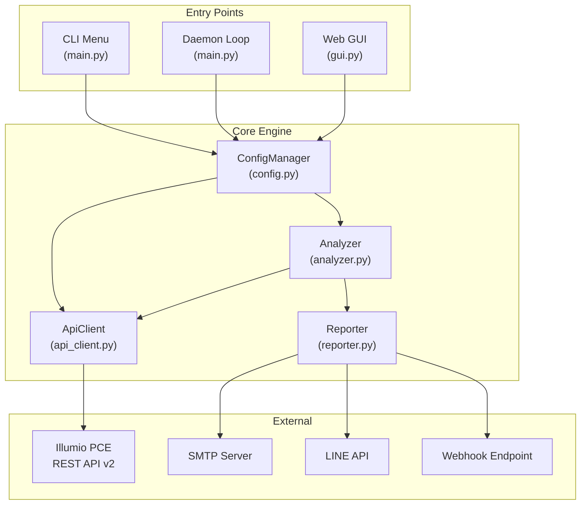
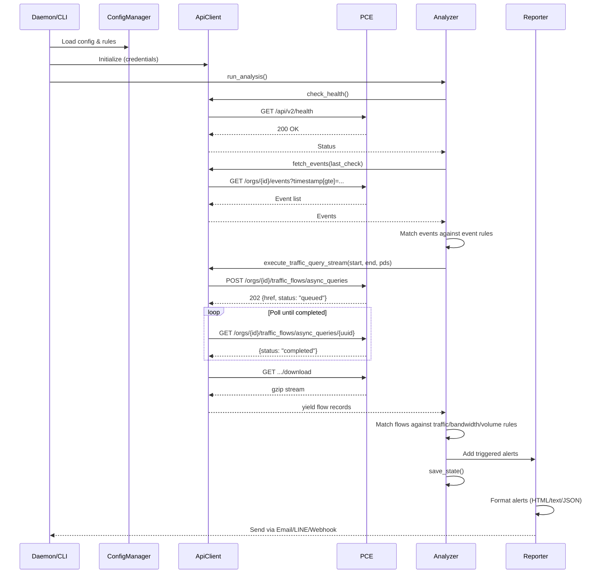

# Illumio PCE Ops — Project Architecture & Code Guide

> **[English](Project_Architecture.md)** | **[繁體中文](Project_Architecture_zh.md)**

---

## 1. System Architecture Overview



**Data Flow**: Entry Point → `ConfigManager` (loads rules/credentials) → `ApiClient` (queries PCE) → `Analyzer` (evaluates rules against returned data) → `Reporter` (dispatches alerts).

---

## 2. Directory Structure

```text
illumio_ops/
├── illumio_ops.py         # Entry point — imports and calls src.main.main()
├── requirements.txt       # Python dependencies
│
├── config/
│   ├── config.json            # Runtime config (credentials, rules, alerts, settings)
│   ├── config.json.example    # Example config template
│   └── report_config.yaml     # Security Findings rule thresholds
│
├── src/
│   ├── __init__.py            # Package init, exports __version__
│   ├── main.py                # CLI argument parser (argparse), daemon loop, interactive menu
│   ├── api_client.py          # Illumio REST API client with retry and streaming
│   ├── analyzer.py            # Rule engine: flow matching, metric calculation, state management
│   ├── reporter.py            # Alert aggregation and multi-channel dispatch
│   ├── config.py              # Configuration loading, saving, rule CRUD, atomic writes
│   ├── gui.py                 # Flask Web application (routes, JSON API endpoints)
│   ├── settings.py            # CLI interactive menus for rule/alert configuration
│   ├── report_scheduler.py    # Scheduled report generation and email delivery
│   ├── rule_scheduler.py      # Policy rule automation (enable/disable/provision with TTL)
│   ├── rule_scheduler_cli.py  # CLI and Web GUI interface for rule scheduler
│   ├── i18n.py                # Internationalization dictionary (EN/ZH_TW) and language switching
│   ├── utils.py               # Helpers: logging setup, ANSI colors, unit formatting, CJK width
│   ├── templates/             # Jinja2 HTML templates for Web GUI
│   ├── static/                # CSS/JS frontend assets
│   └── report/                # Advanced report generation engine
│       ├── report_generator.py    # Traffic report orchestrator (15 modules + Security Findings)
│       ├── audit_generator.py     # Audit log report orchestrator
│       ├── ven_status_generator.py# VEN status inventory report
│       ├── rules_engine.py        # 19 automated Security Findings detection rules (B/L series)
│       ├── analysis/              # Per-module analysis logic (mod01–mod15)
│       ├── exporters/             # HTML and CSV export formatters
│       └── parsers/               # API response and CSV data parsers
│
├── docs/                  # Documentation (this file, user manual, API cookbook)
├── tests/                 # Unit tests (pytest)
├── logs/                  # Runtime log files (rotating, 10MB × 5 backups)
│   └── state.json         # Persistent state (last_check timestamp, alert_history)
├── reports/               # Generated report output directory
└── deploy/                # Deployment helpers (NSSM, systemd configs)
```

---

## 3. Module Deep Dive

### 3.1 `api_client.py` — REST API Client

**Responsibility**: All HTTP communication with the Illumio PCE.

| Method | API Endpoint | HTTP | Purpose |
|:---|:---|:---|:---|
| `check_health()` | `/api/v2/health` | GET | PCE health status |
| `fetch_events()` | `/orgs/{id}/events` | GET | Security audit events |
| `execute_traffic_query_stream()` | `/orgs/{id}/traffic_flows/async_queries` | POST→GET→GET | Async traffic flow query with polling |
| `get_labels()` | `/orgs/{id}/labels` | GET | List labels by key |
| `create_label()` | `/orgs/{id}/labels` | POST | Create new label |
| `get_workload()` | `/api/v2{href}` | GET | Fetch single workload |
| `update_workload_labels()` | `/api/v2{href}` | PUT | Update workload's label set |
| `search_workloads()` | `/orgs/{id}/workloads` | GET | Search workloads by params |
| `fetch_managed_workloads()` | `/orgs/{id}/workloads` | GET | Fetch all managed workloads for VEN reports |
| `get_all_rulesets()` | `/orgs/{id}/sec_policy/.../rule_sets` | GET | List all rulesets (for rule scheduler) |
| `toggle_and_provision()` | Multiple | PUT→POST | Enable/disable a rule and provision changes |

**Key Design Patterns**:
- **Retry with Exponential Backoff**: Automatically retries on `429` (rate limit), `502/503/504` (server errors) up to 3 attempts
- **Streaming Download**: Traffic query results (potentially gigabytes) are downloaded as gzip, decompressed in-memory, and yielded line-by-line via Python generators — O(1) memory consumption
- **No External Dependencies**: Uses only `urllib.request` (no `requests` library)

### 3.2 `analyzer.py` — Rule Engine

**Responsibility**: Evaluate API data against user-defined rules.

**Core Functions**:

| Function | Purpose |
|:---|:---|
| `run_analysis()` | Main orchestration: health check → events → traffic → save state |
| `check_flow_match()` | Evaluate a single traffic flow against a rule's filter criteria |
| `calculate_mbps()` | Hybrid bandwidth calculation (interval delta → lifetime fallback) |
| `calculate_volume_mb()` | Data volume calculation with same hybrid approach |
| `query_flows()` | Generic query endpoint used by Web GUI's Traffic Analyzer |
| `run_debug_mode()` | Interactive diagnostic showing raw rule evaluation results |
| `_check_cooldown()` | Prevent alert flooding via per-rule minimum re-alert intervals |

**State Management** (`state.json`):
- `last_check`: ISO timestamp of last successful check — used as anchor for event queries
- `history`: Rolling window of match counts per rule (pruned to 2 hours)
- `alert_history`: Per-rule last-alert timestamp for cooldown enforcement
- **Atomic Writes**: Uses `tempfile.mkstemp()` + `os.replace()` to prevent corruption on crash

### 3.3 `reporter.py` — Alert Dispatcher

**Responsibility**: Format and send alerts through configured channels.

**Alert Categories**: `health_alerts`, `event_alerts`, `traffic_alerts`, `metric_alerts`

**Output Formats**:
- **Email**: Rich HTML tables with color-coded severity badges and embedded flow snapshots
- **LINE**: Plain text summary (LINE API character limits)
- **Webhook**: Raw JSON payload (full structured data for SOAR ingestion)

### 3.4 `config.py` — Configuration Manager

**Responsibility**: Load, save, and validate `config.json`.

- **Deep Merge**: User config is merged over defaults — any missing fields are auto-populated
- **Atomic Save**: Writes to `.tmp` file first, then `os.replace()` for crash safety
- **Rule CRUD**: `add_or_update_rule()`, `remove_rules_by_index()`, `load_best_practices()`

### 3.5 `gui.py` — Flask Web GUI

**Responsibility**: Browser-based management interface.

**Architecture**: Flask backend exposing ~25 JSON API endpoints, consumed by a Vanilla JS frontend (`templates/index.html`).

**Key Endpoints**:

| Route | Method | Purpose |
|:---|:---|:---|
| `/api/status` | GET | Dashboard data (health, stats, rules) |
| `/api/rules` | GET/POST/DELETE | Rule CRUD |
| `/api/dashboard/top10` | POST | Traffic Analyzer (Top-10 by bandwidth/volume/connections) |
| `/api/quarantine/search` | POST | Workload search for quarantine |
| `/api/quarantine/apply` | POST | Apply quarantine label to workload |
| `/api/settings` | GET/PUT | Read/write application settings |
| `/api/reports/generate` | POST | Generate reports (Traffic/Audit/VEN) on demand |
| `/api/reports/list` | GET | List generated reports |
| `/api/schedules` | GET/POST/PUT/DELETE | Report schedule CRUD |
| `/api/rule-scheduler/*` | GET/POST | Rule scheduler management |

### 3.6 `i18n.py` — Internationalization

**Responsibility**: Provide translated strings for all UI text.

- Contains a ~900-entry dictionary mapping keys to translations in `{"en": {...}, "zh_TW": {...}}` structure
- `t(key, **kwargs)` function returns the string in the current language with variable substitution
- Language is set globally via `set_language("en"|"zh_TW")`

### 3.7 `report_scheduler.py` — Report Scheduler

**Responsibility**: Manage scheduled report generation and email delivery.

- Supports daily, weekly, and monthly schedules
- Generates Traffic, Audit, and VEN Status reports on schedule
- Emails reports as HTML attachments with configurable recipients
- Handles report retention (auto-cleanup of old reports by age)
- Schedule times stored as UTC, displayed in configured timezone

### 3.8 `rule_scheduler.py` + `rule_scheduler_cli.py` — Rule Scheduler

**Responsibility**: Automate PCE policy rule enable/disable with optional TTL.

- Browse and display all PCE rulesets and individual rules
- Enable or disable specific rules with optional expiration time
- Provision changes to the PCE (push draft → active)
- CLI interactive menu (`rule_scheduler_cli.py`) and Web GUI API endpoints
- Time-to-live (TTL) support: schedule a rule to auto-revert after N days

### 3.9 `src/report/` — Advanced Report Engine

**Responsibility**: Generate comprehensive security analysis reports.

| Component | Purpose |
|:---|:---|
| `report_generator.py` | Orchestrate 15 analysis modules + Security Findings for Traffic Reports |
| `audit_generator.py` | Orchestrate 4 modules for Audit Log Reports |
| `ven_status_generator.py` | Generate VEN inventory report with online/offline classification |
| `rules_engine.py` | 19 automated detection rules (B001–B009, L001–L010) with configurable thresholds |
| `analysis/` | Per-module analysis logic (mod01–mod15: traffic overview, policy decisions, ransomware exposure, etc.) |
| `exporters/` | HTML template rendering and CSV export formatting |
| `parsers/` | API response parsing and CSV data ingestion |

---

## 4. Data Flow Diagram



---

## 5. How to Modify This Project

### 5.1 Add a New Rule Type

1. **Define the rule schema** in `settings.py` — create a new `add_xxx_menu()` function
2. **Add matching logic** in `analyzer.py` → `run_analysis()` — handle the new type in the traffic loop
3. **Add GUI support** in `gui.py` — create a new API endpoint for the rule type
4. **Add i18n keys** in `i18n.py` for any new UI strings

### 5.2 Add a New Alert Channel

1. **Add config fields** in `config.py` → `_DEFAULT_CONFIG["alerts"]`
2. **Implement the sender** in `reporter.py` — create `_send_xxx()` method
3. **Register in dispatcher** in `reporter.py` → `send_alerts()` — add the new channel check
4. **Add GUI settings** in `gui.py` → `api_save_settings()` and frontend

### 5.3 Add a New API Endpoint

1. **Add the method** in `api_client.py` — follow the pattern of existing methods
2. **URL format**: Use `self.base_url` for org-scoped endpoints, `self.api_cfg['url']/api/v2` for global ones
3. **Error handling**: Return `(status, body)` tuple, let callers handle specific status codes
4. **Refer to** `docs/REST_APIs_25_2.txt` for endpoint schemas

### 5.4 Add a New i18n Language

1. Add a new top-level key in `i18n.py`'s `MESSAGES` dictionary (alongside `"en"` and `"zh_TW"`)
2. Add the language option in `gui.py` → settings endpoint
3. Update `config.py` defaults to include the new language code
4. Update `set_language()` in `i18n.py` to accept the new code
