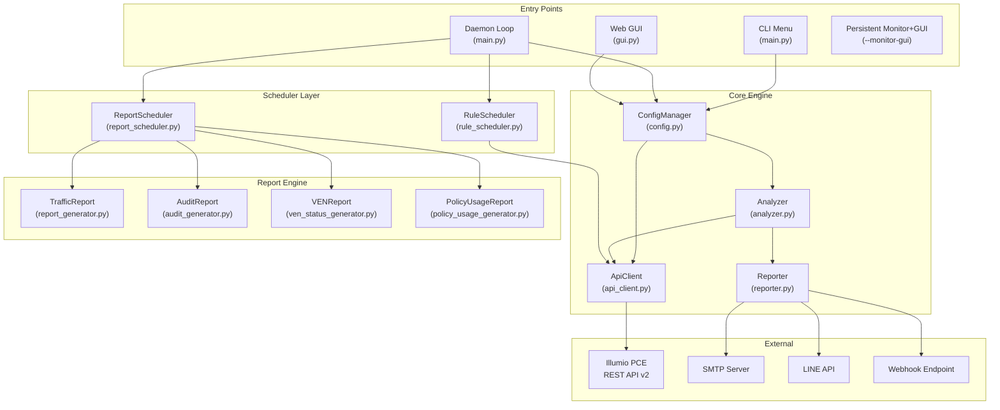
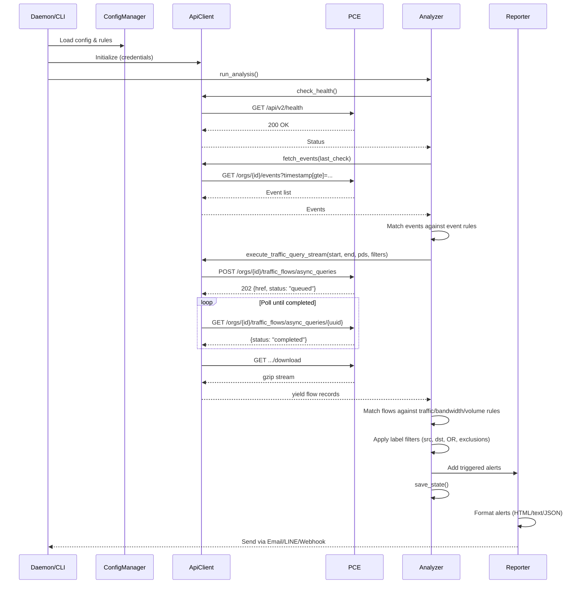

# Illumio PCE Ops — Project Architecture & Code Guide

> **[English](Project_Architecture.md)** | **[繁體中文](Project_Architecture_zh.md)**

---

## 1. System Architecture Overview



**Data Flow**: Entry Point → `ConfigManager` (loads rules/credentials) → `ApiClient` (queries PCE) → `Analyzer` (evaluates rules against returned data) → `Reporter` (dispatches alerts).

**Scheduler Flow**: `ReportScheduler.tick()` evaluates cron-like schedules → dispatches to report generators → emails results. `RuleScheduler.check()` evaluates recurring/one-time schedules → toggles PCE rules → provisions changes.

---

## 2. Directory Structure

```text
illumio_ops/
├── illumio_ops.py         # Entry point — imports and calls src.main.main()
├── requirements.txt       # Python dependencies
│
├── config/
│   ├── config.json            # Runtime config (credentials, rules, alerts, settings)
│   ├── config.json.example    # Example config template
│   └── report_config.yaml     # Security Findings rule thresholds
│
├── src/
│   ├── __init__.py            # Package init, exports __version__
│   ├── main.py                # CLI argument parser, daemon/GUI orchestration, interactive menu
│   ├── api_client.py          # Illumio REST API client with retry and streaming
│   ├── analyzer.py            # Rule engine: flow matching, metric calculation, state management
│   ├── reporter.py            # Alert aggregation and multi-channel dispatch
│   ├── config.py              # Configuration loading, saving, rule CRUD, atomic writes, PBKDF2 password hashing
│   ├── gui.py                 # Flask Web application (~40 JSON API endpoints), login rate limiting, CSRF synchronizer token
│   ├── settings.py            # CLI interactive menus for rule/alert configuration
│   ├── report_scheduler.py    # Scheduled report generation and email delivery
│   ├── rule_scheduler.py      # Policy rule automation (recurring/one-time schedules, provision)
│   ├── rule_scheduler_cli.py  # CLI and Web GUI interface for rule scheduler
│   ├── i18n.py                # Internationalization dictionary (EN/ZH_TW) and language switching
│   ├── utils.py               # Helpers: logging setup, ANSI colors, unit formatting, CJK width
│   ├── templates/             # Jinja2 HTML templates for Web GUI (SPA)
│   ├── static/                # CSS/JS frontend assets
│   └── report/                # Advanced report generation engine
│       ├── report_generator.py        # Traffic report orchestrator (15 modules + Security Findings)
│       ├── audit_generator.py         # Audit log report orchestrator (4 modules)
│       ├── ven_status_generator.py    # VEN status inventory report
│       ├── policy_usage_generator.py  # Policy rule usage analysis report
│       ├── rules_engine.py            # 19 automated Security Findings rules (B/L series)
│       ├── analysis/                  # Per-module analysis logic
│       │   ├── mod01–mod15            # Traffic analysis modules
│       │   ├── audit/                 # Audit analysis modules (audit_mod00–03)
│       │   └── policy_usage/          # Policy usage modules (pu_mod00–03)
│       ├── exporters/                 # HTML, CSV, and policy usage export formatters
│       └── parsers/                   # API response and CSV data parsers
│
├── docs/                  # Documentation (this file, user manual, API cookbook)
├── tests/                 # Unit tests (pytest)
├── logs/                  # Runtime log files (rotating, 10MB × 5 backups)
│   └── state.json         # Persistent state (last_check timestamp, alert_history)
├── reports/               # Generated report output directory
└── deploy/                # Deployment helpers (NSSM, systemd configs)
```

---

## 3. Module Deep Dive

### 3.1 `api_client.py` — REST API Client

**Responsibility**: All HTTP communication with the Illumio PCE, using only Python `urllib` (zero external dependencies).

| Method | API Endpoint | HTTP | Purpose |
|:---|:---|:---|:---|
| `check_health()` | `/api/v2/health` | GET | PCE health status |
| `fetch_events()` | `/orgs/{id}/events` | GET | Security audit events |
| `execute_traffic_query_stream()` | `/orgs/{id}/traffic_flows/async_queries` | POST→GET→GET | Async traffic flow query (3-phase) |
| `fetch_traffic_for_report()` | (same async endpoint) | POST→GET→GET | Traffic query for report generation |
| `get_labels()` | `/orgs/{id}/labels` | GET | List labels by key |
| `create_label()` | `/orgs/{id}/labels` | POST | Create new label |
| `get_workload()` | `/api/v2{href}` | GET | Fetch single workload |
| `update_workload_labels()` | `/api/v2{href}` | PUT | Update workload's label set |
| `search_workloads()` | `/orgs/{id}/workloads` | GET | Search workloads by params |
| `fetch_managed_workloads()` | `/orgs/{id}/workloads` | GET | All managed workloads (VEN reports) |
| `get_all_rulesets()` | `/orgs/{id}/sec_policy/.../rule_sets` | GET | List rulesets (rule scheduler) |
| `get_active_rulesets()` | `/orgs/{id}/sec_policy/active/rule_sets` | GET | Active rulesets (policy usage) |
| `toggle_and_provision()` | Multiple | PUT→POST | Enable/disable rule and provision |
| `submit_async_query()` | `/orgs/{id}/traffic_flows/async_queries` | POST | Submit async traffic query |
| `poll_async_query()` | `.../async_queries/{uuid}` | GET | Poll query status until completed |
| `download_async_query()` | `.../async_queries/{uuid}/download` | GET | Download gzip-compressed results |
| `batch_get_rule_traffic_counts()` | (parallel async queries) | POST→GET→GET | Batch per-rule hit analysis |
| `check_and_create_quarantine_labels()` | `/orgs/{id}/labels` | GET/POST | Ensure quarantine label set exists |
| `provision_changes()` | `/orgs/{id}/sec_policy` | POST | Provision draft → active |
| `has_draft_changes()` | `/orgs/{id}/sec_policy/pending` | GET | Check for pending draft changes |

**Key Design Patterns**:
- **Retry with Exponential Backoff**: Automatically retries on `429` (rate limit), `502/503/504` (server errors) up to 3 attempts with base interval 2s
- **3-Phase Async Query Execution**: Submit → Poll → Download pattern for traffic queries; `batch_get_rule_traffic_counts()` parallelizes all three phases across multiple rules using `ThreadPoolExecutor` (max 10 concurrent)
- **Streaming Download**: Traffic query results (potentially gigabytes) are downloaded as gzip, decompressed in-memory, and yielded line-by-line via Python generators — O(1) memory consumption
- **Label/Ruleset Caching**: Internal caches (`label_cache`, `ruleset_cache`, `service_ports_cache`) avoid redundant API calls during batch operations
- **No External Dependencies**: Uses only `urllib.request` (no `requests` library)

> **Note**: Illumio Core 25.2 deprecated the synchronous traffic query API (`traffic_analysis_queries`). This tool uses exclusively the async API (`async_queries`) with support for up to 200,000 results.

### 3.2 `analyzer.py` — Rule Engine

**Responsibility**: Evaluate API data against user-defined rules, with support for flexible filter logic.

**Core Functions**:

| Function | Purpose |
|:---|:---|
| `run_analysis()` | Main orchestration: health check → events → traffic → save state |
| `check_flow_match()` | Evaluate a single traffic flow against a rule's filter criteria |
| `_check_flow_labels()` | Match flow labels against rule filters (src, dst, OR logic, exclusions) |
| `_check_ip_filter()` | Validate IP addresses against CIDR ranges (IPv4/IPv6) |
| `calculate_mbps()` | Hybrid bandwidth calculation with auto-scale units |
| `calculate_volume_mb()` | Data volume calculation with hybrid approach |
| `query_flows()` | Generic query endpoint used by Web GUI's Traffic Analyzer |
| `run_debug_mode()` | Interactive diagnostic showing raw rule evaluation results |
| `_check_cooldown()` | Prevent alert flooding via per-rule minimum re-alert intervals |

**Filter Matching Logic**:

The analyzer supports flexible filter conditions for traffic rules:

| Filter Field | Logic | Description |
|:---|:---|:---|
| `src_labels` + `dst_labels` | AND | Both source and destination must match |
| `src_labels` only | Src-side | Match by source label only |
| `dst_labels` only | Dst-side | Match by destination label only |
| `filter_direction: "src_or_dst"` | OR | Match if either source or destination matches any specified label |
| `ex_src_labels`, `ex_dst_labels` | Exclusion | Exclude flows matching these labels |
| `src_ip`, `dst_ip` | CIDR match | IPv4/IPv6 address filtering |
| `ex_src_ip`, `ex_dst_ip` | Exclusion | Exclude flows from/to these IPs |
| `port`, `proto` | Service match | Port and protocol filtering |

**State Management** (`state.json`):
- `last_check`: ISO timestamp of last successful check — used as anchor for event queries
- `history`: Rolling window of match counts per rule (pruned to 2 hours)
- `alert_history`: Per-rule last-alert timestamp for cooldown enforcement
- **Atomic Writes**: Uses `tempfile.mkstemp()` + `os.replace()` to prevent corruption on crash

### 3.3 `reporter.py` — Alert Dispatcher

**Responsibility**: Format and send alerts through configured channels.

**Alert Categories**: `health_alerts`, `event_alerts`, `traffic_alerts`, `metric_alerts`

**Output Formats**:
- **Email**: Rich HTML tables with color-coded severity badges, embedded flow snapshots, and auto-scaled bandwidth units. Event alerts include username and IP for login failure notifications.
- **LINE**: Plain text summary (LINE API character limits)
- **Webhook**: Raw JSON payload (full structured data for SOAR ingestion)

**Report Email Methods**:
| Method | Purpose |
|:---|:---|
| `send_alerts()` | Route alerts to configured channels |
| `send_report_email()` | Send on-demand report with single attachment |
| `send_scheduled_report_email()` | Send scheduled report with multiple attachments and custom recipients |

### 3.4 `config.py` — Configuration Manager

**Responsibility**: Load, save, and validate `config.json`.

- **Thread Safety**: Uses **`threading.RLock`** (Reentrant Lock) to prevent deadlocks during recursive load/save cycles or concurrent access from Daemon and GUI threads.
- **Deep Merge**: User config is merged over defaults — any missing fields are auto-populated.
- **Atomic Save**: Writes to `.tmp` file first, then `os.replace()` for crash safety.
- **Password Hashing**: Helper functions `hash_password()` and `verify_password()` handle both new PBKDF2 format (prefixed with `pbkdf2:`) and legacy SHA256 format.
- **Rule CRUD**: `add_or_update_rule()`, `remove_rules_by_index()`, `load_best_practices()`.
- **PCE Profile Management**: `add_pce_profile()`, `update_pce_profile()`, `activate_pce_profile()`, `remove_pce_profile()`, `list_pce_profiles()` — supports multi-PCE environments with profile switching.
- **Report Schedule Management**: `add_report_schedule()`, `update_report_schedule()`, `remove_report_schedule()`, `list_report_schedules()`.

### 3.5 `gui.py` — Web GUI

**Architecture**: Flask backend exposing ~40 JSON API endpoints, consumed by a Vanilla JS frontend (`templates/index.html`).

- **Security Middleware**: Mandates login authentication for all routes and enforces IP Allowlisting (CIDR support) via `@app.before_request`. Unauthorized requests are blocked with 401/403 status.
- **Password Hashing**: Password hashing uses **PBKDF2-HMAC-SHA256** with 260,000 iterations (Python `hashlib.pbkdf2_hmac`, stdlib only). Legacy SHA256 hashes are auto-upgraded on next successful login. Default credentials are `illumio` / `illumio` — users should change the password on first login.
- **Login Rate Limiting**: In-memory per-IP tracker with thread-safe locking. 5 attempts per 60-second window; returns HTTP 429 on excess.
- **CSRF Protection**: Uses the **Synchronizer Token Pattern**: token is stored in Flask session and injected into `index.html` via a `<meta name="csrf-token">` tag. JavaScript reads the token from the meta tag (not from a cookie). The CSRF cookie has been removed.
- **Session Security**: Cryptographically signed session cookies. The `session_secret` is automatically generated on first run.
- **SMTP Password**: Can be provided via `ILLUMIO_SMTP_PASSWORD` environment variable, which takes precedence over the config file value.
- **Threading Model (--monitor-gui)**: The daemon loop runs in a dedicated `threading.Thread` while the Flask app occupies the main thread to handle signals and web requests correctly.

**Key Endpoints**:

| Route | Method | Purpose |
|:---|:---|:---|
| `/api/login` | POST | Session authentication |
| `/api/security` | GET/POST | Security settings (password, allowed IPs) |
| `/api/status` | GET | Dashboard data (health, stats, rules, cooldowns) |
| `/api/event-catalog` | GET | Translated event type catalog |
| `/api/rules` | GET | List all rules |
| `/api/rules/event` | POST | Create event rule |
| `/api/rules/traffic` | POST | Create traffic rule |
| `/api/rules/bandwidth` | POST | Create bandwidth rule |
| `/api/rules/<idx>` | GET/PUT/DELETE | Rule CRUD by index |
| `/api/settings` | GET/POST | Read/write application settings |
| `/api/pce-profiles` | GET/POST | Multi-PCE profile management (list, add, update, delete, activate) |
| `/api/dashboard/queries` | GET/POST/DELETE | Saved query management |
| `/api/dashboard/snapshot` | GET | Latest traffic report snapshot |
| `/api/dashboard/top10` | POST | Top-10 flows by bandwidth/volume/connections |
| `/api/quarantine/search` | POST | Traffic search with flexible filters |
| `/api/quarantine/apply` | POST | Apply quarantine label to workload |
| `/api/quarantine/bulk_apply` | POST | Bulk quarantine (parallel, max 5 workers) |
| `/api/workloads` | GET/POST | Workload search and inventory |
| `/api/reports/generate` | POST | Generate reports (Traffic/Audit/VEN/Policy Usage) |
| `/api/reports` | GET | List generated reports |
| `/api/reports/<filename>` | DELETE | Delete report file |
| `/api/reports/bulk-delete` | POST | Bulk delete reports |
| `/api/audit_report/generate` | POST | Generate audit report |
| `/api/ven_status_report/generate` | POST | Generate VEN status report |
| `/api/policy_usage_report/generate` | POST | Generate policy usage report |
| `/api/report-schedules` | GET/POST | Report schedule CRUD |
| `/api/report-schedules/<id>` | PUT/DELETE | Update/delete schedule |
| `/api/report-schedules/<id>/toggle` | POST | Enable/disable schedule |
| `/api/report-schedules/<id>/run` | POST | Trigger immediate execution |
| `/api/report-schedules/<id>/history` | GET | Schedule execution history |
| `/api/init_quarantine` | POST | Ensure quarantine labels exist on PCE |
| `/api/actions/run` | POST | Execute one analysis cycle |
| `/api/actions/debug` | POST | Run debug mode |
| `/api/actions/test-alert` | POST | Send test alert |
| `/api/actions/best-practices` | POST | Load best practice rules |
| `/api/actions/test-connection` | POST | Test PCE connectivity |
| `/api/rule_scheduler/status` | GET | Rule scheduler status |
| `/api/rule_scheduler/rulesets` | GET | Browse PCE rulesets |
| `/api/rule_scheduler/rulesets/<id>` | GET | Ruleset detail with rules |
| `/api/rule_scheduler/schedules` | GET/POST | Rule schedule CRUD |
| `/api/rule_scheduler/schedules/<href>` | GET | Schedule detail |
| `/api/rule_scheduler/schedules/delete` | POST | Delete rule schedule |
| `/api/rule_scheduler/check` | POST | Trigger schedule evaluation |

### 3.6 `i18n.py` — Internationalization

**Responsibility**: Provide translated strings for all UI text.

- Contains a ~900+ entry dictionary mapping keys to translations in `{"en": {...}, "zh_TW": {...}}` structure
- `t(key, **kwargs)` function returns the string in the current language with variable substitution
- Language is set globally via `set_language("en"|"zh_TW")`
- Covers: CLI menus, event descriptions, alert templates, Web GUI labels, report terminology, filter labels, schedule types

### 3.7 `report_scheduler.py` — Report Scheduler

**Responsibility**: Manage scheduled report generation and email delivery.

- Supports daily, weekly, and monthly schedules
- Generates **4 report types**: Traffic, Audit, VEN Status, and Policy Usage
- `tick()` called every minute from daemon loop to evaluate schedules
- `run_schedule()` dispatches to appropriate generator based on report type
- Emails reports as HTML attachments with configurable recipients
- Handles report retention via `_prune_old_reports()` (auto-cleanup by `retention_days`)
- Schedule times stored as UTC, displayed in configured timezone
- State tracked in `logs/state.json` under `report_schedule_states`

### 3.8 `rule_scheduler.py` + `rule_scheduler_cli.py` — Rule Scheduler

**Responsibility**: Automate PCE policy rule enable/disable on schedule.

**Schedule Types**:
- **Recurring**: Enable/disable rules on specific days and time windows (e.g., Mon–Fri 09:00–17:00). Supports midnight wraparound (e.g., 22:00–06:00).
- **One-time**: Enable/disable a rule until a specific expiration datetime, then auto-revert.

**Features**:
- Browse and search all PCE rulesets and individual rules
- Enable or disable specific rules or entire rulesets
- **Draft protection**: Multi-layer checks ensure only provisioned rules are toggled; prevents enforcement on draft-only items
- Provision changes to PCE (push draft → active)
- Interactive CLI (`rule_scheduler_cli.py`) with paginated rule browsing
- Web GUI API endpoints under `/api/rule_scheduler/*`
- Schedule note tags added to PCE rule descriptions (📅 recurring / ⏳ one-time)
- Day name normalization (mon→monday, etc.)

### 3.9 `src/report/` — Advanced Report Engine

**Responsibility**: Generate comprehensive security analysis reports.

| Component | Purpose |
|:---|:---|
| `report_generator.py` | Orchestrate 15 analysis modules + Security Findings for Traffic Reports |
| `audit_generator.py` | Orchestrate 4 modules for Audit Log Reports |
| `ven_status_generator.py` | VEN inventory report with heartbeat-based online/offline classification |
| `policy_usage_generator.py` | Policy rule usage analysis with per-rule hit counts |
| `rules_engine.py` | 19 automated detection rules (B001–B009, L001–L010) with configurable thresholds |
| `analysis/mod01–mod15` | Traffic analysis modules (overview, policy decisions, ransomware, remote access, etc.) |
| `analysis/audit/` | 4 audit modules (executive summary, health events, user activity, policy changes) |
| `analysis/policy_usage/` | 4 policy usage modules (executive, overview, hit detail, unused detail) |
| `exporters/` | HTML template rendering, CSV export, policy usage HTML export |
| `parsers/` | API response parsing (`api_parser.py`), CSV ingestion (`csv_parser.py`), data validation |

**Report Types**:

| Report | Modules | Description |
|:---|:---|:---|
| **Traffic** | 15 modules (mod01–mod15) + 19 Security Findings | Comprehensive traffic analysis with ransomware, remote access, cross-env, bandwidth, lateral movement detection |
| **Audit** | 4 modules (audit_mod00–03) | PCE health events, user login/authentication, policy change tracking |
| **VEN Status** | Single generator | VEN inventory with online/offline status based on heartbeat (≤1h threshold) |
| **Policy Usage** | 4 modules (pu_mod00–03) | Per-rule traffic hit analysis, unused rule identification, executive summary |

**Policy Usage Report** supports two data sources:
- **API**: Fetches active rulesets from PCE, runs parallel 3-phase async queries per rule
- **CSV Import**: Accepts Workloader CSV export with pre-computed flow counts

**Export Formats**: HTML (primary) and CSV ZIP (stdlib `zipfile`, zero external dependencies).

---

## 4. Data Flow Diagram



---

## 5. Multi-PCE Profile Architecture

The system supports managing multiple PCE instances through profiles:

```text
config.json
├── api: { url, org_id, key, secret }    ← active profile credentials
├── active_pce_id: "production"           ← current active profile name
└── pce_profiles: [
      { name: "production", url: "...", org_id: 1, key: "...", secret: "..." },
      { name: "staging",    url: "...", org_id: 2, key: "...", secret: "..." }
    ]
```

- **Profile Switch**: `activate_pce_profile()` copies profile credentials into the top-level `api` section and reinitializes `ApiClient`
- **GUI**: `/api/pce-profiles` endpoints for listing, adding, updating, deleting, and activating profiles
- **CLI**: Interactive profile management via settings menu

---

## 6. How to Modify This Project

### 6.1 Add a New Rule Type

1. **Define the rule schema** in `settings.py` — create a new `add_xxx_menu()` function
2. **Add matching logic** in `analyzer.py` → `run_analysis()` — handle the new type in the traffic loop
3. **Add GUI support** in `gui.py` — create a new API endpoint for the rule type
4. **Add i18n keys** in `i18n.py` for any new UI strings

### 6.2 Add a New Alert Channel

1. **Add config fields** in `config.py` → `_DEFAULT_CONFIG["alerts"]`
2. **Implement the sender** in `reporter.py` — create `_send_xxx()` method
3. **Register in dispatcher** in `reporter.py` → `send_alerts()` — add the new channel check
4. **Add GUI settings** in `gui.py` → `api_save_settings()` and frontend

### 6.3 Add a New API Endpoint

1. **Add the method** in `api_client.py` — follow the pattern of existing methods
2. **URL format**: Use `self.base_url` for org-scoped endpoints, `self.api_cfg['url']/api/v2` for global ones
3. **Error handling**: Return `(status, body)` tuple, let callers handle specific status codes
4. **Refer to** `docs/REST_APIs_25_2.md` for endpoint schemas

### 6.4 Add a New i18n Language

1. Add a new top-level key in `i18n.py`'s `MESSAGES` dictionary (alongside `"en"` and `"zh_TW"`)
2. Add the language option in `gui.py` → settings endpoint
3. Update `config.py` defaults to include the new language code
4. Update `set_language()` in `i18n.py` to accept the new code

### 6.5 Add a New Report Type

1. **Create generator** in `src/report/` — follow `policy_usage_generator.py` pattern with `generate_from_api()` and `export()` methods
2. **Create analysis modules** in `src/report/analysis/<type>/` — `pu_mod00_executive.py` pattern
3. **Create exporter** in `src/report/exporters/` — HTML and/or CSV export
4. **Register in scheduler** in `report_scheduler.py` — add dispatch case in `run_schedule()`
5. **Add GUI endpoint** in `gui.py` — `api_generate_<type>_report()`
6. **Add CLI option** in `main.py` — argparse `--report-type` choices
7. **Add i18n keys** for report-specific terminology
