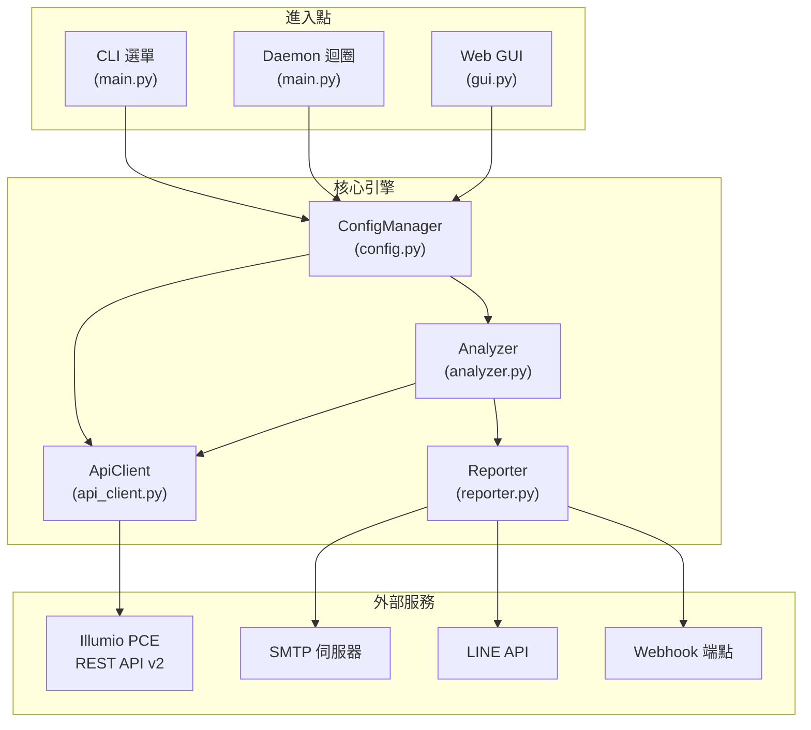
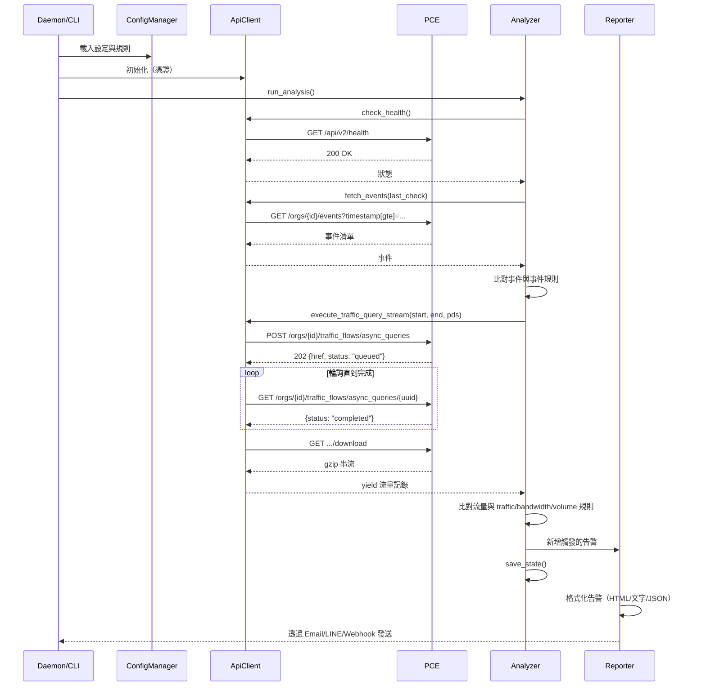

# Illumio PCE Ops — 專案架構與程式碼指南

> **[English](Project_Architecture.md)** | **[繁體中文](Project_Architecture_zh.md)**

---

## 1. 系統架構概覽



**資料流向**：進入點 → `ConfigManager`（載入規則/憑證）→ `ApiClient`（查詢 PCE）→ `Analyzer`（比對規則與回傳資料）→ `Reporter`（發送告警）。

---

## 2. 目錄結構

```text
illumio_ops/
├── illumio_ops.py         # 進入點 — 匯入並呼叫 src.main.main()
├── requirements.txt       # Python 相依套件
│
├── config/
│   ├── config.json            # 執行時設定（憑證、規則、告警、偏好設定）
│   ├── config.json.example    # 設定檔範本
│   └── report_config.yaml     # 安全發現規則閾值
│
├── src/
│   ├── __init__.py            # 套件初始化，匯出 __version__
│   ├── main.py                # CLI 參數解析 (argparse)、Daemon 迴圈、互動選單
│   ├── api_client.py          # Illumio REST API 客戶端（含重試與串流）
│   ├── analyzer.py            # 規則引擎：流量比對、指標計算、狀態管理
│   ├── reporter.py            # 告警聚合與多通道發送
│   ├── config.py              # 設定載入/儲存、規則 CRUD、原子寫入
│   ├── gui.py                 # Flask Web 應用程式（路由、JSON API 端點）
│   ├── settings.py            # CLI 互動選單（規則/告警設定）
│   ├── report_scheduler.py    # 排程報表產生與 Email 寄送
│   ├── rule_scheduler.py      # 政策規則自動化（啟用/停用/部署，含 TTL）
│   ├── rule_scheduler_cli.py  # 規則排程器的 CLI 與 Web GUI 介面
│   ├── i18n.py                # 國際化字典（EN/ZH_TW）與語言切換
│   ├── utils.py               # 工具函式：日誌設定、ANSI 色碼、單位格式化、CJK 寬度
│   ├── templates/             # Jinja2 HTML 模板（Web GUI）
│   ├── static/                # CSS/JS 前端資源
│   └── report/                # 進階報表產生引擎
│       ├── report_generator.py    # 流量報表編排器（15 個模組 + 安全發現）
│       ├── audit_generator.py     # 稽核日誌報表編排器
│       ├── ven_status_generator.py# VEN 狀態盤點報表
│       ├── rules_engine.py        # 19 條自動化安全發現偵測規則（B/L 系列）
│       ├── analysis/              # 各模組分析邏輯（mod01–mod15）
│       ├── exporters/             # HTML 與 CSV 匯出格式器
│       └── parsers/               # API 回應與 CSV 資料解析器
│
├── docs/                  # 文件（本文件、使用手冊、API Cookbook）
├── tests/                 # 單元測試 (pytest)
├── logs/                  # 執行時日誌（輪替，10MB × 5 備份）
│   └── state.json         # 持久化狀態（last_check 時間戳、告警歷史）
├── reports/               # 報表輸出目錄
└── deploy/                # 部署輔助腳本（NSSM、systemd 設定）
```

---

## 3. 各模組深度分析

### 3.1 `api_client.py` — REST API 客戶端

**職責**：與 Illumio PCE 的所有 HTTP 通訊。

| 方法 | API 端點 | HTTP | 用途 |
|:---|:---|:---|:---|
| `check_health()` | `/api/v2/health` | GET | PCE 健康狀態 |
| `fetch_events()` | `/orgs/{id}/events` | GET | 安全稽核事件 |
| `execute_traffic_query_stream()` | `/orgs/{id}/traffic_flows/async_queries` | POST→GET→GET | 非同步流量查詢含輪詢 |
| `get_labels()` | `/orgs/{id}/labels` | GET | 依 key 列出標籤 |
| `create_label()` | `/orgs/{id}/labels` | POST | 建立新標籤 |
| `get_workload()` | `/api/v2{href}` | GET | 取得單一工作負載 |
| `update_workload_labels()` | `/api/v2{href}` | PUT | 更新工作負載標籤集 |
| `search_workloads()` | `/orgs/{id}/workloads` | GET | 依參數搜尋工作負載 |
| `fetch_managed_workloads()` | `/orgs/{id}/workloads` | GET | 取得所有受管工作負載（VEN 報表用） |
| `get_all_rulesets()` | `/orgs/{id}/sec_policy/.../rule_sets` | GET | 列出所有規則集（規則排程器用） |
| `toggle_and_provision()` | Multiple | PUT→POST | 啟用/停用規則並部署變更 |

**關鍵設計模式**：
- **指數退避重試**：遇到 `429`（速率限制）、`502/503/504`（伺服器錯誤）自動重試，最多 3 次
- **串流下載**：流量查詢結果（可能數 GB）以 gzip 下載，在記憶體中解壓縮，透過 Python 生成器逐行 yield — O(1) 記憶體消耗
- **無外部相依**：僅使用 `urllib.request`（不需要 `requests` 函式庫）

### 3.2 `analyzer.py` — 規則引擎

**職責**：根據使用者定義的規則評估 API 資料。

**核心函式**：

| 函式 | 用途 |
|:---|:---|
| `run_analysis()` | 主流程編排：健康檢查 → 事件 → 流量 → 儲存狀態 |
| `check_flow_match()` | 評估單一流量記錄是否符合規則的篩選條件 |
| `calculate_mbps()` | 混合頻寬計算（區間 Delta → 生命週期退回） |
| `calculate_volume_mb()` | 資料量計算（同樣的混合方式） |
| `query_flows()` | Web GUI 流量分析器使用的通用查詢端點 |
| `run_debug_mode()` | 互動式診斷，顯示原始規則評估結果 |
| `_check_cooldown()` | 透過每規則最小重新告警間隔防止告警洪水 |

**狀態管理** (`state.json`)：
- `last_check`：上次成功檢查的 ISO 時間戳 — 用作事件查詢的錨點
- `history`：每條規則的匹配計數滾動視窗（修剪至 2 小時）
- `alert_history`：每條規則的上次告警時間戳（冷卻機制）
- **原子寫入**：使用 `tempfile.mkstemp()` + `os.replace()` 防止當機時損壞

### 3.3 `reporter.py` — 告警發送器

**職責**：格式化並透過設定的通道發送告警。

**告警分類**：`health_alerts`、`event_alerts`、`traffic_alerts`、`metric_alerts`

**輸出格式**：
- **Email**：豐富的 HTML 表格，含色彩編碼的嚴重等級標章和嵌入式流量快照
- **LINE**：純文字摘要（LINE API 字元限制）
- **Webhook**：原始 JSON 酬載（完整結構化資料供 SOAR 擷取）

### 3.4 `config.py` — 設定管理器

**職責**：載入、儲存和驗證 `config.json`。

- **深度合併**：使用者設定覆蓋預設值 — 缺失欄位自動補齊
- **原子儲存**：先寫至 `.tmp` 檔案，再透過 `os.replace()` 確保當機安全
- **規則 CRUD**：`add_or_update_rule()`、`remove_rules_by_index()`、`load_best_practices()`

### 3.5 `gui.py` — Flask Web GUI

**職責**：瀏覽器介面管理介面。

**架構**：Flask 後端提供約 25 個 JSON API 端點，由 Vanilla JS 前端（`templates/index.html`）消費。

**關鍵路由**：

| 路由 | 方法 | 用途 |
|:---|:---|:---|
| `/api/status` | GET | Dashboard 資料（健康狀態、統計、規則） |
| `/api/rules` | GET/POST/DELETE | 規則 CRUD |
| `/api/dashboard/top10` | POST | 流量分析器（依頻寬/流量/連線數 Top-10） |
| `/api/quarantine/search` | POST | 隔離用工作負載搜尋 |
| `/api/quarantine/apply` | POST | 對工作負載套用隔離標籤 |
| `/api/settings` | GET/PUT | 讀取/寫入應用程式設定 |
| `/api/reports/generate` | POST | 可手動產生報表（流量/稽核/VEN） |
| `/api/reports/list` | GET | 列出已產生報表 |
| `/api/schedules` | GET/POST/PUT/DELETE | 報表排程 CRUD |
| `/api/rule-scheduler/*` | GET/POST | 規則排程器管理 |

### 3.6 `i18n.py` — 國際化

**職責**：為所有 UI 文字提供翻譯字串。

- 包含約 900 筆字典，以 `{"en": {...}, "zh_TW": {...}}` 結構對應翻譯
- `t(key, **kwargs)` 函式回傳目前語言的字串，支援變數替換
- 語言透過 `set_language("en"|"zh_TW")` 全域設定

### 3.7 `report_scheduler.py` — 報表排程器

**職責**：管理排程報表產生與 Email 寄送。

- 支援每日、每週、每月排程
- 依排程自動產生流量、稽核、VEN 狀態報表
- 以 HTML 附件方式 Email 寄送報表，可設定自訂收件人
- 處理報表保留政策（依天數自動清理過期報表）
- 排程時間以 UTC 儲存，依設定時區顯示

### 3.8 `rule_scheduler.py` + `rule_scheduler_cli.py` — 規則排程器

**職責**：自動化 PCE 政策規則的啟用/停用，含選擇性 TTL。

- 瀏覽並顯示 PCE 上所有規則集與個別規則
- 啟用或停用特定規則，可設定到期時間
- 部署變更至 PCE（將草稿推送成生效）
- CLI 互動選單（`rule_scheduler_cli.py`）與 Web GUI API 端點
- TTL 支援：可排程規則在 N 天後自動回復

### 3.9 `src/report/` — 進階報表引擎

**職責**：產生全面的安全分析報表。

| 元件 | 用途 |
|:---|:---|
| `report_generator.py` | 編排 15 個分析模組 + 安全發現產生流量報表 |
| `audit_generator.py` | 編排 4 個模組產生稽核日誌報表 |
| `ven_status_generator.py` | 產生 VEN 盤點報表，含線上/離線分類 |
| `rules_engine.py` | 19 條自動化偵測規則（B001–B009、L001–L010），可設定閾值 |
| `analysis/` | 各模組分析邏輯（mod01–mod15：流量概覽、政策決策、勒索軟體風險等） |
| `exporters/` | HTML 模板渲染與 CSV 匯出格式化 |
| `parsers/` | API 回應解析與 CSV 資料匯入 |

---

## 4. 資料流程圖



---

## 5. 如何修改此專案

### 5.1 新增規則類型

1. 在 `settings.py` 中 **定義規則結構** — 建立新的 `add_xxx_menu()` 函式
2. 在 `analyzer.py` → `run_analysis()` 中 **新增比對邏輯** — 在流量迴圈中處理新類型
3. 在 `gui.py` 中 **新增 GUI 支援** — 為新規則類型建立 API 端點
4. 在 `i18n.py` 中 **新增 i18n 鍵值** — 為任何新的 UI 字串新增翻譯

### 5.2 新增告警通道

1. 在 `config.py` → `_DEFAULT_CONFIG["alerts"]` 中 **新增設定欄位**
2. 在 `reporter.py` 中 **實作發送器** — 建立 `_send_xxx()` 方法
3. 在 `reporter.py` → `send_alerts()` 中 **註冊到分派器** — 加入新通道檢查
4. 在 `gui.py` 的 **GUI 設定** 中 → `api_save_settings()` 和前端新增對應欄位

### 5.3 新增 API 端點

1. 在 `api_client.py` 中 **新增方法** — 遵循現有方法的模式
2. **URL 格式**：org-scoped 端點使用 `self.base_url`，全域端點使用 `self.api_cfg['url']/api/v2`
3. **錯誤處理**：回傳 `(status, body)` 元組，讓呼叫端處理特定狀態碼
4. **參考** `docs/REST_APIs_25_2.txt` 取得端點 Schema

### 5.4 新增 i18n 語言

1. 在 `i18n.py` 的 `MESSAGES` 字典中新增一個頂層 key（與 `"en"` 和 `"zh_TW"` 並列）
2. 在 `gui.py` → settings 端點中新增語言選項
3. 更新 `config.py` 預設值以包含新語言代碼
4. 更新 `i18n.py` 中的 `set_language()` 以接受新代碼
