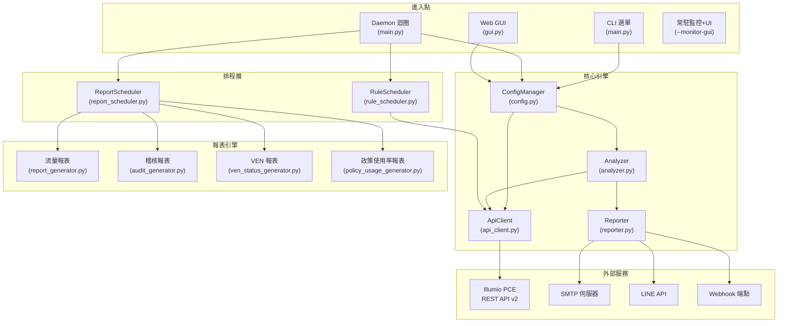
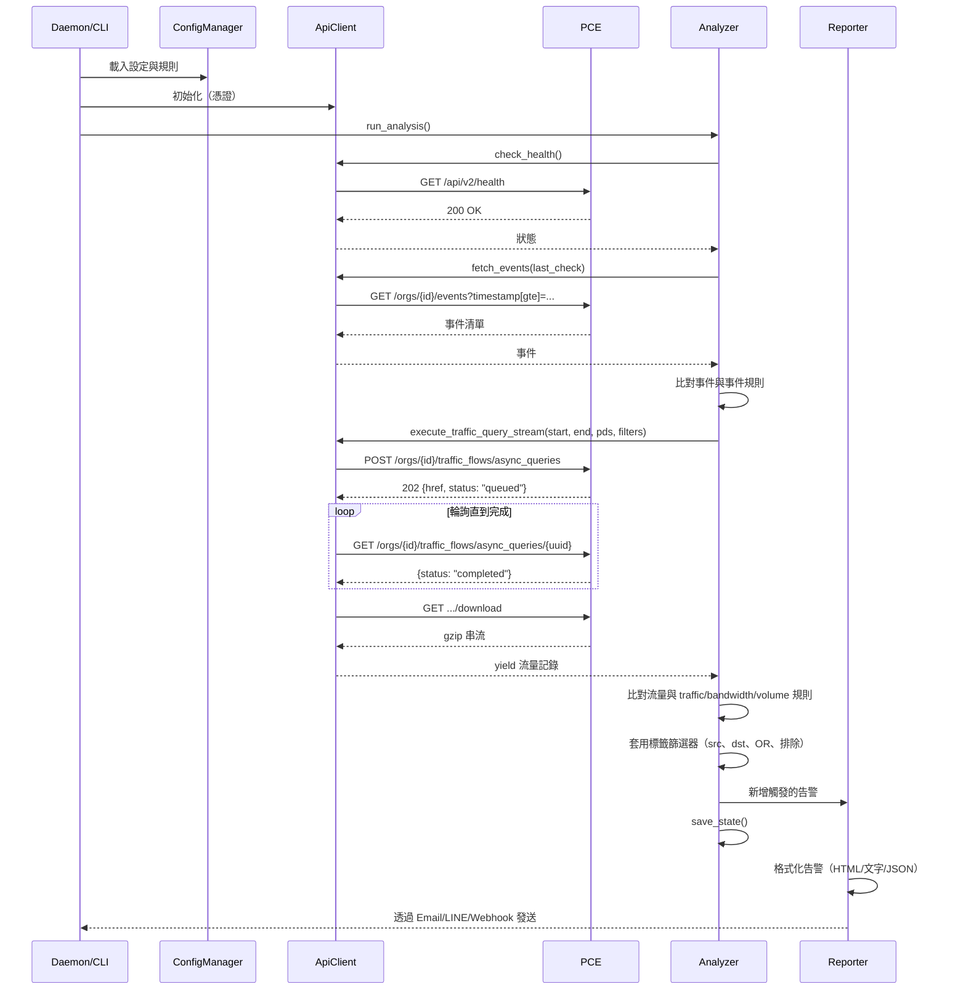

# Illumio PCE Ops — 專案架構與程式碼指南

> **[English](Project_Architecture.md)** | **[繁體中文](Project_Architecture_zh.md)**

---

## 1. 系統架構概覽



**資料流向**：進入點 → `ConfigManager`（載入規則/憑證）→ `ApiClient`（查詢 PCE）→ `Analyzer`（比對規則與回傳資料）→ `Reporter`（發送告警）。

**排程流向**：`ReportScheduler.tick()` 評估排程 → 派送至報表產生器 → Email 寄送結果。`RuleScheduler.check()` 評估循環/一次性排程 → 切換 PCE 規則 → 部署變更。

---

## 2. 目錄結構

```text
illumio_ops/
├── illumio_ops.py         # 進入點 — 匯入並呼叫 src.main.main()
├── requirements.txt       # Python 相依套件
│
├── config/
│   ├── config.json            # 執行時設定（憑證、規則、告警、偏好設定）
│   ├── config.json.example    # 設定檔範本
│   └── report_config.yaml     # 安全發現規則閾值
│
├── src/
│   ├── __init__.py            # 套件初始化，匯出 __version__
│   ├── main.py                # CLI 參數解析、Daemon/GUI 執行序協調、互動選單
│   ├── api_client.py          # Illumio REST API 客戶端（含重試與串流）
│   ├── analyzer.py            # 規則引擎：流量比對、指標計算、狀態管理
│   ├── reporter.py            # 告警聚合與多通道發送
│   ├── config.py              # 設定載入/儲存、規則 CRUD、原子寫入、PBKDF2 密碼雜湊
│   ├── gui.py                 # Flask Web 應用程式（約 40 個 JSON API 端點）、登入速率限制、CSRF Synchronizer Token
│   ├── settings.py            # CLI 互動選單（規則/告警設定）
│   ├── report_scheduler.py    # 排程報表產生與 Email 寄送
│   ├── rule_scheduler.py      # 政策規則自動化（循環/一次性排程、部署）
│   ├── rule_scheduler_cli.py  # 規則排程器的 CLI 與 Web GUI 介面
│   ├── i18n.py                # 國際化字典（EN/ZH_TW）與語言切換
│   ├── utils.py               # 工具函式：日誌設定、ANSI 色碼、單位格式化、CJK 寬度
│   ├── templates/             # Jinja2 HTML 模板（Web GUI SPA）
│   ├── static/                # CSS/JS 前端資源
│   └── report/                # 進階報表產生引擎
│       ├── report_generator.py        # 流量報表編排器（15 模組 + 安全發現）
│       ├── audit_generator.py         # 稽核日誌報表編排器（4 模組）
│       ├── ven_status_generator.py    # VEN 狀態盤點報表
│       ├── policy_usage_generator.py  # 政策規則使用率分析報表
│       ├── rules_engine.py            # 19 條自動化安全發現規則（B/L 系列）
│       ├── analysis/                  # 各模組分析邏輯
│       │   ├── mod01–mod15            # 流量分析模組
│       │   ├── audit/                 # 稽核分析模組（audit_mod00–03）
│       │   └── policy_usage/          # 政策使用率模組（pu_mod00–03）
│       ├── exporters/                 # HTML、CSV 及政策使用率匯出格式器
│       └── parsers/                   # API 回應與 CSV 資料解析器
│
├── docs/                  # 文件（本文件、使用手冊、API Cookbook）
├── tests/                 # 單元測試 (pytest)
├── logs/                  # 執行時日誌（輪替，10MB × 5 備份）
│   └── state.json         # 持久化狀態（last_check 時間戳、告警歷史）
├── reports/               # 報表輸出目錄
└── deploy/                # 部署輔助腳本（NSSM、systemd 設定）
```

---

## 3. 各模組深度分析

### 3.1 `api_client.py` — REST API 客戶端

**職責**：與 Illumio PCE 的所有 HTTP 通訊，僅使用 Python `urllib`（零外部相依）。

| 方法 | API 端點 | HTTP | 用途 |
|:---|:---|:---|:---|
| `check_health()` | `/api/v2/health` | GET | PCE 健康狀態 |
| `fetch_events()` | `/orgs/{id}/events` | GET | 安全稽核事件 |
| `execute_traffic_query_stream()` | `/orgs/{id}/traffic_flows/async_queries` | POST→GET→GET | 非同步流量查詢（三階段） |
| `fetch_traffic_for_report()` | （同上非同步端點） | POST→GET→GET | 報表用流量查詢 |
| `get_labels()` | `/orgs/{id}/labels` | GET | 依 key 列出標籤 |
| `create_label()` | `/orgs/{id}/labels` | POST | 建立新標籤 |
| `get_workload()` | `/api/v2{href}` | GET | 取得單一工作負載 |
| `update_workload_labels()` | `/api/v2{href}` | PUT | 更新工作負載標籤集 |
| `search_workloads()` | `/orgs/{id}/workloads` | GET | 依參數搜尋工作負載 |
| `fetch_managed_workloads()` | `/orgs/{id}/workloads` | GET | 所有受管工作負載（VEN 報表用） |
| `get_all_rulesets()` | `/orgs/{id}/sec_policy/.../rule_sets` | GET | 列出規則集（規則排程器用） |
| `get_active_rulesets()` | `/orgs/{id}/sec_policy/active/rule_sets` | GET | 生效規則集（政策使用率用） |
| `toggle_and_provision()` | Multiple | PUT→POST | 啟用/停用規則並部署 |
| `submit_async_query()` | `/orgs/{id}/traffic_flows/async_queries` | POST | 提交非同步流量查詢 |
| `poll_async_query()` | `.../async_queries/{uuid}` | GET | 輪詢查詢狀態至完成 |
| `download_async_query()` | `.../async_queries/{uuid}/download` | GET | 下載 gzip 壓縮結果 |
| `batch_get_rule_traffic_counts()` | （並行非同步查詢） | POST→GET→GET | 批次逐規則命中分析 |
| `check_and_create_quarantine_labels()` | `/orgs/{id}/labels` | GET/POST | 確保隔離標籤集存在 |
| `provision_changes()` | `/orgs/{id}/sec_policy` | POST | 部署草稿 → 生效 |
| `has_draft_changes()` | `/orgs/{id}/sec_policy/pending` | GET | 檢查待處理草稿變更 |

**關鍵設計模式**：
- **指數退避重試**：遇到 `429`（速率限制）、`502/503/504`（伺服器錯誤）自動重試，最多 3 次，基底間隔 2 秒
- **三階段非同步查詢**：Submit → Poll → Download 模式；`batch_get_rule_traffic_counts()` 透過 `ThreadPoolExecutor` 並行化三個階段（最多 10 個並行工作者）
- **串流下載**：流量查詢結果（可能數 GB）以 gzip 下載，在記憶體中解壓縮，透過 Python 生成器逐行 yield — O(1) 記憶體消耗
- **標籤/規則集快取**：內部快取（`label_cache`、`ruleset_cache`、`service_ports_cache`）避免批次操作時重複 API 呼叫
- **無外部相依**：僅使用 `urllib.request`（不需要 `requests` 函式庫）

> **注意**：Illumio Core 25.2 已棄用同步流量查詢 API（`traffic_analysis_queries`）。本工具專門使用非同步 API（`async_queries`），支援最多 200,000 筆結果。

### 3.2 `analyzer.py` — 規則引擎

**職責**：根據使用者定義的規則評估 API 資料，支援彈性篩選邏輯。

**核心函式**：

| 函式 | 用途 |
|:---|:---|
| `run_analysis()` | 主流程編排：健康檢查 → 事件 → 流量 → 儲存狀態 |
| `check_flow_match()` | 評估單一流量記錄是否符合規則的篩選條件 |
| `_check_flow_labels()` | 比對流量標籤與規則篩選器（src、dst、OR 邏輯、排除） |
| `_check_ip_filter()` | 驗證 IP 位址是否符合 CIDR 範圍（IPv4/IPv6） |
| `calculate_mbps()` | 混合頻寬計算含自動縮放單位 |
| `calculate_volume_mb()` | 資料量計算（同樣的混合方式） |
| `query_flows()` | Web GUI 流量分析器使用的通用查詢端點 |
| `run_debug_mode()` | 互動式診斷，顯示原始規則評估結果 |
| `_check_cooldown()` | 透過每規則最小重新告警間隔防止告警洪水 |

**篩選比對邏輯**：

分析器支援彈性的流量規則篩選條件：

| 篩選欄位 | 邏輯 | 說明 |
|:---|:---|:---|
| `src_labels` + `dst_labels` | AND | 來源和目的地都必須符合 |
| 僅 `src_labels` | 來源端 | 僅比對來源標籤 |
| 僅 `dst_labels` | 目的地端 | 僅比對目的地標籤 |
| `filter_direction: "src_or_dst"` | OR | 來源或目的地任一符合即可 |
| `ex_src_labels`、`ex_dst_labels` | 排除 | 排除符合這些標籤的流量 |
| `src_ip`、`dst_ip` | CIDR 比對 | IPv4/IPv6 位址篩選 |
| `ex_src_ip`、`ex_dst_ip` | 排除 | 排除來自/前往這些 IP 的流量 |
| `port`、`proto` | 服務比對 | 連接埠與協定篩選 |

**狀態管理** (`state.json`)：
- `last_check`：上次成功檢查的 ISO 時間戳 — 用作事件查詢的錨點
- `history`：每條規則的匹配計數滾動視窗（修剪至 2 小時）
- `alert_history`：每條規則的上次告警時間戳（冷卻機制）
- **原子寫入**：使用 `tempfile.mkstemp()` + `os.replace()` 防止當機時損壞

### 3.3 `reporter.py` — 告警發送器

**職責**：格式化並透過設定的通道發送告警。

**告警分類**：`health_alerts`、`event_alerts`、`traffic_alerts`、`metric_alerts`

**輸出格式**：
- **Email**：豐富的 HTML 表格，含色彩編碼的嚴重等級標章、嵌入式流量快照和自動縮放的頻寬單位。事件告警包含登入失敗的使用者名稱與 IP。
- **LINE**：純文字摘要（LINE API 字元限制）
- **Webhook**：原始 JSON 酬載（完整結構化資料供 SOAR 擷取）

**報表 Email 方法**：
| 方法 | 用途 |
|:---|:---|
| `send_alerts()` | 路由告警至設定的通道 |
| `send_report_email()` | 寄送隨選報表（單一附件） |
| `send_scheduled_report_email()` | 寄送排程報表（多附件、自訂收件人） |

### 3.4 `config.py` — 設定管理器

**職責**：載入、儲存和驗證 `config.json`。

- **執行緒安全**：使用 **`threading.RLock`**（重入鎖）防止在遞迴載入/儲存或 Daemon 與 GUI 執行緒同時存取時發生死結。
- **深度合併**：使用者設定覆蓋預設值 — 缺失欄位自動補齊。
- **原子儲存**：先寫至 `.tmp` 檔案，再透過 `os.replace()` 確保當機安全。
- **密碼雜湊**：`config.py` 中的 `hash_password()` 和 `verify_password()` 函式同時支援新的 PBKDF2 格式（前綴 `pbkdf2:`）和舊版 SHA256 格式。
- **規則 CRUD**：`add_or_update_rule()`、`remove_rules_by_index()`、`load_best_practices()`。
- **PCE 設定檔管理**：`add_pce_profile()`、`update_pce_profile()`、`activate_pce_profile()`、`remove_pce_profile()`、`list_pce_profiles()` — 支援多 PCE 環境的設定檔切換。
- **報表排程管理**：`add_report_schedule()`、`update_report_schedule()`、`remove_report_schedule()`、`list_report_schedules()`。

### 3.5 `gui.py` — Web GUI

**架構**：Flask 後端提供約 40 個 JSON API 端點，由 Vanilla JS 前端（`templates/index.html`）消費。

- **安全邊界**：所有路由強制要求登入驗證，並透過 `@app.before_request` 實作 IP 白名單過濾（支援 CIDR）。未經授權的請求回傳 401/403。
- **密碼雜湊**：密碼雜湊使用 **PBKDF2-HMAC-SHA256**，260,000 次迭代（Python `hashlib.pbkdf2_hmac`，僅使用標準函式庫）。舊版 SHA256 雜湊會在下次成功登入時自動升級。預設帳號密碼為 `illumio` / `illumio`，使用者應於首次登入後修改密碼。
- **登入速率限制**：記憶體內逐 IP 追蹤器，支援執行緒安全鎖定。每 60 秒視窗內最多 5 次嘗試；超過回傳 HTTP 429。
- **CSRF 防護**：使用 **Synchronizer Token Pattern**：Token 儲存在 Flask session 中，並透過 `<meta name="csrf-token">` 標籤注入 `index.html`。JavaScript 從 meta 標籤讀取 Token（非從 Cookie）。CSRF Cookie 已移除。
- **連線安全**：Session Cookies 經過加密簽署。`session_secret` 在首次執行時自動產生。
- **SMTP 密碼**：可透過 `ILLUMIO_SMTP_PASSWORD` 環境變數提供，優先於設定檔中的值。
- **執行緒模型 (--monitor-gui)**：Daemon 迴圈運行於獨立的 `threading.Thread` 中，而 Flask 應用程式佔用主執行緒。

**關鍵路由**：

| 路由 | 方法 | 用途 |
|:---|:---|:---|
| `/api/login` | POST | 登入驗證 |
| `/api/security` | GET/POST | 安全設定（密碼、IP 白名單） |
| `/api/status` | GET | Dashboard 資料（健康、統計、規則、冷卻） |
| `/api/event-catalog` | GET | 翻譯後的事件類型目錄 |
| `/api/rules` | GET | 列出所有規則 |
| `/api/rules/event` | POST | 建立事件規則 |
| `/api/rules/traffic` | POST | 建立流量規則 |
| `/api/rules/bandwidth` | POST | 建立頻寬規則 |
| `/api/rules/<idx>` | GET/PUT/DELETE | 規則 CRUD |
| `/api/settings` | GET/POST | 讀取/寫入應用程式設定 |
| `/api/pce-profiles` | GET/POST | 多 PCE 設定檔管理（列出、新增、更新、刪除、啟用） |
| `/api/dashboard/queries` | GET/POST/DELETE | 儲存的查詢管理 |
| `/api/dashboard/snapshot` | GET | 最新流量報表快照 |
| `/api/dashboard/top10` | POST | 依頻寬/流量/連線數的 Top-10 |
| `/api/quarantine/search` | POST | 彈性篩選的流量搜尋 |
| `/api/quarantine/apply` | POST | 對工作負載套用隔離標籤 |
| `/api/quarantine/bulk_apply` | POST | 批次隔離（並行，最多 5 工作者） |
| `/api/workloads` | GET/POST | 工作負載搜尋與盤點 |
| `/api/reports/generate` | POST | 產生報表（流量/稽核/VEN/政策使用率） |
| `/api/reports` | GET | 列出已產生報表 |
| `/api/reports/<filename>` | DELETE | 刪除報表檔案 |
| `/api/reports/bulk-delete` | POST | 批次刪除報表 |
| `/api/audit_report/generate` | POST | 產生稽核報表 |
| `/api/ven_status_report/generate` | POST | 產生 VEN 狀態報表 |
| `/api/policy_usage_report/generate` | POST | 產生政策使用率報表 |
| `/api/report-schedules` | GET/POST | 報表排程 CRUD |
| `/api/report-schedules/<id>` | PUT/DELETE | 更新/刪除排程 |
| `/api/report-schedules/<id>/toggle` | POST | 啟用/停用排程 |
| `/api/report-schedules/<id>/run` | POST | 立即觸發執行 |
| `/api/report-schedules/<id>/history` | GET | 排程執行歷史 |
| `/api/init_quarantine` | POST | 確保 PCE 上隔離標籤存在 |
| `/api/actions/run` | POST | 執行一次分析循環 |
| `/api/actions/debug` | POST | 執行除錯模式 |
| `/api/actions/test-alert` | POST | 發送測試告警 |
| `/api/actions/best-practices` | POST | 載入最佳實務規則 |
| `/api/actions/test-connection` | POST | 測試 PCE 連線 |
| `/api/rule_scheduler/status` | GET | 規則排程器狀態 |
| `/api/rule_scheduler/rulesets` | GET | 瀏覽 PCE 規則集 |
| `/api/rule_scheduler/rulesets/<id>` | GET | 規則集詳情含規則 |
| `/api/rule_scheduler/schedules` | GET/POST | 規則排程 CRUD |
| `/api/rule_scheduler/schedules/<href>` | GET | 排程詳情 |
| `/api/rule_scheduler/schedules/delete` | POST | 刪除規則排程 |
| `/api/rule_scheduler/check` | POST | 觸發排程評估 |

### 3.6 `i18n.py` — 國際化

**職責**：為所有 UI 文字提供翻譯字串。

- 包含約 900+ 筆字典，以 `{"en": {...}, "zh_TW": {...}}` 結構對應翻譯
- `t(key, **kwargs)` 函式回傳目前語言的字串，支援變數替換
- 語言透過 `set_language("en"|"zh_TW")` 全域設定
- 涵蓋：CLI 選單、事件說明、告警模板、Web GUI 標籤、報表用語、篩選標籤、排程類型

### 3.7 `report_scheduler.py` — 報表排程器

**職責**：管理排程報表產生與 Email 寄送。

- 支援每日、每週、每月排程
- 產生 **4 種報表類型**：流量、稽核、VEN 狀態、政策使用率
- `tick()` 由 daemon 迴圈每分鐘呼叫以評估排程
- `run_schedule()` 依報表類型派送至對應的產生器
- 以 HTML 附件方式 Email 寄送報表，可設定自訂收件人
- 透過 `_prune_old_reports()` 處理報表保留（依 `retention_days` 自動清理）
- 排程時間以 UTC 儲存，依設定時區顯示
- 狀態追蹤於 `logs/state.json` 的 `report_schedule_states` 下

### 3.8 `rule_scheduler.py` + `rule_scheduler_cli.py` — 規則排程器

**職責**：自動化 PCE 政策規則的排程啟用/停用。

**排程類型**：
- **循環 (Recurring)**：在特定日期和時間窗口啟用/停用規則（如 週一至週五 09:00–17:00）。支援跨午夜（如 22:00–06:00）。
- **一次性 (One-time)**：啟用/停用規則直到指定的到期日期時間，然後自動回復。

**功能**：
- 瀏覽並搜尋 PCE 上所有規則集與個別規則
- 啟用或停用特定規則或整個規則集
- **草稿保護**：多層檢查確保僅切換已部署的規則；防止對草稿專用項目進行強制執行
- 部署變更至 PCE（將草稿推送成生效）
- CLI 互動選單（`rule_scheduler_cli.py`）含分頁規則瀏覽
- Web GUI API 端點於 `/api/rule_scheduler/*` 下
- 排程備註標籤加入 PCE 規則說明（📅 循環 / ⏳ 一次性）
- 星期名稱正規化（mon→monday 等）

### 3.9 `src/report/` — 進階報表引擎

**職責**：產生全面的安全分析報表。

| 元件 | 用途 |
|:---|:---|
| `report_generator.py` | 編排 15 個分析模組 + 安全發現產生流量報表 |
| `audit_generator.py` | 編排 4 個模組產生稽核日誌報表 |
| `ven_status_generator.py` | VEN 盤點報表，以心跳為基礎的線上/離線分類 |
| `policy_usage_generator.py` | 政策規則使用率分析，含逐規則命中數 |
| `rules_engine.py` | 19 條自動化偵測規則（B001–B009、L001–L010），可設定閾值 |
| `analysis/mod01–mod15` | 流量分析模組（概覽、政策決策、勒索軟體、遠端存取等） |
| `analysis/audit/` | 4 個稽核模組（摘要、健康事件、使用者活動、政策變更） |
| `analysis/policy_usage/` | 4 個政策使用率模組（摘要、概覽、命中詳情、未使用詳情） |
| `exporters/` | HTML 模板渲染、CSV 匯出、政策使用率 HTML 匯出 |
| `parsers/` | API 回應解析（`api_parser.py`）、CSV 匯入（`csv_parser.py`）、資料驗證 |

**報表類型**：

| 報表 | 模組 | 說明 |
|:---|:---|:---|
| **流量** | 15 模組 (mod01–mod15) + 19 安全發現 | 全面流量分析含勒索軟體、遠端存取、跨環境、頻寬、橫向移動偵測 |
| **稽核** | 4 模組 (audit_mod00–03) | PCE 健康事件、使用者登入/驗證、政策變更追蹤 |
| **VEN 狀態** | 單一產生器 | VEN 盤點含線上/離線狀態（心跳 ≤1 小時閾值） |
| **政策使用率** | 4 模組 (pu_mod00–03) | 逐規則流量命中分析、未使用規則辨識、摘要 |

**政策使用率報表**支援兩種資料來源：
- **API**：從 PCE 取得生效規則集，並行執行三階段非同步查詢
- **CSV 匯入**：接受 Workloader CSV 匯出檔含預先計算的流量數

**匯出格式**：HTML（主要）和 CSV ZIP（stdlib `zipfile`，零外部相依）。

---

## 4. 資料流程圖



---

## 5. 多 PCE 設定檔架構

系統透過設定檔支援管理多個 PCE 實例：

```text
config.json
├── api: { url, org_id, key, secret }    ← 啟用中設定檔的憑證
├── active_pce_id: "production"           ← 目前啟用的設定檔名稱
└── pce_profiles: [
      { name: "production", url: "...", org_id: 1, key: "...", secret: "..." },
      { name: "staging",    url: "...", org_id: 2, key: "...", secret: "..." }
    ]
```

- **設定檔切換**：`activate_pce_profile()` 將設定檔憑證複製到頂層 `api` 區段並重新初始化 `ApiClient`
- **GUI**：`/api/pce-profiles` 端點用於列出、新增、更新、刪除和啟用設定檔
- **CLI**：透過設定選單進行互動式設定檔管理

---

## 6. 如何修改此專案

### 6.1 新增規則類型

1. 在 `settings.py` 中**定義規則結構** — 建立新的 `add_xxx_menu()` 函式
2. 在 `analyzer.py` → `run_analysis()` 中**新增比對邏輯** — 在流量迴圈中處理新類型
3. 在 `gui.py` 中**新增 GUI 支援** — 為新規則類型建立 API 端點
4. 在 `i18n.py` 中**新增 i18n 鍵值** — 為任何新的 UI 字串新增翻譯

### 6.2 新增告警通道

1. 在 `config.py` → `_DEFAULT_CONFIG["alerts"]` 中**新增設定欄位**
2. 在 `reporter.py` 中**實作發送器** — 建立 `_send_xxx()` 方法
3. 在 `reporter.py` → `send_alerts()` 中**註冊到分派器** — 加入新通道檢查
4. 在 `gui.py` 的 **GUI 設定**中 → `api_save_settings()` 和前端新增對應欄位

### 6.3 新增 API 端點

1. 在 `api_client.py` 中**新增方法** — 遵循現有方法的模式
2. **URL 格式**：org-scoped 端點使用 `self.base_url`，全域端點使用 `self.api_cfg['url']/api/v2`
3. **錯誤處理**：回傳 `(status, body)` 元組，讓呼叫端處理特定狀態碼
4. **參考** `docs/REST_APIs_25_2.md` 取得端點 Schema

### 6.4 新增 i18n 語言

1. 在 `i18n.py` 的 `MESSAGES` 字典中新增一個頂層 key（與 `"en"` 和 `"zh_TW"` 並列）
2. 在 `gui.py` → settings 端點中新增語言選項
3. 更新 `config.py` 預設值以包含新語言代碼
4. 更新 `i18n.py` 中的 `set_language()` 以接受新代碼

### 6.5 新增報表類型

1. 在 `src/report/` 中**建立產生器** — 參考 `policy_usage_generator.py` 模式，含 `generate_from_api()` 和 `export()` 方法
2. 在 `src/report/analysis/<type>/` 中**建立分析模組** — 參考 `pu_mod00_executive.py` 模式
3. 在 `src/report/exporters/` 中**建立匯出器** — HTML 及/或 CSV 匯出
4. 在 `report_scheduler.py` 中**註冊至排程器** — 在 `run_schedule()` 中新增派送案例
5. 在 `gui.py` 中**新增 GUI 端點** — `api_generate_<type>_report()`
6. 在 `main.py` 中**新增 CLI 選項** — argparse `--report-type` 選項
7. **新增 i18n 鍵值**用於報表特定用語
